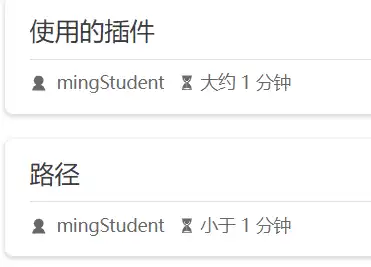
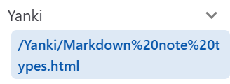
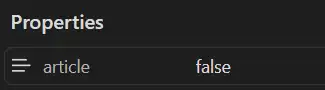
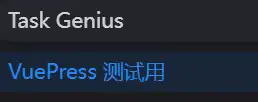

# 文章列表
文章列表是主页显示的所有可浏览的文章的列表。在个人简介中提供了文章列表分类。
<!-- more -->

	文章包含：标题、摘要、作者、阅读时间等信息
## 路径
> http://localhost:8081/article/

在 /article/下存放文章列表页面
## 摘要
## 关闭自动生成摘要
默认启用了自动生成摘要
关闭自动生成摘要：
``` js title:theme.ts
  plugins: {
    blog: {
		excerpt: true,
		excerptLength: 0
	},
	}
```

## 设置摘要
1. 在正文中：
``` markdown
文章列表是。。。
<!-- more -->
正文
```
效果：

2. 在Frontmatter中设置

## 标题
在文章的Frontmatter 设置title属性。如果没有设置，那么默认为文章的首个h1 标签内容

## 隐藏文章
希望文章列表中不显示指定的文章
配置：
1. 在文章的frontmatter中设置 atricle 属性为false；
2. 在theme.ts中设置 plugins.blog.filter
- 类型：(page:page) => boolean, 获取页面信息，返回是否过滤当前页面
- 默认值：
```js
({ frontmatter, filePathRelative}) =>
	frontmatter.article ?? (Boolean(filePathRelative) && ! frontmatter.home)
```

| 变量/表达式                    | 说明                                |
| ------------------------- | --------------------------------- |
| frontmatter               | 文档frontmatter（yaml配置）             |
| filePathRelative          | 文档的相对路径，应该是相对于src的                |
| frontmatter.article       | 如果设置了article属性，则按照article的值确定是否过滤 |
| ??                        | 未设置article                        |
| Boolean(filePathRelative) | 文档的路径正确                           |
| &&                        | 与逻辑运算                             |
| !frontmatter.home         | 文档不是主页                            |

设置过滤掉 Yanki 文件夹
```js
  plugins: {
    blog: {
		excerpt: true,
		excerptLength: 0,
		filter: ({ frontmatter, filePathRelative}) => {
			//1. 需要排除的文件夹
			const excludedDir = "Yanki";
			//2. 检查当前文档是否在该文件下（以Yanki 起始）
			const isExcluded = filePathRelative?.startsWith(excludedDir);
			if(isExcluded)
				return false;
			else
				return frontmatter.article ?? (Boolean(filePathRelative) && ! frontmatter.home)
			}
		},
```
<span style="background:#ff4d4f">问题：</span>以上配置不好使 
line 9 filePathRelative后的 ? 表示：如果调用后面函数的对象不存在，则返回 undefined，而不是 throw error
filePathRelative  还有许多为null所以需要 ? 避免报错

侧边栏中显示的文档名称为：

	带有 / ，设置为 "/Yanki" 无法过滤掉
打印filePathRelative的值为：Yanki/Markdown note types.md，isExcluded的值是 true
但是文章仍然存在。该函数返回的结果对文章显示没有效果？？？
<span style="background:#affad1">答：</span>因为配置sidebar为structur-按结构自动生成，侧边栏中仍然会显示Yanki下的文档。

问题：文章列表中不显示，能否通过分类、标签找到该文章？

效果：


<mark style="background: #FF5582A6;">还是显示，为什么？</mark>

<span style="background:#40a9ff">答：</span>article的类型是 `boolean` 对应obsidian frontmatter 中的 Checkbox，这里article的类型是text，类型不符，所以页面未被隐藏
