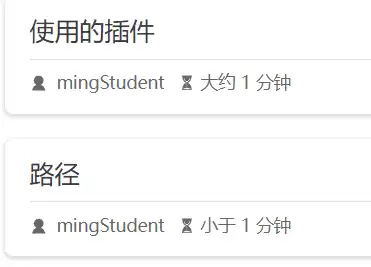
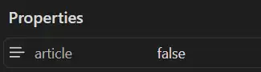

# 文章列表
文章列表是主页显示的所有可浏览的文章的列表。在个人简介中提供了文章列表分类。
<!-- more -->

	文章包含：标题、摘要、作者、阅读时间等信息
## 路径
> http://localhost:8081/article/

在 /article/下存放文章列表页面
## 摘要
## 关闭自动生成摘要
默认启用了自动生成摘要
关闭自动生成摘要：
``` js title:theme.ts
  plugins: {
    blog: {
		excerpt: true,
		excerptLength: 0
	},
	}
```

## 设置摘要
1. 在正文中：
``` markdown
文章列表是。。。
<!-- more -->
正文
```
效果：

2. 在Frontmatter中设置

## 标题
在文章的Frontmatter 设置title属性。如果没有设置，那么默认为文章的首个h1 标签内容

## 隐藏文章
希望文章列表中不显示指定的文章
配置：
1. 在文章的frontmatter中设置 atricle 属性为false；
2. 在theme.ts中设置 plugins.blog.filter
问题：文章列表中不显示，能否通过分类、标签找到该文章？

效果：


<mark style="background: #FF5582A6;">还是显示，为什么？</mark>

