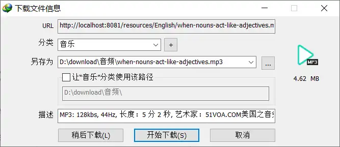

# 添加资源
提供可供下载的资源（统一放置在public下）

1. 将资源文件放到下面的路径下（windows 路径分隔符为\）
``` 
src\.vuepress\public
```
	资源为MP3
2. 在提供下载链接的页面中添加链接
```
[mp3](/resources/English/when-nouns-act-like-adjectives.mp3)
```
3. 效果：点击链接后弹出下载提示



>[!note]
>资源文件的名称如果含有空格，使用%20替换空格 或 使用其他符号代替 如：-、_ 

:::preview
[txt](/test/Hello%20World.txt)
链接到Hello World.txt
:::

## 绝对路径
根目录：
``` 
.vuepress\public
```
