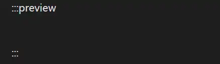

# 视频组件
官方参考：[主页 | 组件库](https://plugin-components.vuejs.press/zh/)

介绍的视频组件有两种：ArtPlayer、VidStack，这里使用VidStack

1. install
``` bash
npm install -D vidstack@next
```
安装的时候提示 ENADENGINE（当前版本低）：
``` warning
$ npm install -D vidstack@next
npm warn EBADENGINE Unsupported engine {
npm warn EBADENGINE   package: '@vitejs/plugin-vue@6.0.1',
npm warn EBADENGINE   required: { node: '^20.19.0 || >=22.12.0' },
npm warn EBADENGINE   current: { node: 'v20.18.0', npm: '11.5.1' }
npm warn EBADENGINE }
```
可以使用，暂时不处理

2. 启用
``` js title="theme.ts"
    components: {
      components: ["Badge", "VPCard", "VidStack"],
    },
```
各个组件的名称见：插件选项-》Components
3. 将视频放置到`.vuepress/public/`下
4. 在markdown 中添加视频
:::preview
<VidStack
  src="/test/msedge_CeBceC8xcR.mp4"
/>

:::

问题：<mark style="background: #FFF3A3A6;">在obsidian中编辑html元素-VidStack时没有显示效果？？？</mark> 
:::tabs
@tab 光标在元素前有显示

@tab 无显示

:::

也可以播放音频
:::preview
<VidStack
  src="/test/MELANCHOLY-Single Wang.mp3"
/>
:::

音频来源：[Iphone & Android 手机铃声 免费下载网 - MyRingtone](https://myringtone.app/zh-cn)

## 字幕
:::preview
<VidStack
  src="/test/msedge_CeBceC8xcR.mp4"
  :tracks="[
	  {
		  src: '/test/msedge_CeBceC8xcR_en.vtt',
		  label: 'English',
		  language: 'en-US',
		  kind: 'subtitles',
		  default: true,
	  },
	  {
		  src: '/test/msedge_CeBceC8xcR_zh.vtt',
		  label: 'Chinese',
		  language: 'zh',
		  kind: 'subtitles'
	  },
	  {
		  src: '/test/chapters.vtt',
		  kind: 'chapters',
		  language: 'en-US',
		  default: true,
	  },
  ]"
/>

:::
注意：示例中使用的是language，而WebVTT参考中的属性名称为srclang

问：<mark style="background: #FFF3A3A6;">示例只提供了一个language 为en的chapter文件，如果不同语言有各自对应的chapter该如何设置？</mark>


