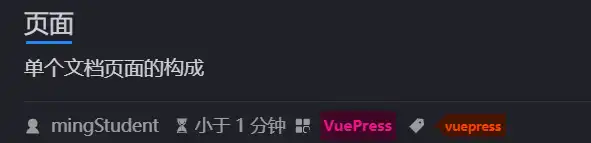

---
tags:
  - vuepress
category: VuePress
---
# 页面
单个文档页面的构成
<!-- more -->
## 标题导航

配置显示的标签级别
``` js title:theme.ts
hopeTheme({
  toc: {
	levels: [1,6]
  },
})
```
	显示所有的h1 - h6标签，默认值为deep，相当于[2,6]

## 分类
文档所在文件夹
``` 
---
category:
	- VuePress
---
```
效果：

## 标签
文档用途


效果：


问：<mark style="background: #FFF3A3A6;">obsidian 能识别到该属性？</mark>设置属性时提供了tags选项。
官方文档中介绍的是设置方式是:
``` title:frontmatter
---
tag:
  - HTML
  - Web
---

页面内容...
```
