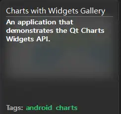
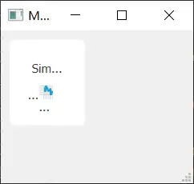
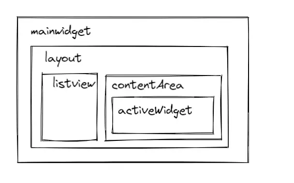
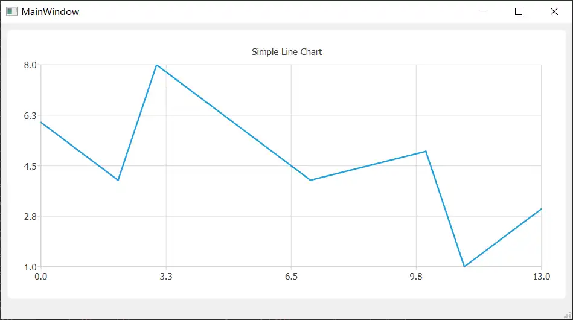
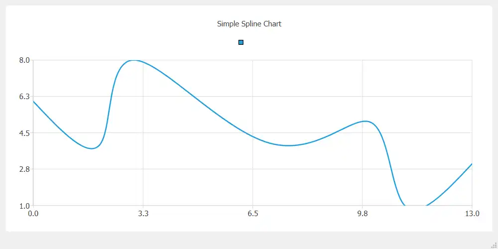
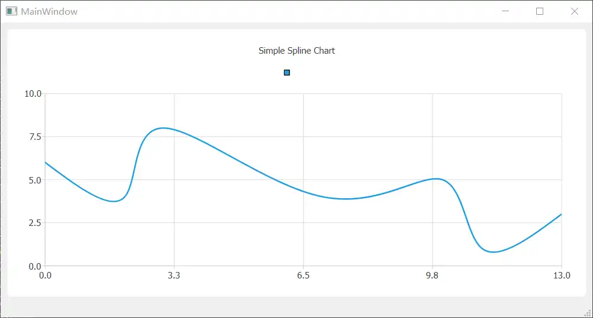
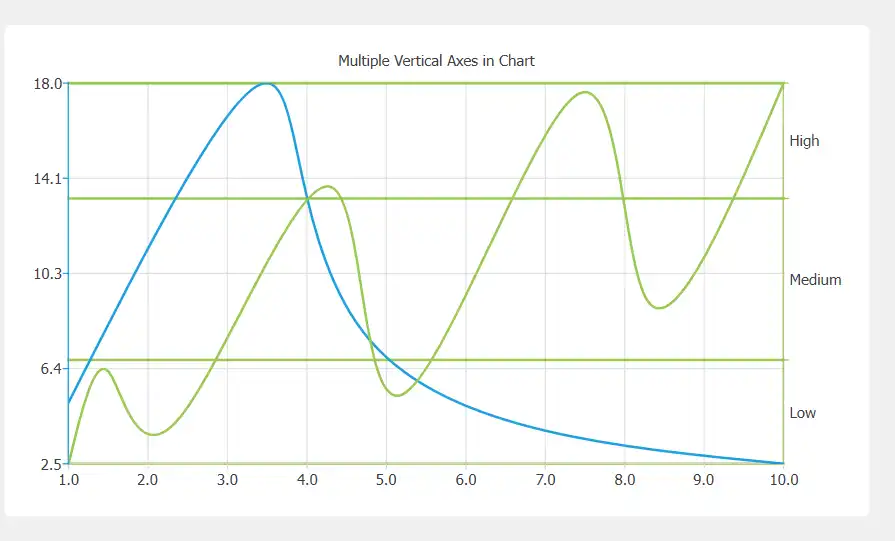
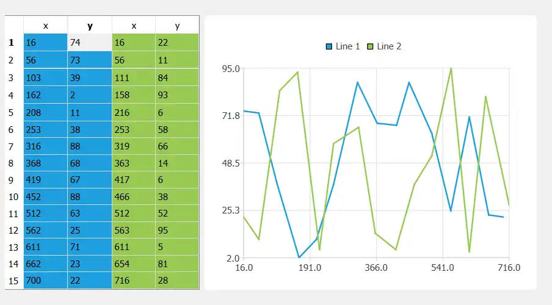
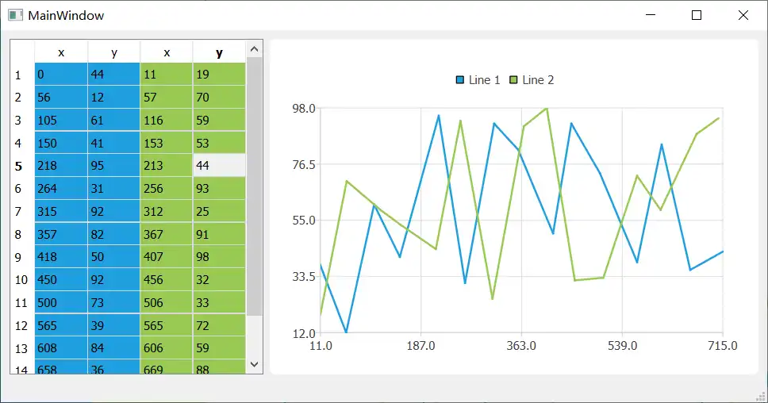

---
tags:
  - Qt
  - Graphics
  - Widget
---


>The QChartView is a standalone widget that can display charts.

<!-- more -->

# QChartView


## 从示例开始
在Weclome 的 Examples 中搜索 chart，有一个Charts with Widgets Gallery项目

项目演示了如何使用QChartView 绘制各种类型的图表，包含
- Area Chart：区域图
- Bar Chart：柱状图
- Line Chart：折线图
- Spline Chart：曲线图
- Pie Chart：饼状图
- Scatter Chart：散点图
- Polar Chart：极坐标图

## 最简单的Line Chart
参考：linewidget.cpp
### 构建
1. 新建Widget 项目
2. 添加Charts模块
``` title:cmakelists.txt
find_package(Qt${QT_VERSION_MAJOR} REQUIRED COMPONENTS Widgets Charts)
target_link_libraries(MWidget PRIVATE Qt${QT_VERSION_MAJOR}::Widgets Qt${QT_VERSION_MAJOR}::Charts)
```

### 创建series
``` cpp
auto series = new QLineSeries;
series->append(0, 6);
...
*series << QPointF(11, 1);
```
在series 中存储要绘制的曲线上的坐标点。添加坐标点的方式：
1. append（）；
2. << ： 可以是单个点，也可以是一系列的点
``` cpp
    QXYSeries &operator << (const QPointF &point);
    QXYSeries &operator << (const QList<QPointF> &points);
```

### 创建Chart - 数据管理
> The QChart class manages the graphical representation of the chart's series, legends, and axis.

``` cpp
auto chart = new QChart;
chart->legend()->hide();
chart->addSeries(series);
chart->createDefaultAxes();
chart->setTiltle("Simle Line Chart");
```
 QChart 管理的内容包含：
 - lengend：注释
 - 坐标点
 - 坐标轴
 - 标题
 - 。。。
注意执行的顺序，需要先添加series 然后创建axis
series 使用 new 创建，addSeries时Chart 会 takes the ownership of it.（Chart 释放时会释放series）

### 创建ChartView - display
``` cpp
m_chartView = new QChartView(chart,this);
m_chartView->setRenderHint(QPainter::Antialiasing);
```
> Constructs a chart view object with the parent (this) to display the chart. The ownership of the chart of the chart is passed to the chart view.

创建一个chart 的view，由parent 管理（同时也是放置在parent内？），parent 需要是 QWidget类型-可视的。然后设置渲染的选项，这里Antialiasing 是 抗锯齿。

### 放置ChartView
在MainWindow 的 constructor 中设置ChartView
``` cpp
    ChartView *chartView = new ChartView(this);
    setCentralWidget(chartView);
```

#### 问题 - 显示错误

可以看到ChartView 控件有显示，但是显示效果不正常。
问：<mark style="background: #FFF3A3A6;">是被压缩了？和示例中的代码有什么差别</mark>
和示例代码比较后，可以发现示例代码中各个widget 之间的关系如下图所示。


``` cpp
    m_contentArea->installEventFilter(this);
    
bool MainWidget::eventFilter(QObject *object, QEvent *event)
{
    if (event->type() == QEvent::Resize && object == m_contentArea && m_activeWidget)
        m_activeWidget->resize(m_contentArea->size());
    return QObject::eventFilter(object, event);
}
```
 contextArea 的resize 时间在 MainWidget中进行处理，处理的过程是将 activeWidget（chartView的parent）的大小设置为contentArea的大小。

重点就是要根据parent的大小调整chartView 的大小。

#### 处理 
让chartView 的大小跟随其parent 变化：
``` cpp
void ChartView::resizeEvent(QResizeEvent *e)
{
    m_ChartView->resize(this->size());
}
```
	parent 大小变化时设置chartView的大小

#### 效果

1. defaultAxes（x、y） 的范围是所有点的x、y极值；
2. 默认带有网格
问：<mark style="background: #FFF3A3A6;">网格的间距是？</mark>
3. 默认颜色为蓝色


## spline 
参考：splinewidget.cpp
和Line 的差别仅在于存储点的series 类型不一致，绘制spline 的series为QSplineSeries
``` cpp
auto series = new QSplineSeries;
series->append(0, 6);
*series << QPointF(11, 1);
```
 使用和line 相同的一组数据绘制效果：
 
	 同时我注释了hide legend，所以标题下方的蓝色方块就是legend了？

使用defaultAxes 的缺点在这里可以很明显的看出来：贴近顶部和底部的线看起来有一部分没有绘制出来。

### 调整坐标轴范围
``` cpp
    chart->axes(Qt::Vertical).first()->setRange(0, 10);
```
	设置vertical 方向的第一个axis 的范围为0，10. 这里说明每个方向上可以存在多个axis。 每条曲线可以绑定一个axis，它们可以绘制在同一个view上
效果：

纵轴的范围被调整为 0~10


## Multiple Axes

	上图有两条曲线，一条蓝色，对应右侧的坐标轴（也是蓝色）。另一条曲线是绿色，对应左侧的坐标轴，坐标轴的值是文字而不是值。还有4条水平轴用来区分绿色曲线的值范围。
涉及到：
1. 如何设置axes 的位置：如果是vertical 方向，并且在坐标轴范围上，那么应该是可以根据x的值来设置其位置。同理horizontal 方向的轴可以根据y值设置。
2. 如何关联axis 和 series：应该是层级对应关系，view 包含axis，axis 包含series。每个上层对象可以对应多个下层对象
3. 如何设置 string 显示类型的轴

### 实现
有省略
``` cpp
auto chart = new QChart;

auto axisX = new QValueAxis;
axisX->setTickCount(10);
chart->addAxis(axisX, Qt::AlignBottom);
```
	tickCount是坐标轴上点的个数。axisX 是底部的x轴

``` cpp
auto series = new QSplineSeries;
*series << QPointF(1, 5) << ...
chart->addSeries(series);
```
	第一条曲线-默认蓝色
	
``` cpp
auto axisY = new QValueAxis;
axisY->setLinePenColor(series->pen().color());

chart->addAxis(axisY, Qt::AlignLeft);
series->attachAxis(axisX);
series->attachAxis(axisY);
```
	2: 设置axis 的颜色；
	5、6：绑定series 的x、y轴；
问：<mark style="background: #FFF3A3A6;">这里x、y轴的顺序是根据绑定的顺序确定的？（即坐标点的x 和 axisX对应，y和axisY对应）</mark>

``` cpp
series = new QSplineSeries;
...

auto axisY3 = new QCategoryAxis;
axisY3->append("Low", 5);
axisY3->append("Medium", 12);
axisY3->append("High", 17);
axisY3->setLinePenColor(series->pen().color());
axisY3->setGridLinePen(series->pen());

```
	4:QCategoryAxis 的特点-可以使用labeled显示值的分类
	5-7：设置分类的范围及描述
	9：设置网格线的颜色（分类的界限

分类的label 显示在 ranges 的中间位置。
后添加的分类以前一个分类的最大值为起点。
默认的第一个分类的起始值为0


## Model Data
显示model 中的数据

	左侧表格显示点的值，右侧图显示曲线。修改左侧点的值，图中的点会更新显示。
涉及到：
1. 一个model 显示在不同的view中（一个table，一个chart）；
2. 关于tableview：
	1. 可以编辑（修改）model 的数据；
	2. 区分两条曲线上的点的背景颜色；
3. model 中的数据发生变化时通知view更新显示；

### model 定义

1. 初始化数据：行列数固定，使用 QRandomGenerator::global()->bounded(20) 生成指定范围内的随机数
2. 表头：horizontal 方向显示x、y，vertical 显示点的序号
3. 颜色和范围：
``` cpp
modeldata.cpp

    QMultiHash<QString, QRect> m_mapping;
    
void ModelDataModel::addMapping(const QString &color, const QRect &area)
{
    m_mapping.insert(color, area);
}

modeldatawidget.cpp

    model->addMapping(seriesColorHex, QRect(0, 0, 2, model->rowCount()));
    model->addMapping(seriesColorHex, QRect(2, 0, 2, model->rowCount()));

```
	m_mapping 存储颜色值 和 对应点的范围。范围使用QRect
问：<mark style="background: #FFF3A3A6;">没有理解addMapping（）时传递的QRect（），这里x，y 是相对于widget的吗？其单位是多少呢？</mark>


4. 数据接口：
``` cpp
QVariant ModelDataModel::data(const QModelIndex &index, int role) const
{
    if (role == Qt::DisplayRole) {
        return m_data[index.row()]->at(index.column());
    } else if (role == Qt::EditRole) {
        return m_data[index.row()]->at(index.column());
    } else if (role == Qt::BackgroundRole) {
        for (const QRect &rect : m_mapping) {
            if (rect.contains(index.column(), index.row()))
                return QColor(m_mapping.key(rect));
        }
        // cell not mapped return white color
        return QColor(Qt::white);
    }
    return QVariant();
}
```
	显示的内容 和 进入编辑状态后编辑的内容是一致的，都是坐标值本身。所以DisplayRole 和 EditRole 返回点的坐标值。
5. 可编辑
``` cpp
Qt::ItemFlags ModelDataModel::flags(const QModelIndex &index) const
{
    return QAbstractItemModel::flags(index) | Qt::ItemIsEditable;
}
```
6. 修改数据
``` cpp
bool ModelDataModel::setData(const QModelIndex &index, const QVariant &value, int role)
{
    if (index.isValid() && role == Qt::EditRole) {
        m_data[index.row()]->replace(index.column(), value.toDouble());
        emit dataChanged(index, index);
        return true;
    }
    return false;
}
```
	修改完数据后 emit dataChanged(index, index) 表示修改的单元格只有一个


### 使用
1. 创建model
2. 创建tableview
``` cpp
    // create table view and add model to it
    auto tableView = new QTableView;
    tableView->setModel(model);
    tableView->horizontalHeader()->setSectionResizeMode(QHeaderView::Stretch);
    tableView->verticalHeader()->setSectionResizeMode(QHeaderView::Stretch);
```
	stretch：自动填充可用空间，不可通过用户（鼠标等）修改
3. 创建chart
``` cpp
    auto chart = new QChart;
    chart->setAnimationOptions(QChart::AllAnimations);
```
	chartview显示的内容动态变换
4. series关联model 
``` cpp
    auto series = new QLineSeries;
    series->setName("Line 1");
    auto mapper = new QVXYModelMapper(this);
    mapper->setXColumn(0);
    mapper->setYColumn(1);
    mapper->setSeries(series);
    mapper->setModel(model);
    chart->addSeries(series);
```
5. 设置颜色
``` cpp
    // for storing color hex from the series
    QString seriesColorHex = "#000000";

    // get the color of the series and use it for showing the mapped area
    seriesColorHex = "#" + QString::number(series->pen().color().rgb(), 16).right(6).toUpper();
```
6. 设置边距
``` cpp
#include <QGraphicsLayout>
    chart->layout()->setContentsMargins(0, 0, 0, 0);
```
7. 放置: 使用layout 将tableview 和 chart 放置在一个widget，需要删除之前的设置resizeEvent（）
效果：


### 问题
虽然修改表格中的坐标值点可以更新位置，但是如果点的坐标值超出了原来的坐标轴范围，坐标轴不会更新。如上图中点（0，44）就没有显示在chartview范围内

