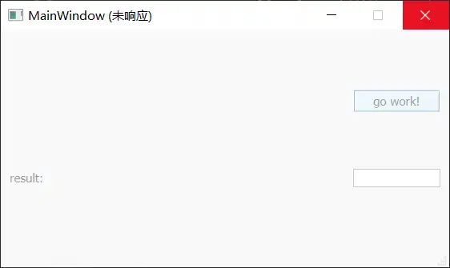

# QThread
The QThread class provides a platform-independent way to manage threads.
<!-- more -->

## 为什么要使用thread
每个进程都是从一个线程开始，这个线程被称为主线程（在Qt 应用程序中被叫做GUI thread）。所有界面显示相关的控件都要运行在GUI thread中。如果在GUI thread 中执行耗时甚至阻塞的任务（方法）或者 执行sleep 会导致界面无法响应用户操作。

示例：点击按钮执行work，work执行过程中会进行sleep。执行完毕后反馈结果
实现：
``` cpp title="Work.h"
class Worker : public QObject
{
    Q_OBJECT
public:
    explicit Worker(QObject *parent = nullptr);

public slots:
    void doWork() {
		qDebug() << "begin do work thread:" << QThread::currentThreadId();
        size_t i = 0, j = 0;
        while(i < 100)
        {
            sleep(1);
            i++;
        }
        qDebug() << "finish work";
        emit resultReady("ok");
    }
signals:
    void resultReady(const QString &result);

signals:
};
```

``` cpp title="mainwindow"
class MainWindow : public QMainWindow
{
    Q_OBJECT
public:
	MainWindow(QWidget *parent)
    : QMainWindow(parent)
    , ui(new Ui::MainWindow)
	{
	    ui->setupUi(this);
		qDebug() << "MainWindow threadid:" << QThread::currentThreadId();
	    connect(this, &MainWindow::operate, &m_worker, &Worker::doWork);
	    connect(&m_worker, &Worker::resultReady, this, &MainWindow::handleResults);
	}
private slots:
    void on_pushButton_clicked() { emit operate(); }
    void handleResults(const QString &result) { ui->lineEdit->setText(result); }
signals:
    void operate();
};

```


| 行号  | 功能               |
| --- | ---------------- |
| 11  | 执行work           |
| 12  | 获取work执行结果       |
| 15  | 点击work 按钮后执行work |
| 16  | 显示work 执行结果      |
在GUI thread 连接信号-槽 和 直接调用没有区别

效果：


``` txt title="output"
MainWindow threadid: 0x76d8
begin do work thread: 0x76d8
```
	线程id相同，在同一线程中执行。
## 使用moveToThread
>Changes the thread affinity for this object and its children and returns true on success. The object cannot be moved if it has a parent. Event processing will continue in the targetThread.

只有Qobject 的子类可以通过moveToThread 移动方法到指定线程中
``` cpp title="mainwindow"
class MainWindow : public QMainWindow
{
    Q_OBJECT
    QThread m_workerThread;
public:
	MainWindow(QWidget *parent)
    : QMainWindow(parent)
    , ui(new Ui::MainWindow)
	{
	    ui->setupUi(this);
	
	    resize(800, 400);
	    m_worker.moveToThread(&m_workerThread);
	    connect(this, &MainWindow::operate, &m_worker, &Worker::doWork);
	    connect(&m_worker, &Worker::resultReady, this, &MainWindow::handleResults);
	    m_workerThread.start();
	}
    //... same as before
};

```


| 行号  | 功能                      | 说明                                                              |
| --- | ----------------------- | --------------------------------------------------------------- |
| 13  | 将worker移动到workerThread中 | workerThread 维护一个event loop，所有在该线程中的对象的槽函数都会在该线程中执行。所有信号均由该线程发射 |
| 16  | 启动workerThread          | 如果线程没有启动，那么worker 的 slots 仍在GUI线程中执行                            |

## 线程退出
如果GUI thread 退出的时候，启动的子线程仍在执行会报以下错误：
``` txt title="output"
QThread: Destroyed while thread is still running
```
需要主动结束子线程
``` cpp
     ~Controller() {
         workerThread.quit();
         workerThread.wait();
     }
```


| 行号  | 功能             | 说明            |
| --- | -------------- | ------------- |
| 2   | 退出thread 的事件循环 | 不再响应非当前线程的信号？ |
| 3   | 等待thread 执行完成  | 默认是一直等待       |

## 关联文章
- [ ] Threading Basic