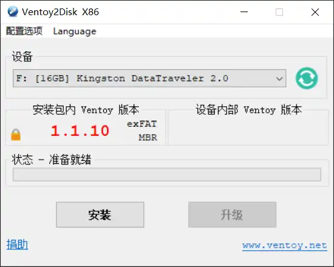
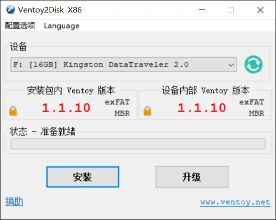
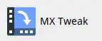
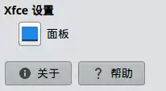
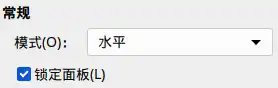
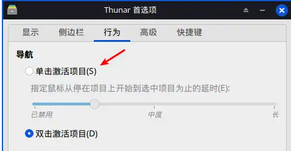
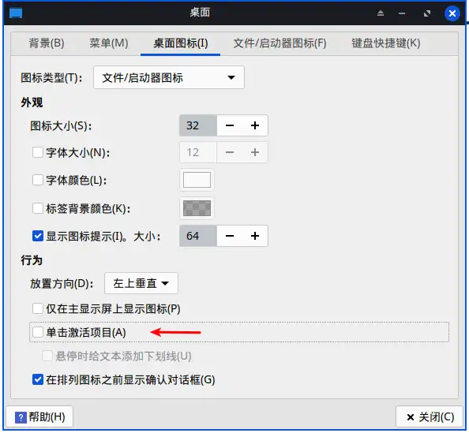
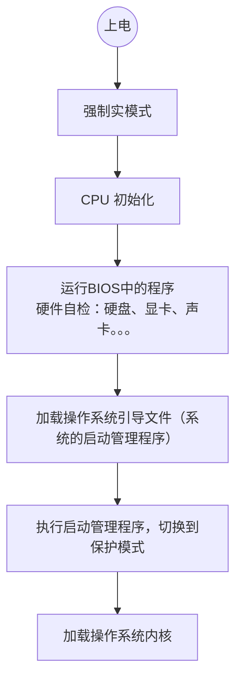

# 重装操作系统
为一台预装windows系统的电脑重装Ubuntu系统

[Ubuntu镜像下载地址](https://cn.ubuntu.com/download)
## 创建一个启动盘

1. 下载镜像：根据电脑配置 以及 自身需求选择合适的系统
因为使用的电脑年代久远，硬件配置低，所以对系统的要求是“轻量、稳定、高效”
AI推荐的是MX Linux系统 - 排行榜第一
2. 下载[Ventoy](https://github.com/ventoy/Ventoy) 制作可启动U盘的开源工具
特点：
- 拷贝ISO/WIM/IMG/VHD(x)/EFI 等系统镜像文件到U盘即可适用
- 可以在U盘中存放不同类型镜像文件，不需要反复格式化U盘
- 同一U盘同时支持x86 Legacy BIOS、IA32 UEFI、x86_64 UEFI、ARM64 UEFI 等模式
- U盘仍可用来存储其他文件，不影响日常使用
3. 测试U盘
U盘在目标电脑上是否可用；备份U盘内文件
4. 制作
参考官方文档手册中的使用说明
运行Ventoy2Disk.exe

- 选择设备 - 启动盘
- 在U盘内安装Ventoy：会格式化U盘

安装成功后右侧会显示设备内部版本号
- 拷贝镜像文件：将下载的系统镜像文件拷贝到U盘内

**信息及选项的含义**
左侧：当前配置的参数，包括分区文件系统类型（exFAT） 以及对应的 分区格式（MBR）
右侧：设备(U盘)中实际的参数
安装：第一次将左侧配置的Ventoy安装到设备中
升级：后续更改参数 以及 更新Ventoy 版本

5. 从U盘启动
插入U盘；
开机按 F9 或 F10、F12 （电脑品牌不同，对应的按键不同）进入BIOS；
选择从U盘启动 - USB hard Disk

6. 加载系统

	通过Ventoy 选择要进入的系统
7. 安装系统
[参考链接](https://www.oryoy.com/news/mx-linux-cong-ling-kai-shi-shou-ba-shou-xiang-xi-an-zhuang-jiao-cheng-jie-jue-fen-qu-yu-shuang-xi-to.html)
成功进入系统后（此时系统是通过U盘加载的）需要将系统安装到电脑的硬盘上
点击桌面上的 Installer 启动安装程序
配置的项目：
- 键盘
- Select type of installation 
	- Regular install using the entire disk：使用整个磁盘，自动分区，会替换当前电脑上已安装的系统
	- Customize the disk layout: 自定义
	- Replace existing installation(Experimental)
- 配置账户
- 时间设置

## 初始配置
### 任务栏
初始任务栏在左侧，不习惯，修改为底部

配置路径：左下角开始菜单-》
右上角设置

-》MX Tweak

-》点击左下角的 “面板” 按钮

-》将模式修改为水平


### 中文输入法
1. 更新软件源：打开MX 软件仓库管理器，手动选择相近地区的源。然后点击为`我选择最快的MX软件仓库` 会根据测试结果修改相关的配置文件
2. 在MX 软件包管理器中搜索：fcitx，安装Chinese_Input_fcitx
3. 安装成功后输入法配置中新增pinyin 

效果：


<font color="#ff0000">问题</font>：在MX 自带的文本编辑器 - Feather Pad中无法切换输出中文字符

### 表格

| 项目  | 内容                        |
| --- | ------------------------- |
| 锁屏  | 设置-》Xfce 屏幕保护程序-》锁屏-》启用锁屏 |

## 使用xfce 桌面的感受
主要是一些“缺点” 或者说不习惯的地方 还有一些无法使用 或 不知道怎么使用的情况

| 描述         | 评价                                                                                     | 修改配置                                                                                                                                                                                                         |
| ---------- | -------------------------------------------------------------------------------------- | ------------------------------------------------------------------------------------------------------------------------------------------------------------------------------------------------------------ |
| 鼠标左键单击打开文件 | 这个我觉得实在太离谱了吧，单击选中，双击打开，这应该算不上是什么固定思维吧，很符合常理。如果是触摸屏，那单击打开是正常的，因为除了修改桌面布局以外，好像没什么地方需要选中。 | 两处：对桌面图标的操作 以及 文件浏览器中的文件的操纵。<br>桌面图标：桌面设置-》桌面图标-》行为-》单击激活项目<br><br>文件管理器: 打开文件管理器 或 设置 -》 Thunar 首选项-》行为-》导航-》单击激活项目<br> |
| Snipaste   | 1. 无法设置快捷键：右键点击任务栏图标 没有弹出应用设置的菜单栏;<br>2. 无法识别窗口                                        |                                                                                                                                                                                                              |

## BIOS 和 UEFI
### BIOS - Basic Input-Output System
[参考视频](https://www.bilibili.com/video/BV1gb421h7C4/?spm_id_from=333.337.search-card.all.click&vd_source=6d8ce529a71ce9e817753804f6e733cc)

```markmap
# BIOS

## 计算机的发展过程

### 1971 Intel 第一款商用微处理器 4004

### 1973 加里.基尔代尔 (Gary Kildall)

#### 第一款面向微处理器的高级编程语言PL/M
  Programming Language for Microcomputers

#### 第一个微型计算机操作系统 CP/M
  Control Program for Microcomputers

### 1974 Altair 8800 第一台个人商用计算机 <br>意义：计算机在个人领域流行，产品快速增长

## 操作系统

### 1945 约翰·冯·诺伊曼 提出计算机设计基本原则<br>计算机的五大组成部分：运算器、控制器、存储器、输入设备、输出设备

### 作用：调度以及管理硬件资源

### 计算机体系结构

#### 冯·诺伊曼结构：将程序指令存储器和数据存储器合并在一起的电脑设计概念结构

#### 哈佛结构：将程序指令与数据储存分别存储、分别使用数据总线的计算机架构

### 操作系统也是程序，在操作系统运行前需要从硬盘加载到内存中

## BIOS的诞生

### 数字研究公司 基尔代尔 <br> 授权CP/M 给硬件制造商

- CP/M 需要支持不同硬件

### BIOS “将不同系统的硬件接口划分为一组汇编***程序***”<br>全称：Basic Input/Output System

#### 功能
- 初始化硬件

- 硬件抽象：中断向量表-硬件功能接口，系统使用硬件时通过中断号调用对应的中断处理函数，在BIOS中实现对硬件的具体操作<br>

- 存储：早期 ROM；发展 EEPROM 或 闪存

## CMOS

- 存储硬件参数、用户设定值
- RAM：掉电后数据消失

```

加载过程：


实模式（real mode）：将内存视为连续的字节，访问实际的内存地址。8086芯片只有实模式，只有20位地址总线，可寻址的地址空间大小只有1MB.
保护模式（Protected Mode）：提供内存保护、权限、分页，实现基础 - 寻址的方式。实模式中段寄存器 + 偏移地址得到实际要访问的地址。保护模式下，在表格中存储内存的访问权限、地址范围。访问内存时对比当前状态，判断是否合规（符合权限、在有效范围内）

>[!note]
>和视频介绍有出入
>- BIOS只运行在实模式下
>- 由bootloader切换模式

### UEFI -  Unified Extensible Output System


