# 轻食
注：图示图片来源于购物平台或小红书

## 大福
| 名称       | 包装                                     | 实物                                     | 价格  | 保存类型/时间          |
| -------- | -------------------------------------- | -------------------------------------- | --- | ---------------- |
| 提拉米苏风味大福 |  |  | 6.6 | 冷冻：365天 冷藏：4天 |
| 一颗栗子大福   |            |   | 5.9 |                  |
| 巴拿拿大福    |   | 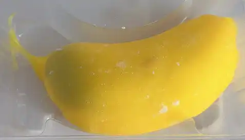  | 4.9 |                  |
| 心想事橙大福   |   | 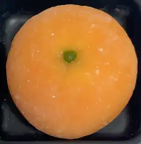 | 5.9 |                  |
| 黄油羊角可颂   |                                        |                                        | 8   | 冷冻：6个月 冷藏：3天  |

## 甜品蛋糕

| 名称       | 包装                                     | 实物                                     | 价格  | 保存类型/时间 |
| -------- | -------------------------------------- | -------------------------------------- | --- | ------- |
| 蜂蜜云朵蛋糕   | 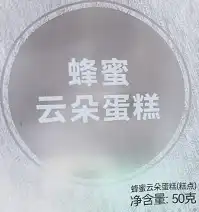 | 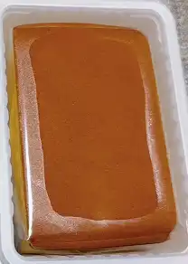 | 3.9 |         |
| 半熟芝士蛋糕   |           | 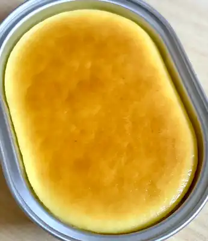 | 5.9 |         |
| 原味瑞幸卷    |  | 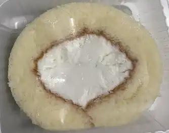          | 6.9 |         |
| 香蕉蛋糕     |  |  | 3.9 |         |
| 提拉米苏杯子蛋糕 |  |  | 7.9 |         |

## 贝果三明治
| 名称        | 包装图                                    | 实物图                                    | 价格  | 保存类型/时间         |
| --------- | -------------------------------------- | -------------------------------------- | --- | --------------- |
| 蔓越莓贝果     | 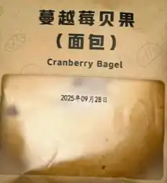 |            | 4.9 | 冷冻：4个月 冷藏：2天 |
| 烟熏鸡肉贝果三明治 |  |            | 8.9 | 冷冻：4个月 冷藏：2天 |
| 双重乏士贝果    |  |  | 4.9 |                 |
| 汁汁烤肉菌菇贝果  |                                        | 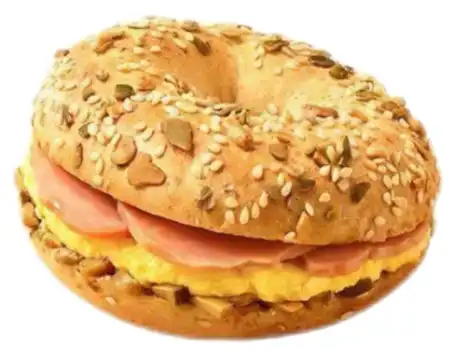 | 8.9 |                 |
| 核桃莓莓贝果    |                                        |  | 4.9 |                 |

## 经典烘焙
| 名称      | 包装图                                    | 实物图                                    | 价格  | 保存类型/时间         |
| ------- | -------------------------------------- | -------------------------------------- | --- | --------------- |
| 港式菠萝包   | 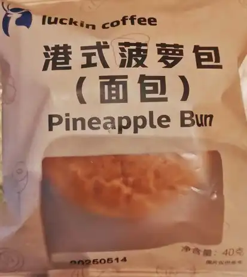  |                                        | 5.9 | 冷冻：4个月 冷藏：2天 |
| 黄油葡萄干司康 |           |           | 6.9 | 冷冻：6个月 冷藏：2天 |
| 小黄油提子曲奇 |  | 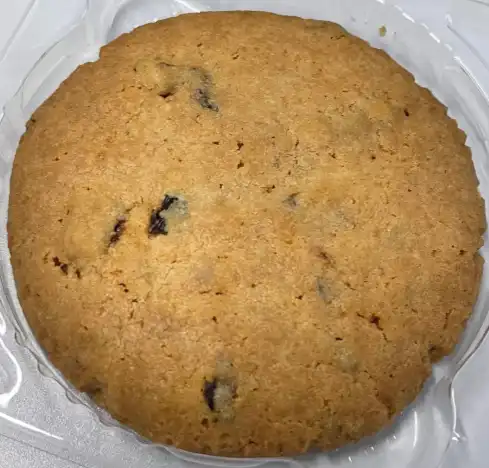 | 3.5 |                 |
| 小黄油扁扁可颂 |                                        | 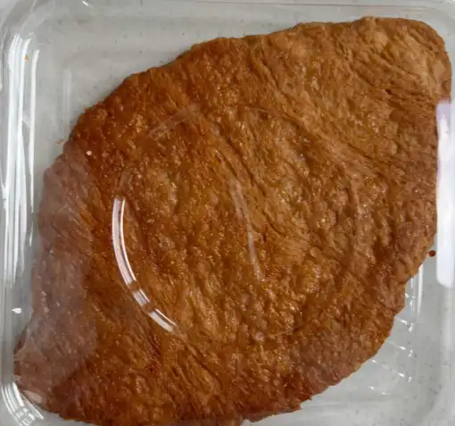 | 4.9 |                 |
| 巴斯克芝士吐司 | 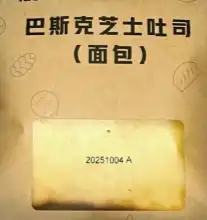 |  | 5.9 |                 |
| 原味麻薯    |                                        |                                        | 4.9 |                 |

## 曲奇
| 名称     | 图示                                    | 价格  | 保存类型/时间 |
| ------ | ------------------------------------- | --- | ------- |
| 巧克力味曲奇 |  | 3.5 | 常温：     |

## 坚果

| 名称      | 图示                                  | 价格  | 保存类型/时间 |
| ------- | ----------------------------------- | --- | ------- |
| 每日坚果8种装 |  | 4.8 | 常温：  |

