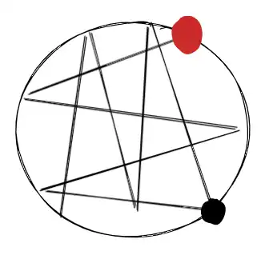

# 配方
说明：
- 如添加含量是相对含量-有对应的刻度线，则在（）内说明添加量。如：牛奶（350），指的是添加牛奶到（奶缸、杯子）350刻度线。如添加含量是绝对含量-使用量杯量取，则直接说明，如：牛乳30，指的是用量杯量取30ml牛乳。
- 杯子型号说明：所有容量标识后新增材质说明，如16注塑，16冰杯
- A/B：表示根据订单，在A、B中选一个添加
- 【C】：表示C是可选的
- 【D】（）：额外说明
- 【E-》F-》G】：冰饮，E到G是添加到冰摇壶内；热饮，E到G是添加到奶缸内
- 杯盖：冰平盖、16oz注塑杯盖、热饮杯盖、20oz一体杯盖、小黑杯盖
- 吸管类型：
	- 三孔吸管：热饮、双层纸杯（鲜萃。。）
	- 普通吸管：冰饮
	- 粗吸管：带果粒-柠檬、葡萄、晶球、椰奶冻等固体配料（而非果汁）

配方表

| 名称   | 杯型         | 杯盖/吸管      | 标准配方（符号版）  | 标准配方（文字版） | 实际做法 | 说明  | 上市/下市时间 |
| ---- | ---------- | ---------- | ---------- | --------- | ---- | --- | ------- |
| 饮品名称 | 🔥： ❄️： | 🔥： ❄️： | 🔥： ❄️： |           |      |     |         |

符号表：为简化以及方便记忆。使用图形化符号而非文字标识标识配料

| 配料/动作       | 符号         | 说明                                      |
| ----------- | ---------- | --------------------------------------- |
| 5ml原味糖浆     | 🍭白色/5ml   | 原本打算使用白色泵头表示的，但是没有找到现存的表情，暂时使用糖果 + 文字说明 |
| 6.5ml原味糖浆   | 🍭黑色/6.5ml |                                         |
| 冰饮          | ❄️         |                                         |
| 热饮          | 🔥         |                                         |
| 冰块          | 🧊         |                                         |
| 巧克力         | 🍫         |                                         |
| 牛奶          | 🥛         |                                         |
| 椰浆          | 🥥         |                                         |
| 牛乳          | 🐄         | 。。。                                     |
| 罐头果粒        | 🥫         |                                         |
| 茉莉花茶汤       | 🌸-茉莉      |                                         |
| 直饮水         | 🚰         |                                         |
| 吧勺搅拌        | 🥄         |                                         |
| 入杯          | 口_         |                                         |
| 茶叶          | 🍵         |                                         |
| 咖啡          | ☕          |                                         |
| 搅拌-》入杯-》加冰块 | 🥄-》口_-》🧊 |                                         |
| 香草味糖浆       | 🍀         |                                         |
| 马斯卡彭        | 🐎         |                                         |
| 芝士          | 🧀         | 相关的调味酱、装饰。。。                            |

符号来源：Fluent Emoji Gallery , 2D
说明：
- 可能存在类似配料，如果仅通过表情符号无法区分，应附带说明。

问：如何编辑表情的颜色？

问题：
- 为什么 带有奶盖的雪酪拿铁/抹茶 冰杯使用拱盖，但是带奶盖的咸芝士豆乳拿铁使用平盖？实际上经常有顾客要求换拱盖
- 为什么不能在制作区域粘贴配方提示图？起码可以在后方顾客看不到的地方贴吧？（即使公司没有要求，店长也可以自己执行）

**类别**

| 分类   | 说明   |
| ---- | ---- |
| 黑咖系列 |      |
| 不喝咖啡 |      |
| 经典奶咖 |      |
| 茶咖系列 | 茶+咖啡 |
| 轻咖系列 |      |

**销售周期**
- 季节售卖品
- 常规售卖品

## 刻度线
只有冰杯有刻度线
**12oz**
有3条划线刻度线，只使用中间的200ml刻度线。添加直饮水到中线

现在的12oz 使用双层纸杯，没有刻度标识

**16oz注塑杯**
- 椰云线：可去冰的产品，添加主原料到该刻度线
- 上线：和标签方框上边界平齐
- 中线：
- 下线：
- 100ml刻度线：通常添加果汁类、饮料类产品到该刻度线

**16oz冰杯**
- 满杯线
- 椰云线：椰云和满杯的中间（无实际标识）是到杯口20mm
- 上线
- 中线
- 下线
- 100ml刻度线

**20oz注塑杯**
- 满杯：550ml
- 奶盖线：450ml，通常加冰（冰沙）至该刻度线，然后添加奶盖至满杯刻度线。奶盖线指的是奶盖的起点，和果汁线-果汁的终点相反。
- 虚线：350ml
- 上线：250ml
- 中线：200ml
- 下线：150ml
- 100ml刻度线

**24oz**
- 上线：330ml
- 中线：280ml
- 下线：230ml
- 130ml刻度线：果汁

**杯口刻度线**
**12oz**
满杯刻度线

**16oz**
- 10mm
- 20mm
10和20的中间就是15mm

**24oz**
满杯刻度线：

## 风味拿铁
| 名称      | 纸杯       | 步骤                                                                                                                                                                                                                                                     | 特点（记忆）            | 是否含有牛乳 | 上市/下市 时间 |
| ------- | -------- | ------------------------------------------------------------------------------------------------------------------------------------------------------------------------------------------------------------------------------------------------------ | ----------------- | ------ | -------- |
| 黑糖拿铁    |          | 🔥 ：黑糖 -》 咖啡-》牛奶（300）-》加热-》搅拌-》入杯 ❄ ：黑糖 -》 牛奶（上线）-》咖啡-》搅拌-》冰块-》入杯                                                               | 先加咖啡，最后加冰块        |        |          |
| 黑糖燕麦拿铁  |          | 🔥 ：黑糖 -》 咖啡-》燕麦牛奶（400）-》加热-》搅拌-》入杯 ❄ ：黑糖 -》 燕麦牛奶（上线）-》咖啡-》搅拌-》冰块-》入杯 |                   |        |          |
| 丝绒拿铁    |          |                                                                                                                                                                                                                                                        | 70丝绒              |        |          |
| 茉莉花香拿铁  |          |                                                                                                                                                                                                                                                        | 和疯狂红茶拿铁区别：红茶替换为茉莉 |        |          |

| 名称     | 杯型                         | 杯盖/吸管     | 配方                                                                                              | 实际做法 | 说明               | 上市/下市时间 |
| ------ | -------------------------- | --------- | ----------------------------------------------------------------------------------------------- | ---- | ---------------- | ------- |
| 钱塘龙井拿铁 | 🔥：16热饮/20双层 ❄️：16/24冰杯 |           | 🔥：🍭白色/5ml-》☕-》【🐄-》🍵-龙井（250）-》🥛（400/500）】 ❄️：🍭白色/5ml-》🐄-》🍵-龙井（中线）-》🥛（上线）-》🥄-》口_-》🧊 |      |                  | 260316  |
| 陨石拿铁   | 16/24 冰杯                   | 16冰平盖/粗吸管 | 黑糖-》黑糖晶球 2平勺-》牛奶 主原料-》🥄-》🧊-》☕-》黑糖淋酱 杯壁一圈                                                      |      | 和之前的熊猫陨石拿铁是一个东西吧 |         |

## 大师咖啡

| 名称        | 纸杯               | 步骤                                                                                           | 特点（记忆）                                                                                                     | 上市/下市  |
| --------- | ---------------- | -------------------------------------------------------------------------------------------- | ---------------------------------------------------------------------------------------------------------- | ------ |
| 精粹奥瑞白     | 16oz热饮杯          |                                                                                              | 普通拿铁 350ml牛奶                                                                                               |        |
| 卡布奇诺      | 16/20            | 🥛250/350                                                                                    | 250ml牛奶，实际加到300，多打一点奶泡                                                                                     |        |
| 特仑苏专属牧场拿铁 | 16oz热饮杯/20oz双层纸杯 | 🔥 ：糖-》咖啡-》特仑苏牛奶（400/500）-》加热-》入杯 ❄ ：糖-》特仑苏牛奶（上线）-》咖啡-》转移至奶泡搅拌杯-》3/C 键-》入杯-》冰块            | 个神经病，放到奶泡搅拌杯干嘛？                                                                                            |        |
| 焦糖玛奇朵     |                  | 🔥 ：香草☘-》牛奶（300/400）-》加热-》入杯-》搅拌-》咖啡-》装饰 ❄ ：香草☘糖浆 -》 牛奶（上线） -》 搅拌 -》加冰-》咖啡 + 沙司焦糖酱，四横四竖。。 | 运营部门的人长脑子了，配了淋酱示意图😀   区分黑糖酱 和 沙司酱的酱瓶，黑糖-红色份数盒贴纸。 这个黑糖不能整一个黑色的贴纸？ | 260119 |
| 深烘拿铁      |                  | 🔥 ：🍬-》咖啡-》牛奶：有糖（300）；无糖（350）-》加热-》搅拌-》入杯                                                   | 搞不懂为什么这里要区分有糖 和 无糖，其他的深烘都带有额外的原料？这里只有咖啡和牛奶，牛奶的味道太甜了？                                                       |        |

## 生耶家族
| 名称     | 纸杯  | 步骤                                                           | 特点（记忆）                |
| ------ | --- | ------------------------------------------------------------ | --------------------- |
| 生耶拿铁   |     |                                                              |                       |
| 生椰丝绒拿铁 |     |                                                              | 70丝绒、椰浆               |
| 抹茶好喝椰  |     | 🔥 ：糖-》椰浆（350）-》抹茶（400）-》加热-》入杯 ❄ : 糖-》椰浆（上线）-》搅拌-》加冰-》抹茶 | 将牛奶替换为椰浆，凡是带 “椰”的都有椰浆 |

| 名称      | 杯型          | 杯盖/吸管     | 配方                                                      | 实际做法 | 说明   |
| ------- | ----------- | --------- | ------------------------------------------------------- | ---- | ---- |
| 生椰三重奏拿铁 | ❄️：16/24冰杯  | ❄️：拱盖/粗吸管 | ❄️：🍭白色/5ml-》椰奶冻（果汁线）-》冷冻椰浆（上线）-》椰子奶油 30 -》🥄-》🧊-》椰云奶盖 |      |      |
| 冰吸生椰拿铁  | ❄️：16/24 冰杯 | ❄️：通用     | ❄️：🍭白色/5ml-》冰凉感厚椰 70/100 -》椰浆-主原料（上线）-》🥄-》🧊-》☕       |      | 12.9 |
| 轻椰茉莉拿铁  | ❄️：16/24 冰杯 | ❄️：通用     | ❄️：🍭白色/5ml-》椰浆（下线）-》茉莉（上线）-》🥄-》🧊-》☕                  |      | 9.9  |
## 美式家族

| 名称     | 纸杯  | 步骤                                                                   | 特点（记忆）     | 上市/下市 时间 |
| ------ | --- | -------------------------------------------------------------------- | ---------- | -------- |
| 标准美式   |     | 🔥 ：糖-》咖啡-》单奶30、双奶60-》热水-》搅拌 ❄ ：糖-》直饮水（上线）-》单奶30、双奶60-》搅拌-》冰块-》咖啡 |            |          |
| 深烘美式   |     |                                                                      | 咖啡替换为 深烘   |          |
| 加浓美式   |     |                                                                      | 咖啡替换为加浓美式  |          |
| 小黄油美式  |     | 🔥 ：糖-》咖啡-》小黄油70-》热水-》搅拌 ❄ ：糖-》直饮水（上线）-》小黄油70-》搅拌-》冰块-》咖啡         | 冰的先加水后加小黄油 |          |
| 茉莉花香美式 |     | 🔥 ：糖-》茉莉100 -》咖啡-》热水-》搅拌 ❄ ：糖-》直饮水（上线）-》咖啡-》搅拌-》冰块-》茉莉           | 茉莉当作抹茶？    |          |

| 名称     | 杯型         | 杯盖/吸管 | 配方                           | 说明                   |
| ------ | ---------- | ----- | ---------------------------- | -------------------- |
| 椰青冰萃美式 | ❄️：16/24冰杯 | 平盖/通用 | 🍭白色/5ml-》椰子水（上线）-》🥄-》🧊-》☕ | 是不是要把一整颗椰子用到的原料消耗完😆 |
## 果C美式
相比标准美式增加了果汁

| 名称     | 纸杯  | 步骤                                                                                                           | 特点（记忆）                                                                                   |        |
| ------ | --- | ------------------------------------------------------------------------------------------------------------ | ---------------------------------------------------------------------------------------- | ------ |
| 橙C美式   |     | 🔥 ：糖-》橙汁（100）-》咖啡-》热水-》搅拌 ❄ ：糖-》100ml-》直饮水（上线）-》搅拌-》冰块-》咖啡                                               | 没看到热的超大杯，冰的超大杯就加果汁到130 奶缸底部是100ml刻度线，可能不是很好量取吧，热饮就用量杯量取果汁                             |        |
| 苹果C美式  |     | ❄                                                                                                            | 加苹果汁100ml                                                                                |        |
| 柚C美式   |     | ❄                                                                                                            | 柚子果汁 注意：其他果汁都是用塑料瓶包装，只有这个用的是纸盒                           |        |
| 拧C美式   |     | ❄ ：糖 5~8 泵-》柠檬果粒1平勺-》柠檬汁 25ml -》直饮水（上线）-》搅拌-》冰块-》咖啡                                                          | 这里要加柠檬果粒，并且配粗吸管，没有热                                         |        |
| 葡萄冰萃美式 |     | ❄ ：糖-》葡萄果粒 1平勺-》葡萄（100/130）-》苏打水（下线）-》搅拌-》12oz/16oz 1平铲冰-》苏打水（杯口15mm）-》咖啡                                    | 冰拱盖子，分两次添加苏打水，第一次下线，第二次到杯口。粗吸管 |        |

| 名称     | 杯型          | 杯盖/吸管            | 配方                                          | 说明  |
| ------ | ----------- | ---------------- | ------------------------------------------- | --- |
| 苦瓜果蔬美式 | ❄️：16/24 冰杯 | ❄️：16oz 冰平盖/通用吸管 | 🍭白色/5ml-》🥒（果汁线）-》🍎 30-》🚰（上线）-》🥄-》🧊-》☕ |     |
## 果蔬茶
| 名称      | 纸杯  | 步骤  | 特点（记忆）  |
| ------- | --- | --- | ------- |
| 羽衣轻体果蔬茶 |     |     | 加羽衣甘蓝果汁 |

| 名称      | 杯型             | 杯盖/吸管            | 配方                                                           | 实际做法 | 说明             |
| ------- | -------------- | ---------------- | ------------------------------------------------------------ | ---- | -------------- |
| 苦瓜轻体果蔬茶 | 16oz注塑杯/24oz冰杯 | 16oz注塑杯盖，冰平盖/粗吸管 | 🍭白色/5ml-》🥫白西柚1TBSP-》【🥒（150）-》🌸-茉莉（250）-》🚰（350）】-》口_-》🥄 |      | 增加了西柚粒，其余和羽衣相同 |

- 基本上都是超大杯，极少量的大杯，注意下大杯果蔬茶的杯子是注塑杯：果蔬茶的杯子是不是比标准16冰杯小啊？不然为什么不用16冰杯？而且果蔬茶都是用冰摇壶，如果用冰杯：果汁线（100）-》下线-》上线这样加，味道会不足？因为没有咖啡，主要还是靠果汁吧
## 轻乳茶

| 名称     | 杯型         | 杯盖/吸管     | 配方                                                                                           | 说明  |
| ------ | ---------- | --------- | -------------------------------------------------------------------------------------------- | --- |
| 鲜粹轻轻茉莉 | 16/20 双层纸杯 | 热饮杯盖/三孔吸管 | 🔥 ：糖-》牛乳-》牛奶（100、150）-》茉莉（400、500）-》加热 ❄ 🥛冰摇壶:  糖-》牛乳-》牛奶（100、150）-》茉莉（300、400）-》搅拌-》加冰 |     |

- 热的大杯：加完糖和牛乳后如果按照标准加牛奶到100刻度线，感觉都不用加牛奶，已经到了100

## 不喝咖啡系列

### 瑞纳冰

| 名称      | 杯型    | 杯盖/吸管    | 配方                                                                                                                                           | 说明                                                                                                 |
| ------- | ----- | -------- | -------------------------------------------------------------------------------------------------------------------------------------------- | -------------------------------------------------------------------------------------------------- |
| 雪酪芝士葡萄  | 20注塑杯 | 一体杯盖/粗吸管 | ❄: 🍬-》葡萄（下线）-》茉莉（上线）-》搅拌-》倒入冰沙搅拌杯-》加入冰块16oz-》4/D 搅拌-》杯中加入葡萄果粒 **2平勺**  -》入杯-》奶盖 非沙冰：🍬-》葡萄果粒**2平勺**-》葡萄饮料（下线）-》茉莉（上线）-》直饮水（虚线）-》奶盖（满刻度线） | 既然是倒入搅拌杯将冰块打成沙冰，为什么倒入之前还要搅拌？多此一举。前面粒粒沙冰是先将冰块冰杯中然后一起倒入搅拌杯？ 这里搅拌应该是搅拌糖浆（实际上忙的的时候直接倒，本来就耽误时间，谁还搅：） |
| 冰镇杨梅瑞纳冰 | 16冰杯  | 粗吸管      | 🍭白色/5ml-》杨梅（下线）-》直饮水（上线）-》🥄-》【16oz 一铲子冰-》4/D 按键】-》口_-》杨梅（满刻度线）                                                                             |                                                                                                    |

### 抹茶系列

| 名称                | 纸杯    | 步骤                                                                                                                                           | 特点（记忆）                                                     | 上市/下市 时间 | 评价  |
| ----------------- | ----- | -------------------------------------------------------------------------------------------------------------------------------------------- | ---------------------------------------------------------- | -------- | --- |
| 瑞之抹茶              | 双层纸杯  | 热🔥：糖浆-》牛乳-》牛奶（100、150）-》抹茶（150、200）-》茉莉花茶茶汤（400、500）-》蒸煮-》入杯 冰-冰摇壶❄：糖浆-》牛乳-》牛奶（100、150）-》抹茶（150、200）-》茉莉茶汤（300、400）-》搅拌-》入杯-》加冰          |                                                            |          |     |
| 抹茶丝绒拿铁            | 普通热饮杯 | 🔥 ：糖-》抹茶（50）-》丝绒（70）-》热水-》搅拌 ❄ : 糖-》丝绒（70）-》直饮水（上线）-》搅拌-》冰块-》抹茶                                                                          | 和其他的比名称带有三种原材料：抹茶、丝绒以及拿铁（牛奶），水是主要原料。问：为什么不叫抹茶丝绒美式？美式必须加咖啡？ |          |     |
| 抹茶拿铁              |       | 🔥 ：糖-》牛乳-》牛奶/燕麦奶（350）-》抹茶（400）-》加热-》入杯 ❄ : 糖-》牛乳-》牛奶/燕麦奶（上线）-》搅拌-》加冰-》抹茶       | 在普通拿铁的基础上将咖啡替换成抹茶                                          |          |     |
| 雪酪芝士抹茶 （原雪酪抹茶） | 拱盖    | 🔥 ：🍬-》【牛乳30-》牛奶（300）-》抹茶（350）】-》加热-》入杯（距离杯口20）-》奶盖（10）-》抹茶粉 ❄: 🍬-》牛乳30-》牛奶（上线）-》抹茶50-》搅拌-》加冰-》奶盖-》抹茶粉-》拱盖 |                                                            | 260112   |     |

### 冰茶系列
| 名称    | 纸杯       | 步骤                                                                                                                 | 特点（记忆）                                                              |
| ----- | -------- | ------------------------------------------------------------------------------------------------------------------ | ------------------------------------------------------------------- |
| 葡萄冰茶  | 16/24    | ❄ ：糖-》葡萄果粒 1勺小号底料勺-》葡萄浓浆100ml/130ml-》直饮水（上线）-》搅拌-》冰块-》茉莉-》粗吸管PLA                                                   | 和美式相比只不过是将咖啡替换为茉莉茶汤 葡萄果粒合葡萄浓浆分开添加，我觉得这种做法没问题，不会因为饮料剩余度影响出品的果粒数量。 |
| 苹果C冰茶 | 16/20/24 | 🔥 ：糖-》苹果（100）-》茉莉 50-》热水-》搅拌 ❄ ：糖-》🍎（果汁线）-》直饮水（上线）-》搅拌-》冰块-》茉莉                   |                                                                     |
| 橙C冰茶  | 16/20/24 | 🔥 、❄                                                                                                              |                                                                     |
| 柚C冰茶  |          |                                                                                                                    |                                                                     |
|       | 24       | ❄ ：糖 5泵起-》柠檬果粒1平勺-》葡萄果粒1平勺（小号底料勺）-》柠檬汁25ml（对头式量杯另一面）-》茉莉（上线）-》葡萄50-》搅拌-》加冰 含轻咖：添加绿咖啡液 50ml 少冰：加冰前，补充100ml直饮水 | 糖的添加含量有变化：微甜-5；少少甜6；少甜7；标准8                                         |

| 名称    | 杯型   | 杯盖/吸管     | 配方                                                                                                  | 说明  |
| ----- | ---- | --------- | --------------------------------------------------------------------------------------------------- | --- |
| 轻咖柠檬茶 | 24冰杯 | 16冰平盖/粗吸管 | ❄ ：原味糖浆 5泵起-》柠檬果粒 1平勺-》柠檬汁 25ml-》青露茶汤（中线）-》直饮水（上线）/少冰 150ml）-》【绿咖啡液 50ml】-》搅拌-》加冰                   |     |
| 葡萄柠檬茶 | 24冰杯 | 16冰平盖/粗吸管 | ❄ ：原味糖浆 5泵起-》柠檬果粒 1平勺-》葡萄果粒 1平勺-》柠檬汁 25ml-》青露茶汤（中线）-》直饮水（上线）/少冰 150ml）-》【绿咖啡液 50ml-》葡萄 50ml-》搅拌-》加冰 |     |
### 生椰杨枝甘露
| 名称  | 纸杯     | 步骤                                                                                     | 特点（记忆） |
| --- | ------ | -------------------------------------------------------------------------------------- | ------ |
|     | 16oz大杯 | ❄ ：糖-》西柚粒（可选）-》1平勺晶球-》椰奶冻（果汁线）-》【椰浆】（100）-》芒果（（150、200）-》茉莉（200、300）-》直饮水（250、400）-》盖盖 | 粗吸管    |

## SOE小黑杯
| 名称       | 纸杯  | 步骤                                                                             | 特点（记忆）                                                                                                                                         |
| -------- | --- | ------------------------------------------------------------------------------ | ---------------------------------------------------------------------------------------------------------------------------------------------- |
| 耶加雪菲-美式  |     | 🔥 ：糖-》咖啡-》热水-》搅拌 ❄ ：糖-》直饮水（200）-》搅拌-》冰块-》甄选浓缩 | 12oz SOE热饮杯盖                                                                                                                                   |
| 耶加雪菲-拿铁  |     | ❄ ：先加咖啡，后加冰块 特仑苏：糖-》特仑苏（200）-》咖啡-》奶泡搅拌杯 3/C-》入杯-》冰块                         | 和普通拿铁区别：250ml牛奶；冰的加到200ml刻度线； 实际牛奶加到300ml，多打一点奶泡  |
| 耶加雪菲-奥瑞白 |     |                                                                                | 和上面的拿铁使用的咖啡不一样                                                                                                                                 |

包装变更：原热、冷区分杯型，现在同一使用同一种杯型
冷饮使用冰摇壶量取

## 去冰、少冰
**补充直饮水**
- 冰茶
- 果茶：杨枝甘露、一大口草莓

**椰浆**
生椰家族

**牛奶**
拿铁

**茶汤**
- 鲜萃
- 羽衣轻体果蔬茶

**不支持去冰**
- 所有的气泡（葡萄冰萃、橙C美式气泡）都不可去冰、少冰

标准中 `葡萄柠檬茶` 属于轻咖系列？不可去冰
实际如果备注去冰补充水？还是茶汤？ - 顾客优先，要喝去冰的有什么不能去的。

## 总结
**冰饮中咖啡添加的顺序**
大部分都是先加冰块后加咖啡，但是以下产品是先添加咖啡后加冰块：
- 小黄油脆苹果拿铁
- 咸芝士豆乳拿铁
- 雪酪拿铁：奶盖
它们都需要添加装饰，需要冰块作支撑，但是又不能同咖啡的味道混合？
是否有例外？
添加装饰但是仍先加冰后加咖啡的：
- 比利时黑巧拿铁：巧克力一圈，难不成是因为巧克力和咖啡混合的味道不明显？

未添加装饰，先加咖啡后加冰块的：
- 黑糖拿铁
- 黑糖燕麦拿铁

**使用非原味糖浆的饮品**

| 名称    | 其他说明 |
| ----- | ---- |
| 小白梨拿铁 | 丝绒   |
| 褚橙拿铁  | 丝绒   |

**燕麦奶添加含量**
燕麦奶的含量通常为400

**使用沙冰搅拌**
- 雪酪芝士葡萄：4/D
- 雪酪芝士桃桃：4/D

**使用奶泡搅拌杯**
- 特仑苏专属牧场拿铁：3/C
- 耶加雪菲拿铁-换特仑苏：3/C

