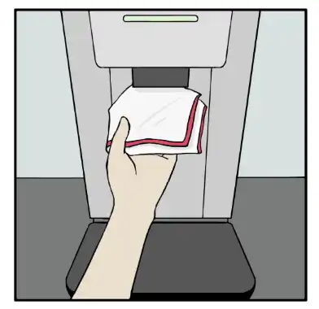

# 闭店
预打烊：闭店前3小时，可以依据实际运营状况，预先完成部分打烊工作（清理器具）

整体流程：
- 器具清洁
- 设施设备清洁
- 闭店工作
## 1. 器具清洁
- 去除残渣
- 配置清洁液
- 在清洁液中清洗
- 温水冲洗
- 消毒：浸泡在消毒水中 5min
- 再次温水冲洗
- 擦拭

## 2. 设施设备清洁
**每日固定清洁**
- 咖啡机
- 搅拌机
- 开水机
- 直饮水机
- 隔渣池
- 隔油池
- 储冰车
- 地面

---
- 固定设施
- 吧台及其他设备
- 冰箱

**周清**

| 日期  | 内容                              | 注意事项                                                                                                                                                                                                  |
| --- | ------------------------------- | ----------------------------------------------------------------------------------------------------------------------------------------------------------------------------------------------------- |
| 一   | 风幕机、鹿头灯、大门玻璃  奶油枪周清 小器具除垢 | 200ml牛奶清洗液 + 4800ml温水 这是小器具除垢用的？                                                                                                                                                                      |
| 二   | 设备后方 柜体内部                    | 咖啡机后方无法触及部分可用绿色抹布包裹长毛剧选行清洁 所有柜体都要擦拭   实际上每天都会擦柜门，但是柜体内部没擦过                                                                                                                                      |
| 三   | 糖浆泵头 海洛蒂擦拭 制冰机？              |                                                                                                                                                                                                       |
| 四   | 水池除垢 冰箱密封条                   | 1包除垢粉 + 100m1热水 + 400m1直饮水 搅拌后倒入喷瓶内，喷洒之后用绿色百洁布擦拭，之后用蓝色抹布去除水渍 红色抹布擦拭 密封条与冰箱接缝处 注：实际告知的是使用绿色抹布擦拭缝隙 |
| 五   | 咖啡机豆仓、冰箱上方及外表面、仓库货架             |                                                                                                                                                                                                       |
| 六   | 开封物料冰箱层架清洁                      | 开材物料冰箱层架取出后对冰箱里顶部进行擦拭                                                                                                                                                                                 |
| 日   | 墙壁电视清洁                          | 重点区域：三联池上方、茶桶架上方                                                                                                                                                                                      |

### 咖啡机
照片：
- 蒸奶棒浸泡
- 擦拭豆仓：佩戴一次性手套
- 红色长柄刷清洁冲泡器周边（2张）
### 开水机
吉之美
清洁区域：出水口、外表

| 步骤                             | 内容                          | 图示                                      |
| ------------------------------ | --------------------------- | --------------------------------------- |
| 0                              | 准备工作，工具：毛刷三件套、红色抹布；戴上红色胶皮手套 |    |
| 1                              | 关闭电源                        |      |
| 2 | 用最小的毛刷顶住红色毛巾，深入出水口，上下旋转擦拭。  | \| |
| 3                              | 擦拭出水口外部                     |                                         |
| 4 | 放水5秒，奶缸接取                   |                                         |
| 5                              | 使用绿色抹布擦拭开水机表面               |                                         |

### 搅拌机
照片：
搅拌壶：
- 内部
- 盖子
机器：
- 底座
- 
### 糖浆机

| 步骤                             | 内容                                               | 图示                                    | 说明                       |
| ------------------------------ | ------------------------------------------------ | ------------------------------------- | ------------------------ |
| 1 | 将装有80℃热水的清洁盒放在 出囗下方，用清洁毛刷沾取热 水清洁糖浆出囗至无糖浆残留 |  | 清洁盒使用过后清水冲洗干净，擦干后使用保鲜膜包装 |
| 2                              | 刷洗完成，使用粉色消毒抹布 将糖浆出囗附近管路擦至干净、 无水滴残留         |  |                          |
| 3                              | 使用保鲜膜包裹出口                                        |                                       |                          |

## 3. 闭店工作
- 原料封存
- 闭店剩余清洁

