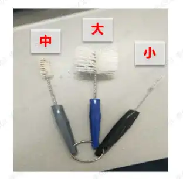
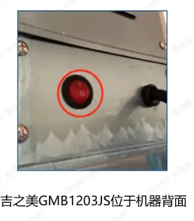
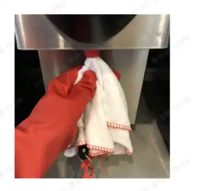
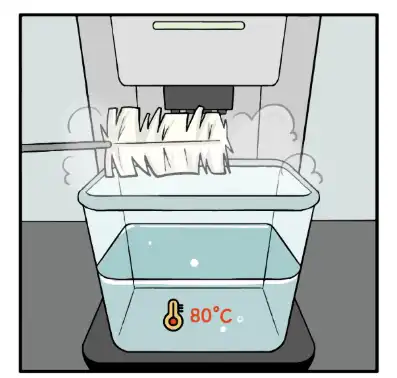
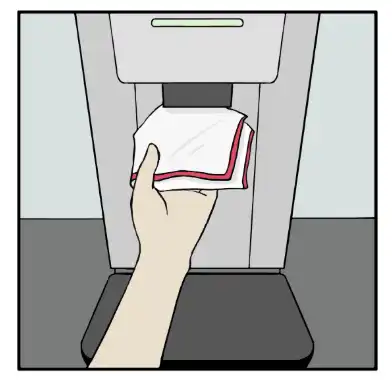

# 闭店
预打烊：闭店前3小时，可以依据实际运营状况，预先完成部分打烊工作（清理器具）

整体流程：
- 器具清洁
- 设施设备清洁
- 闭店工作
## 1. 器具清洁
- 去除残渣
- 配置清洁液
- 在清洁液中清洗
- 温水冲洗
- 消毒：浸泡在消毒水中 5min，巧克力桶浸泡（10min？）
- 再次温水冲洗
- 擦拭

### 奶油枪

### 酱料桶（预调液桶）
组成部分：
- 桶身
- 桶盖
- 外部泵头
- 底部软管（软）
- 内部吸管（硬）：上粗下窄
- 弹簧
- 垫片
- 三棱坐（不知道叫啥）

组装顺序：底部吸管连接内部吸管下方-》从硬吸管上方放入垫片-》三棱坐底部朝下放入硬吸管-》放入弹簧-》桶盖-》外部泵头向下按压并拧紧-》连接桶身

清洗时间：10min

组装时使用一次性手套

## 2. 设施设备清洁
**每日固定清洁**
- 咖啡机
- 搅拌机
- 开水机
- 直饮水机
- 隔渣池
- 隔油池
- 储冰车
- 地面

---
- 固定设施
- 吧台及其他设备
- 冰箱

**周清**

| 日期  | 内容                                 | 注意事项                                                               |
| --- | ---------------------------------- | ------------------------------------------------------------------ |
| 一   | 风幕机、鹿头灯、大门玻璃 、地垫清洁 奶缸除垢         | 除垢：100ml牛奶清洗液 + 2400ml温水                                           |
| 二   | 制冰机清洗、储冰车清洁 单屏机、小票机、标签机、吸管盒、杯塞盒 |                                                                    |
| 三   | 奶缸除垢 封口夹清洁 垃圾桶清洁、墙壁清洁        |                                                                    |
| 四   | 货架清洁 海诺蒂清洁 糖浆机周清             |                                                                 |
| 五   | 储物柜内部清洁 管道清洁 奶缸除垢            | 所有货柜内部清洁(包含清洁用品及开封物料)                                              |
| 六   | 搅拌壶周清 空调出风口 冰箱周清             | 30ml牛奶清洁液+500ml热水(闭店后做) 百洁布  门封条、冰箱隔板、冰箱角落                   |
| 日   | 豆仓周清 三联池除垢                      | 过一遍三联池 1包除垢粉 + 500m1热水(奶缸接取)  搅拌后倒入喷瓶内，喷洒之后用绿色百洁布擦拭，之后用蓝色抹布去除水渍 |

- 三连池 及 洗手池下方的柜门使用蓝色抹布擦拭，其余柜门使用绿色抹布擦拭。
- 放置药品（牛奶清洁液、咖啡机清洗药片。。。）的柜子内部使用蓝色抹布擦拭。
### 咖啡机
**日清**
咖啡豆仓区分：
- 浅烘：绿色，在最左侧
- 耶加雪菲：蓝色，中间
- 普通咖啡豆：左侧
- 深烘：红色，中间

粘贴效期时，普通咖啡豆不用补打效期，其余类型咖啡豆补打效期。

照片：
- 蒸奶棒浸泡：30ml 牛奶系统清洁液，500ml热水，浸泡10分钟
- 擦拭豆仓：佩戴一次性手套
- 红色长柄刷清洁冲泡器周边
- 蒸奶棒擦拭：红色毛巾、一次性手套

蒸奶棒清洗完成安装回咖啡机后需要高温吹气将棒内残留的清水吹走（吹干），重复3次高温蒸汽动作，每次动作时间不少于3s。

**周清**

### 开水机
吉之美
清洁区域：出水口、外表

| 步骤                             | 内容                          | 图示                                      |
| ------------------------------ | --------------------------- | --------------------------------------- |
| 0                              | 准备工作，工具：毛刷三件套、红色抹布；戴上红色胶皮手套 |    |
| 1                              | 关闭电源                        |      |
| 2 | 用最小的毛刷顶住红色毛巾，深入出水口，上下旋转擦拭。  | \| |
| 3                              | 擦拭出水口外部                     |                                         |
| 4 | 放水5秒，奶缸接取                   |                                         |
| 5                              | 使用绿色抹布擦拭开水机表面               |                                         |

### 直饮水机
**水龙头**
出水口周围红色抹布，其余部位绿色抹布

**废水盘**
- 取下并冲洗废水盘罩子
- 拆解冲压器，冲洗零件
- 热水冲洗底部废水盘，绿色毛巾擦拭干净

### 搅拌机（料理机）
**日清**
搅拌壶、沙冰壶过三联池

照片：
搅拌壶：
- 内部
- 盖子
机器：
- 底座
- 胶条
- 静音罩

**周清**
1. 30ml奶路清洁剂到搅拌壶中
2. 500ml开水
3. 浸泡10min

周清后仍需日清

🙂，瑞幸的营业额，大半是从员工身上压榨出来的
### 糖浆机
**日清**

| 步骤  | 内容                                               | 图示                                    | 说明                       |
| --- | ------------------------------------------------ | ------------------------------------- | ------------------------ |
| 1   | 将装有80℃热水的清洁盒放在 出囗下方，用清洁毛刷沾取热 水清洁糖浆出囗至无糖浆残留 |  | 清洁盒使用过后清水冲洗干净，擦干后使用保鲜膜包装 |
| 2   | 刷洗完成，使用粉色消毒抹布 将糖浆出囗附近管路擦至干净、 无水滴残留         |  |                          |
| 3   | 使用保鲜膜包裹出口                                        |                                       |                          |

**周清**

| 步骤  | 内容                                                                       | 图示  | 说明            |
| --- | ------------------------------------------------------------------------ | --- | ------------- |
| 1   | 准备：清洁盒2个                                                                 |     |               |
| 2   | 启动清洁流程：长按屏幕左上角水滴图标                                                       |     |               |
| 3   | 取糖浆瓶，拆除吸管                                                                |     | 用保鲜膜包裹糖浆瓶口    |
| 4   | 温水冲洗吸管及瓶塞，洗净后使用红色抹布擦干                                                    |     |               |
| 5   | 红色抹布擦拭糖浆接头                                                               |     |               |
| 6   | 抽屉内部清洁：红色抹布擦拭侧壁及横梁。清水冲洗底部垫子，绿色抹布擦干后放回。                                   |     |               |
| 7   | 连接吸管，使用另一个清洁盒接取并倒入热水，推回抽屉                                                |     |               |
| 8   | 同步：点击确认屏幕上的已完成的步骤                                                        |     |               |
| 9   | 清洁程序：移除出口处的垫子，放置空的的清洁盒接取清洁废水。启动清洁程序。                                     |     |               |
| 10  | 重启：等待清洁程序完成后，关闭电源，等待5s，再次启动                                              |     |               |
| 11  | 校准准备：更换2000ml直饮水                                                         |     |               |
| 12  | 填充泵头：点击右上角设置按钮（齿轮图标）-》填充全部泵头 **2次**                                      |     |               |
| 13  | 泵头校准：将出口清洁盒放置在电子秤上，并清零电子秤读数。点击屏幕 设置-》泵头校准-》选择泵头-》启动校准 **3次**-》取平均值，输入，同步 |     |               |
| 14  | 安装糖浆瓶：按位置插入对应糖浆瓶                                                         |     | 未使用的泵头使用保鲜膜包裹 |
| 15  | 再次填充2次泵头                                                                 |     |               |
| 16  | 日清                                                                       |     |               |

### 隔渣池

### 三联池

## 3. 闭店工作
- 原料封存
- 闭店剩余清洁

