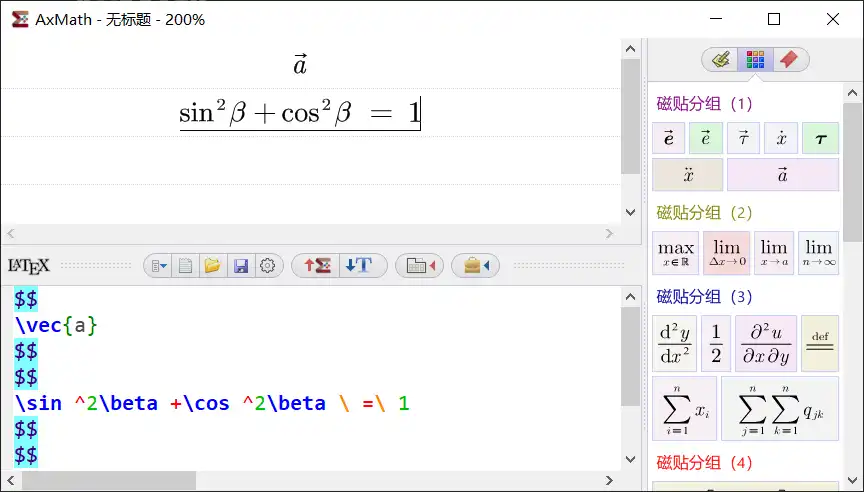
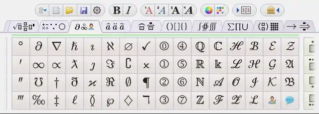
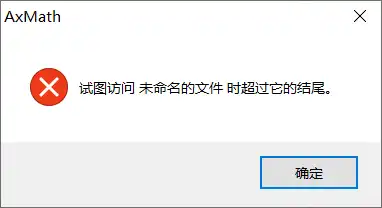

# AxMath

中间的菜单栏分为：
- 主菜单：文件相关设置 以及 软件设置
- 转换
	- 转换为公式：将下方LaTex 编辑内容转换为公式
	- 转换为LaTex代码：将上方公式转换为LaTex代码
注意：转换对所有公式、代码生效
- 面板编辑模式：使用下面的面板编辑公式

	在面板编辑模式下该功能按钮变化为LaTex 语法编辑器，点击后进入LaTex代码编辑模式
- 打开/关闭右侧工具栏

## 右侧工具栏
**笔记**
1. 可以将指定（选中）的内容添加到笔记中
打开工具栏；
选中要添加的内容：

在内容上方，按住鼠标左键，拖拽到工具栏内
效果：

2. 可以通过双击左键将笔记内容快速添加到编辑的公式内
问题：上面添加的中文文本添加时报错

**磁贴**
快速编辑用，也可以通过双击左键添加到公式中。

## 问题
1. 转换的LaTex代码似乎不正确
如：
输入字母w，然后添加箭头，转换为latex代码：
:::preview

$$
\text{\vec{w}}
$$

:::
实际上向量w的latex代码为：
:::preview
$$
\vec{w}
$$
:::
