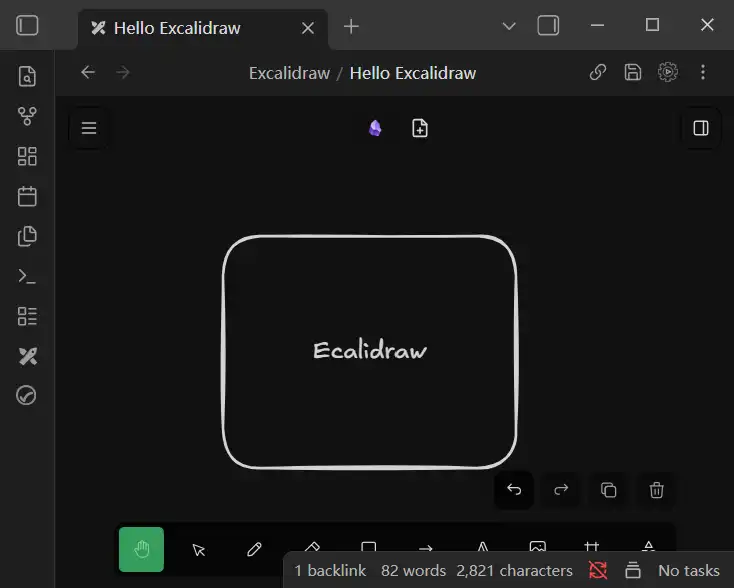
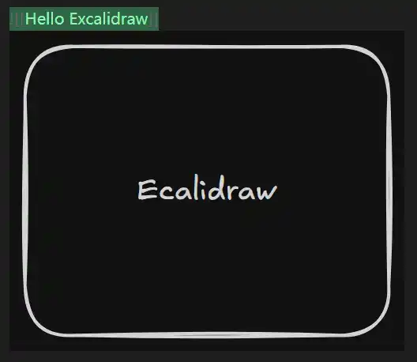

# Excalidraw

- 绘图：基本（自带）的图形工具使用
- 导入：在白板内插入外部链接、图片、视频等
- 交互：与md文档的交互，在md中嵌入Excalidraw 以及 在 Excalidraw中嵌入md

前言：
问：为什么使用Excalidraw 作为白板工具？
之前一直在用 ioDraw 作为白板工具，但是使用起来有以下几个问题
- 软件切换
- 加载文件：貌似和本地存储是分开的，需要导入本地文件，编辑后再另存，不能直接实时更新本地文件
- Excalidraw 的功能完善：使用方式和ioDraw 基本相同，能满足绘制需求
- Excalidraw 和 ob 的集成：可以很方便的在md中显示Excalidraw 的内容，不需要另外截图（修改绘图后也不用另外截图更新笔记内容）

## 配置
## 画布设置

| 项目                | 说明                                                                  |
| ----------------- | ------------------------------------------------------------------- |
| Canvas background | 两种模式：Light mode、Dark mode，每种mode 下内置了多种颜色。点击可选颜色列表最右侧按钮可以手动设置/替换 颜色 |

## 插件配置
#### Basic

| 项目                | 默认         | 说明                                                                                      | 当前配置                                                                                                    |
| ----------------- | ---------- | --------------------------------------------------------------------------------------- | ------------------------------------------------------------------------------------------------------- |
| Excalidraw folder | Excalidraw | Default location for new drawings. If empty drawings will be created in the Vault root. | 保持默认。新建的Excalidraw 会保存在 /Excalidraw/下，该路径仅存放Hello Excalidraw 文件-说明Excalidraw的功能，以及根目录下其他文件引用的Excalidraw |
|                   |            |                                                                                         |                                                                                                         |

##### 关于绘图文件的存放
**文件的内容**
使用ioDraw时将整个目录下使用的图绘制在一个文件中，切换到Excalidraw 可以将内容单独绘制，如果不同内容之间有关联，可以使用链接。

**文件的存放**
- 指定文件夹存放仓库所有Excalidraw 文件
- 存放在attachments下

原则：将Excalidraw 视为资源，和首次使用该资源的文件绑定，存放在同一路径下。其他使用该资源的文件通过链接进行绑定。
#### Embedding Excalidraw into your Notes and Exporting
| 项目                                                                | 默认        | 说明                                                             | 当前配置      |
| ----------------------------------------------------------------- | --------- | -------------------------------------------------------------- | --------- |
| Image type in markdown preview                                    | SVG Image | SVG Image：标准SVG格式图片<br>Native SVG:                             | SVG Image |
| Exporting Settings                                                |           |                                                                |           |
| Auto-export Settings                                              |           |                                                                |           |
| Keep the .SVG and/or .PNG filenames in sync with the drawing file | off       | 让根据Excalidraw 生成的SVG 或 PNG 图片名称 和 Excalidraw 保持同步，这个功能和下面的设置绑定 | on        |
| Auto-export SVG                                                   | off       | 自动创建SVG，生成的image 和 Excalidraw 在同一路径下                           | on        |

#### Excalidraw appearance and behavior
| 项目                                  | 默认  | 说明                                                        | 当前配置 |
| ----------------------------------- | --- | --------------------------------------------------------- | ---- |
| Theme and Styling                   |     |                                                           |      |
| New drawing to match Obsidian theme | OFF | 新建的绘图的主题（dark mode or light mode）默认是light（如果没有配置template） | ON   |

## 交互
### 在md中嵌入Excalidraw
Excalidraw内容：


使用：
``` md
![[Hello Excalidraw]]
```
	Hello Excalidraw 是文件名
效果：

可以直接显示Excalidraw 内容

通过引用自动生成的图片实现自动更新

新的问题：
1. SVG 图片文件较大，能不能转换为WEBP？（Excalidraw 是如何生成、更新 SVG的？）
如果能直接修改Excalidraw 增加WEBP图片格式自然是最好的。
2. 不能通过鼠标修改SVG图片的大小
可以在文件名称后指定大小 或 安装新的插件
``` md

```

