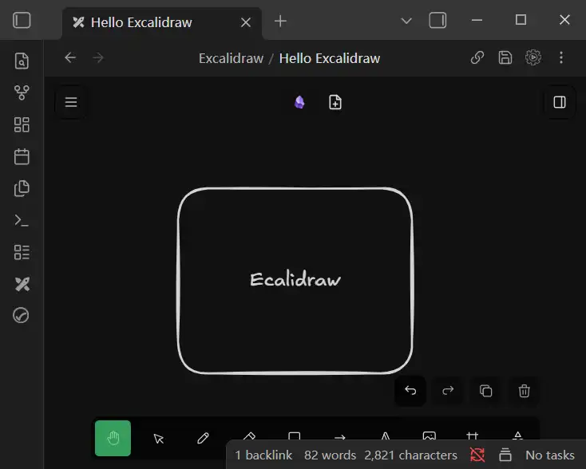
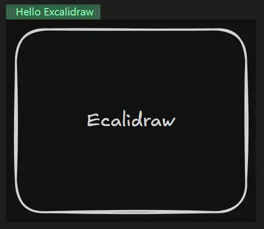
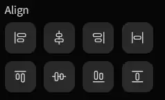
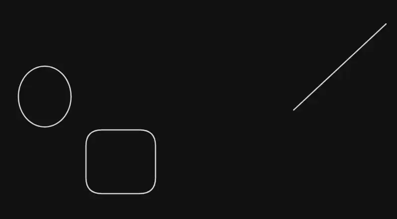
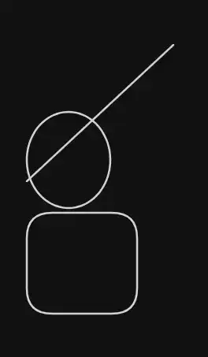
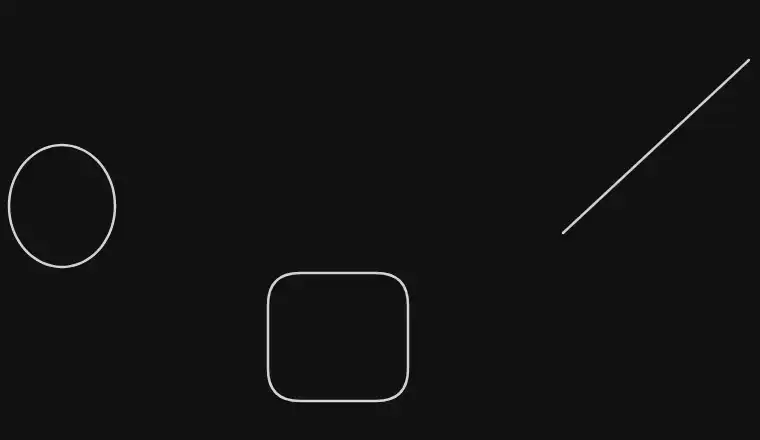
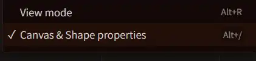
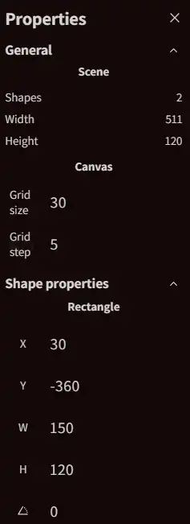
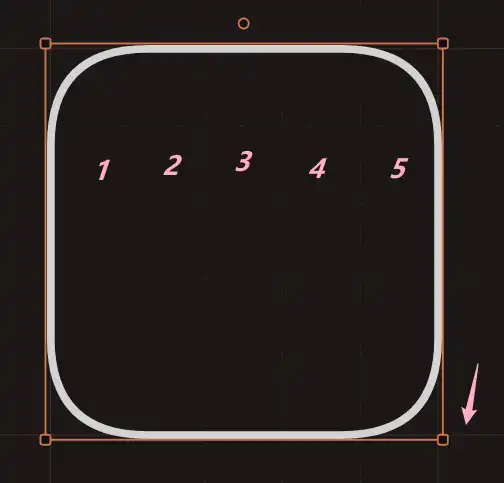
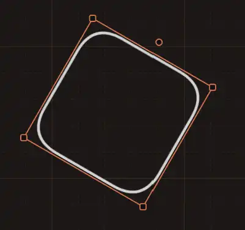

# Excalidraw

- 绘图：基本（自带）的图形工具使用
- 导入：在白板内插入外部链接、图片、视频等
- 交互：与md文档的交互，在md中嵌入Excalidraw 以及 在 Excalidraw中嵌入md

前言：
问：为什么使用Excalidraw 作为白板工具？
之前一直在用 ioDraw 作为白板工具，但是使用起来有以下几个问题
- 软件切换
- 加载文件：貌似和本地存储是分开的，需要导入本地文件，编辑后再另存，不能直接实时更新本地文件
- Excalidraw 的功能完善：使用方式和ioDraw 基本相同，能满足绘制需求
- Excalidraw 和 ob 的集成：可以很方便的在md中显示Excalidraw 的内容，不需要另外截图（修改绘图后也不用另外截图更新笔记内容）

## 配置
## 画布设置

| 项目                | 说明                                                                  |
| ----------------- | ------------------------------------------------------------------- |
| Canvas background | 两种模式：Light mode、Dark mode，每种mode 下内置了多种颜色。点击可选颜色列表最右侧按钮可以手动设置/替换 颜色 |

## 插件配置
#### Basic

| 项目                                                                      | 默认         | 说明                                                                                                                                                        | 当前配置                                                                                                                            |
| ----------------------------------------------------------------------- | ---------- | --------------------------------------------------------------------------------------------------------------------------------------------------------- | ------------------------------------------------------------------------------------------------------------------------------- |
| Excalidraw folder                                                       | Excalidraw | Default location for new drawings. If empty drawings will be created in the Vault root.                                                                   | 保持默认。新建的Excalidraw 会保存在 /Excalidraw/下，该路径仅存放Hello Excalidraw 文件-说明Excalidraw的功能，以及根目录下其他文件引用的Excalidraw                         |
| Use Excalidraw folder when embedding a drawing into the active document | off        | Define which folder to place the newly inserted drawing into when using the command palette action: 'Create a new drawing and embed into active document' | off: Use the attachments folder<br>可以通过 palette action在当前文档内插入一个新建drawing，存放在配置的attachments目录下。如果为on则存放在上面配置的Excalidraw folder下 |

##### 关于绘图文件的存放
**文件的内容**
使用ioDraw时将整个目录下所有文件使用的图绘制在一个画布/文件中，切换到Excalidraw 可以将内容单独绘制，存放在不同的画布/文件中。如果不同内容之间有关联，可以使用链接。

**文件的存放**
- 指定文件夹存放仓库所有Excalidraw 文件
- 存放在attachments下

原则：将Excalidraw 视为资源，和首次使用该资源的文件绑定，存放在同一路径下。其他使用该资源的文件通过链接进行绑定。
#### Embedding Excalidraw into your Notes and Exporting
| 项目                                                                | 默认        | 说明                                                           | 当前配置      |
| ----------------------------------------------------------------- | --------- | ------------------------------------------------------------ | --------- |
| Image type in markdown preview                                    | SVG Image | SVG Image：标准SVG格式图片<br>Native SVG:                           | SVG Image |
| Exporting Settings                                                |           |                                                              |           |
| Auto-export Settings                                              |           |                                                              |           |
| Keep the .SVG and/or .PNG filenames in sync with the drawing file | off       | 让Excalidraw 生成的SVG 或 PNG 图片名称 和 Excalidraw 保持同步，这个功能和下面的设置绑定 | on        |
| Auto-export SVG                                                   | off       | 自动创建SVG，生成的image 和 Excalidraw 在同一路径下                         | on        |

#### Excalidraw appearance and behavior
| 项目                                  | 默认  | 说明                                                        | 当前配置 |
| ----------------------------------- | --- | --------------------------------------------------------- | ---- |
| Theme and Styling                   |     |                                                           |      |
| New drawing to match Obsidian theme | OFF | 新建的绘图的主题（dark mode or light mode）默认是light（如果没有配置template） | ON   |

## 交互
### 在md中嵌入Excalidraw
Excalidraw内容：


使用：
``` md
![[Hello Excalidraw]]
```
	Hello Excalidraw 是文件名
效果：

可以直接显示Excalidraw 内容

通过引用自动生成的图片实现自动更新

新的问题：
1. SVG 图片文件较大，能不能转换为WEBP？（Excalidraw 是如何生成、更新 SVG的？）
如果能直接修改Excalidraw 增加WEBP图片格式自然是最好的。
2. 不能通过鼠标修改SVG图片的大小
可以在文件名称后指定大小 或 安装新的插件
``` md

```


## Basic shapes and features

顶部工具/图形按钮
- Selection:
- Rectangle:
- Diamond:
- Ellipse:
- Arrow
- Line:
- Draw:
- Text:
- Eraser:
- Image & Files:
- More Tools:

### 通用的方法 & 属性
**The lock button**
>Keep selected tool active after drawing

保持选中的工具 active 
默认状态下绘制图形后会回到 Selection，如果要连续绘制相同图形，可以打开 lock button

补充：默认状态 以及 lock 后绘制

**Duplicate shape**
选中要复制的图形（可以是多个图形的组合）按住alt 键，按住鼠标左键，拖动光标选择放置的位置，可以复制图形

**Canvas Background**

**Grid**

打开的方式：空白区域右键菜单-》Toggle grid
在没有grid的时候可以将图形移动到任意位置，打开grid后拖动图形时，图形的位置变化不是连续的。图形被吸附到grid上，只能停留在特定（grid上的点？）的位置。

<span style="background:#fff88f">问：</span>首先grid是不是有一个最小的格子，然后组成更大的格子。然后开启grid不会改变图形的位置？如果开启grid后所有图形的中心点只能在grid上的交叉点上，那怎么保证任意位置的图形中心点落在交叉点上？ 特定的位置到底是不是交叉点啊？


#### 单个图形

- Edit
- Duplicate: 复制选中图形
- Delete
- Undo
- Redo
选中图形，点击左下角 Edit（调色板）按钮展开编辑菜单
Edit 可配置的属性
- Stroke:
- Background:
- Fill
- Stroke width
- Stroke style
- Sloppiness
- Edges
- Opacity
- Layers
- Actions
#### 多个图形
- Align

图标的含义：
- 举行：代表图形
- 直线：代表对齐的边界线

初始：


:::tabs
@tab Align left

3个图形的右侧边缘对齐
@tab Center horizontally

3个图形的中心在垂直方向对齐
@tab Align right

3个图形的左侧边缘对齐
@tab Distribute horizontally

3个图形水平方向等距分布。
水平方向左右两侧的图形位置保持不变，中间的矩形移动到中间位置
:::
垂直方向：
- Align top: 图形上边缘对齐
- Center vertically: 图形的中心在水平方向对齐
- Align bottom: 图形的下边缘对齐
- Distribute vertically: 垂直方向等距分布

### Canvas & Shape properties

空白区域右键菜单打开 Canvas & Shape properties 

- Scene
	- Shapes 2: 图形的数量 - 2
	- Width: 画布的宽度
	- Height: 画布的高度
- Canvas: 画布 仅在开启 grid 后有效 
	- Grid size: 网格大小 - 图形移动的最小单位
	- Grid step: 间隔多少个网格显示一条更明显的网格线（箭头指向）

上图矩形大小为 100 x 100，grid size为20，grid step为5.
<span style="background:#fff88f">问：</span>能否调整网格线的颜色？
在ob中能看清，但是截图后感觉看不到网格线

- Shape properties
	- x
	- y
	- w
	- h
	- ▲: 绕中心点顺时针旋转的角度


### Lines and arrows

<span style="background:#fff88f">问：</span>如何调整arrow上文本的位置？包括能否将其放到箭头的上方（或其他任意位置）如何让文本跟随箭头的指向