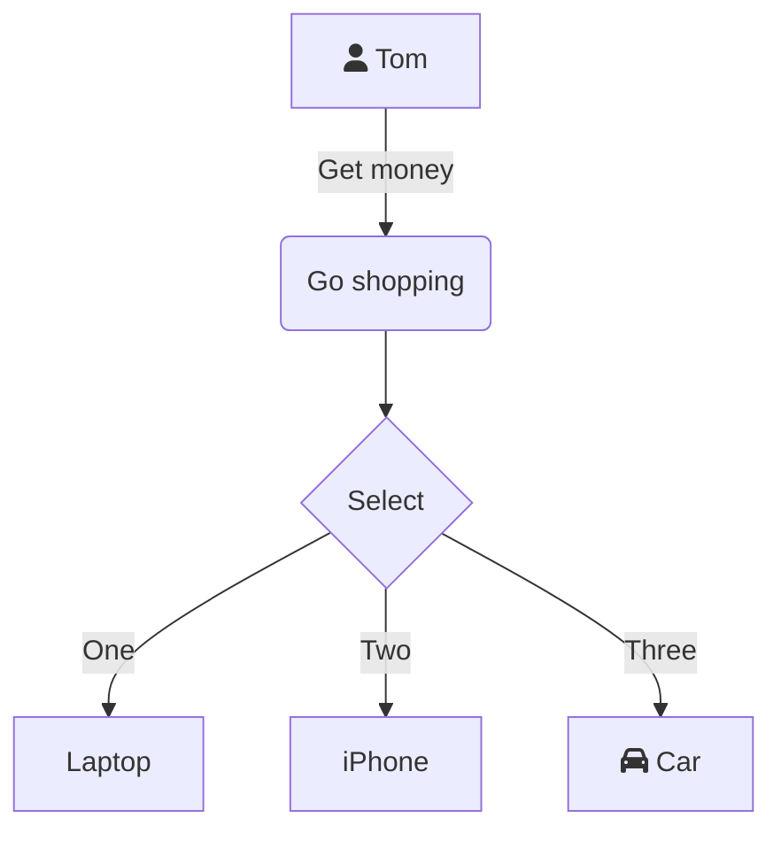
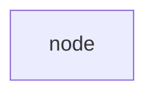
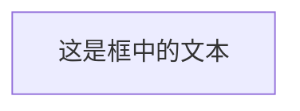
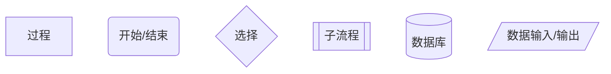
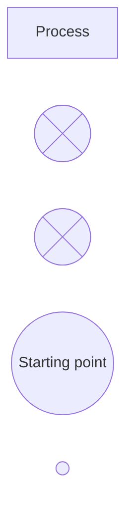
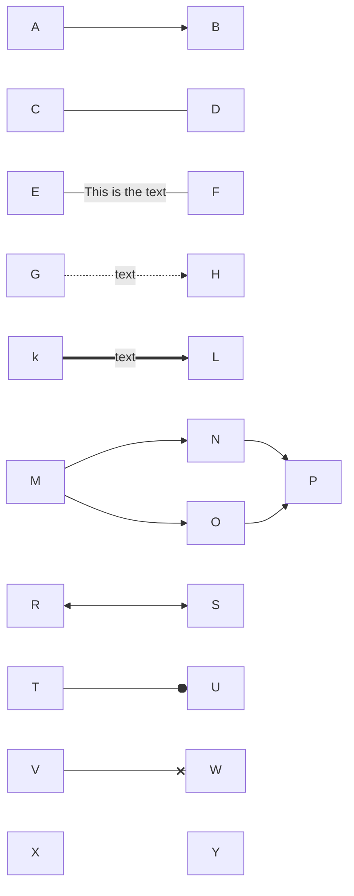
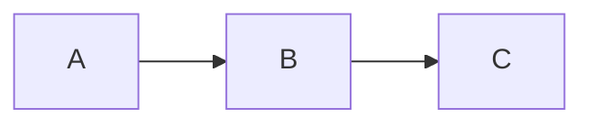
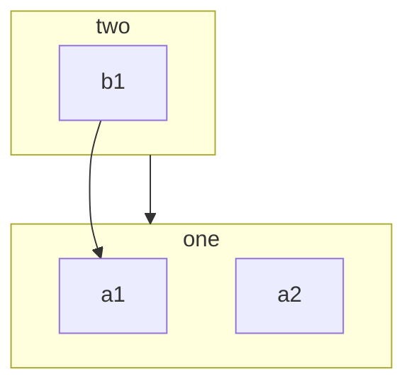
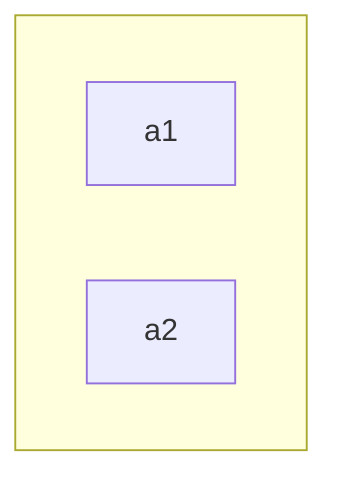
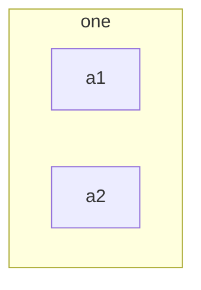

# Flowchart
各种形状的节点表示处理对象、处理过程、处理结果等
类型：graph TD
## 基本流程图要素
:::preview


:::

定义节点的语法：
:::tabs
@tab id 和 文本相同
```
graph
	node
```



@tab id 和 文本不同的节点
``` 
flowchart 
    id1[这是框中的文本]
```


:::

通过id 引用节点
## 节点形状
各种形状的节点定义

**旧的语法**
:::preview

:::

**新的语法**
:::preview

:::

语法支持的节点形状表

| Semantic Name | Shape Name     | Short Name | Alias Supported          |
| ------------- | -------------- | ---------- | ------------------------ |
| Process       | Rectangle      | rect       | proc, process, rectangle |
| Start         | Circle         | circle     | circ                     |
| Start         | Small Circle   | sm-circ    | small-circle, start      |
| Summary       | Crossed Circle | cross-circ | crossed-circle, summary  |

- Semantic Name：节点在流程图中的作用
- Shape Name：节点形状
- Short Name：在代码中的名称，使用Shape Name的简写
- Alias Supported：别名，通常为完整的shape name 或 Semantic name

新的语法使用文本描述代替符号描述，不需要记忆抽象的符号，更容易使用。
注意事项：
1. 节点的ID、@ 以及 \{ 符号需要连续，中间不能有空格；
2. 可以使用Short Name 或 Alias Supported 表示同一形状节点
3. 不同形状节点可能具有相同的Semantic 
4. 节点可以通过label属性指定描述文本。不支持的节点可以指定，但是不会显示文本。
5. 属性名称 和 属性值 之间需要空格，如shape: odd，否则指定的属性无效
## Links between nodes
节点连接
::: preview

:::

| 连接类型                 | 语法                | 说明                                     |
| -------------------- | ----------------- | -------------------------------------- |
| link with arrow head | A --> B；C --- D   |                                        |
| 带文本描述的arrow head     | E --> \|text\| F  | 在箭头后使用\| \| 包围说明文本，所有箭头都可以使用这种方法定义文本描述 |
| Dotted Link          | G -.-> H          |                                        |
| Thick Link           | K ==> L           |                                        |
| multiple link        | M --> N & O --> P | 看作是一个整体，拆分后对整体内包含的所有node 都有有效          |
| 双向箭头                 | R <--> S          |                                        |
| ⚪                    | T --o U           |                                        |
| x                    | V --x W           |                                        |
| invisible link       | X ~~ Y            | 不可见的连接，用来调整节点的位置？                      |

## Comments
::: preview

:::

注释的要求：
- 另起一行
- 使用\%% 作为起始


# Subgraphs
:::preview

:::

- 隐藏标题
:::preview

:::

- 设置subgraph 内组件的排列反向
:::preview

:::
ob中没有效果
