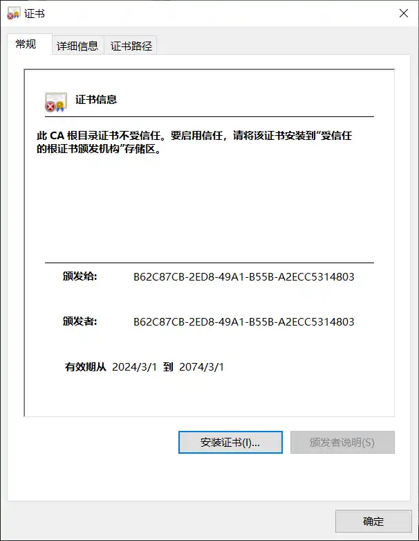
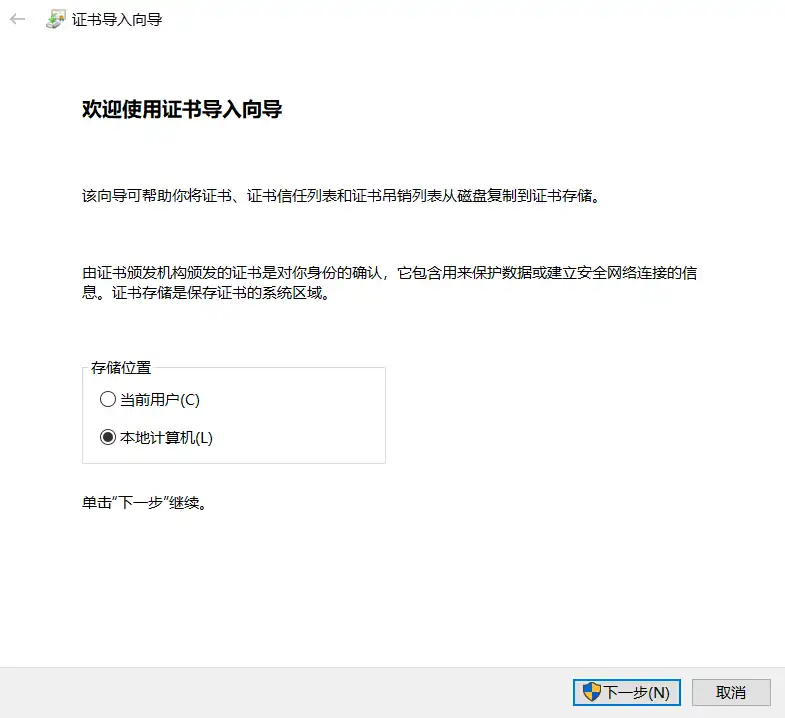
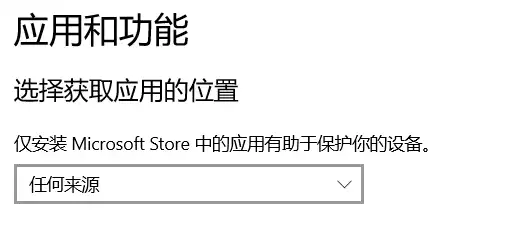
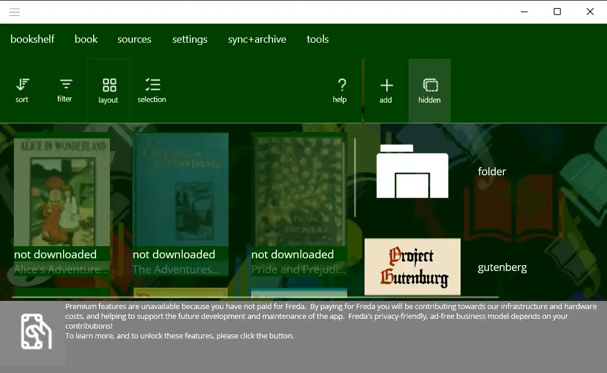
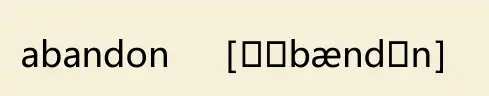
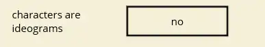

# Freda
1. Microsoft Store 链接：[freda epub ebook reader - Free download and install on Windows | Microsoft Store](https://apps.microsoft.com/detail/9wzdncrfj43b?referrer=psi&hl=en-US&gl=CN)
2. 离线安装包下载：[Freda](https://www.turnipsoft.com/freda/sideloading.html)

## 安装 - 官网给定的安装包
因为Microsoft Store 根本进不去，所以只能用离线安装包

如果直接安装，会报错：


按照网站介绍的步骤操作：
1. Right click the MSIX file, choose Properties, then in the Digital Signatures tab select the signature (there should be one and only one in the list)
Click 'Details', then 'View Certificate'

右键mslx文件，点击属性，查看数字签名栏目信息


选中签名列表中的项目，点击查看详细信息。

2. Click 'Install Certificate'. In the subsequent popups, choose 'Local Machine', then as/when prompted to, give admin permission to proceed.
选择 “本地计算机”，点击下一步，给予权限

3. Next, select 'Place all certificates in the following store' and browse to 'Trusted People'. Click OK, then Finish to actually import the certificate.

一路确认
4. Now double-click the MSIX file to install it.

现在可以安装了
...
点击安装后闪退了。。。
5. Note: depending on your system settings, this may be blocked (because Windows will allow you install apps only if they come from the Microsoft Store). If this happens, please check in Settings under Apps>Advanced app settings, and adjust 'choose where to get apps' accordingly.
如果仍然被阻止，检查 系统 ”应用和功能“中的设置，修改为”任何来源“ 



无语啊！！！天杀的microsoft 


## 安装 - 其他网站获取到的安装包
1. [Microsoft Store - Generation Project (v1.2.3) [by @rgadguard & mkuba50]](https://store.rg-adguard.net/)
把软件在store 中的网址贴上去
2. 下载
... 一样的闪退

逆天

## 安装 - 使用 PowerShell
>[!note]
我是在完成了 证书设置后 调用的命令

安装包路径下，通过`shift` + 鼠标右键打开 PowerShell ，输入命令：
``` shell
PS D:\software> add-appxpackage ./fredasideload.msix
```

成功安装

## 为什么会使用Freda？
因为在 `Bookxnote pro` 以及 `SumatraPDF` 中打开 字典数据 无法显示音标符号：

AI 推荐的epub 阅读器

效果：

能正常显示


### 英文单词间没有空格
又发现Freda 显示的英文例句没有空格。。。

真是要了命了

**修改设置：**
Settings-》Book Processing -》 关闭 characters are ideograms


如果阅读全中文的书籍，这个选项（每个字符都是表意符号-有含义）有用

同时修改了字体为：Segoe UI 
**效果：**


