# HomeBank


## Accounts

### 账户管理
路径：Manage-》Accounts...
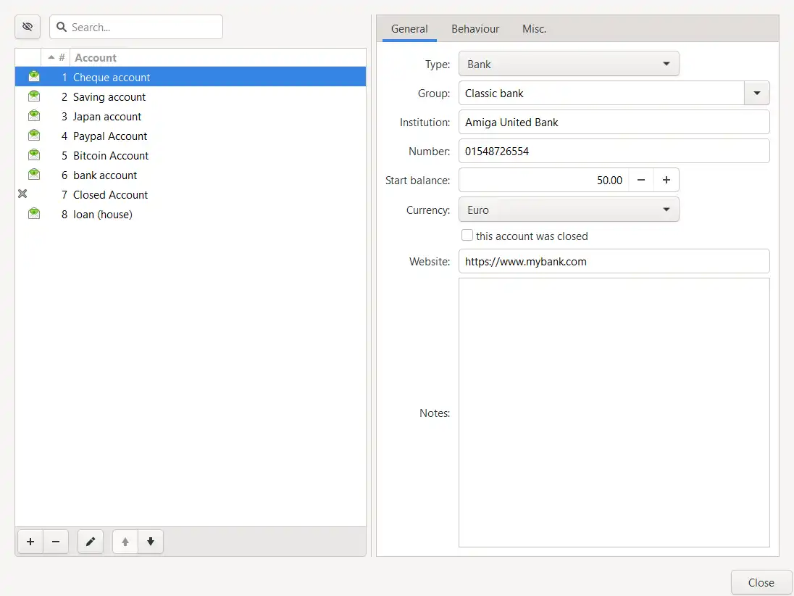

左下角的操作按钮依次为：
1. 新增account
2. 删除当前选中account
3. 修改account名称
4. 调整account的顺序

#### 关于账户 和 支付方式
账户 和 支付方式 是不同的概念。以微信为例，微信可以开通零钱，可以添加/绑定银行卡。使用微信扫码支付，可以选择付款方式。
一个银行可以办理多张卡，卡的级别、类型不同，可使用的功能（业务范围）也不同。

>[!info]
>工商银行
>1. 根据人民银行规定，我行为您提供I、II、III类账户三种不同的账户服务，您可根据需要选择办理其中的一种或多种账户
>2. 其中，II类账户包括有实体卡账户、无实体卡账户两种。有实体卡II账户只能在柜面办理，有银行卡💍；无实体卡II类账户可通过手机银行、网上银行自助申请开立，无银行卡介质
>3. 有实体卡II类账户可办理的业务种类与I类账户（实体储蓄卡）一致，但转账、取现、缴费等资金交易 日累计限额不超过1万元、年累计不超过20万元
>4. 有实体卡II类账户与绑定的I类账户之间转账，以及批量代发工资入账、归还本人贷款、本人信用卡还款不受日累计1万元、年累计20万元限额限制

<span style="background:#fff88f">问：</span>如何创建同一个银行下的所有账户？

<span style="background:#fff88f">问：</span>如何记录通过微信/支付宝扫码，使用银行卡支付的交易？
如：在12306上购票，通过支付宝-》信用卡支付
- 12306：相当于是商户的名称，实际的收款方是中国铁路网络有限公司，但我们并不关心具体的收款方
- 支付宝：账户
- 信用卡：支付方式

#### General
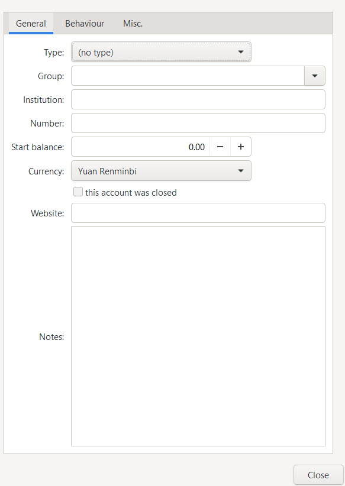

**Type**
- no type
- Bank
- Cash
- Asset
- Credit card/account
几个属性：
1. 能够借用的最大金额
2. 能够使用的范围
3. 账单的周期 及 还款日

对于分期的账单，比如使用花呗分期买了一个手机，需要记录：金额、分期数、每期还款金额、已经还款的期数、利息、是否可以延期 及 延期时间，在note中记录超期未归还等不良后果 或 其它注意事项

- Liability
- Checking
- Savings


**Group**

**Institution**

**Number**

**Start balance**

**Currency**
可选项：this account was closed

**Website**


##### Bank
银行卡有效期
1. 有效期时长
2. 到期后：无法使用ATM取现、POS消费等服务
3. 处理：更新/延长有效期？或银行卡废弃？

#### Behaviour
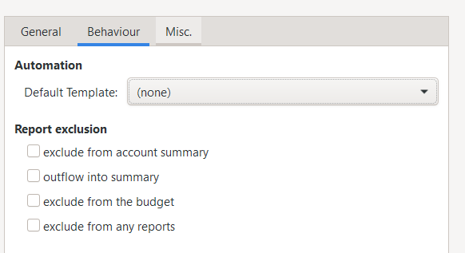

#### Misc.
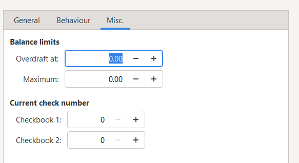

### 统计
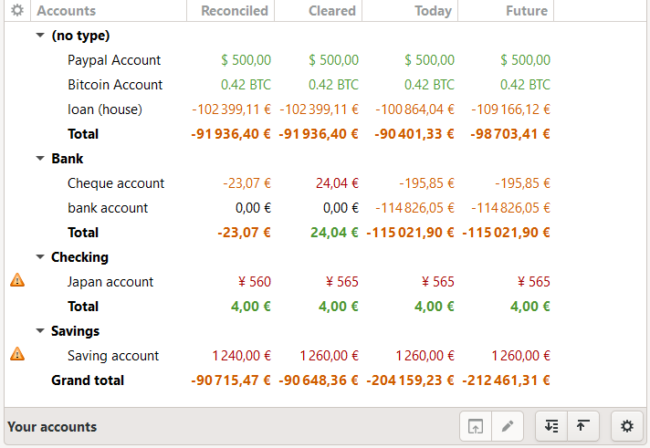

左下角功能按钮：
1. Browse Website：查看网站
2. Edit
3. Expand all
4. Collapse all
5. Options
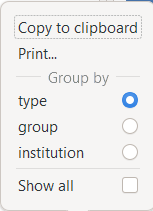

- Copy to clipboard: 拷贝当前accounts（所有） 数据道剪切板 
- Print
- Group by：设置分组类型
- Show all：是否显示 closed的account

表格列
- Reconciled：已核对。记录的账单信息 和 平台（银行）账单信息一致。
- Cleared：已结清。已经扣款
- Today：
- Future：


## Categories
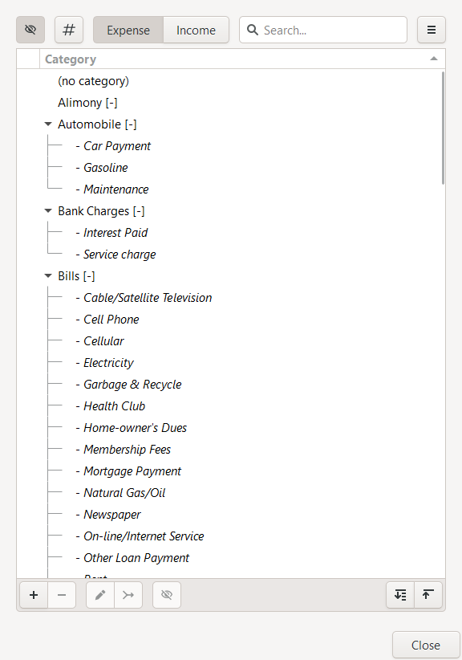

\[-]：支出
\[+]: 收入

### Expense

| 消费内容                  | 在HomeBank中的分类 | 在tr.en.d中的分类 | 我的分类 |
| --------------------- | ------------- | ------------ | ---- |
| 早餐                    |               |              |      |
| 中餐                    |               |              |      |
| 晚餐                    |               |              |      |
| 夜宵                    |               |              |      |
| 共享单车（单次/月卡）           |               |              |      |
| 地铁                    |               |              |      |
| 快递                    |               |              |      |
| 顺丰车（高速费、过桥费等其他费用）     |               |              |      |
| 替他人支付的费用（无需还）需要记录“他人” |               |              |      |
| 剪头                    |               |              |      |
| 零食                    |               |              |      |
| 火车                    |               |              |      |

#### 出行
假设要从A地-》B地，可选择的出行方式/路线
线路1：A-》火车站1：公共汽车。火车站1-》火车站2：地铁。火车站2-》火车站3：火车。火车站3-》B：地铁
另一条线路
线路2：A-》火车站2：打车。火车站2-》火车站4：高铁.火车站4-》B：打车

出行方式（乘坐的交通工具）不同，需要记录的内容也不同：
1. 公共汽车：公交线路；运营时间；班次时间-固定时间发车？每班次间隔时间；支持的付款方式。。。
2. 地铁：线路；出口-每个出口的地标；同站换乘是否需要步行一段距离。。。
3. 火车：发车时间；检票点；座位；餐车；票价。。。

同一段旅程，可以有多条线路，多条线路之间可以进行比较。比较的主要内容：
1. 价格
2. 时间
对于从A-》B可以比较两条线路的整体价格、时间。。。，也可以只比较其中部分线路（如果有相同的途径点），如：从A-》火车站2. 《=》只要有相同的起点 及 终点，就可以比较两（多条）线路。

#### Food
什么东西算是food？只要能吃的？有哪些场所会产生food类型的消费？它们之间需要记录的信息是否有区别？如何进行分类？
消费的情景/场所：
1. 普通的饭店/餐馆：不同的餐馆经营的范围（售卖的食物）不同。
- 包子铺：糕点、豆浆、粥
- 大排档：烧烤

2. 电影院/大型商场/游乐园等：去这些场所主要目的不是吃饭
3. 美食一条街/路边摊
4. （零食）超市/杂货铺

应该按照店铺进行记录，具体的food相当于是菜品，记录在店铺下面
示例：
```
名称：一树肠粉
地点：石井路。。。
品牌：用于比较同一品牌下不同位置的店铺
环境：
服务：
味道：
推荐菜：
营业时间：
类型：早、中、晚 （夜宵）
口味：广式/不辣 甜咸 （酸苦辣） 

菜品名称：海带绿豆糖水
规格-价格：小-3；中-5 规格可以是：三块/5条/300克。。。最好是可以计量的
上线时间：有的饭店会根据季节调整菜品
下线时间：
图片：
评价：

菜品名称：蛋肉肠粉
规格-价格：7
图片：
评价

```

同一家店铺可能会去很多次，每次整体的体验，每个菜品的体验都可能发生变化，这些该如何记录？
记录food的消费不仅仅是记录消费，可以当作是一个美食探店记录，可以用来:
- 分享美食
- 在自己不知道吃什么的时候提供参考
- 避免上当

### Income


### Expense (默认)
- Alimony
- Automobile
	- Car payment
	- Gasoline
	- Maintenance
- Bank Charges
	- Interest Paid
	- Service charge
- Bills
	- Cable/Satellite Television
	- Cell Phone
	- Electricity
	- Garbage & Recycle
	- Health Club
	- Home-owner's Dues
	- Membership Fees
	- Mortgage Payment
	- Natural Gas/Oil
	- Newspaper
	- On-line/Internet Services 
	- Other Loan Payment
	- Rent
	- Student Loan Payment
	- Telephone
	- Water & Sewer
- Cash Withdrawal
- Charitable Donations
- Childcare
- Children/Toys
	- Child Support
	- Daycare
- Clothing
- Credit Card Payments/Transfers
- Dining Out
- Education
	- Books
	- Fees
	- Tuition
- Entertainment
- Fees
- Food
- Gifts
- Groceries
- Health care
	- Dental
	- Eye-care
	- Hospital
	- Physician
	- Prescriptions
- Hobbies/Leisure
	- Books & Magazines
	- Cultural Events
	- Entertaining
	- Movies & Video Rentals
	- Sporting Events
	- Sporting Goods
	- Tapes & CDs
	- Toys & Games
- Home Improvement
- Household
	- Furnishing
	- House Cleaning
	- Yard Service
- Insurance
	- Automobile
	- Health
	- Home-owner's/Renter's
	- Life
- Job Expense
	- Non-Reimbursed
	- Reimbursed
- Loan
	- Loan Interest
	- Mortgage Interest
	- Student Loan Interest
- Miscellaneous
- Mortgage/Rent
- Personal Care
- Pet Care
	- Food
	- Supplies
	- Veterinarian
- Phone/Wireless
- Services/Memberships
- Taxes
	- Federal Income Tax
	- Federal Income Tax-Previous Year
	- Local Income Tax
	- Medicare Tax
	- Other Taxes
	- Real Estate Taxes
	- Sales Tax
	- Social Security Tax
	- State Income Tax
	- State/Provincial
	- Travel/Vacation
		- Lodging
		- Travel
	- Utilities

### Income (默认)
- Income/Interest
- Investment Income
	- Capital Gains
	- Dividends
	- Interest
	- Tax-Exempt Interest
- Not an Expense
- Other Income
	- Child Support Received
	- Employee Stock Option
	- Gifts Received
	- Loan Principal Received
	- Lotteries
	- State & Local Tax Refund
	- Unemployment Compensation
- Retirement Income
	- IRA Distribution
	- Pensions & Annuities
	- Social Security Benefits
- Wage & Salary
	- Bonus
	- Commission
	- Employer Matching
	- Gross Pay
	- Net Pay
	- Overtime


## Transations
### Add...
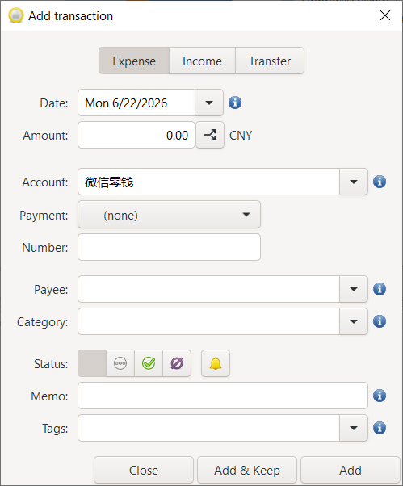

- Number：交易的编号/次数？
- Memo：备忘

#### Transfer
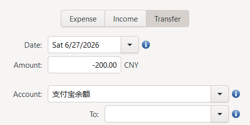

目前软件只记录内部账户之间的transfer。对于只作为中转，如支付宝收款，然后银行卡转出，如果要记录只能分别记录支付宝收款，银行卡付款。这样无法记录两者之间的流转关系。
资金可能在多个账户之间流转（大于两个），比如支付宝-》建设银行卡-》微信。每次交易可能存在服务费。这些应该作为一个整体进行记录。

#### Date
有几个问题：
1. 每次添加时都会恢复到当前日期，如果我要添加之前日期的多比交易，每次都要手动切换。就不能添加一个是否保持当前日期的选项（是否回到当前日期）？
2. 时间的精度是天，如果一天交易量比较大，或者关注交易的时间，那不是没法统计了。比如正常的早餐时间是7：00~9：00，如果超出该时间范围视为异常。

可以通过按键调整时间：
- ↑↓：day
- Shift + ↑↓: month
- Ctrl + ↑↓: year

<span style="background:#fff88f">想法：</span>这里可不可有 yesterday, last week 这种相对时间跨度。用来核对之前的交易？这样记录可以是任意时刻，而不必等到当天所有交易完成之后再进行记录。

#### Amount
单笔交易的总额。
或者
单笔消费里包含了不同类型/数量的交易
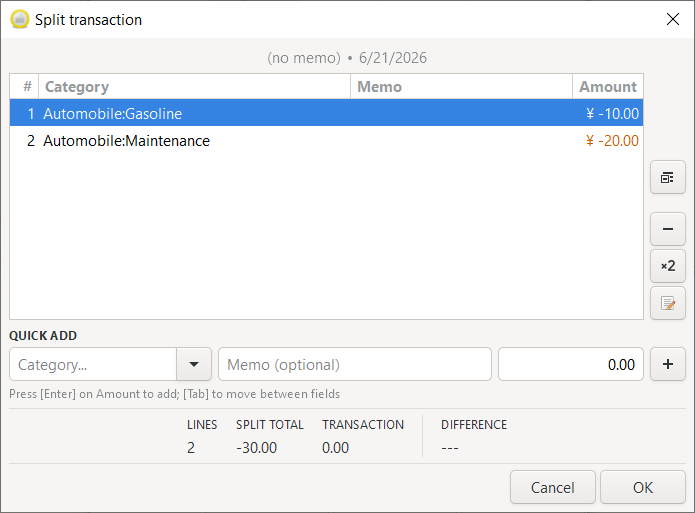

左侧功能按钮：
- Delete all
- Delete
- Duplicate
- Edit
在QUICK ADD 下方添加单笔交易

实际用途：
1. 早餐买了一碗热干面 + 一碗粥，但是是在不同的店消费的
2. 商场购物，买了一条裤子，一件上衣

<span style="background:#fff88f">问题：</span>单笔交易的内容只有3个
#### Payment
	- Credit card
	- Check
	- Cash
	- Bank Transfer
	- Debit card
	- Standing order
	- Electronic payment
	- Deposit
	- Flfee?：费用
	- Direct Debit
	- Mobile Phone

#### Payee
所有交易过的payee都会被记录，可以单独管理payee

<span style="background:#fff88f">问题：</span>通常情况下同一个Payee 交易的 category 是相同的，去饭店当然是吃饭。当然，一些综合性的场所可能涉及到不同的服务内容，交易的类型也有所区别，但是这种情况下，payee通常不是同一个。
所以对于有交易记录的payee，能不能：
1. 有一个默认category
2. 选择时默认显示已经出现过的category，增加一个按钮用于显示全部category

<span style="background:#fff88f">问题：</span>消费平台和下单的商家
如在淘宝闪购上购买了猪脚饭
一个商家可能上线不同的平台，不同平台之间活动、外卖平台等不相同，需要记录平台相关信息，以及商家信息

#### Status
从左到右依次为
- None
- Cleared
- Reconciled
- Void
- Remind


## Statistics Report
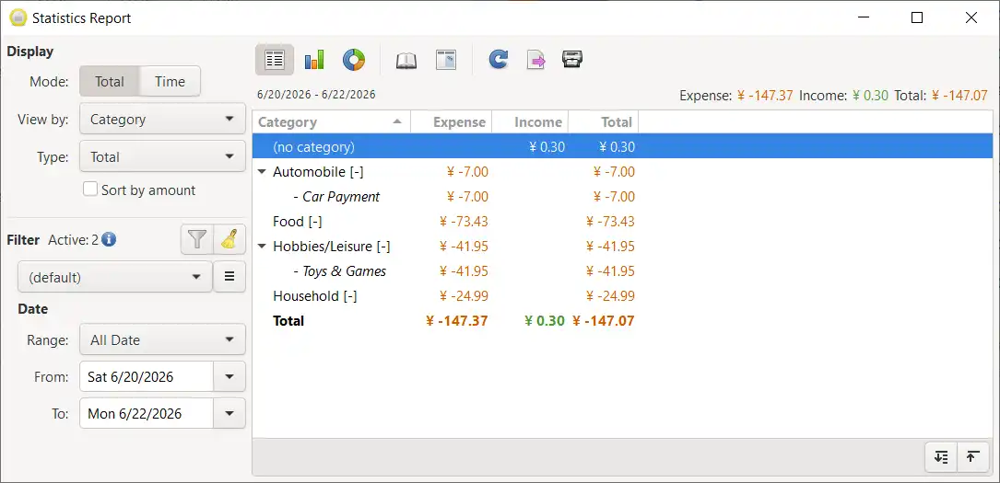

### Display
**Mode**
- Total: will display the total expense/income/balance for the period
- Time: will display the total per interval for the period

period：由下面的Date设置

**View by**
分类统计的标准
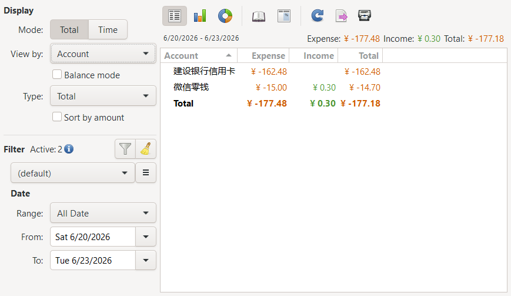

#### Total
显示period 内的 expense/income/balance的总和
**Type**
- Total: 显示所有
- Expense: 有支出的交易
- Income: 有收入的交易
如果一笔交易既有expense，又有income，那么它会一直显示。

Total模式下的另外两种视图
:::tabs
@tab column
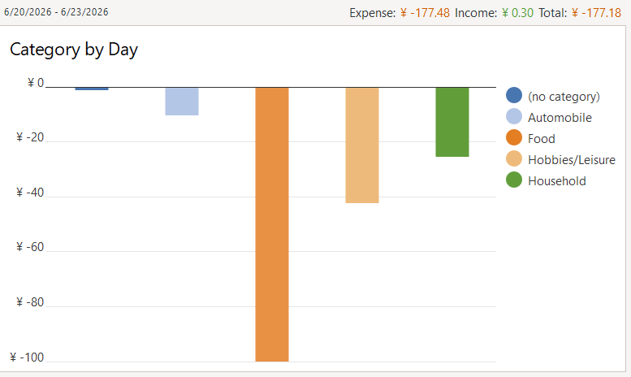

@tab donut
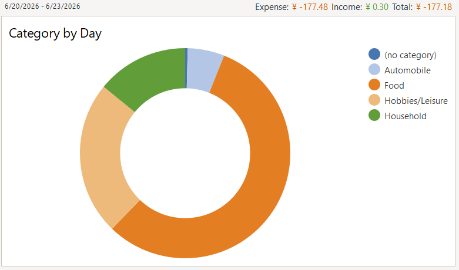
:::

在list 视图下，选中Toggle detail 按钮可以显示具体的交易信息：
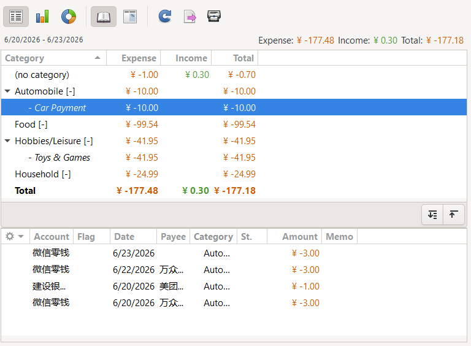

Total 模式下点击Toggle rate 按钮可以在表格中查看占比
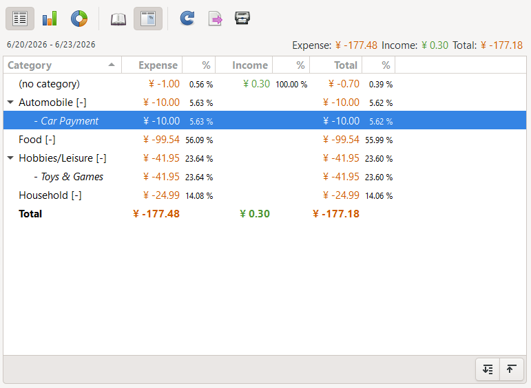

#### Time
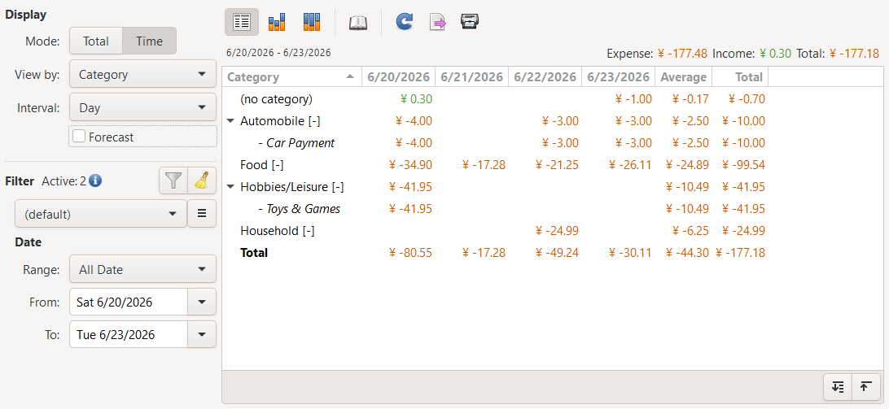
对period内的数据按照interval进行区分并统计每个interval内的数据
示例中的period为 6/20/2026 ~ 6/23/2026
interval为 day
显示每天（day）的 expense/income

**Forecast**
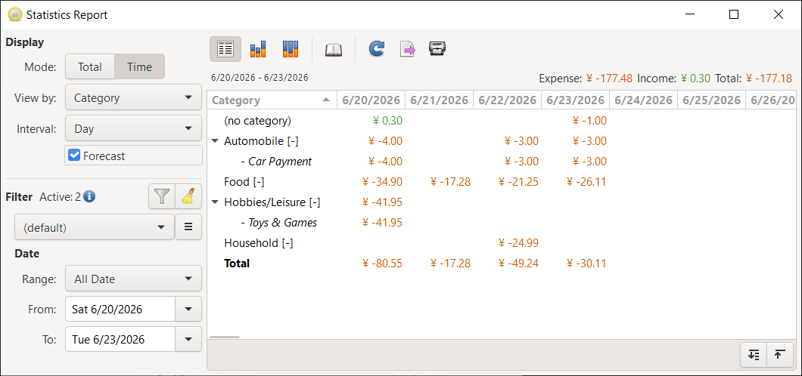
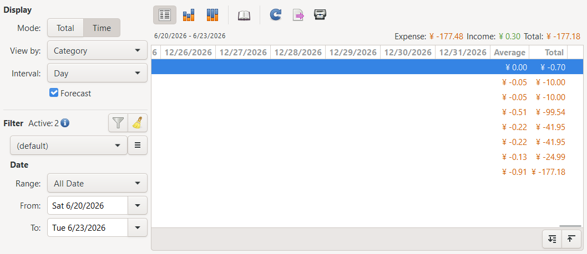

开启后统计的范围延申到了 12/31/2026

<span style="background:#fff88f">问：</span>范围如何设置？

Time模式下的另外两种视图
:::tabs
@tab stack
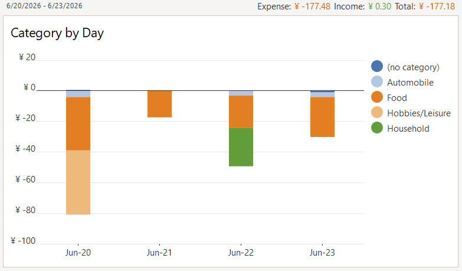
@tab stack-100%
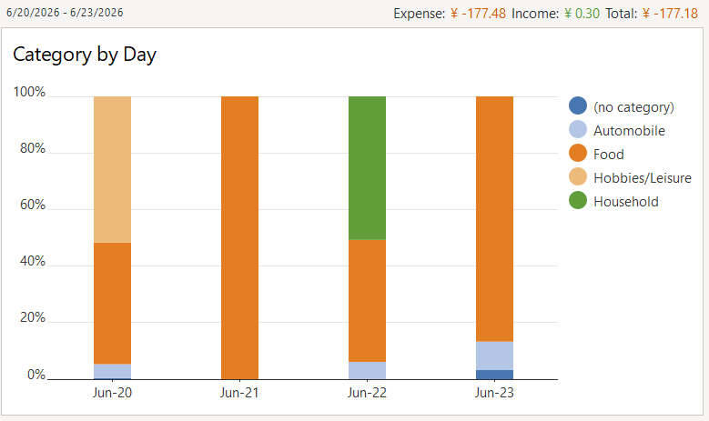

:::

### Date
**Range**
>fast select a date with predefined range

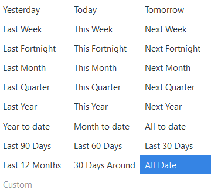

- Year to date:今年开年到现在
- Month to data:这个月开头到现在

**From/to**
> specify date bound limit to restrict the results to

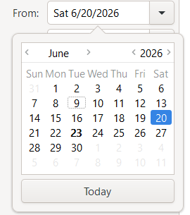


## 想法
1. 每日交易记录的完成状态
由于当前交易记录都是手动输入（与之相对的，每笔交易完成后自动添加记录），可能会存在忘记添加。是否可以存在一个日历视图查看添加交易记录的完成情况？并且设置提醒
2. 添加交易的流程向导
如果每天的交易相对固定，或者对于某种类型的交易其流程已经确定，是否可以有一个添加向导，提示需要添加的内容。比如日常中某一天的添加向导：
	a. 早餐
	b. 交通
	c. 中餐
	d. 晚餐
	e. 零食
	f. 其它
把这些汇总到一个表格里进行记录

这里每笔交易可以有一个默认值（每天早上都是热干面）也可以手动输入（今天换一换口味吃包子）

