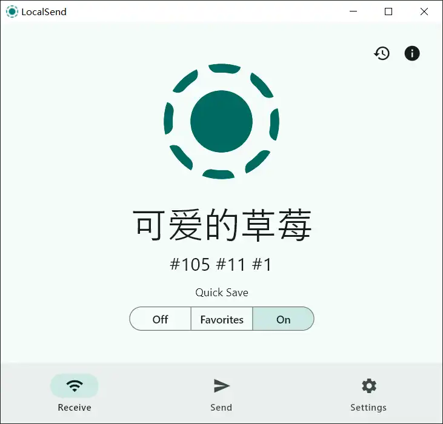

# LocalSend

## Send

## Receive

- History：接收历史
- Information：IP地址列表，port，设备名称
- Off/On：关闭/打开
- Favorites：只接收 在Send的 Search Devices 中设置为Favorite的设备发送的消息

## Send

## 问题

| 现象描述                      | 原因  | 办法                     | 参考                                                          | 思考                                           |
| ------------------------- | --- | ---------------------- | ----------------------------------------------------------- | -------------------------------------------- |
| A 可以接收到 B 消息  但是无法发送消息给 B |     | A 开了代理，关闭代理（直连）后可以发送给B | [1](https://github.com/localsend/localsend/discussions/746) | 能发不能收。因为localsend是在本地局域网通信，开了代理之后本地的被自动过滤掉了？ |

