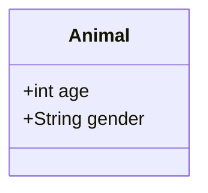
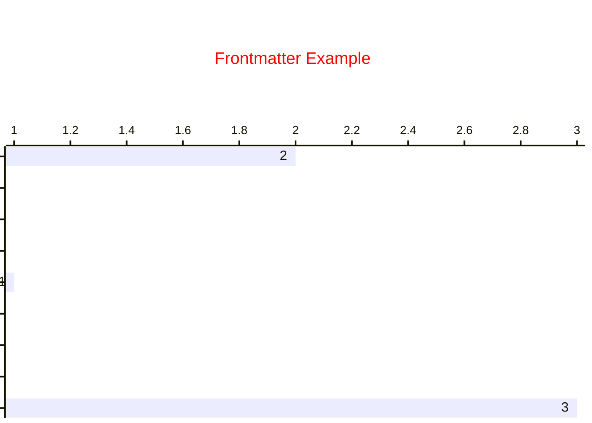
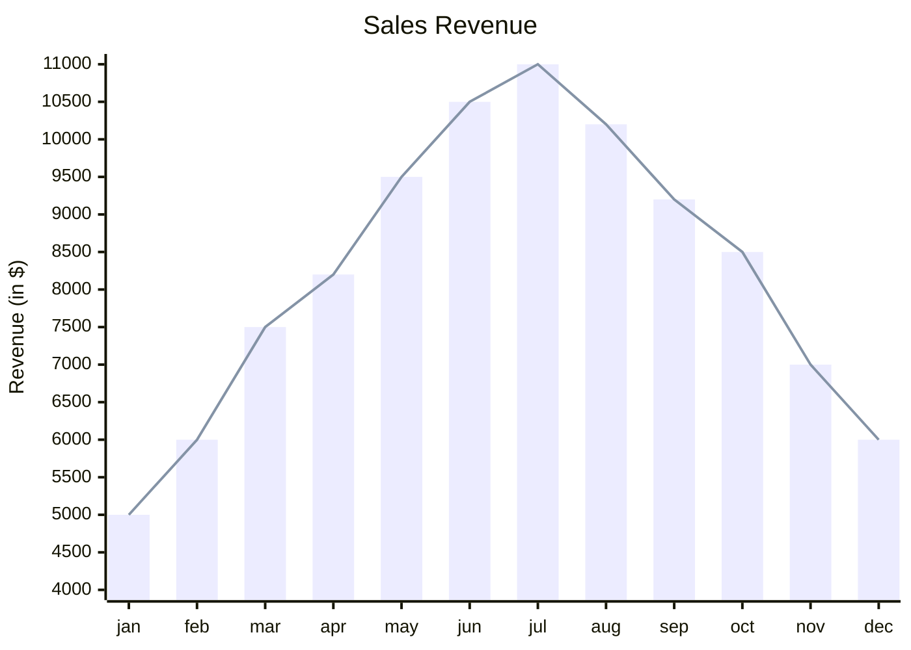
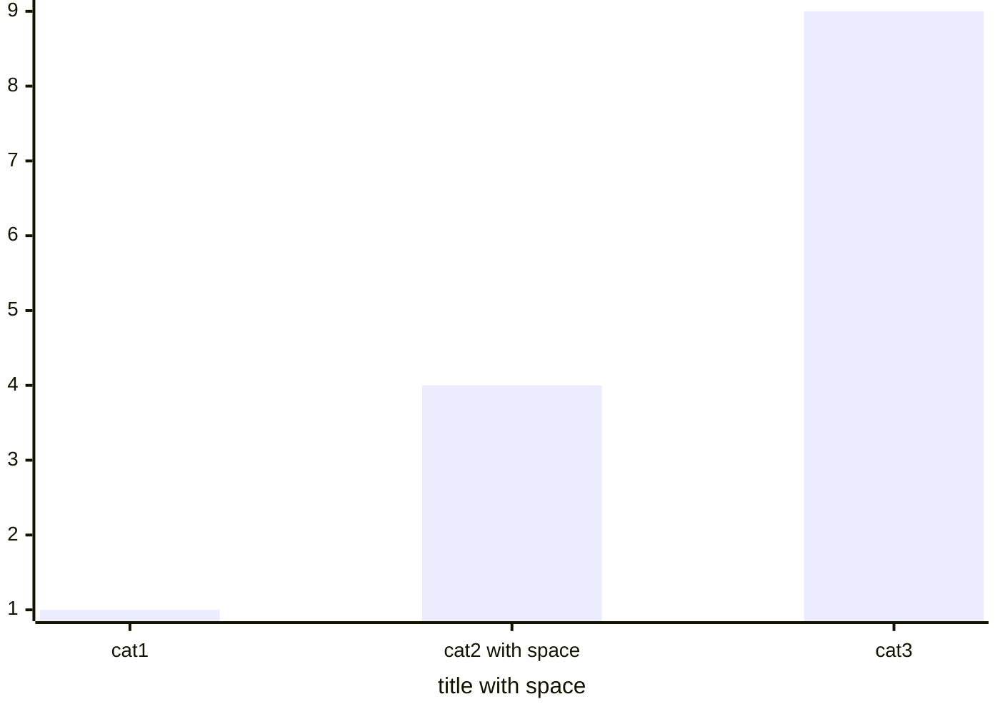
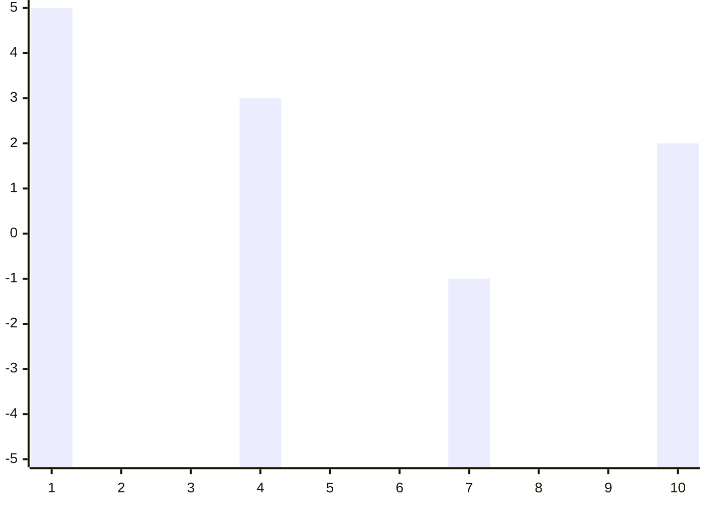

```mermaid
xychart-beta
x-axis 1 --> 10
bar [3, 5, 1]
bar [9, 4, 2]
line [3, 5, 1]
line [9, 4, 2]
```

```mermaid
---
config:
  themeVariables:
    xyChart:
      plotColorPalette: '#0000FF, #00FF00'
---
xychart-beta
x-axis ["cate0", "cate1", "cate2"]
y-axis 0 --> 50
%% blue bar
bar [20, 30, 40]
%% green bar
bar [15, 23, 28]
```

# Mermaid
[Home | Mermaid Chart](https://www.mermaidchart.com/)
[关于 Mermaid | Mermaid中文文档](https://docs.min2k.com/zh/mermaid/intro/)
**Mermaid lets you create diagrams and visualizations using text and code.**
<!-- more -->

## 在obsidian 中的使用
``` txt
\`\`\` mermaid
classDiagram
	class Animal {
		+int age
		+String gender
	}
\`\`\`
```
代码语言：mermaid
第一行声明diagram 的类型，然后是diagram的内容
效果：

## Diagram syntax
[Sequence diagrams](Sequence%20diagrams.md)


## Frontmatter for diagram code
:::preview

:::

>[!note]
>不要使用它tab作为indentation
>

> The frontmatter is a YAML block at the top of the diagram.


1. 在顶部由 --- 作为边界的 YAML 格式的代码块中定义配置
2. 配置的项目有多个层级，一个项目可以包含其它项目，如config下包含了 themeVariables、xyChart，而xyChart下有 showDataLabel、xAxis。。。
3. 单个配置项的值有多种类型

| 类型      | 值                       | 属性                           |
| ------- | ----------------------- | ---------------------------- |
| bool    | true、false              | showDataLabel                |
| string？ | '#ff0000', 'horizontal' | titleColor, chartOrientation |
| number  | 60                      | titlePadding                 |

>[!note]
>这里配置对象的名称xyChart 中 C是大写，而 diagram的类型名称是 xychart-beta，c是小写。如果名称错误，则配置无法生效

## XY Chart
> Presently, it includes two fundamental chart types: the bar chart and the line chart.

:::preview

:::

>[!note]
>当前ob 版本只支持 xychart-beta 作为 diagram 类型不支持 xychart 
### Syntax

bar
#### title
表格的标题
- 单个单词无需使用“”
- 包含空格需使用“”

#### x-axis
range
:::preview
```mermaid
xychart-beta
x-axis 0 --> 10
line [1, 4, 9]
```
:::

category
:::preview


:::


有两种类型的x取值：
1. 范围
2. 类型

- 如果同时定义了多个x-axis，后定义的会覆盖前面定义的
- x 可以带title
- 没有定义y的范围，会根据给定的y的值设置y范围（取最大、最小值）
#### y-axis
:::preview

:::


### Chart Configurations


### Setting Colors for Lines and Bars
:::preview

:::
- 可以有多个bar、line，对于bar 后定义的bar会盖住先定义的bar

第二个bar的9盖住了第一个bar的3
如果一个值由多个部分组成，如一天的伙食费包含早、中、晚三餐，好像没有专门定义各个组成部分的语法。可以分别设置bar的颜色

:::preview

:::

每个柱子分为蓝（0000FF）、绿两个部分。

| 分类    | blue部分数值 | green | bar0 | bar1 |
| ----- | -------- | ----- | ---- | ---- |
| cate0 | 5        | 15    | 20   | 15   |
| cate1 | 7        | 23    | 30   | 23   |
| cate2 | 12       | 28    | 40   | 28   |

分为多个部分时，从上到下定义每个部分的颜色值。
第一个bar是整体的和，第二个bar是整体减去第一部分，第三个bar是整体减去前两部分，依次类推

