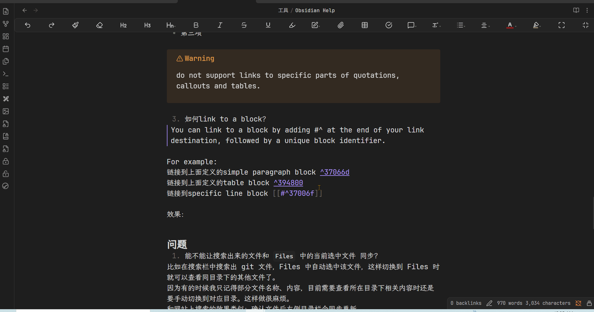

# Obsidian Help
ob 软件本身的使用，不包含插件

参考：
[Home - Obsidian Help](https://help.obsidian.md/)
[咖啡豆版](https://obsidian.vip/)
<!--more-->

## Math
在obsidian 中插入公式，使用LaTeX 标记语法
1. 行间
实现：
```LaTex 
$$
\begin{vmatrix}a & b\\
c & d
\end{vmatrix}=ad-bc
$$
```
效果：
$$
\begin{vmatrix}a & b\\
c & d
\end{vmatrix}=ad-bc
$$
$$
e^{2i\pi} = 1
$$

2. inline
实现：
```LaTex
这是文本行内的公式$e^{2i\pi} = 1$
```
效果：
这是文本行内的公式$e^{2i\pi} = 1$

行内 和 行间 显示的效果不一致，行间的公式显示中央，inline 公式显示在文本行内


## Linking notes and files
### Supported formats for internal links
1. `[[Enlgish/ResouRelative Pronouns]]`
2. `[[Relative Pronouns.md]]`
3. `[Relative Pronouns](Relative%20Pronouns)`
4. `[Relative Pronouns](Relative%20Pronouns.md)`

以上4中链接都会链接到Relative Pronouns.md 

1、2 是 Wikilink 格式，3、4是 Markdown 格式
可以看到wiki 格式只需要文件名称就能链接到对应的md文件，而Markdown 格式链接名 和 链接文件分开指定，同时链接文档路径需要 URL encode（用`%20` 替换文件名中的空格）

### Link to a file
在编辑模式下输入`[[` 就会弹出链接文件菜单，输入链接文件名称，根据提示进行选择

- 即使使用Markdown 格式的链接也能通过`[[` 输入链接，ob会自动转换链接的格式


### Link to a heading in a note
>[!info]
>To link to a heading in another note, add a hash (`#`) at the end of the link destination, followed by the heading text.

如果是要链接到当前文档的内的heading，直接使用\#

### Link to a block in a note
1. 什么是block？
>A block is a unit of text in your note, such as a paragraph, block quote, or list item.

2. 如何确定一个block？
- simple paragraphs: place a blank space followed by a caret \^ and the block identifier at the end of the line

示例：
这是一个simple paragraph 在段落的末尾，空一格，使用caret+block identifier 设置block ^37066d

>[!note]
>这里paragraph的范围，最好是前后都有空行

- structured blocks(lists, quotations, callouts, tables): the block identifier should be on a separate line, with a blank line before and after
示例：
下面是一个table，将他定义为一个blcok

| 序号  | 名称  |
| --- | --- |
| 1   | M   |

^394800

- For specific lines within a list: can be placed directly on a bullet point
示例：
链接到一个列表中的某一项
下面是一个列表
- 第一项
- 第二项
	^37006f
- 第三项

>[!warning]
>do not support links to specific parts of quotations, callouts and tables.

block identifier 可以包含Latinletters, numbers, and dashes

这是一个使用 human-readable block identifier 的paragraph ^human-readable-block-identifier

<span style="background:#fff88f">问：</span> block identifier 除了 unique 以及组成的字符 还有其他要求吗？比如位数，首位字符等
对于unique，是不能定义两个同名identifier，还是定义后会出错？

3. 如何link to a block？
>You can link to a block by adding \#\^ at the end of your link destination, followed by a unique block identifier.

For example:
链接到上面定义的simple paragraph block [[#^37066d]]
链接到上面定义的table block [[#^394800]]
链接到specific line block [[#^37006f]]
链接到human-readable identifier block [[#^human-readable-block-identifier]]

效果：


<span style="background:#fff88f">问：</span>这里都是链接到当前文档内定义的blcok，如果要链接到其他文档中定义的block，需要通过 目标文档+\#\^ 来链接到block吗？
链接到test中的block
[[obsidian test.md#^test-block]]

>[!warning]
>Block references are specific to Obsidian and not part of the standard Markdown format.

只能在Obsidian 中使用blcok link，可惜
### Change the link display text
1. [[Obsidian Help]]
2. [[Obsidian Help.md#Change the link dispaly text]]

**Wikilink format**

**Markdown format**
格式：\[Display text](Link URL)
本身显示的文本和链接的目标就是分离的

## 问题
1. 能不能让搜索出来的文件和 `Files` 中的当前选中文件 同步？
比如在搜索栏中搜索出 git 文件，Files 中自动选中该文件，这样切换到 Files 时就可以查看同目录下的其他文件了。
因为有的时候我只记得部分文件名称、内容，目前需要查看所在目录下相关内容时还是要手动切换到对应目录。这样做很麻烦。
和网站上搜索的效果类似：确认文件后左侧目录栏会同步更新

或者提供上一页/下一页功能，能够在同一目录下按文件排列顺序跳转。


## Options
### Appearance
#### Font
中文字体
- [LXGW WenKai / 霞鹜文楷](https://github.com/lxgw/LxgwWenKai)
英文字体
- [JetBrains Mono](https://github.com/JetBrains/JetBrainsMono)

安装字体:
1. 下载字体文件（ttf后缀）
2. 选中文件后鼠标右键，选择install


可以在系统 font 设置中查看当前已安装的字体：


3. 设置

| 选项             | 含义  | 说明  |
| -------------- | --- | --- |
| Interface font |     |     |
| Text font      |     |     |
| Monospace font |     |     |

输入字体名称，选择对应的字体。如果可选列表中没有新安装的字体，重新打开obsidian。

对比：
