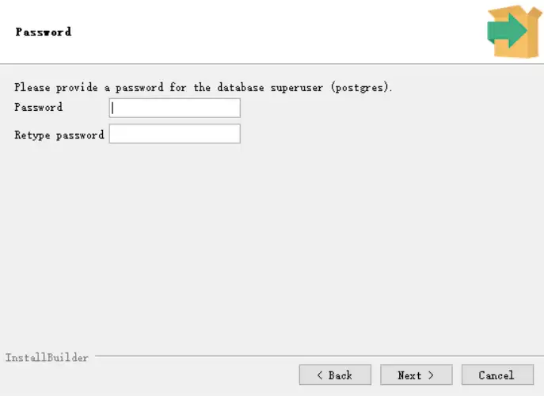
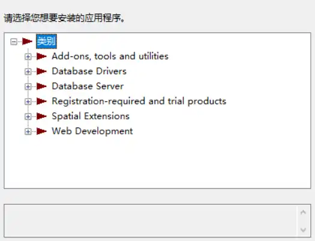

# Postgres

## 安装
[下载](https://www.enterprisedb.com/downloads/postgres-postgresql-downloads)
运行exe
按提示设置密码

选择local-位置
Stack Builder：
>[!quote]
>标准的PostgreSQL 安装包只包含核心的 数据库服务器 和 命令行工具。其他工具（图形化管理工具、驱动等）需要另外下载、安装。Stack Builder 用来下载安装另外的组件。

安装工具：

| 类别                           | 工具        | 功能                                                    |
| ---------------------------- | --------- | ----------------------------------------------------- |
| Add-ons, tools and utilities | pgAgent   | GUI工具                                                 |
|                              | pgBouncer | 连接池                                                   |
| Database Drivers             | psqlODBC  | 驱动 ODBC 是操作数据库的通用API接口 psqlODBC 通用接口的postgres实现 |

