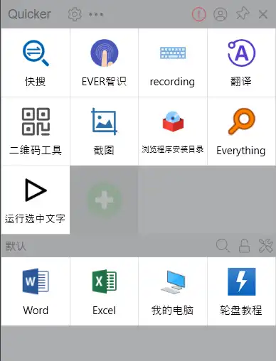
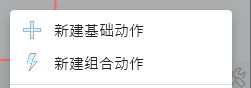
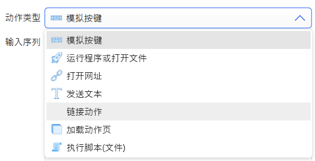
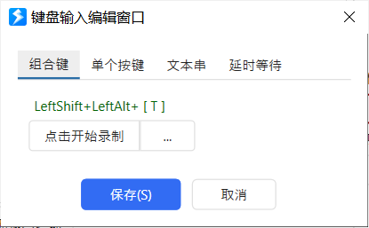
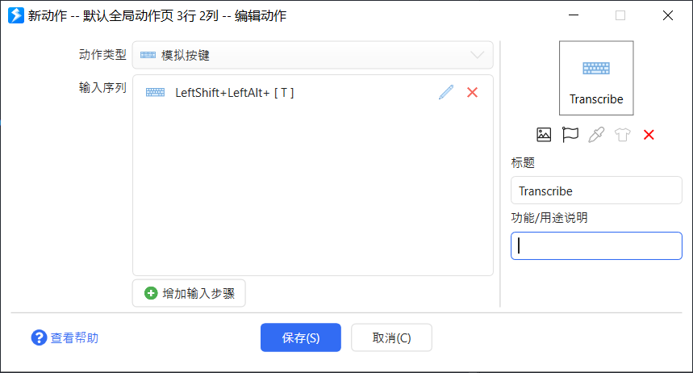
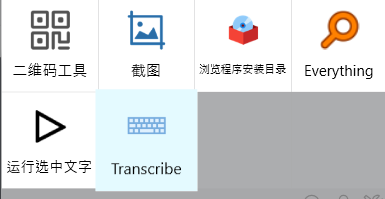
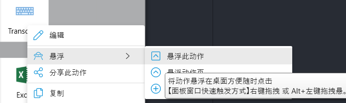
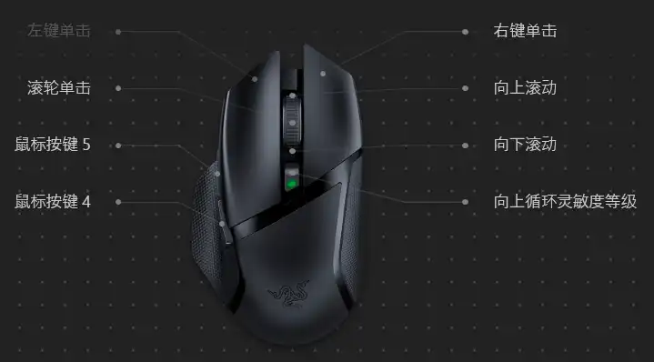

# Quicker

## 创建和编辑动作

鼠标点击弹出面板空白区域

	在弹出菜单中选择 新建基础动作

### 动作类型

#### 模拟按键
点击动作按钮相当于 执行动作绑定的按键
示例：
添加 对应 Handy 的 Transcribe Shortcut 模拟按键

录入按键

动作名称 + 说明

新增了动作

**悬浮**
右键点击动作

效果：

现在就可以愉快的进行音频输入转文本了：）

## 轮盘菜单
### 触发按键
**什么是x1、x2键？**
部分鼠标侧面的两个按键

上图中鼠标按键4、5 对应x1、x2

