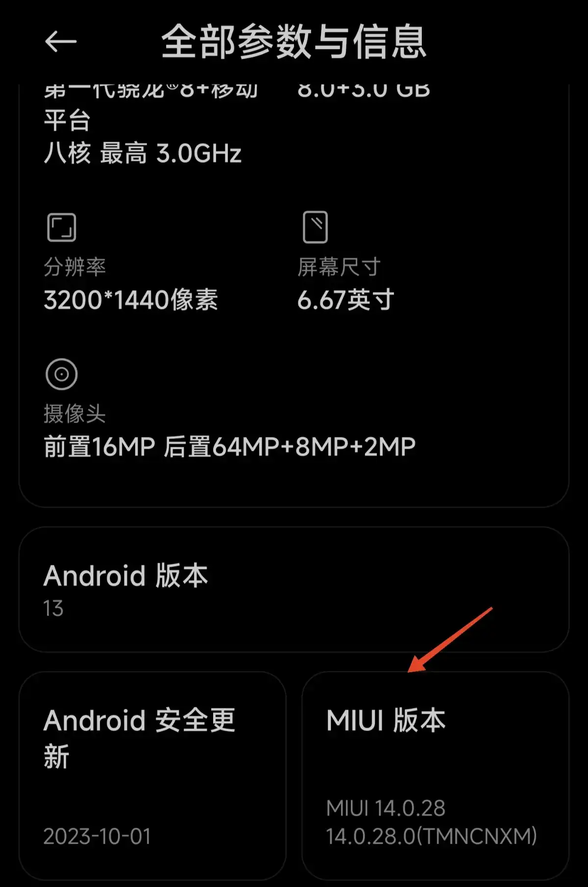
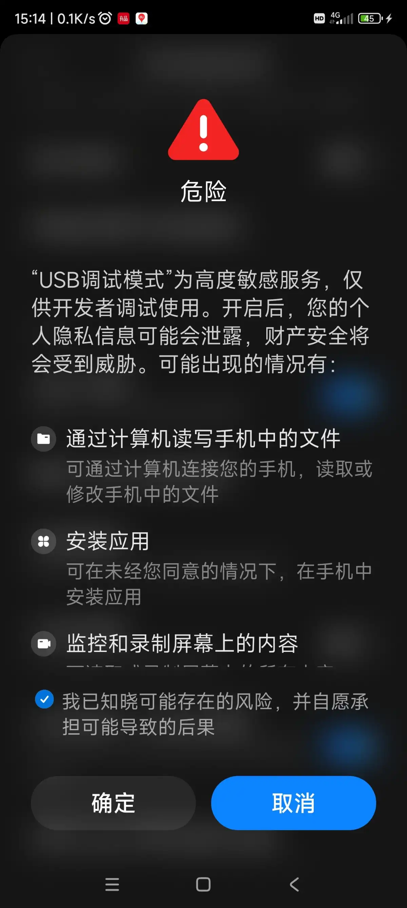
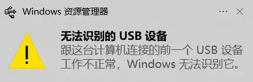
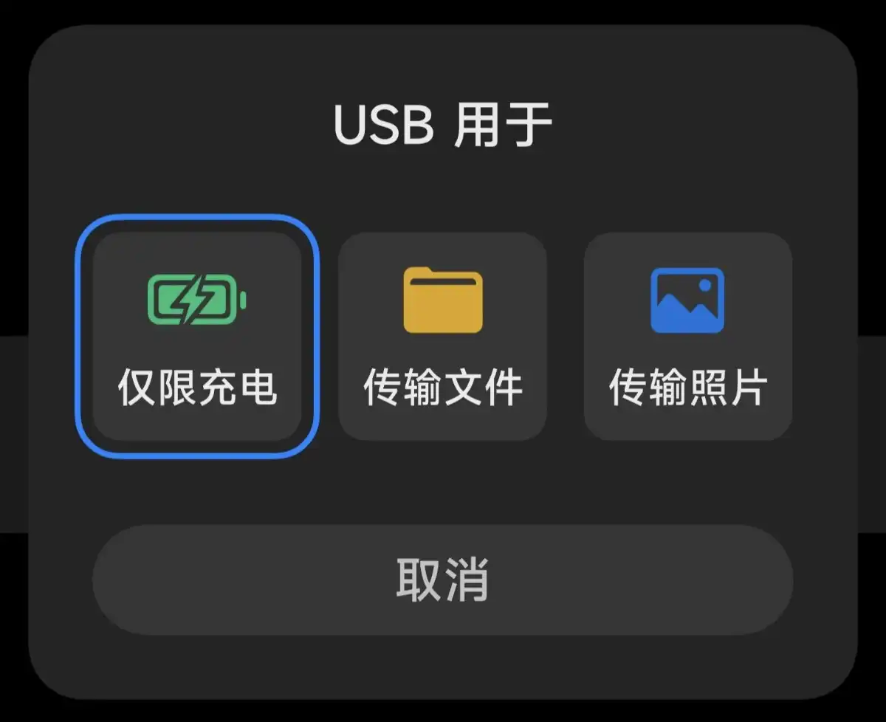

# Scrcpy
>[!info]
>This application mirrors Android devices (video and audio) connected via USB or TCP/IP and allows control using the computer's keyboard and mouse. It does not require root access or an app installed on the device. It works on Linux, Windows, and macOS

通过usb连接的方式，将小米手机 镜像到 windows 上
## 手机配置
设置-》我的设备-》全部参数与信息-》连续点击 “MIUI 版本” 直到提示 “已进入开发者模式”


然后返回到 设置 ，搜索并进入开发者选项 
开启 "USB 调试" 以及 "USB调试（安全设置）"


开启前会提示确认，勾选免责声明，等待计时结束后点击确定



## 通过USB连接
1. 使用USB线连接手机 与 电脑
可能需要等待连接成功后会提示

如出现以下提示，重新拔插接口

或更新驱动
[Xiaomi USB Driver Download](https://mifirmware.com/xiaomi-usb-drivers/)

连接成功后手机端提示：


下载并解压缩Scrcpy，运行`open_a_terminal_here.bat` 启动一个命令窗口，执行scrcpy
``` bash
D:\software\scrcpy-win64-v3.3.3\scrcpy-win64-v3.3.3>scrcpy
scrcpy 3.3.3 <https://github.com/Genymobile/scrcpy>
INFO: ADB device found:
INFO:     -->   (usb)  b7bec5a3                        device  23013RK75C
```

效果：


连接经常没有反应，注意以下事项，可能会有所帮助：
- 最好使用手机原配（原厂）充电线连接；（<span style="background:#ff4d4f">每次都能立即连接成功</span>）
- 直接连接到电脑接口，而不是通过拓展坞连接；
- 断开后等待一会儿再尝试连接；
- 解锁手机


## 通过 wifi 连接
1. 打开 开发者选项-》调试-》无线调试，启用无线调试
2. 电脑 和 手机连接到同一个局域网
3. 启动scrcpy
``` bash
D:\software\scrcpy-win64-v3.3.3\scrcpy-win64-v3.3.3>scrcpy --tcpip
scrcpy 3.3.3 <https://github.com/Genymobile/scrcpy>
INFO: ADB device found:
INFO:     -->   (usb)  b7bec5a3                        device  23013RK75C
INFO: Switching device b7bec5a3 to TCP/IP...
INFO: TCP/IP mode already enabled on port 5555
INFO: Connecting to 192.168.1.6:5555...
INFO: Connected to 192.168.1.6:5555
```

`device 23013RK75C`：和手机参数中的认证型号一致
## 选择连接设备
scrcpy一次只能连接一台设备，如果同时存在多台设备 或 一台设备有多种连接方式，需要进行选择。
1. 序列号-adb 识别设备的编号
``` bash
scrcpy -s 192.168.1.6:5555
scrcpy -s b7bec5a3
```

| 行号  | 功能  | 说明                       |
| --- | --- | ------------------------ |
| 1   |     | TCP/IP连接的设备 由ip地址+端口充当编号 |
| 2   |     | usb 连接的设备分配一个编号          |

2. 只有一个通过usb连接的设备
``` bash
scrcpy --select-usb
scrcpy -d   # short version
```
3. 只有一个通过TCP/IP （wifi）连接的设备
``` bash
scrcpy --select-tcpip
scrcpy -e   # short version
```

## 其他
1. 查看设备
``` bash
D:\software\scrcpy-win64-v3.3.3\scrcpy-win64-v3.3.3>adb devices
List of devices attached
b7bec5a3        device
192.168.1.6:5555        device
```

2. 断开指定wifi设备
``` bash
D:\software\scrcpy-win64-v3.3.3\scrcpy-win64-v3.3.3>adb disconnect 192.168.1.6:5555
disconnected 192.168.1.6:5555

D:\software\scrcpy-win64-v3.3.3\scrcpy-win64-v3.3.3>adb devices
List of devices attached
b7bec5a3        device
```

3. 断开所有wifi设备
``` bash
adb disconnect
```