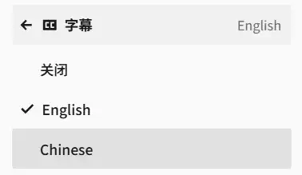
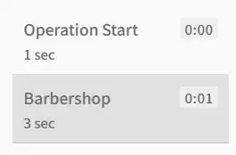

# WebVTT
>[!info]
>Web Video Text Tracks Format (WebVTT) . Its main use is for marking up external text track resources in connection with the HTML \<track> element. WebVTT files provide captions or subtitles for video content, and also text video descriptions, chapters for content navigation, and more generally any form of metadata that is time-aligned with audio or video content.

<!--more-->


参考：
1. [HTML5WebVTT字幕格式与添加教程-Golang学习网](https://m.17golang.com/article/295601.html)
2. [Web Video Text Tracks Format (WebVTT) - Web APIs | MDN](https://developer.mozilla.org/en-US/docs/Web/API/WebVTT_API/Web_Video_Text_Tracks_Format)
3. [WebVTT: The Web Video Text Tracks Format](https://w3c.github.io/webvtt/#introduction)
4. [<track>: The Embed Text Track element - HTML | MDN](https://developer.mozilla.org/en-US/docs/Web/HTML/Reference/Elements/track)

## Overview
一个简单的WebVTT file的示例：
``` txt title="simple.vtt"
WEBVTT

NOTE This is a multi-line note block.
These are used for comments by the author
Two cue blocks are defined below.

00:01.000 --> 00:04.000
Never drink liquid nitrogen.

00:05.000 --> 00:09.000
Because:
- It will perforate your stomach.
- You could die.
```

| 行号    | 功能    | 说明                                                                            |
| ----- | ----- | ----------------------------------------------------------------------------- |
| 1     | 起始标识  | 必须以WEBVTT开头                                                                   |
| 3-5   | 注释    | 通过NOTE标识注释                                                                    |
| 7、8   | 第一条字幕 | 00:01:000 ：字幕出现的起始时刻，格式为HH:MM:SS.mmm<br>00:04:000 ：字幕消失的时刻<br>Never ... ：字幕内容 |
| 10-13 | 第二条字幕 |                                                                               |

将`.vtt` 文件 和 同名的视频文件放在同一路径下，通过PotPlayer播放视频。
字幕效果：


## `<track>`: The Embed Text Track element
在html中 `<audio>` 和 `<video>` 用于表示音频、视频，`<track>` 作为它们的 child，将`vtt`格式的字幕文件加载到音视频中。
示例：
``` js 
<video controls src="/videos/friday.mp4">
	<track
		default
		kind="captions"
		srclang="en"
		label="English"
		src="/videos/friday.vtt"
	/>
</video>
```

| 行号  | 属性      | 功能                                                                                                                                       | 说明                                                                                               |
| --- | ------- | ---------------------------------------------------------------------------------------------------------------------------------------- | ------------------------------------------------------------------------------------------------ |
| 3   | default | This attribute indicates that the track should be enabled unless the user's preferences indicate that another track is more appropriate. | 一个video（audio）可以添加多个track，default 设置当前track为默认显示的字幕                                              |
| 4   | kind    | How the text track is meant to be used.<br>可能的值<br>subtitles:默认值，字幕，可以包含额外信息<br>captions:<br>descriptions:<br>chapters:章节标题<br>metadata: |                                                                                                  |
| 5   | srclang | Language of the track text data.<br>zh: Chinese<br>en: English<br>cmn: Mandarin Chinese<br>en-US: 美式英语。US的类型为region，表示地区                 | 必须符合`BCP 47`语言标签定义。查看完整的语言标签列表：[Language subtag lookup app](https://r12a.github.io/app-subtags/) |
| 6   | label   | A user-readable title of the text track                                                                                                  | 字幕类型（语言）选择                                                       |
| 7   | src     | Address of the track(`.vtt` file).                                                                                                       |                                                                                                  |


## chapters
示例：
``` txt
WEBVTT

00:00 --> 00:01
Operation Start

00:01 --> 00:04
Barbershop
```
问：<mark style="background: #FFF3A3A6;">时间值的格式为MM:SS，没有包含毫秒部分是因为功能限制只能定位到秒，还是特意省略到秒就够了？</mark>
效果：


