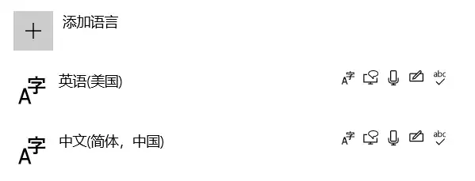
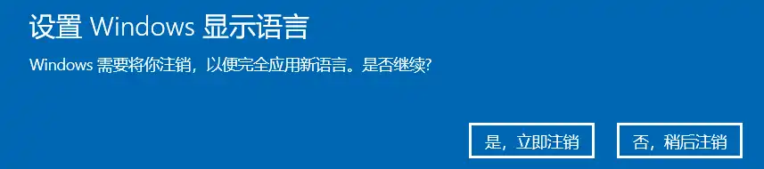
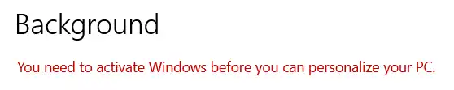
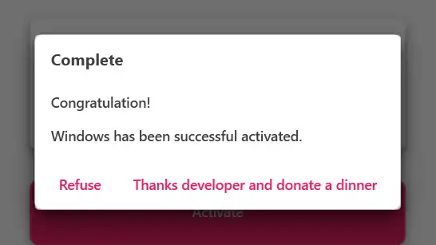
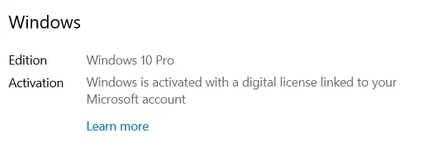

# Windows
系统相关配置

## 传递优化
>[!info]
>传递优化能够快速、可靠地提供 Windows 和 Microsoft store 应用更新以及其他Microsoft 产品。
>

将本地下载的windows 更新 以及 应用 程序 上传给 已连接Internet 的其他电脑，也可以从其他电脑上下载windows 更新 以及应用。

没有使用需求，还占用网络带宽，关闭。
路径：设置-》更新和安全-》传递优化-》允许从其他电脑下载

## 以管理员身份运行程序
**单次运行**
鼠标右键选中程序-》选择 “以管理远身份运行”

打开程序后会弹出对话框：是否允许应用对设备进行更改，点击是

**每次都以管理员身份运行**
鼠标右键选中程序-》属性-》兼容性-》更改所有用户的设置-》设置-》以管理员身份运行此程序

## Windows Defender 导致的CPU、内存占用异常
之前电脑用着用着就会卡顿个几秒（主要是用Qtcreator 敲代码时），刚开始以为是Qtcreator的问题。后面发现不是。查看任务管理器，Defender 占用内存持续增长，没有停止的趋势。
尝试了网上的各种办法，都没有效果。包括将文件夹添加到 “排除项”，修改一些设置。
只能每次开机启动后手动关闭实时保护。
最近倒是没发现Defender 引起的异常了。
关闭设置路径：设置-》Windows 安全中心 -》 病毒和威胁防护 -》 管理设置 -》 实时保护

## 修改系统显示语言
通常个人购买的PC安装的是家庭版，无法修改系统语言，需要升级到专业版

1. 查看系统版本信息
- 设置-》系统-》关于-》Windows 规格
- cmd（win + R 快捷键）：winver
2. 升级到专用版本
设置-》更新和安全-》激活-》更改产品密钥-》输入密钥，确认升级

3. 添加带有语言包的语言
设置-》时间和语言-》语言-》添加语言

>[!note]
>如果通过软件（如WUB）禁用了系统更新，需要先启用更新，然后进行下载，否则可能下载失败，错误码：# 0x80073d01

4. 选择 `Windows 显示语言`
重启系统后生效

5. 激活 Activation
>
>We can't activate Windows on this device because you don't have a
valid digital license or product key. If you think you do have a valid
license or key, select Troubleshoot below. Error code: OxC004C060

使用网上的密钥升级系统后无法激活系统，无法使用一些系统功能
如：

	无法设置桌面
通过 [CMWTAT_Digital_Release_2_7_2_0](https://github.com/TGSAN/CMWTAT_Digital_Edition)激活系统
- 下载程序
- 管理员身份运行
- 点击Active，等待激活完成

	提示激活成功
- 重启
结果：

