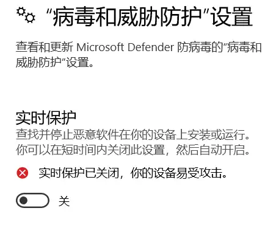

# Windows
系统相关配置

## 以管理员身份运行程序
**单次运行**
鼠标右键选中程序-》选择 “以管理远身份运行”

打开程序后会弹出对话框：是否允许应用对设备进行更改，点击是

**每次都以管理员身份运行**
鼠标右键选中程序-》属性-》兼容性-》更改所有用户的设置-》设置-》以管理员身份运行此程序

## Windows Defender 导致的CPU、内存占用异常
之前电脑用着用着就会卡顿个几秒（主要是用Qtcreator 敲代码时），刚开始以为是Qtcreator的问题。后面发现不是。查看任务管理器，Defender 占用内存持续增长，没有停止的趋势。
尝试了网上的各种办法，都没有效果。包括将文件夹添加到 “排除项”，修改一些设置。
只能每次开机启动后手动关闭实时保护。
最近倒是没发现Defender 引起的异常了。
关闭设置路径：设置-》Windows 安全中心 -》 病毒和威胁防护 -》 管理设置 -》 实时保护

