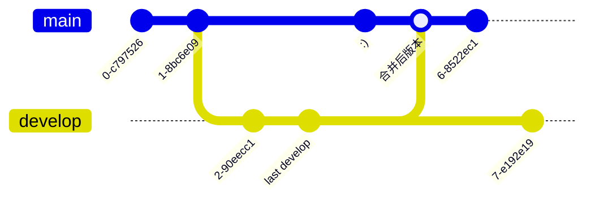

# git
版本控制工具
[Git - Downloads](https://git-scm.com/downloads)


## 目录

[git Rewriting History](git%20Rewriting%20History.md)


## What is Git？

| 特性                              | 内容                                                                                                                                                                             |
| ------------------------------- | ------------------------------------------------------------------------------------------------------------------------------------------------------------------------------ |
| Snapshots, Not Differences      | git 存储（看待）文件的方式                                                                                                                                                                |
| Nearly Every Operation Is Local | 本地保存所有历史记录，可以直接查看，不用向服务器请求；可以本地创建新的版本；。。。除了同步之外的所有操作                                                                                                                           |
| Git Has Integrity               | "Everything in Git is checksummed before it is stored and is then referred to by that checksum"<br>"calculated based on the contents of a file or directory  structure in Git" |
| Git Generally Only Adds Data    | 所有的操作都会进行记录，可以尽情操作，不用担心数据丢失的问题                                                                                                                                                 |
| The Three States                | git 管理的文件状态可以分为三种：modified, staged and committed                                                                                                                               |

### Snapshots, Not Differences
CVS，Subversion 子类的管理工具："Storing data as changes to a base version of each file"
问：<mark style="background: #FFF3A3A6;">为什么是 changes to a base version， 而不是存储和上一个版本的差异？</mark>

git："basically takes a picture of what all your files look like at that moment and stores a reference to that snapshot."
snapshot: 文件内容
reference：对snapshot的引用，相当于文件id。


每个版本管理一组文件。两个版本之间没有变化的文件（version 3 相对 version 2 文件B没有变换），使用同一个reference。

关于snapshot：相当于是文件副本，完整记录文件内容，而不是文件之间的差异
问：<mark style="background: #FFF3A3A6;">为什么使用git 进行版本管理，仓库大小不会快速增长。假设文件大小1G，那么10个版本后仓库大小是？</mark>

>[!quote]
>Git more like a mini filesystem with some incredibly powerful tools built on top of it.

## Branching
### how Git stores its data
提交对象（commit object）：每次进行提交操作都会保存一个提交对象，该对象包含指向snapshot的指针，用于恢复文件内容。提交对象还包含了其他信息，如：作者、邮箱、commit subject、Description 。。。以及父对象指针，用来确定版本之间的关系
树对象（tree）：存储目录下snapshot，目录本身也有id（也会计算校验和）
blob对象：保存snapshot

假设仓库管理的文件结构如下：
``` 
README.md
CMakeLists.txt
main.cpp
include/
	json.h
```
那么初始提交对象的结构应该是：


用tree表示目录，在tree中可以保存tree 和 blob，对应于嵌套的目录以及当前目录下的文件。

有两个版本时仓库存储的内容：


### 暂存和提交操作的效果
暂存：对进行了修改的文件进行暂存时会创建文件的snapshot（通过blob保存）并存入.git（仓库）内。
提交：先创建tree对象，最后创建一个commit object

### branch
>[!quote]
>A branch in Git is simply a lightweight movable pointer to one of these commits.

- pointer：指向commit
- movable：创建新的提交后分支自动指向最新的提交（向前移动）
有3个提交 和 两个分支的仓库一种结构：


master 是第一次提交时默认设置的分支名称（也可能叫main）
查看分支信息：
``` git
$ git branch -v
  Basic                                   4831457 更新ignore
* ComboBox                                f5d5b9e ComboBox Model Roles
```
分支信息包含了分支的版本号（指向的commit object id） 和 提交信息

### Creating a New Branch 
既然已经知道了 branch 就是一个指向分支的指针，那么创建分支就是创建一个指向指定提交的指针。


当前有一个main 分支，两个版本，head 指向main最后提交的版本（节点），需要在第一个节点上创建分支。

实现：
:::tabs
@tab Sourcetree
选中节点-》分支

	选择创建新分支的提交
:::

#### HEAD
>[!quote]
>this is a pointer to the local branch you're currently on.

HEAD 指向本地所在分支

HEAD 和 branch 指向的commit object 是同一个，HEAD 可以看作是所指向分支的别名

查看本地分支
:::tabs
@tab command
```
$ git branch
  feature1
* main
```

@tab sourcetree

分支图标前的原点

@tab Fork

名称前√
:::
### Switching Branches
创建分支实际上仅仅是创建了分支，如果要在新建的分支上进行提交，需要切换到新分支上。
切换分支的工作包含：
- HEAD指向目标分支
- 将工作区恢复为目标分支的内容

问：<mark style="background: #FFF3A3A6;">恢复内容是如何实现的？对于相同名称的文件先删除，然后从仓库拷贝文件？还是从blob中拷贝内容覆盖工作区的同名文件？</mark>


问：<mark style="background: #FFF3A3A6;">在git 的gui应用中可以查看分支包含了哪些版本（提交），那么commit object中是否包含有它是由哪个分支创建的属性？</mark>

chatgpt：<mark style="background: #BBFABBA6;">commit object 中不包含分支相关信息。通过分支指向的版本向上查找（parent指向）该分支包含的所有版本</mark>

当前在main分支，切换到feature1分支
实现：
:::tabs
@tab command
```
$ git checkout feature1
Switched to branch 'feature1'
```
@tab sourcetree

:::

#### Detached HEAD state
如果对分支上的非最新版本进行checkout，就会进行Detached HEAD state，此时HEAD 指向的commit 没有 分支。仍然可以进行提交，但是在Detached HEAD 上进行的提交可能被清理掉，导致修改的内容丢失。
可以在Detached HEAD 上进行测试，如果要保留修改需要将其转变为分支

Detached HEAD state 状态提示：
:::tabs
@tab Fork

@tab sourcetree

:::

## Basic Merging

develop 合并到 main后 develop指向的是合并前 最后提交的版本。合并后的版本包含有两个parent，一个指向 last develop，一个指向:), main 指向合并后版本

如果切换回develop，然后再进行一次提交，那么新的提交是在develop 上进行的，而不是main上。
效果：



实现：
:::tabs
@tab command
``` 
git merge branchName
```
将branchName 合并到本地分支

@tab Fork


	Merge：tbranch2 被合并的分支
	into：main 合并到的分支（本地分支）
	Merge Option：
:::

### 合并冲突
如果合并的两个分支相同文件的内容不同（存在冲突）需要先解决冲突（确定合并后的内容）

:::tabs
@tab Fork
冲突提示：

	1.txt：冲突文件
选择工具

:::

解决冲突工具
:::tabs

@tab 文件内容
``` 
1
<<<<<<< HEAD
2
3
=======
dfjslf 
>>>>>>> feature1
```

| 行号  | 含义                                        |
| --- | ----------------------------------------- |
| 2   | 冲突起始行：从这里开始文件内容存在冲突，下面的内容为HEAD 分支（本地分支）内容 |
| 3-4 | HEAD 分支内容                                 |
| 5   | 分支内容分隔符，后面的内容为另一分支                        |
| 6   | feature1 分支内容（从第2行开始）                     |
| 7   | 冲突内容结束提示                                  |

如果要完全保留HEAD就将\= 到 》之间的内容删除。

@tab Beyond Compare
最终合并后的内容：

	绿色：被合并分支的内容
	红色：main分支的内容
	点击箭头采用对应分支的内容
@ tab fork 内置合并工具
点击Merge

选择采用的分支内容 或 手动修改
:::

确认合并后内容点击Resolve

	提交新的版本

最终效果：


## 其他分支操作
**删除已合并的分支**
``` 
git branch -d branchName
```


## Rebasing
>[!quote]
>Rebasing replays changes from one line of work onto another in the order they were introduced, whereas merging takes the endpoints and merges them together.

:::tabs
@tab graph


@tab sourcetree

:::

experiment是在main上2发展的分支，将experiment rebase 到 main 上的5。
在sourcetree上的graph：

实现：
``` 
git rebase main
```

效果：
:::tabs
@tab graph


@tab sourcetree

:::

使用merge 合并分支：


差异对比

| 内容   | 类型     | 效果                                   | 差异                                                                                      |
| ---- | ------ | ------------------------------------ | --------------------------------------------------------------------------------------- |
| 命令调用 | merge  | git merge branchName                 | 合并到本地分支                                                                                 |
|      | rebase | git rebase main                      | 从本地分支rebase到指定分支                                                                        |
| 合并后  | merge  | experiment 指向分支最后创建版本                | 和main 是并行的，可以看到并行的过程                                                                    |
|      | rebase | experiment 指向rebase后创建的版本            | rebase 后 experiment 可以直接追溯到main（串行、一条线）。最终效果看上去experiment 是在main上进行的commit，而不是通过branch。 |
| 实现过程 | merge  | 整个两个分支的内容                            | main 中只包含合并后的最终结果版本                                                                     |
|      | rebase | 将experiment上的修改（版本变换）按照顺序依次应用到main 上 | main 中包含了分支中的所有版本。rebase 后的3、4 和 rebase 前的3、4相同（修改内容、提交信息等）                             |

>[!quote]
>whether it's the last of the rebased commits for a rebase or the final merge commit after a merge, is the same snapshot

操作的结果-文件内容是一致的，但是历史记录不同。rebasing makes for a cleaner history.

### 更高级的Rebasing
仓库版本结构如下：

server基于main，client又基于server
如果直接使用rebase 将 client 的修改应用到main上
效果：

client 和 main 的most recent common ancestor 是 C2
main的 C6 后包含了 client 基于C2 的修改：C3、C8和 C9。其中C3实际是server 的修改，而不是client的修改。

如果要对rebase 的版本进行控制，那么就要使用更高级的rabase

:::tabs
@tab command
实现：
``` bash 
$ git rebase --onto main sERVER client
Successfully rebased and updated refs/heads/client.
```

| 参数      | 含义                                               |
| ------- | ------------------------------------------------ |
| --onto  | rebase onto given branch instead of upstream<br> |
| main    | newbranch 新基底                                    |
| sEERVER | upstream                                         |
| client  | branch                                           |

找到从upstream 开始的 branch 包含的修改，然后rebasing到newbranch 上
效果：

C6后只有clent 修改的版本：C8、C9

@tab sourcetree
1. 右键main分支（newbranch），选择交互式变基

2. 对分支版本进行处理

Amend Commit：当前修改合并到上一个修改中，不保留当前版本的提交信息，而是使用上一个版本的提交信息。
底部功能按钮：
重置：重置所有设置
编辑信息：编辑提交信息
用此前的squash：用于合并多个提交
删除：删除该版本（不使用该版本进行修改）
调整顺序：按照表格中的顺序应用版本修改内容
删除C3，然后交换C8、C9的顺序
效果：

	C6后是C9，然后是C8
:::

**关于squash**

选中C8，点击squash。表格中的C8和C3 合并为一项
问题：<mark style="background: #FFF3A3A6;">使用该功能后sourcetree一直进行处理，无法结束</mark>

