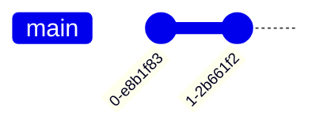

# git
版本控制工具
[Git - Downloads](https://git-scm.com/downloads)


## Merge into
合并两个分支
``` 
gitGraph
	commit
	commit
	branch develop
	checkout develop
	commit
	checkout main
	merge develop
	commit
```
	develop 合并到 main
效果：


fork中的操作：
将tbranch2 合并到 main
``` txt title="tbranch2"
tbranch2 分支
```

``` txt title="main"
main 分支
```

两个分支的第一行内容不同

切换到main


tbranch2 右键菜单，选择Merge into 'main'...


	Merge：tbranch2 被合并的分支
	into：main 合并到的分支
	Merge Option：

点击Merge
由于存在冲突，无法直接合并

	1.txt：冲突文件

解决冲突：


解决冲突
:::tabs
@tab Beyond Compare
添加Beyond Compare后，在下拉菜单中选择Beyond Compare
使用Beyond Compare解决冲突：
最终合并后的内容：

	绿色：tbranch 分支的内容
	红色：main分支的内容
	点击箭头采用对应分支的内容

@ tab fork 内置合并工具
点击Merge

选择采用的分支内容 或 手动修改
:::

确认合并后内容点击Resolve

	提交新的版本

最终效果：


## 在指定版本上创建分支

当前有一个main 分支，两个版本，head 指向main最后提交的版本（节点），需要在第一个节点上创建分支。

:::tabs
@tab Sourcetree
选中节点-》分支

	选择创建新分支的提交
:::

