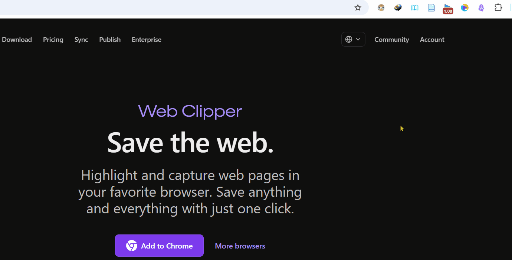

# obsidian 插件
记录使用过的、功能简单无需过多（单独）介绍的ob插件
<!--more-->

**总览**

| 序号  | 插件名称                                       | 功能描述                                                             | 使用情况                                                        |
| --- | ------------------------------------------ | ---------------------------------------------------------------- | ----------------------------------------------------------- |
| 1   | Editing Toolbar                            | 在文档界面上方，提供一个文本格式化（粗体、颜色）以及插入表格、Fullscreen Focus等功能的工具栏。          | 如果要在表格中进行格式化，可以先在表格外完成，然后剪切到表格内。否则可能会出现标签不匹配的情况导致解析失败，页面报错。 |
| 2   | Advanced Merger                            | "a folder of notes for easier export"：将一个文件夹内的所有文件合并输出到新生成的一个文件内 | 备份之前的文档                                                     |
| 3   | [Excalidraw](Excalidraw.md)                | 白板绘图                                                             |                                                             |
| 4   | [Web Clipper](https://obsidian.md/clipper) | "Highlight and capture web pages in your favorite browser"       |                                                             |

## 已废弃

| 序号  | 插件名称       | 废弃原因                  | 替换              |
| --- | ---------- | --------------------- | --------------- |
| 1   | Highlightr | 1. 使用起来不是很方便；2. 已停止更新 | Editing Toolbar |

## Web Clipper
初始体验
1. 安装浏览器插件
2. 点击插件功能按钮

Add to Obsidian

Open Obsidian

3. 效果

obsidian vault 中新增 Clippings 目录 以及 当前保存的网页文件

保存时的相关配置：
- Properties
- Content：转换后的markdown内容
- Clippings：存放的文件夹

因为最终保存的结果是markdown格式，所以不能保存一些网页的排版、布局

### Highlight

保存后的效果：

### Settings
#### General
**Vaults**
>By default, clipped notes are saved to the currently open vault. 

输入vault名称，回车确认。可以配置多个vault。按道理每次保存应该是保存到所有vault中，但是测试发现只保存到了obsidianTest vault中

**Behavior**
- Open behavior: Reader-进入阅读模式

:::tabs
@tab Popup

@tab Embedded

嵌入到网页中
:::

#### Reader
**Images**
- Blend images: 图片的背景颜色被替换为主题颜色

:::tabs 
@tab on

@tab off

:::

#### Highlighter
**Always show highlights**
on：在非highlighter mode 下显示高亮的内容
off：不显示

**Clip behavior**
- Highlight the page content
- Replace the page content: 将高亮内容摘录到content中，未高亮的内容不会出现在content中（content 默认为空白）
- Do nothing: 仅在阅读模式下高亮显示，保存到obsidian的内容不会进行高亮

