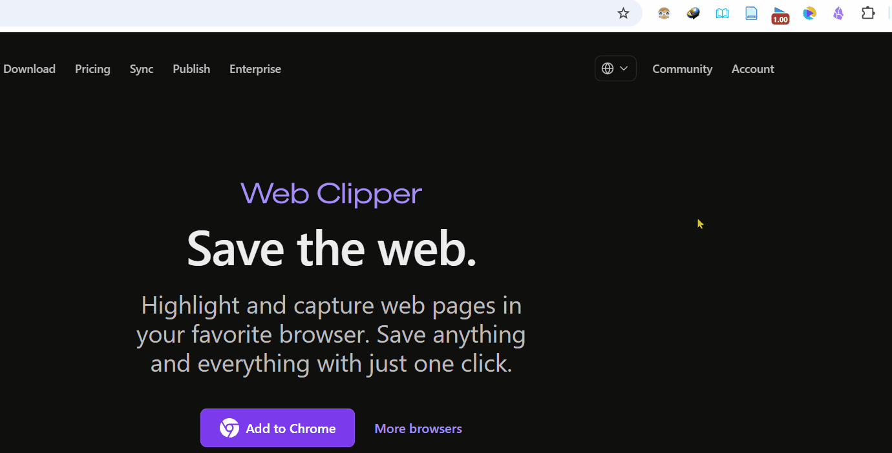
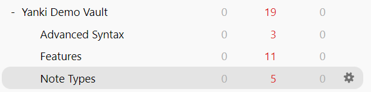

# obsidian 插件
记录使用过的ob插件
<!--more-->

**总览**

| 序号  | 插件名称                                                  | 功能描述                                                                                                      | 使用情况                                                        | 官网/文档链接                                                |
| --- | ----------------------------------------------------- | --------------------------------------------------------------------------------------------------------- | ----------------------------------------------------------- | ------------------------------------------------------ |
| 1   | Editing Toolbar                                       | 在文档界面上方，提供一个文本格式化（粗体、颜色）以及插入表格、Fullscreen Focus等功能的工具栏。                                                   | 如果要在表格中进行格式化，可以先在表格外完成，然后剪切到表格内。否则可能会出现标签不匹配的情况导致解析失败，页面报错。 |                                                        |
| 2   | Advanced Merger                                       | "a folder of notes for easier export"：将一个文件夹内的所有文件合并输出到新生成的一个文件内                                          | 备份之前的文档                                                     |                                                        |
| 3   | [Excalidraw](Excalidraw.md)                           | 白板绘图                                                                                                      |                                                             |                                                        |
| 4   | [Web Clipper](https://obsidian.md/clipper)            | "Highlight and capture web pages in your favorite browser"                                                |                                                             |                                                        |
| 5   | Notebook Navigator                                    |                                                                                                           |                                                             |                                                        |
| 6   | Better Export PDF                                     | Export your notes to PDF, support export preview, and bookmarks outline and header/footer.                |                                                             |                                                        |
| 7   | [Image Converter](#Image%20Converter)                 |                                                                                                           |                                                             |                                                        |
| 8   | [Spaced Repetition](#Spaced%20Repetition)             | Fight the forgetting curve by reviewing flashcards & entire notes.                                        |                                                             | https://github.com/st3v3nmw/obsidian-spaced-repetition |
| 9   | [Yanki](#Yanki)                                       | sync flashcards from a folder in your vault to Anki. Pure Markdown syntax.                                |                                                             | https://github.com/kitschpatrol/yanki-obsidian         |
| 10  | [Commander](#Commander)                               | Customize your workspace by adding commands everywhere, create macros and supercharge your mobile toolbar |                                                             |                                                        |
| 11  | [Better Command Palette](#Better%20Command%20Palette) | A command palette that does all of the things you want it to do                                           |                                                             |                                                        |
| 12  | [Custom Commands](#Custom%20Commands)                 | Create custom commands to be executed in the command palette, and by hotkey.                              |                                                             |                                                        |


## 已废弃

| 序号  | 插件名称       | 废弃原因                  | 替换              |
| --- | ---------- | --------------------- | --------------- |
| 1   | Highlightr | 1. 使用起来不是很方便；2. 已停止更新 | Editing Toolbar |


## Web Clipper
初始体验
1. 安装浏览器插件
2. 点击插件功能按钮

Add to Obsidian

Open Obsidian

3. 效果

obsidian vault 中新增 Clippings 目录 以及 当前保存的网页文件


保存时的相关配置：
- Properties
- Content：转换后的markdown内容
- Clippings：存放的文件夹

因为最终保存的结果是markdown格式，所以不能保存一些网页的排版、布局

### Highlight


保存后的效果：


### Settings
#### General
**Vaults**
>By default, clipped notes are saved to the currently open vault. 

输入vault名称，回车确认。可以配置多个vault。按道理每次保存应该是保存到所有vault中，但是测试发现只保存到了obsidianTest vault中


**Behavior**
- Open behavior: Reader-进入阅读模式

:::tabs
@tab Popup


@tab Embedded

嵌入到网页中
:::

#### Reader
**Images**
- Blend images: 图片的背景颜色被替换为主题颜色

:::tabs 
@tab on

@tab off

:::

#### Highlighter
**Always show highlights**
on：在非highlighter mode 下显示高亮的内容
off：不显示

**Clip behavior**
- Highlight the page content
- Replace the page content: 将高亮内容摘录到content中，未高亮的内容不会出现在content中（content 默认为空白）
- Do nothing: 仅在阅读模式下高亮显示，保存到obsidian的内容不会进行高亮


## Image Converter
### Drop/paste presets
#### Resize
>Configure non-destructive resizing options for images directly within the editor. This allows to adjust the display size without altering the original file.

配置的项目：
1. Resize dimension: Choose how to resize the image
- None
- Width
- WidthxHeight(Custom)
- Longest edge
- Shortest edge
- Apply original image width
- Apply original image height
- Fit editor max-width

2. Maintain aspect ration: Preserve the image's original proportions when resizing
3. Scale mode: Controls how images are adjusted relative to target size
	1. Auto: adjusts image to fit specified dimensions
	2. Reduce only: only shrinks images larger than target
	3. Enlarge only: only enlarges images smaller than target
4. Respect editor max width: when calculating dimensions, prevent the image from exceeding the editor's width

我的配置：其它的选项保持默认，仅设置width为 300px


## Spaced Repetition
### Quick Start
1. 编写flashcard
```txt title="Test.md"
Prompt::answer
```
上面是简单的卡片，正面是提示词，背面是答案
2. 添加tag
```
#flashcards/deckA
```
- Flashcards: 卡片标识
- deckA：卡片所属的牌组
\# 和 flashcards之间不空格
3. 效果
点击ribbon 中的 Review flashcards

- deckA| 0/1： 所属牌组 | 第几张？牌组卡片数量？
- Test：编写flashcard的文件名称
- Prompt：提示词
- Show answer：space 显示答案
4. 查看答案

根据记忆情况选择效果
5. 查看deck
如果显示：

- 所有flashcards都review了
- 没有添加flashcards
不要紧，退出，重新打开


下面都是灰色的，无法查看具体flashcards，是因为只新建了一张flashcard，且已经review。
切换为 Cram Mode


可以反复练习，练习结果不会影响 Review mode 中的学习进度

### Notes
可以将单个note作为review对象
1. 添加tag
```
#review
```
2. 设置练习进度

右上角的菜单栏中查看 Note Review Queue

文档右侧弹出菜单中设置进度
3. 进度更新

文档fontmatter更新几个属性：

- sr-due：计划的复习时间
- sr-interval：距今天的间隔时长
- sr-ease：额，难易因子吧
对比 Hard 
- sr-interval：1
- sr-ease：230

## Yanki
下载源码中 examples/Yanki Demo Vault 查看示例
- <span style="background:#fff88f">问：</span>sync 能不能弄一个ribbon 按钮？
- <span style="background:#fff88f">问：</span>sync 后md 分配了id，如果copy vault 到另一台电脑上再 sync会不会有问题？分配id的逻辑中是否有检查id冲突？
示例文档中不带id
- <span style="background:#fff88f">问：</span>怎么排除指定的文件/文档啊
### Quick start
1. 前置：
- The AnkiConnect add-on
Tools(工具) -> Add-ons(插件)->Get Add-ons...(获取插件)->输入代号 `2055492159`


重启anki

2. 设置Yanki 卡片文件夹
3. 在设置的卡片文件夹下新建文档
```
This is the front of the card

---

This is the back of the card
```
4. sync
- 插件-》设置：点击同步按钮

- 命令：Yanki: Sync ...

右上角会显示同步结果
4. 查看anki中的卡片

ob的文档会增加 noteId 属性


### Markdown note types
:::tabs
@tab Basic
```
**Basic**

...is created from any file with a `---`

This is the front of the card

---

This is the back of the card

```
使用 --- 分隔 card 的front 和 back
效果：


@tab Basic (type in the answer)
```
**Basic (type in the answer)**

If the last statement in the Markdown file is `_emphasized like this_`, it becomes the type-in-the-answer text in Anki.

Jazz isn't dead

_It just smells funny_
```
在文档的结尾处使用 \_ 包围答案
效果：

有一个输入框用来输入答案

显示答案后会自动比较输入内容和答案并显示差异

@tab Basic(and reversed card)
```
**Basic (and reversed card)**

Doubling up the `---` identifies the note as being **reversible** (and will result in the generation of two cards in Anki).

---

---

_Mnemonic: Twice the `---` for twice the cards._
```
- 符号 --- 之间不要包含内容，否则会当作是 Basic ，不会生成两张flashcards。中间的内容会放置在back
eg.
```
Doubling up the ...
---
aaa
---
_Mnemonic: Twice the ..._
```


效果：

可以看到Note Types deck 中生成了两张 Basic(and reversed card).
这两张flashcards，一张是以 --- 前为prompt，另一张以 --- 后为prompt


<span style="background:#fff88f">问：</span>最后使用了 \_ 第一张card 的类型为什么不是 type in the answer？有关联的card只能有一种类型？

@tab Cloze
```
**Cloze**

~~All~~ will be ~~revealed but here's a hint~~.

---

Additional revelations on the back of the card:

_Mnemonic: The `~~strike through~~` implies redaction._

```
- 使用 两个 \~\~ 包围要隐藏的文本
- front中有两个部分使用 \~\~ 

效果：

隐藏的文本会以 \[...] 代替 

有多少个隐藏的部分就会生成多少张card，每张card只会隐藏其中一个

两张cards 的back 相同

所有隐藏的部分在显示答案时都会显示出来
<span style="background:#fff88f">问：</span>如果有多个隐藏片段，但是只想生成一张care，如何做？
:::


### Features
#### Vault folder hierarchy = Anki deck hierarchy
ob中的结构
```
Advanced Syntax
	Basic(and reversed card) with extra
	Cloze(...)
Assets
	banner.gif
Features
	Advanced cloze numbering
	...
Note Types
	Basic
Welcome to Yanki
```
- 只要是能够转换为flashcard的md都会在anki中生成flashcard
- 由于 Assets 下 没有md所以不会生成deck
- 整个Vault 对应一个deck，然后每个文件夹对应vault下的一个 deck



## Commander


可编辑区域

1. Ribbon
2. Tab Bar
3. Status Bar
4. Editor Menu
5. File Menu
6. Explorer
7. Toolbar: The Toolbar is only available in Obsidian Mobile
8. Macros:按顺序执行多个命令

创建的Macro 可以当作是 Command 添加


问题：
- 开启了 Show "Add Command" Button，但是 Ribbon 栏中没有 add button
- 功能限制：无法修改右侧边栏的按钮

## Custom Commands

可以定义的commands 类型：
- open notes
- create new notes
- insert text or code snippets
- 或以上命令的组合

- 显示的即为当前自定义的Command
- 在HotKeys中修改快捷键
- 命令全称带有Custom Commands


应用：

打开QuickCapture

## Better Command Palette
**Feature List**


1. Recent choices bubble to the top
2. Hide less useful Commands, Files, and Tag, but quickly see them again with cmd+i
- 最近使用的commands会被置顶；
- core plugin 中pinned 的command依然显示在顶部
- 可以隐藏不常用的commands，通过 cmd+i 或 点击 show hidden items 显示隐藏项目后可以点击 item 右侧 +取消隐藏

3. Built in quick switcher by typing / or using the hotkey

查找并打开文件
4. Built in tag search by typing \# or using the hotkey

选择具体tag 后会显示文件列表

