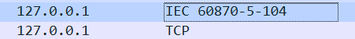
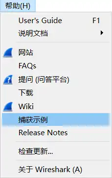

# wireShark

## 复制报文
1. 复制整个报文，包含TCP/IP 部分：在报文列表中选中要复制的报文，右键-》复制-》选择转换后的格式
2. 复制报文中指定部分：
### 格式

| 名称          | 含义                                              | 示例                                                                                                                               |
| ----------- | ----------------------------------------------- | -------------------------------------------------------------------------------------------------------------------------------- |
| 摘要为文本       | 列表中的所有信息，包含序号、时间等                               | 253	15.489035	127.0.0.1	127.0.0.1	IEC 60870-5-104	50	-> U (STARTDT con)                                                          |
| 作为过滤器       | 以选中的报文中指定的部分（摘要的列项-Source、Destination。。。）作为过滤条件 | U帧 protocol 作为过滤器：\_ws.col.protocol == IEC 60870-5-104 结果：U、S I帧 protocol 作为过滤器：\_ws.col.protocol == "IEC 60870-5 ASDU" 结果： I |
| as Hex Dump | 复制为十六进制值：每行16字节，每行首字节的序号 + 值                    | 0000   02 00 00 00 45 00 00 2e bc 56 40 00 80 06 00 00                                                                        |
|             |                                                 |                                                                                                                                  |

	被选中的部分有边框

## 下载示例

