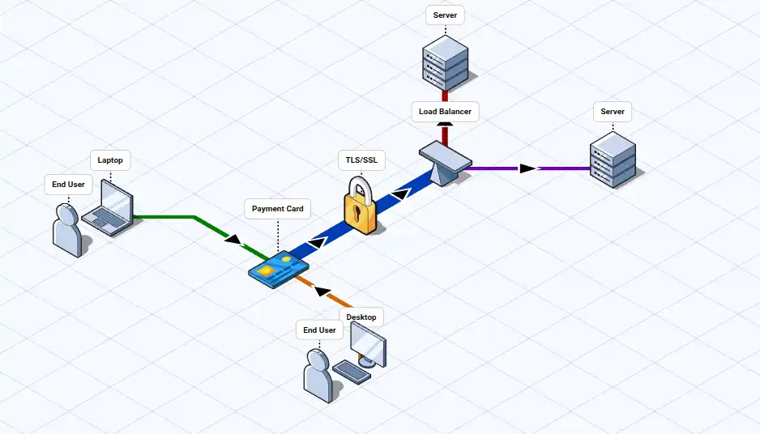
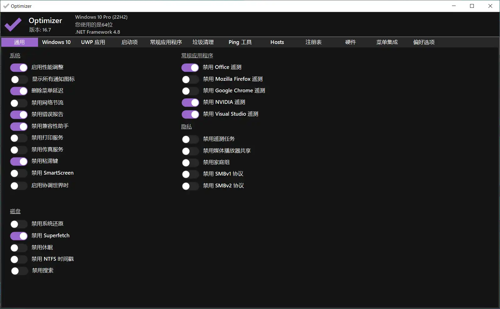
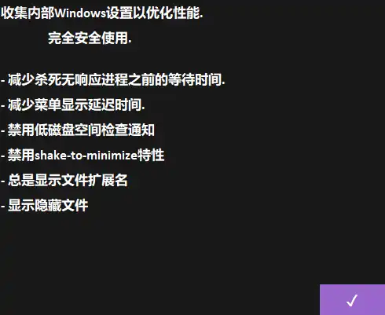
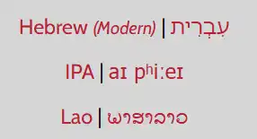
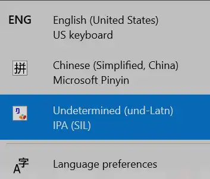
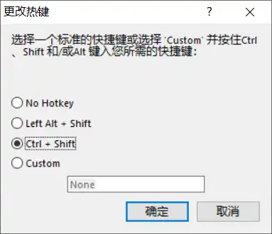
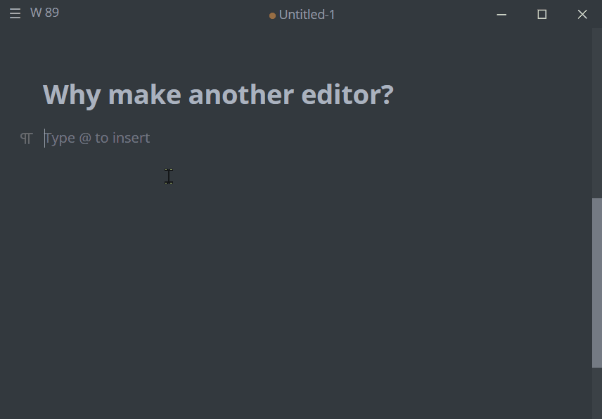
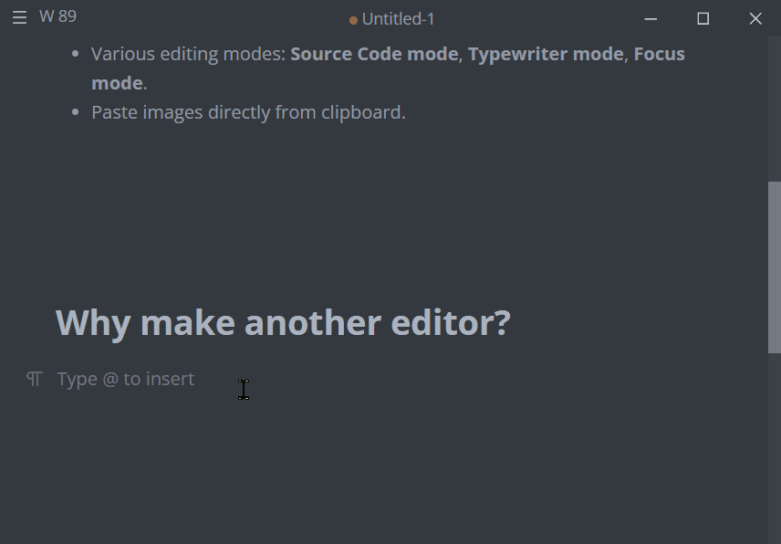
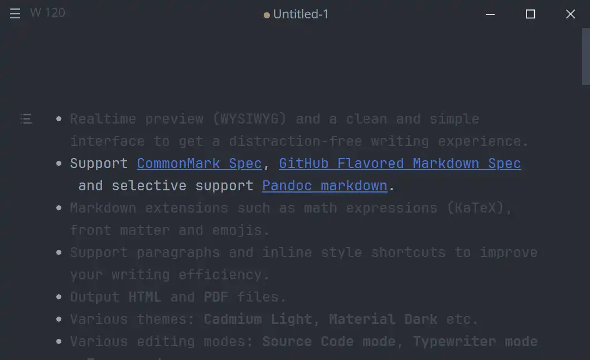
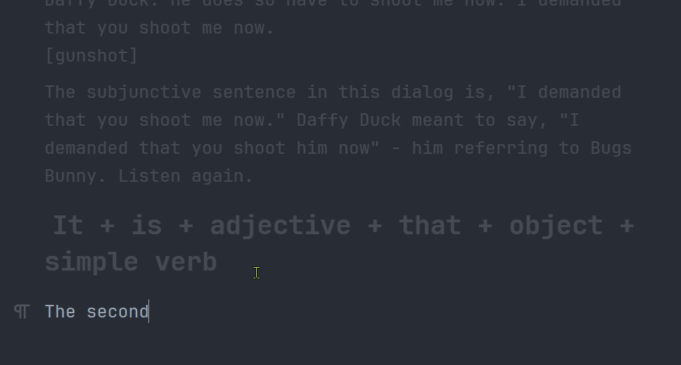

# 工具列表

| 类型                             | 工具名称                                                                           | 简介                                                                                                                                                               | 特点                                                                                                                                                                  | 官网/项目地址                                                                                                                  | 使用平台                      | 安装方式/下载                                       | 信息来源                                                      | 图示                                               | 应用                                                                                   |
| ------------------------------ | ------------------------------------------------------------------------------ | ---------------------------------------------------------------------------------------------------------------------------------------------------------------- | ------------------------------------------------------------------------------------------------------------------------------------------------------------------- | ------------------------------------------------------------------------------------------------------------------------ | ------------------------- | --------------------------------------------- | --------------------------------------------------------- | ------------------------------------------------ | ------------------------------------------------------------------------------------ |
| 画图                             | FossFLOW                                          | for creating beautiful isometric diagrams.在平行等距网格线上绘制具有3D效果的流程图                                                                                                  | - it runs entirely in your browser with offline support.                                                                                                            | [stan-smith/FossFLOW: Make beautiful isometric infrastructure diagrams](https://github.com/stan-smith/FossFLOW)          | 跨平台                       | Docker、Local                                  | 微信-韩数同学                                                   |  | 系统架构图                                                                                |
| 按键可视化                          | Keyviz                                            | Free and open-source software for visualizing your keystrokes.                                                                                                   | Powerful and easy to use configuration options. Filter hotkeys, adjust visualization position & linger duration, and choose from catchy animation presets. | [Keyviz](https://mularahul.github.io/keyviz/?from=thosefree.com#about-section)                                           | windows                   | installer, potable                            | [哪些免费的砖-发现优质的免费商用资源](https://www.thosefree.com/keyviz-v2) |                    |                                                                                      |
| 手机投屏                           | [Scrcpy](Scrcpy.md)                                                            | mirrors Android devices                                                                                                                                          |                                                                                                                                                                     | [Genymobile/scrcpy: Display and control your Android device](https://github.com/Genymobile/scrcpy)                       | Linxu、windows and macOS   | potable                                       | chatgpt                                                   |                                                  |                                                                                      |
| 游戏、网盘加速                        | OpenSpeedy                                        | 一款开源免费的游戏变速工具，让你的游戏突破帧率限制，提供更流畅丝滑的游戏加速体验。                                                                                                                        |                                                                                                                                                                     | [Speedy/docs/README_cn.md at master · game1024/Speedy](https://github.com/game1024/Speedy/blob/master/docs/README_cn.md) | windows                   |                                               | 微信-开源先锋                                                   |                                                  |                                                                                      |
| js 动画库                         | Anime.js                                          |                                                                                                                                                                  |                                                                                                                                                                     | [Anime.js \| JavaScript Animation Engine](https://animejs.com/)                                                          |                           |                                               |                                                           |                                                  |                                                                                      |
| json 可视化                       | jsoncrack                                         |                                                                                                                                                                  | Visualize your JSON Upload:树状图显示json结构; your data:可以在图表区域编辑； Export to image: 导出为PNG、JPEG or SVG 格式图片                                                         | [JSON Crack \| Online JSON Viewer - Transform your data into interactive graphs](https://jsoncrack.com/)                 |                           | VSCode Extension；online                       | 微信-开源先锋                                                   |                                                  |                                                                                      |
| 脚本语法检查                         | ShellCheck                                        | ShellCheck is a GPLv3 tool that gives warnings and suggestions for bash/sh shell scripts:                                                                        |                                                                                                                                                                     | [ShellCheck – shell script analysis tool](https://www.shellcheck.net/)                                                   | windows、macos、linux       |                                               | 微信-开源先锋                                                   |                                                  |                                                                                      |
| 十六进制编辑器，逆向工程，静态分析              | ImHex                                             | ImHex is a Hex Editor, a tool to display, decode and analyze binary data to reverse engineer their format, extract informations or patch values in them.         |                                                                                                                                                                     | [ImHex - Free and Open Source Hex Editor](https://imhex.werwolv.net/)                                                    |                           |                                               | 微信-开源先锋                                                   |                                                  |                                                                                      |
| 跨平台的开源手写笔记应用                   | Xournal++                                         |                                                                                                                                                                  |                                                                                                                                                                     | [Xournal++ - Xournal++](https://xournalpp.github.io/)                                                                    | MacOS, Windows, and Linux |                                               | Github银河系                                                 |                                                  |                                                                                      |
| 开源跨平台文件共享                      | [LocalSend](LocalSend.md)                                                      | 无需云端即可分享文件。 快速、私密、离线                                                                                                                                          |                                                                                                                                                                     | https://localsend.org/zh-CN                                                                                              | 所有主流平台                    |                                               |                                                           |                                                  |                                                                                      |
| 带有加密功能的，和windows 原生文本编辑器类似的编辑器 | Crypto Notepad                                    |                                                                                                                                                                  |                                                                                                                                                                     | https://crypto-notepad.github.io/                                                                                        | windows                   |                                               | chatgpt                                                   |                                                  |                                                                                      |
| WSL 图形管理工具                     | WSL Distro Manager()                              | WSL Distro Manager is a free and open source app that provides a user-friendly graphical interface for managing Windows Subsystem for Linux (WSL) distributions. |                                                                                                                                                                     | https://github.com/bostrot/wsl2-distro-manager                                                                           |                           | 介绍界面-》Install-》Direct download -》Release page | b站[Reaper_6](https://space.bilibili.com/441832003)        |                                                  |                                                                                      |
| windows系统激活工具                  | CMWTAT_Digital_Edition                            | This toolkit can activate your Windows 10 and Windows 11 use digital license.                                                                                    |                                                                                                                                                                     | https://github.com/TGSAN/CMWTAT_Digital_Edition                                                                          |                           |                                               |                                                           |                                                  |                                                                                      |
| windows系统工具                    | [optimizer](#optimizer)                                                        | an advanced configuration utility designed to enhance your privacy and security on Windows                                                                       |                                                                                                                                                                     | https://github.com/hellzerg/optimizer                                                                                    |                           |                                               |                                                           |                                                  |                                                                                      |
| 截图                             | pixpin                                            | 截图、录屏、OCR - 一款快速灵活的工具                                                                                                                                            | - 文字识别功能：可以直接在图片上选中并复制文本。 - 长截图                                                                                                                                  | https://pixpin.cn/                                                                                                       | windows、macOS             |                                               | Gemini                                                    |                                                  | 之前要么照着图片上的文本手打，要么使用PowerToys中的OCR功能，但是中文还需要切换语言。总之有点麻烦。微信上的图片查看器就可以直接选中复制图片中的文本，很方便。 |
| IPA音标输入                        | [keyman](#keyman)                                                              | Helps you type in over 2500 language on just about any device. completely free and open source!                                                                  |                                                                                                                                                                     | https://keyman.com/                                                                                                      |                           |                                               |                                                           |                                                  |                                                                                      |
| Markdown 文档编辑器                 | [marktext](#marktext)                                                          | A simple and elegant open-source markdown editor that focused on speed and usability.                                                                            | Various editing modes: Typewriter mode, Focus mode.两者组合就是 禅模式                                                                                                       | https://github.com/marktext/marktext?tab=readme-ov-file                                                                  |                           |                                               |                                                           |                                                  |                                                                                      |

>[!note]
>一些软件需要[以管理员身份运行程序](Windows.md#以管理员身份运行程序) 才有效果，否则功能受到限制，导致无法使用

说明：
1. 有具体使用说明的工具点击链接查看对应文档；
2. 未使用过的工具名称为黄色
3. 已下载使用的工具名称为绿色

## optimizer

功能栏：
- 系统
- windows10：相同相关配置
- UWP应用：Universal Windows Platform，“UWP的核心API在所有windows设备上是相同的”。运行windows的设备有多种类型，比如台式电脑、Xbox、头戴显示设备。。。为了编写跨设备的应用，推出了UWP。使用UWP创建的应用
- （开机）启动项：删除前可以先进行备份以便恢复
- 常规应用：下载推荐的应用
- 垃圾清理
- Ping 工具
- Hosts
- 注册表
- 硬件：硬件信息检测
- 菜单集成：修改右键菜单、System Variables、字体
- 偏好设置：optimizer 配置

点击具体项目可以查看具体解释：

## keyman
在主界面选择 IPA 语言，进入对应的下载页面，下载并安装程序

启动运行后， Input methods 中新增 IPA输入

**配置快捷键**
配置-》快捷键-》常规快捷键
选中 “打开语言切换器”，按住shift + space，进入快捷键配置界面

>[!note]
>这里配置的快捷键最好和系统设置中的 `Between Input Languages` 一致，否则可能会导致系统配置失效，无法切换输入法

**选项**
- 随windows 启动：需要运行keyman 程序，IPA输入法才有效果

**键盘布局**
通过字符序列：基本字符 + 修饰符（<、>、=） 组合成一个IPA基本字符
如输入 "i" + "=" 结果是 "ɪ"

### Vowels
---
<table>
    <tr>
        <td></td>
        <td>Font</td>
        <td></td>
        <td>Central</td>
        <td></td>
        <td>Back</td>
        <td> </td>
    </tr>
    <tr>
        <td></td>
        <td>Unrounded</td>
        <td>Rounded</td>
        <td>Unrounded</td>
        <td>Rounded</td>
        <td>Unrounded</td>
        <td>Rounded </td>
    </tr>
    <tr>
        <td>Close</td>
        <td>i i</td>
        <td>y y</td>
        <td>ɨ</td>
        <td>ʉ</td>
        <td>ɯ</td>
        <td>u u</td>
    </tr>
    <tr>
        <td>Near-close</td>
        <td>ɪ i=</td>
        <td>ʏ y=</td>
        <td></td>
        <td></td>
        <td></td>
        <td>ʊ u&lt;</td>
    </tr>
    <tr>
        <td>Close-mid</td>
        <td>e e</td>
        <td>ø o&gt;</td>
        <td>ɘ E=</td>
        <td>ɵ O=</td>
        <td>ɤ O&gt;</td>
        <td>o o</td>
    </tr>
    <tr>
        <td>Mid</td>
        <td></td>
        <td></td>
        <td>ə e=</td>
        <td></td>
        <td></td>
        <td> </td>
    </tr>
    <tr>
        <td>Open-mid</td>
        <td>ɛ e&lt;</td>
        <td>œ E&lt;</td>
        <td>ɜ e&gt;</td>
        <td>ɞ O&lt;</td>
        <td>ʌ u&gt;</td>
        <td>ɔ o&lt;</td>
    </tr>
    <tr>
        <td>Near-open</td>
        <td>æ a&lt;</td>
        <td></td>
        <td>ɐ a&gt;</td>
        <td></td>
        <td></td>
        <td> </td>
    </tr>
    <tr>
        <td>Open</td>
        <td>a a</td>
        <td>ɶ E&gt;</td>
        <td></td>
        <td></td>
        <td>ɑ a=</td>
        <td>ɒ o=</td>
    </tr>
</table>

---
### Suprasegmental

| 输入  | 输出  | 含义                      | 示例                 | 中文名称   |
| --- | --- | ----------------------- | ------------------ | ------ |
| }   | ˈ   | Primary stress          | /ˈpraɪməri/        | 主重音    |
| }}  | ˌ   | Secondary stress        | /ˌsuːprəsegˈmentl/ | 次重音    |
| :   | ː   | Long                    | /siː/              | 长      |
| ::  | ˑ   | Half long               |                    | 半长     |
| .<  | \|  | Minor(foot) group       |                    | 小（音步）段 |
| .=  | ‖   | Major(intonation) group |                    | 大（语调）段 |

### Consonants

|                     | Bilabial | Labiodental | Dental       | Alveolar | Post-alveolar | Retroflex | Palatal | Velar  | Uvular | Pharyngeal | Glottal |
| ------------------- | -------- | ----------- | ------------ | -------- | ------------- | --------- | ------- | ------ | ------ | ---------- | ------- |
| Plosive             | p  b  |             |              | t d   |               |           |         | k g |        |            |         |
| Nasal               | m        |             |              | n        |               |           |         | ŋ n>   |        |            |         |
| Trill               |          |             |              | r        |               |           |         |        |        |            |         |
| Tap or Flap         |          |             |              |          |               |           |         |        |        |            |         |
| Fricative           |          | f  v     | θ t= ð d= | s z   | ʃ s= ʒ z=  |           |         |        |        |            | h       |
| Lateral Fricative   |          |             |              |          |               |           |         |        |        |            |         |
| Appproximant        |          |             |              |          |               |           | j       |        |        |            |         |
| Lateral Approximant |          |             |              | l        |               |           |         |        |        |            |         |

**Other Consonants**

| 输入  | 输出  | 含义                          |
| --- | --- | --------------------------- |
| w   | w   | Vd labial-velar approximant |

## marktext
在复习文章 或 专注写作时，想要屏蔽干扰，或者说是减少不必要的信息输入，需要禅模式。ob 中虽然有 一个 Typewriter mode 插件，但是使用起来不尽人意。

:::tabs
@tab 普通模式

@tab Typewriter mode

和普通模式的区别：
- 换行时界面会自动向上移动，使当前输入保持在相对中央的位置（即使界面能够显示全部内容）
- 切换/跳转 行时，界面也移动。
@tab focus mode

	突出当前编辑内容，淡化其他内容。
	问：对比不是很明显，是否可以设置突出内容的背景、字体等参数？
:::

Typewrite mode 使用起来似乎有些问题

	每输入一个字符界面就会跳动一下，人都要被晃晕了😵
只能在全屏模式下使用？
问：focus mode 中突出显示的范围是多大？是否能够设置为单行或段落？能不能设置为渐变，并且可以控制渐变的程度（距离当前行的距离 - x，设置弱化的程度 - y）？