# 工具列表

| 类型                             | 工具名称                                                                           | 简介                                                                                                                                                               | 特点                                                                                                                                                                  | 官网/项目地址                                                                                                                  | 使用平台                      | 安装方式/下载                                       | 信息来源                                                      | 图示                                               | 应用                                                                                   |
| ------------------------------ | ------------------------------------------------------------------------------ | ---------------------------------------------------------------------------------------------------------------------------------------------------------------- | ------------------------------------------------------------------------------------------------------------------------------------------------------------------- | ------------------------------------------------------------------------------------------------------------------------ | ------------------------- | --------------------------------------------- | --------------------------------------------------------- | ------------------------------------------------ | ------------------------------------------------------------------------------------ |
| 画图                             | <font color="#ffff00">FossFLOW</font>                                          | for creating beautiful isometric diagrams.在平行等距网格线上绘制具有3D效果的流程图                                                                                                  | - it runs entirely in your browser with offline support.                                                                                                            | [stan-smith/FossFLOW: Make beautiful isometric infrastructure diagrams](https://github.com/stan-smith/FossFLOW)          | 跨平台                       | Docker、Local                                  | 微信-韩数同学                                                   | 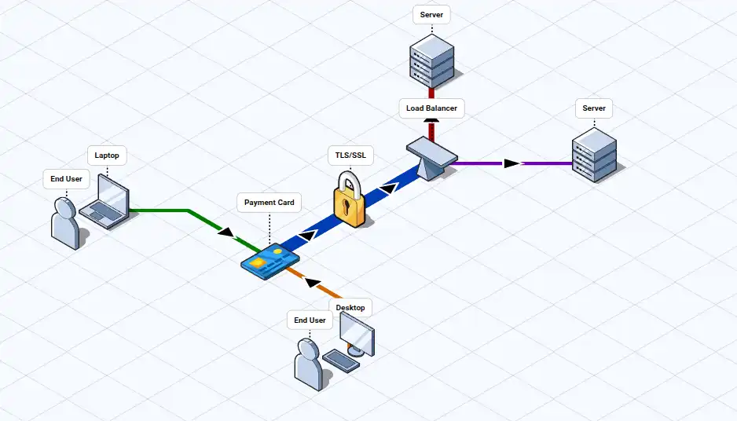 | 系统架构图                                                                                |
| 按键可视化                          | <font color="#00b050">Keyviz</font>                                            | Free and open-source software for visualizing your keystrokes.                                                                                                   | Powerful and easy to use configuration options. Filter hotkeys,<br>adjust visualization position & linger<br>duration, and choose from catchy<br>animation presets. | [Keyviz](https://mularahul.github.io/keyviz/?from=thosefree.com#about-section)                                           | windows                   | installer, potable                            | [哪些免费的砖-发现优质的免费商用资源](https://www.thosefree.com/keyviz-v2) |                    |                                                                                      |
| 手机投屏                           | [Scrcpy](Scrcpy.md)                                                            | mirrors Android devices                                                                                                                                          |                                                                                                                                                                     | [Genymobile/scrcpy: Display and control your Android device](https://github.com/Genymobile/scrcpy)                       | Linxu、windows and macOS   | potable                                       | chatgpt                                                   |                                                  |                                                                                      |
| 游戏、网盘加速                        | <font color="#ffff00">OpenSpeedy</font>                                        | 一款开源免费的游戏变速工具，让你的游戏突破帧率限制，提供更流畅丝滑的游戏加速体验。                                                                                                                        |                                                                                                                                                                     | [Speedy/docs/README_cn.md at master · game1024/Speedy](https://github.com/game1024/Speedy/blob/master/docs/README_cn.md) | windows                   |                                               | 微信-开源先锋                                                   |                                                  |                                                                                      |
| js 动画库                         | <font color="#ffff00">Anime.js</font>                                          |                                                                                                                                                                  |                                                                                                                                                                     | [Anime.js \| JavaScript Animation Engine](https://animejs.com/)                                                          |                           |                                               |                                                           |                                                  |                                                                                      |
| json 可视化                       | <font color="#00b050">jsoncrack                             </font>            |                                                                                                                                                                  | Visualize your JSON<br>Upload:树状图显示json结构; your data:可以在图表区域编辑；<br>Export to image: 导出为PNG、JPEG or SVG 格式图片                                                         | [JSON Crack \| Online JSON Viewer - Transform your data into interactive graphs](https://jsoncrack.com/)                 |                           | VSCode Extension；online                       | 微信-开源先锋                                                   |                                                  |                                                                                      |
| 脚本语法检查                         | <font color="#ffff00">ShellCheck                             </font>           | ShellCheck is a GPLv3 tool that gives warnings and suggestions for bash/sh shell scripts:                                                                        |                                                                                                                                                                     | [ShellCheck – shell script analysis tool](https://www.shellcheck.net/)                                                   | windows、macos、linux       |                                               | 微信-开源先锋                                                   |                                                  |                                                                                      |
| 十六进制编辑器，逆向工程，静态分析              | <font color="#ffff00">ImHex</font>                                             | ImHex is a Hex Editor, a tool to display, decode and analyze binary data to reverse engineer their format, extract informations or patch values in them.         |                                                                                                                                                                     | [ImHex - Free and Open Source Hex Editor](https://imhex.werwolv.net/)                                                    |                           |                                               | 微信-开源先锋                                                   |                                                  |                                                                                      |
| 跨平台的开源手写笔记应用                   | <font color="#ffff00">Xournal++</font>                                         |                                                                                                                                                                  |                                                                                                                                                                     | [Xournal++ - Xournal++](https://xournalpp.github.io/)                                                                    | MacOS, Windows, and Linux |                                               | Github银河系                                                 |                                                  |                                                                                      |
| 开源跨平台文件共享                      | [LocalSend](LocalSend.md)                                                      | 无需云端即可分享文件。<br>快速、私密、离线                                                                                                                                          |                                                                                                                                                                     | https://localsend.org/zh-CN                                                                                              | 所有主流平台                    |                                               |                                                           |                                                  |                                                                                      |
| 带有加密功能的，和windows 原生文本编辑器类似的编辑器 | <font color="#00b050">Crypto Notepad                             </font>       |                                                                                                                                                                  |                                                                                                                                                                     | https://crypto-notepad.github.io/                                                                                        | windows                   |                                               | chatgpt                                                   |                                                  |                                                                                      |
| WSL 图形管理工具                     | <font color="#00b050">WSL Distro Manager()                             </font> | WSL Distro Manager is a free and open source app that provides a user-friendly graphical interface for managing Windows Subsystem for Linux (WSL) distributions. |                                                                                                                                                                     | https://github.com/bostrot/wsl2-distro-manager                                                                           |                           | 介绍界面-》Install-》Direct download -》Release page | b站[Reaper_6](https://space.bilibili.com/441832003)        |                                                  |                                                                                      |
| windows系统激活工具                  | <font color="#00b050">CMWTAT_Digital_Edition</font>                            | This toolkit can activate your Windows 10 and Windows 11 use digital license.                                                                                    |                                                                                                                                                                     | https://github.com/TGSAN/CMWTAT_Digital_Edition                                                                          |                           |                                               |                                                           |                                                  |                                                                                      |
| windows系统工具                    | [optimizer](#optimizer)                                                        | an advanced configuration utility designed to enhance your privacy and security on Windows                                                                       |                                                                                                                                                                     | https://github.com/hellzerg/optimizer                                                                                    |                           |                                               |                                                           |                                                  |                                                                                      |
| 截图                             | [PixPin](#PixPin)                                                              | 截图、录屏、OCR - 一款快速灵活的工具                                                                                                                                            | - 文字识别功能：可以直接在图片上选中并复制文本。<br>- 长截图                                                                                                                                  | https://pixpin.cn/                                                                                                       | windows、macOS             |                                               | Gemini                                                    |                                                  | 之前要么照着图片上的文本手打，要么使用PowerToys中的OCR功能，但是中文还需要切换语言。总之有点麻烦。微信上的图片查看器就可以直接选中复制图片中的文本，很方便。 |
| IPA音标输入                        | [keyman](#keyman)                                                              | Helps you type in over 2500 language on just about any device. completely free and open source!                                                                  |                                                                                                                                                                     | https://keyman.com/                                                                                                      |                           |                                               |                                                           |                                                  |                                                                                      |
| Markdown 文档编辑器                 | [marktext](#marktext)                                                          | A simple and elegant open-source markdown editor that focused on speed and usability.                                                                            | Various editing modes: Typewriter mode, Focus mode.两者组合就是 禅模式                                                                                                       | https://github.com/marktext/marktext?tab=readme-ov-file                                                                  |                           |                                               |                                                           |                                                  |                                                                                      |
| 离线文档查看                         | [Zeal](#Zeal)                                                                  | Zeal is an offline documentation browser for software developers.                                                                                                |                                                                                                                                                                     | https://zealdocs.org/                                                                                                    |                           |                                               |                                                           |                                                  |                                                                                      |
| 加密                             | [Cryptomator](https://cryptomator.org/)                                        | Cryptomator is simple tool for digital self-defense. It allows you to protect your cloud data by yourself and independently                                      |                                                                                                                                                                     | https://docs.cryptomator.org/desktop/                                                                                    |                           |                                               |                                                           |                                                  |                                                                                      |
| 记账                             | [HomeBank](HomeBank.md)                                                        | Free, easy, personal accounting software for everyone                                                                                                            |                                                                                                                                                                     | https://www.gethomebank.org/en/index.php                                                                                 |                           |                                               |                                                           |                                                  |                                                                                      |
| 词典                             | [GoldenDict-ng](#GoldenDict)                                                   |                                                                                                                                                                  |                                                                                                                                                                     | https://github.com/xiaoyifang/goldendict-ng                                                                              |                           |                                               |                                                           |                                                  |                                                                                      |
| 音频                             | [Audacity](#Audacity)                                                          | the free, open source, cross-platform software for recording and editing sounds                                                                                  |                                                                                                                                                                     | https://www.audacityteam.org/                                                                                            |                           |                                               |                                                           |                                                  |                                                                                      |
| 视频                             | [HandBrake](#HandBrake)                                                        | The open source video transcoder                                                                                                                                 |                                                                                                                                                                     | https://handbrake.fr/downloads.php                                                                                       |                           |                                               |                                                           |                                                  |                                                                                      |
| windows 系统工具                   | Sysinternals                                                                   | 工具集合                                                                                                                                                             |                                                                                                                                                                     | https://learn.microsoft.com/en-us/sysinternals/                                                                          |                           |                                               |                                                           |                                                  |                                                                                      |
| 绘图                             | Veusz                                                                          | `Veusz` is a scientific plotting and graphing program with a graphical user interface, designed to produce publication-ready 2D and 3D plots.                    |                                                                                                                                                                     | https://veusz.github.io/                                                                                                 |                           |                                               |                                                           |                                                  |                                                                                      |
| 绘图                             | [ioDraw](#ioDraw)                                                              |                                                                                                                                                                  |                                                                                                                                                                     | https://www.iodraw.com/en                                                                                                |                           |                                               |                                                           |                                                  |                                                                                      |
| 语音转文字                          | [handy](#handy)                                                                | A free, open source, and extensible speech-to-text application that works completely offline.                                                                    |                                                                                                                                                                     | https://github.com/cjpais/handy                                                                                          |                           |                                               |                                                           |                                                  |                                                                                      |
| 图片浏览                           | voidImageViewer                                                                | A lightweight image viewer for windows with animated GIF/WEBP support. Open and displays BMP, ... images as fast as possible                                     |                                                                                                                                                                     | https://github.com/voidtools/voidImageViewer                                                                             |                           |                                               |                                                           |                                                  |                                                                                      |
| 记忆                             | [Anki](Anki.md)                                                                | Remembering is easier with Anki                                                                                                                                  |                                                                                                                                                                     | https://apps.ankiweb.net/                                                                                                |                           |                                               |                                                           |                                                  |                                                                                      |
| 鼠标操作 工具箱                       | [Quicker](Quicker.md)                                                          | 你的指尖工具箱。操作更少收获更多                                                                                                                                                 |                                                                                                                                                                     | https://getquicker.net/                                                                                                  |                           |                                               |                                                           |                                                  |                                                                                      |
| 获取exe图标                        | IconViewer                                                                     |                                                                                                                                                                  |                                                                                                                                                                     | https://www.botproductions.com/iconview/download.html                                                                    |                           |                                               |                                                           |                                                  |                                                                                      |
| 桌面标签笔记                         | PaperTodo                                                                      |                                                                                                                                                                  |                                                                                                                                                                     | https://github.com/snownico0722/PaperTodo                                                                                |                           |                                               |                                                           |                                                  |                                                                                      |


>[!note]
>一些软件需要[以管理员身份运行程序](Windows.md#以管理员身份运行程序) 才有效果，否则功能受到限制，导致无法使用


说明：
1. 有具体使用说明的工具点击链接查看对应文档；
2. 未使用过的工具名称为黄色
3. 已下载使用的工具名称为绿色


## optimizer

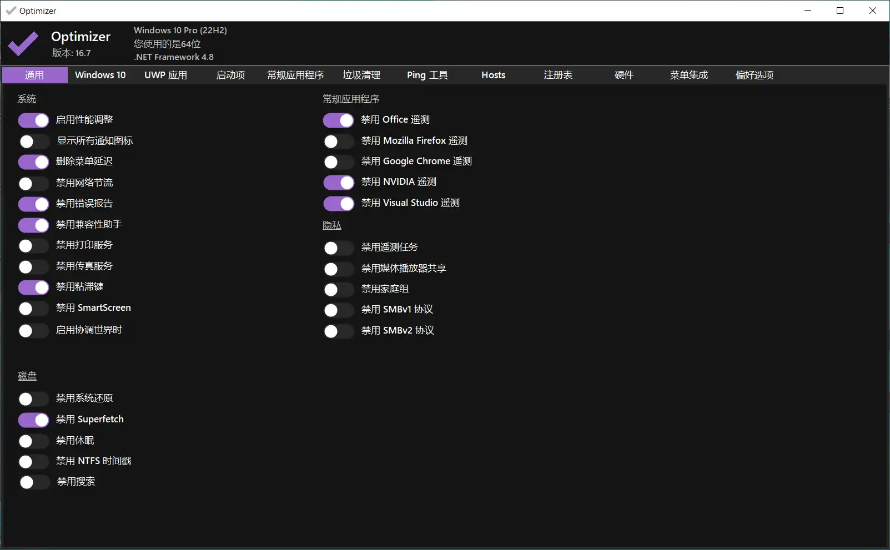

功能栏：
- 系统
- windows10：相同相关配置
- UWP应用：Universal Windows Platform，“UWP的核心API在所有windows设备上是相同的”。运行windows的设备有多种类型，比如台式电脑、Xbox、头戴显示设备。。。为了编写跨设备的应用，推出了UWP。使用UWP创建的应用
- （开机）启动项：删除前可以先进行备份以便恢复
- 常规应用：下载推荐的应用
- 垃圾清理
- Ping 工具
- Hosts
- 注册表
- 硬件：硬件信息检测
- 菜单集成：修改右键菜单、System Variables、字体
- 偏好设置：optimizer 配置

点击具体项目可以查看具体解释：
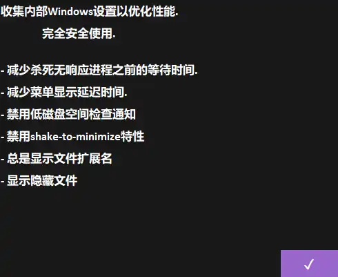

## keyman
在主界面选择 IPA 语言，进入对应的下载页面，下载并安装程序
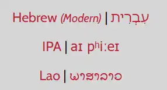

启动运行后， Input methods 中新增 IPA输入
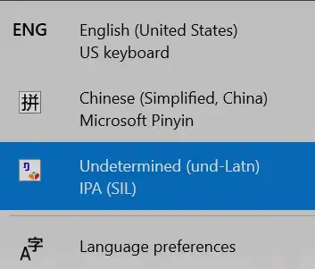


**配置快捷键**
配置-》快捷键-》常规快捷键
选中 “打开语言切换器”，按住shift + space，进入快捷键配置界面
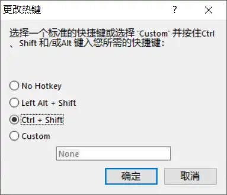

>[!note]
>这里配置的快捷键最好和系统设置中的 `Between Input Languages` 一致，否则可能会导致系统配置失效，无法切换输入法


**选项**
- 随windows 启动：需要运行keyman 程序，IPA输入法才有效果

**键盘布局**
通过字符序列：基本字符 + 修饰符（<、>、=） 组合成一个IPA基本字符
如输入 "i" + "=" 结果是 "ɪ"

### Vowels
---
<table>
	<tbody>
	    <tr>
	        <td></td>
	        <td>Font</td>
	        <td></td>
	        <td>Central</td>
	        <td></td>
	        <td>Back</td>
	        <td> </td>
	    </tr>
	    <tr>
	        <td></td>
	        <td>Unrounded</td>
	        <td>Rounded</td>
	        <td>Unrounded</td>
	        <td>Rounded</td>
	        <td>Unrounded</td>
	        <td>Rounded </td>
	    </tr>
	    <tr>
	        <td>Close</td>
	        <td>i i</td>
	        <td>y y</td>
	        <td>ɨ</td>
	        <td>ʉ</td>
	        <td>ɯ</td>
	        <td>u u</td>
	    </tr>
	    <tr>
	        <td>Near-close</td>
	        <td>ɪ i=</td>
	        <td>ʏ y=</td>
	        <td></td>
	        <td></td>
	        <td></td>
	        <td>ʊ u&lt;</td>
	    </tr>
	    <tr>
	        <td>Close-mid</td>
	        <td>e e</td>
	        <td>ø o&gt;</td>
	        <td>ɘ E=</td>
	        <td>ɵ O=</td>
	        <td>ɤ O&gt;</td>
	        <td>o o</td>
	    </tr>
	    <tr>
	        <td>Mid</td>
	        <td></td>
	        <td></td>
	        <td>ə e=</td>
	        <td></td>
	        <td></td>
	        <td> </td>
	    </tr>
	    <tr>
	        <td>Open-mid</td>
	        <td>ɛ e&lt;</td>
	        <td>œ E&lt;</td>
	        <td>ɜ e&gt;</td>
	        <td>ɞ O&lt;</td>
	        <td>ʌ u&gt;</td>
	        <td>ɔ o&lt;</td>
	    </tr>
	    <tr>
	        <td>Near-open</td>
	        <td>æ a&lt;</td>
	        <td></td>
	        <td>ɐ a&gt;</td>
	        <td></td>
	        <td></td>
	        <td> </td>
	    </tr>
	    <tr>
	        <td>Open</td>
	        <td>a a</td>
	        <td>ɶ E&gt;</td>
	        <td></td>
	        <td></td>
	        <td>ɑ a=</td>
	        <td>ɒ o=</td>
	    </tr>
	</tbody>
</table>

---
### Suprasegmental

| 输入  | 输出  | 含义                      | 示例                 | 中文名称   |
| --- | --- | ----------------------- | ------------------ | ------ |
| }   | ˈ   | Primary stress          | /ˈpraɪməri/        | 主重音    |
| }}  | ˌ   | Secondary stress        | /ˌsuːprəsegˈmentl/ | 次重音    |
| :   | ː   | Long                    | /siː/              | 长      |
| ::  | ˑ   | Half long               |                    | 半长     |
| .<  | \|  | Minor(foot) group       |                    | 小（音步）段 |
| .=  | ‖   | Major(intonation) group |                    | 大（语调）段 |

### Consonants

|                     | Bilabial | Labiodental | Dental       | Alveolar | Post-alveolar | Retroflex | Palatal | Velar  | Uvular | Pharyngeal | Glottal |
| ------------------- | -------- | ----------- | ------------ | -------- | ------------- | --------- | ------- | ------ | ------ | ---------- | ------- |
| Plosive             | p <br>b  |             |              | t<br>d   |               |           |         | k<br>g |        |            |         |
| Nasal               | m        |             |              | n        |               |           |         | ŋ n>   |        |            |         |
| Trill               |          |             |              | r        |               |           |         |        |        |            |         |
| Tap or Flap         |          |             |              |          |               |           |         |        |        |            |         |
| Fricative           |          | f <br>v     | θ t=<br>ð d= | s<br>z   | ʃ s=<br>ʒ z=  |           |         |        |        |            | h       |
| Lateral Fricative   |          |             |              |          |               |           |         |        |        |            |         |
| Appproximant        |          |             |              |          |               |           | j       |        |        |            |         |
| Lateral Approximant |          |             |              | l        |               |           |         |        |        |            |         |

**Other Consonants**

| 输入  | 输出  | 含义                          |
| --- | --- | --------------------------- |
| w   | w   | Vd labial-velar approximant |


## marktext
在复习文章 或 专注写作时，想要屏蔽干扰，或者说是减少不必要的信息输入，需要禅模式。ob 中虽然有 一个 Typewriter mode 插件，但是使用起来不尽人意。

:::tabs
@tab 普通模式
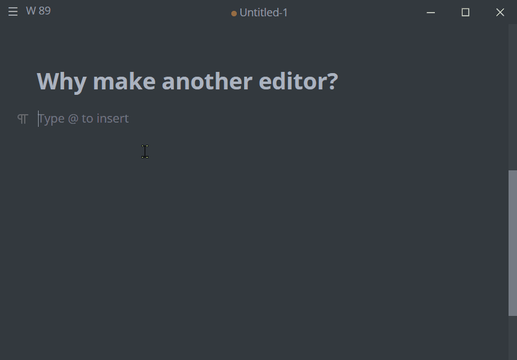

@tab Typewriter mode
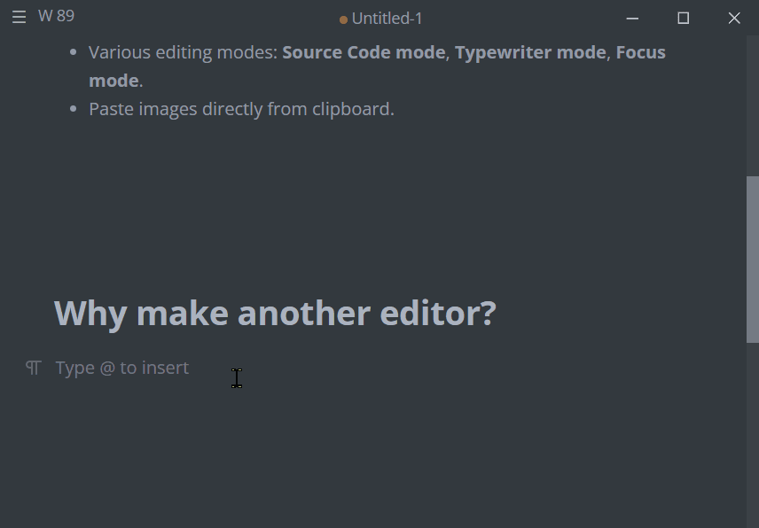
和普通模式的区别：
- 换行时界面会自动向上移动，使当前输入保持在相对中央的位置（即使界面能够显示全部内容）
- 切换/跳转 行时，界面也移动。
@tab focus mode
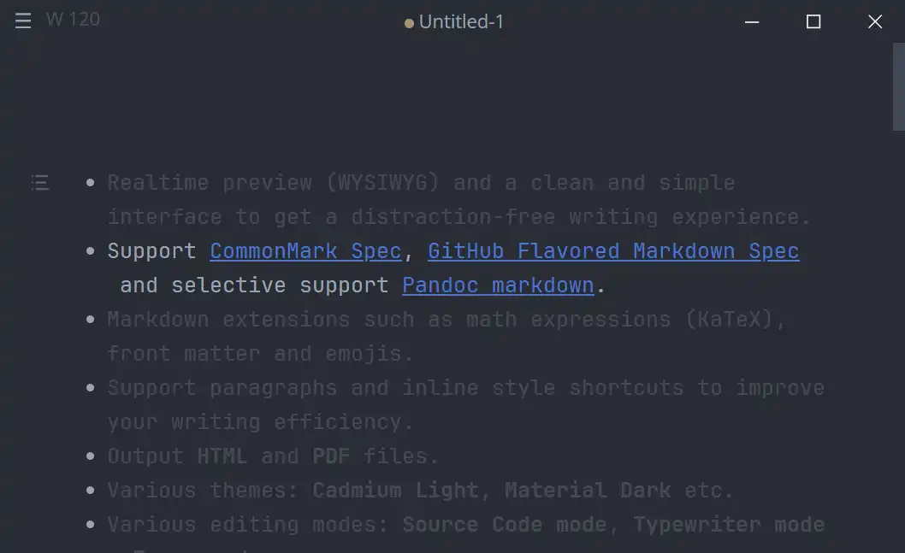
	突出当前编辑内容，淡化其他内容。
	<span style="background:#fff88f">问：</span>对比不是很明显，是否可以设置突出内容的背景、字体等参数？
:::

Typewrite mode 使用起来似乎有些问题
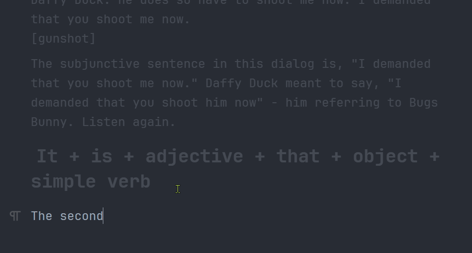
	每输入一个字符界面就会跳动一下，人都要被晃晕了😵
只能在全屏模式下使用？
<span style="background:#fff88f">问：</span>focus mode 中突出显示的范围是多大？是否能够设置为单行或段落？能不能设置为渐变，并且可以控制渐变的程度（距离当前行的距离 - x，设置弱化的程度 - y）？


## Zeal
**下载docset**
配置路径：Tool -> Docsets...
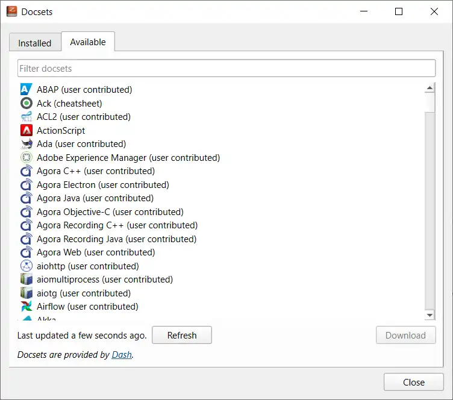

- 可能是网络的原因，前面几次打开时 Available 列表是空白的
- 先用ASCII Tables 测试能够正常下载
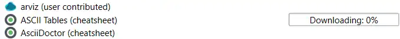


**手动导入 docset**
1. [Zeal User Contributions](https://zealusercontributions.vercel.app/official)
2. 下载压缩包
3. 进入docsets 存储目录
Edit -> Preferences -> General -> Docset storage -> Browse...
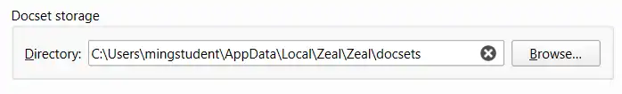

4. 解压压缩包到该目录下
5. 效果
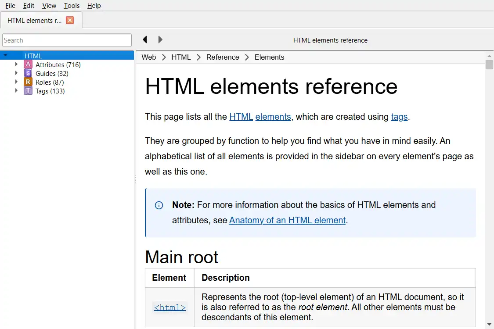

如果docsets 列表没有更新，先将 Docset storage设置为新安装的docset路径，然后再调整到上级目录。

## Cryptomator

**Create New Vault**
点击主界面左下角 “+” 按钮，创建新的 vault
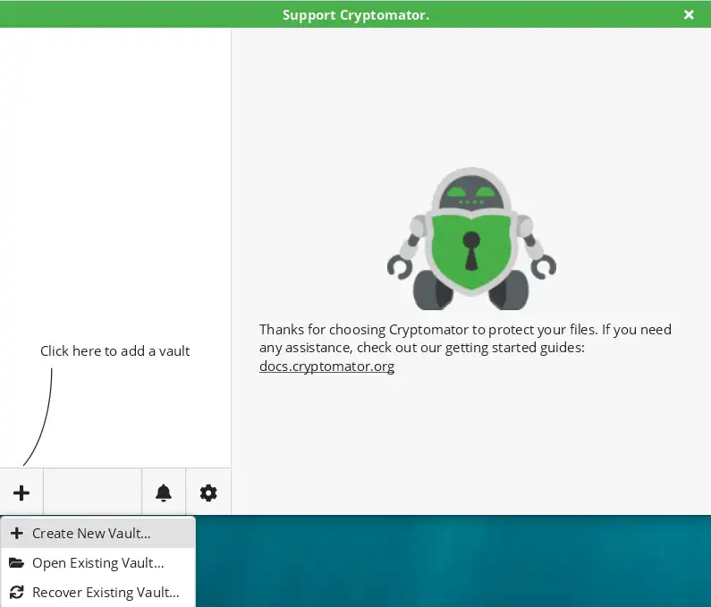

设置 vault 的名称（本地目录名称）
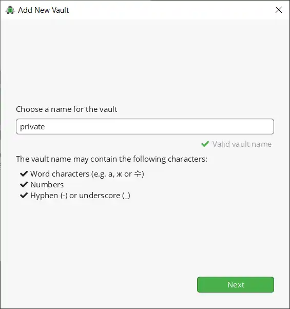

选择存储路径
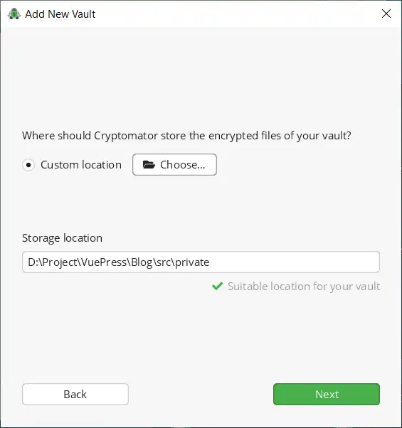

设置密码 & 是否创建 recovery key
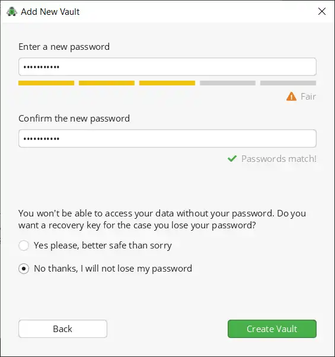

新建成功
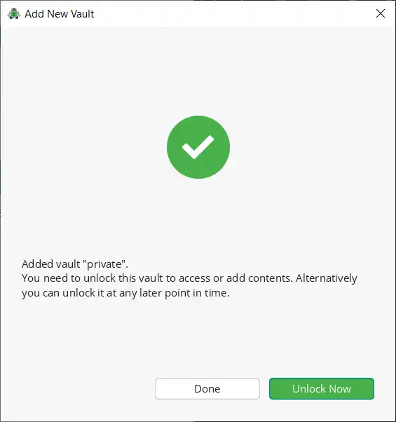


新建 vault 本地结构：
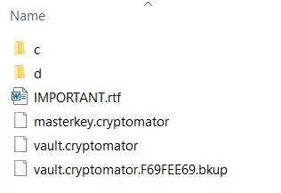

```txt title="IMPORTANT.rtf"
⚠️ VAULT FILES  ⚠️
This is your vault's storage location.

DO NOT
    • alter any files within this directory or
    • paste any files for encryption into this directory.

If you want to encrypt files and view the content of the vault, do the following:
    1.  Add this vault to Cryptomator.
    2.  Unlock the vault in Cryptomator.
    3.  Open the access location by clicking the "Reveal" button.

If you need help, visit the documentation: http://docs.cryptomator.org
```

向vault中添加要加密的文件的正确步骤：
1. Unlock the vault in Cryptomator
点击 `Unlock...`
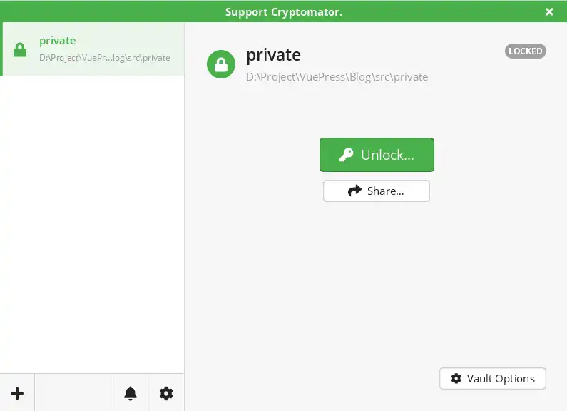

2. 输入密码
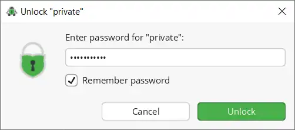

3. Reveal Drive
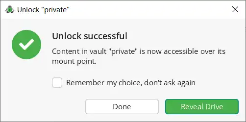

4. 就能看到vault存储的文件了


Unlock 后 vault 映射为一个 虚拟磁盘
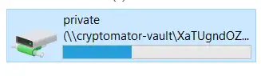

5. 将要加密的文件添加到该磁盘内


### Vault Options

在 LOCKED 状态下点击右下角按钮

####  General
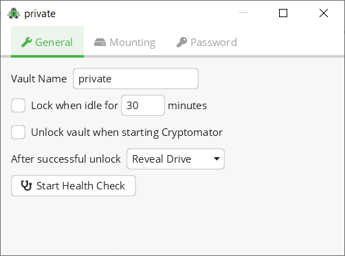

#### Mounting
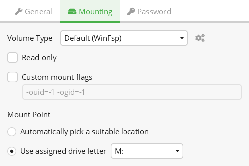


**Mount Point**

- Use assigned drive letter: 

### Encrypted File Names
>The app offers two features to reveal the mapping between the cleartext (in your unlocked vault) and the encrypted files (in the vault storage location)


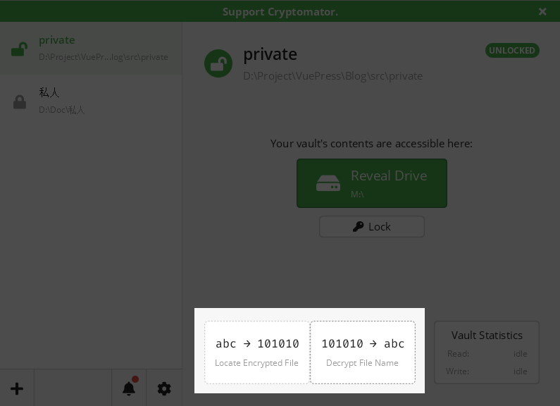

#### Locate Encrypted File
>find the encrypted counterpart of a file from inside the vault.

找到和虚拟磁盘中对应的本地文件

#### Decrypt File Name
>helps you resolve encrypted file names back to their original cleartext names.

解密本地文件的文件名

## GoldenDict-ng
词典下载：
1. https://forum.freemdict.com/t/topic/30466/128
2. https://mdict.org/post/oxford-students-dictionary/


## PixPin
### 长截图
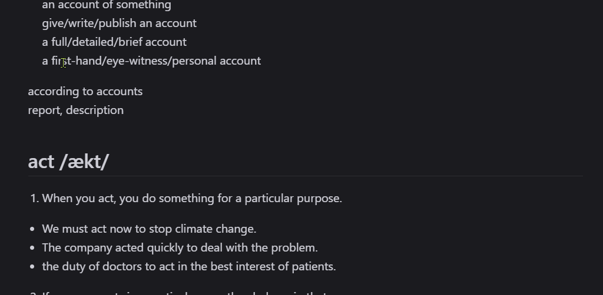

点击长截图按钮进入长截图模式
右侧显示当前长截图的缩略图，其中绿色区域为当前截取区域
长截图下的功能按钮：

1. 长截图大小
2. 区域移动按钮：
截图模式下（右侧有缩略图，按钮为↑↓箭头-和截取方向一致）可以通过该按钮移动截取区域。
滑轮滚动到底部后，底部内容不在截图区域内，需要通过按住该按钮调整截图区域位置
示例：


非截图模式下，可以拖动调整截图区域
3. 自动滚动截图：自动滚动，无需手动调整鼠标滑轮
4. 裁剪：裁剪最上/下方多余的截图（垂直方向截取时）
5. 进入/退出截图模式
6. 关闭：取消截图
7. 贴图：保存长截图并钉在界面上

## Audacity
edition: 3.7.7

### Transport Toolbar
三种状态
:::tabs
@tab void


@tab 播放


@tab 录制

:::

按钮：
- Pause：暂停/继续 播放 或 录制。
- Play(Space)/Play Once(Shift+Space): 从选定的起始位置（editing cursor）开始播放 或 播放选定区域 快捷键为 Space
在波形图中，红色箭头所指的竖线即为起始位置
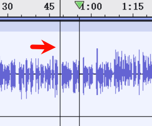

选定区域（深色部分），播放完毕后自动停止
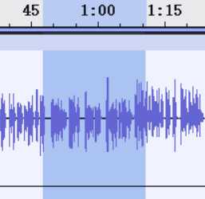

按住Ctrl 键 Play button 会切换图标：

此时Play 的功能为 Play Cut Preview，这里Cut 指的是不需要的播放的选中区域。预览Cut该区域后的效果，播放时会跳过该区域
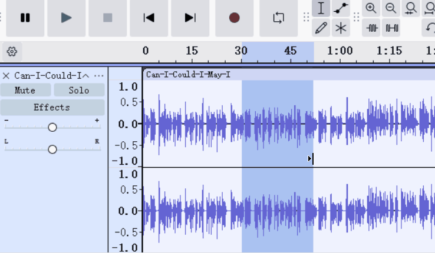

- Stop: 停止播放/录音
- Skip to Start：将播放位置移动到起始按住 shift后点击 会选中 the editing cursor 到 起始区域

>在void 以及 暂停状态下该按钮可用，但是使用后会退回（切换）到void状态（播放过程中改变播放位置相当于重新播放，录音过程中不允许修改录音的起点）


- Skip to end
- Record：从当前 track(s) 的末尾开始录音
	- Record new track(Shift)：新的track起始位置为the editing cursor
- Loop：时间轴上深色区域即为循环播放区间，启动循环播放后会显示该区间。
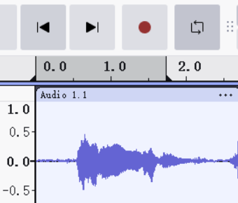
	可以在时间轴上调整 looping region

### Tools Toolbar
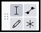
- Selection: select a start point, or a selection region。可以先选取region起点，然后按住 shift 键，再选取终点
- Envelope
>Allows smooth volume changes to be made over the length of a track by means of embedded volume "control points"

控制音量随时间变化的程度
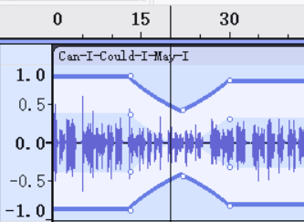
上图中白色的点即为 control points

- Draw Samples
调整单个采样点的音量

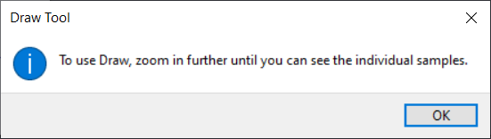
放大波形(Zoom in、Ctrl + wheel or Zoom Toggle)直到可以看到采样点（点击波形图不再出现上面的弹窗提示）
- Multi-Tool: Combines all the other tools in one. One tool is available at a time, according to the mouse position and modifier key chosen.
### Menu Bar
#### File Menu
- Open: 选取文件并打开一个新的工程

>Note carefully that this does not actually 'open' your audio files for editing, rather it copies them into Audacity in Audacity's internal project format where they can be worked on.

- import: 导入文件到当前的project中 作为一个新的 track


## HandBrake
压缩前后视频文件大小：455M-》90M
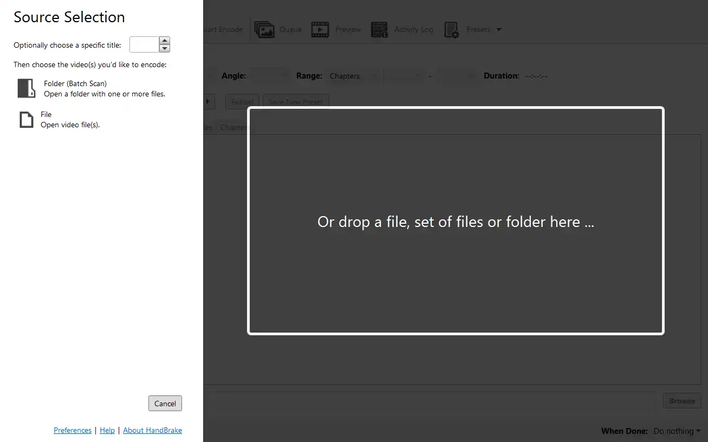

1. 打开文件/文件夹
2. 配置
3. 选择输出位置
4. 开始编码

## ioDraw
### Mind Map

优点：
1. 切换布局样式（节点排布以及连线样式）时不会保留节点的位置
当前布局：
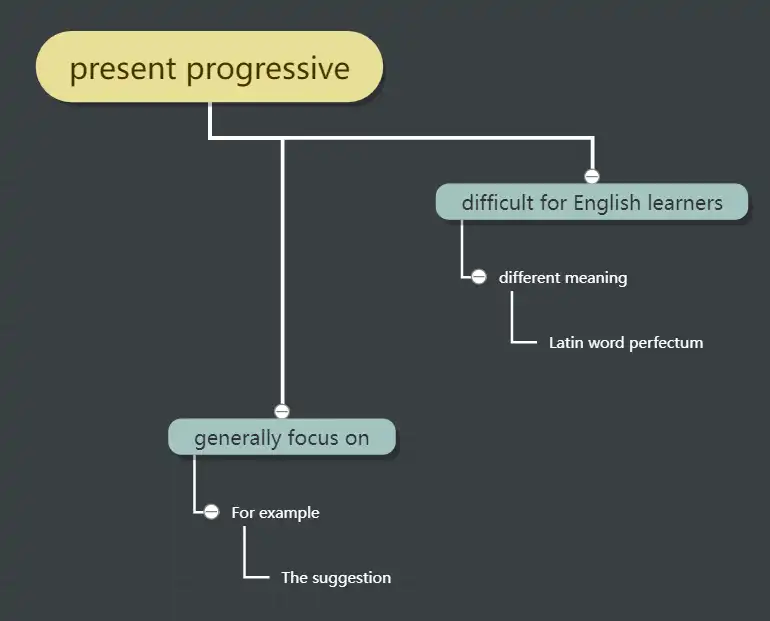
切换另一种布局：
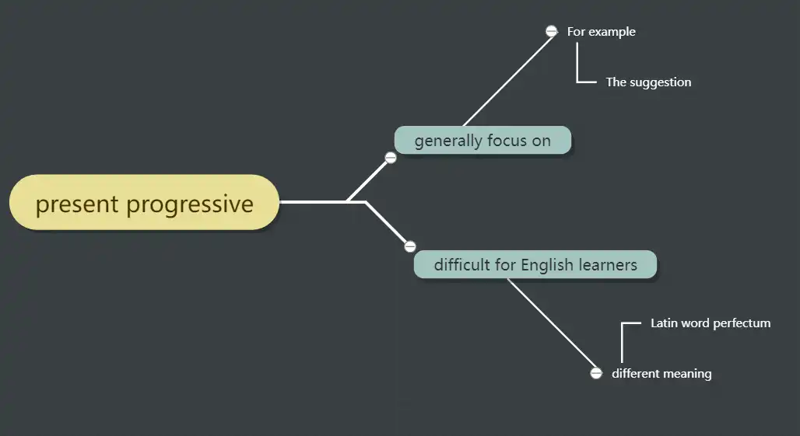
再切换回去节点位置相同

### 不足
因为没怎么用过思维导图工具，所以以下不足仅对个人使用情况而言。
使用起来的几个问题：
1. 没办法范围选中多个节点，只能单个选中？需求：需要一次性删除多个节点
可以选中多个节点，被选中的节点背景颜色会变为黄色
2. 不能通过鼠标中键移动画布，只能先选择左下角移动工具，然后再移动
按住鼠标右键拖动画布


## handy
Model: 
Parakeet TDT 0.6B v2 English only. The best model for English
size: 695 MB Q8_0 ?

### General
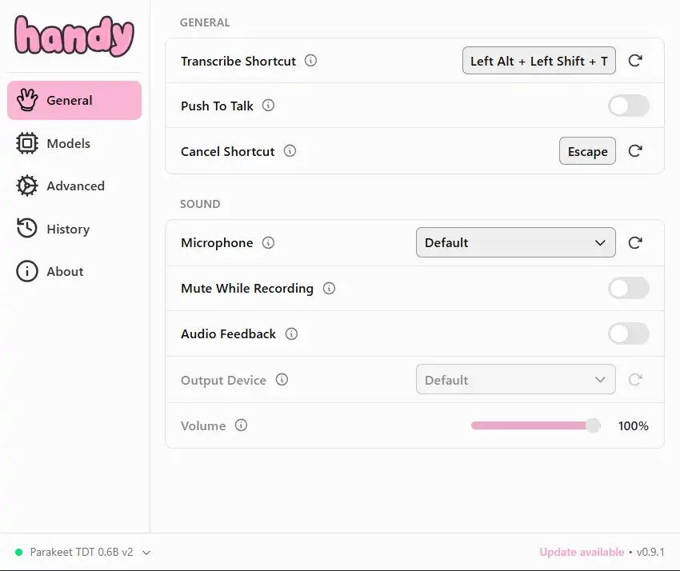
#### GENERAL
*Transcribe shortcut*
默认的和同英文切换 shortcut 冲突

*Push to Talk*
两种录制模式：
1. Hold to record, release to stop:release 后直接转换
2. 按键进入recording，再次按键结束recording。
通过cancel shortcut to cancel(取消/放弃) the current recording

背诵的时候记录整段的内容，按键不方便，自然是选择第二种

<span style="background:#fff88f">问：</span>但是我感觉按键不太方便，能不能有个按钮控制？
类似于360 那种一键加速的悬浮球，可以拖动设置球的位置。将其绑定到recording 按键上 
Quicker？
### Advanced
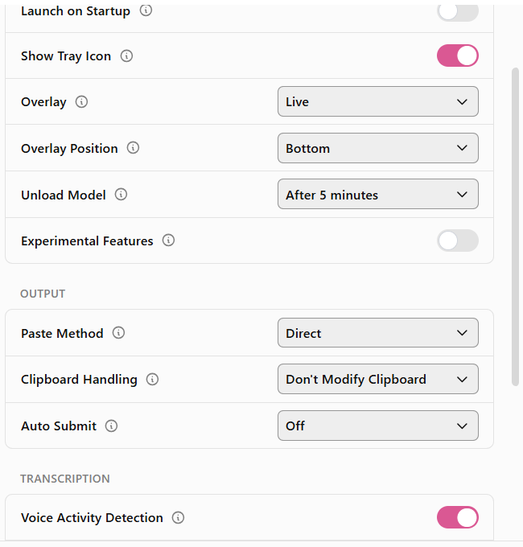
#### OUTPUT
*Paste Method*
how text is inserted
- Clipboard: paste and updates history/clipboard
- Direct: simulates typing via system input. 
这里的typing指的是输入文本，并不是对应按键。语音：control plus a，不会全选
所以有没有语音能够控制软件本身的行为的软件：）语音-》文本-》ai
- None: skips paste, only updates history/clipboard. 
- Clipboard(Ctrl+Shift+V): paste, updates history/clipboard and 模拟()内的按键

## IconViewer
默认安装
查看exe的properites
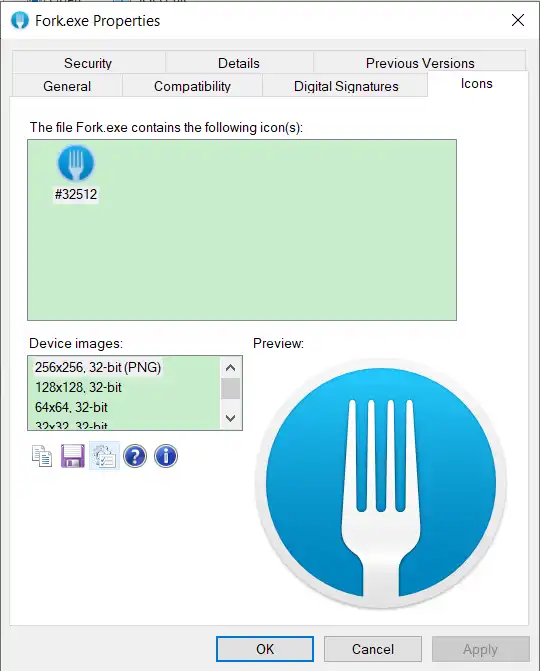
