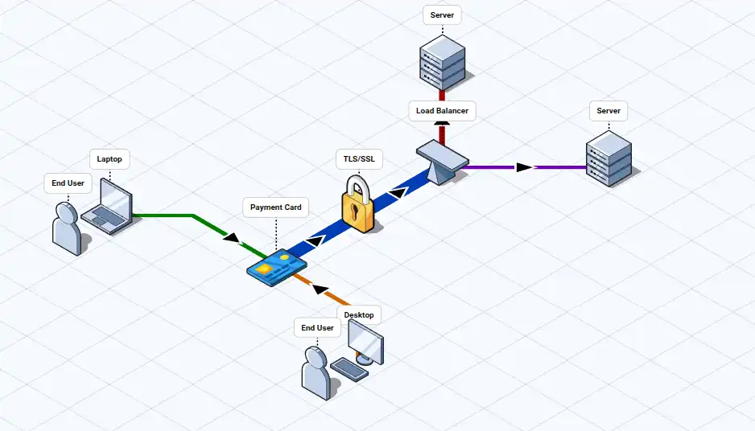

# 工具列表

| 类型  | 工具名称     | 简介                                                              | 特点                                                       | 官网/项目地址                                                                                                         | 使用平台 | 安装方式/下载      | 信息来源    | 图示                                               | 应用    |
| --- | -------- | --------------------------------------------------------------- | -------------------------------------------------------- | --------------------------------------------------------------------------------------------------------------- | ---- | ------------ | ------- | ------------------------------------------------ | ----- |
| 画图  | FossFLOW | for creating beautiful isometric diagrams.在平行等距网格线上绘制具有3D效果的流程图 | - it runs entirely in your browser with offline support. | [stan-smith/FossFLOW: Make beautiful isometric infrastructure diagrams](https://github.com/stan-smith/FossFLOW) | 跨平台  | Docker、Local | 微信-韩数同学 |  | 系统架构图 |
|     |          |                                                                 |                                                          |                                                                                                                 |      |              |         |                                                  |       |

