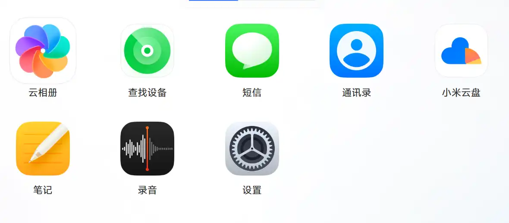
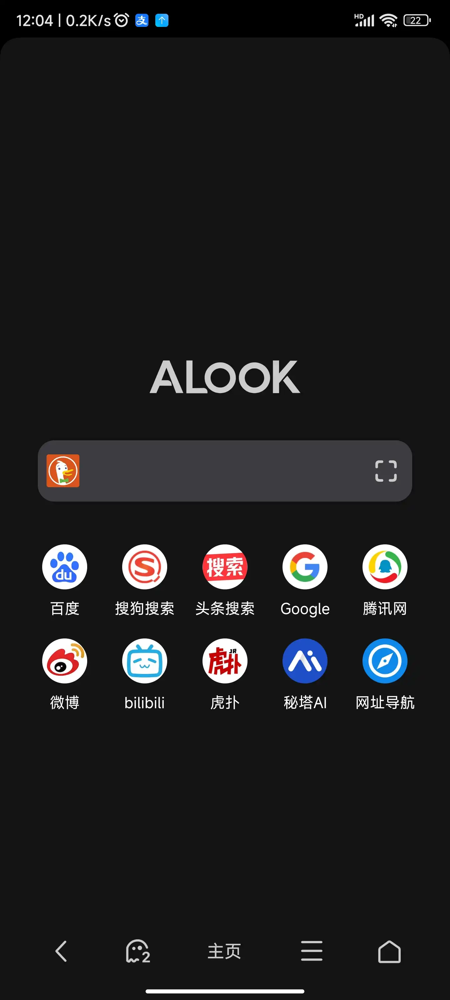
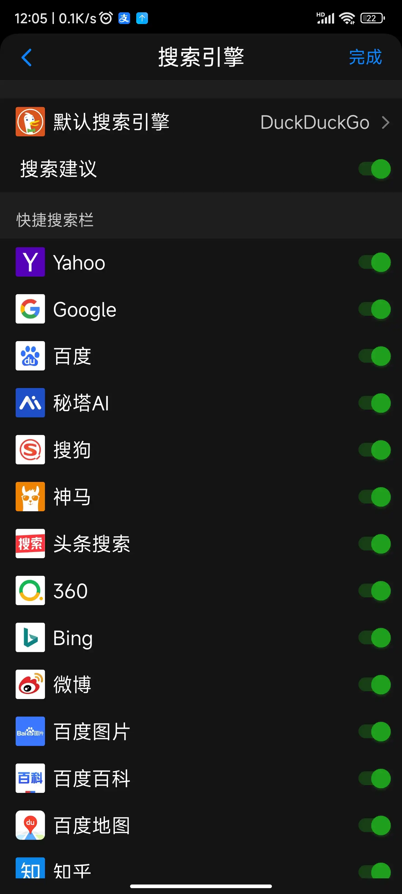
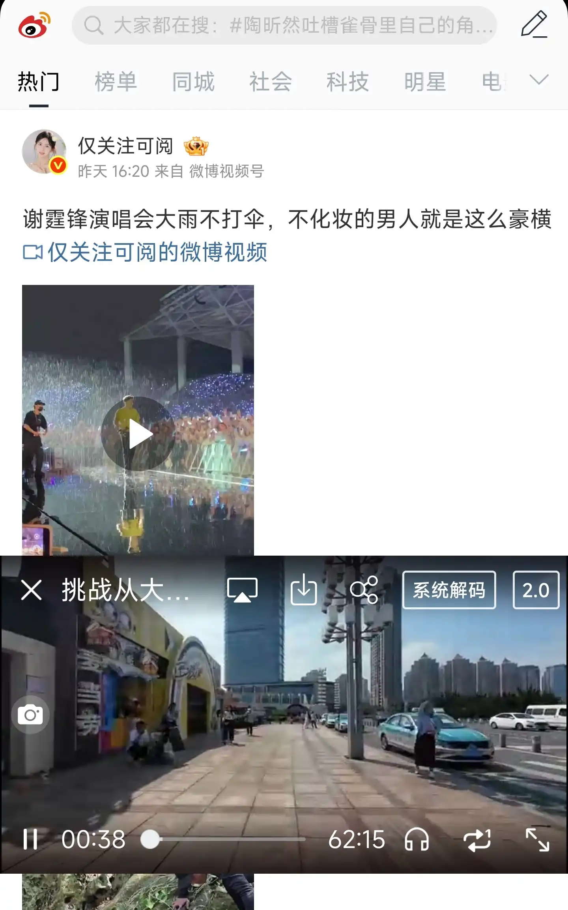
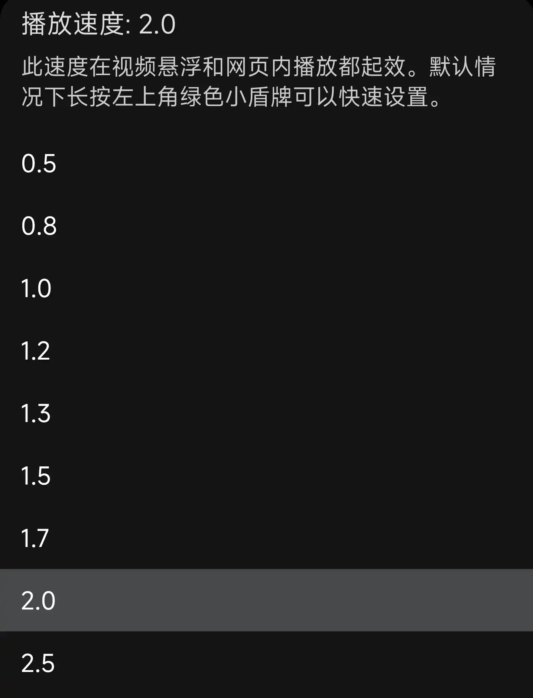
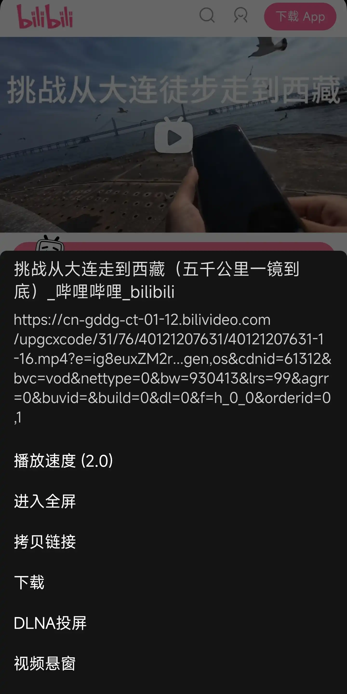
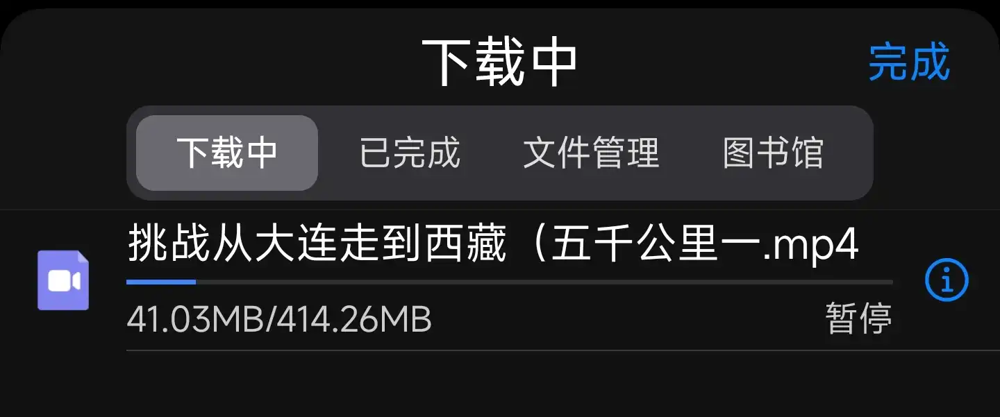

# 手机软件

## 当前安装
分类参考手机应用商店
### 影音视听
**播放器**
- Musicolet：Music 

**音乐**
- 小米自带音乐：能够登录QQ音乐
### 实用工具
**浏览器**
- ALOOK

**小工具**
- Suntimes：可以看日出、日落时间，以及世界地图日照情况
- Saber：白板工具，可以屏幕画图
- GitHub
- Clash
- 半岛小芯
- Linux Commands
- 路影：查看、下载行车记录仪视频
- 小米WiFi
- HiPER Calc Pro：计算器
- 自带计算器：可以查看单位换算、亲属称呼
- HP Smart：连接打印机
- RAR：解压缩
- MT 管理器：文件管理
- YAM Launcher：极简手机桌面，但是经常性闪退，所以暂时没用了
- [Breathe](#Breathe)：呼吸辅助工具
- Tomato：番茄工作法
- 小天才：小天才手表
- WiFi万能钥匙
- GPS工具箱
- 小米音箱
- 腾讯会议
- 小鹅通学员版：网课学习
- WIKIPEDIA
- LocalSend
- 中国电信：积分可换商品

**应用安装**
- F-Droid
- Play 商店
### 聊天社交
**通讯**
- QQ：Wegame启动器

**交友**
- 微信：工作需要

**社区**
- 小红书：攻略查询
- 少数派
### 图书阅读
**电子书**
- ReadEra
- Epistemeoss
### 时尚购物
- 淘宝
- 京东
- 拼多多
- 喵街：仙桃商城购物积分可兑换商城停车优惠券

**银行**
- 中国建设银行
- 长沙银行
- 中国工商银行
- 中国农业银行
### 摄像摄影
**相机**
- 水印相机
### 学习教育
**词典**
- 快快查汉语字典：可以看书写笔画、书法字书写
- MDict for Android：英语词典，词库 - 牛津高阶英汉双解词典

### 旅行交通
**用车**
- 交管12123
- 萝卜快跑
- 滴滴出行
- 哈啰
- 一汽丰田
- 平安好车主
- 易捷加油

**地图**
- 高德地图
- 百度地图

**票务**
- 铁路12306
### 效率办公
**笔记**
- 幕布
- obsidian

**云盘**
- 百度网盘
- 城通网盘
- 腾讯微云
- 阿里云盘
- 
**邮箱**
- 网易邮箱
- QQ邮箱

**AI**
- 元宝：可以在腾讯会议中记录会议笔记
- deepseek

**企业信息 & 招聘平台**
- 企查查
- 爱企查
- BOSS直聘：诈骗平台
- 前程无忧51Job
## 已卸载
- 古文岛
- 鄂汇办
- 掌上12333
- Neat Reader
- 北极星学社：电力相关知识论坛
- 同城旅行
- 嘀嗒出行
- 我的长沙：乘坐地铁
- 书加加：外语学习，买了几本电子书
- 智慧人社
- 楚税通：购车缴税
- ManualsLib：查看使用说明书
- 转转：二手电子产品
- 咸鱼：个人二手市场
- 安居客
- Edge：经常闪退
- Chrome
- 腾讯地图
- 奥维互动地图：可查看卫星图
- 智联招聘
- flomo浮墨笔记
## 微信
### 设置
#### 隐藏发现页内功能
我-》设置-》通用-》发现页管理

## 米家
### 小米云服务
免费5G大小同步空间

问题：浏览器开启并进行同步，手机端在 `立即同步` 界面更新了同步时间，但是网页端看不到浏览器项目。

不是非要我下个客户端才好使吧。。。
### 小米浏览器
无法导出书签
这都不是导出所有书签，根本就没有导出功能也太离谱

## ALOOK - 目前用过的最好的手机浏览器
难得一见的精品，相见恨晚 ipad上也有，但是感觉不怎么好用
特点：
1. 界面干净

无广告、新闻、推送
2. 默认可选多种搜索引擎

其它的一些浏览器要么是选不了-UC只能选神马、百度和？ 要么就是默认的只有两三个垃圾引擎，其它的要自己添加

3. 音/视频悬浮 + 最高16倍速 + 视频资源检测（下载）
悬浮播放：在播放视频时可以退出视频起始页面，浏览其它网页

可以拖动调整视频播放位置：保持宽度，调整上下位置 或 缩小到右下角

倍速调整：

下载：可以直接播放的视频资源，其它浏览器可能需要安装插件（即使安装了也可能检测不到）。。。

4. Adblock Plus
进手机端b站不会弹广告

## Breathe
### 等比例呼吸
1. 舒适的姿势坐下或躺下
2. 鼻子吸气 4s
3. 鼻子呼气 4s

### 盒式呼吸
1. 从一个舒服的坐姿开始。确保背部是直的
2. 通过鼻子吸气，感觉到空气进入到肺部（感受空气从鼻腔流动到肺部的过程），4second
3. 屏住呼吸 4s 忘我
4. 通过嘴巴呼气，4s 感受空气从肺部排出的过程
5. 保持 忘我
