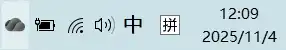
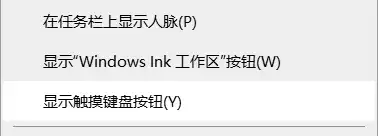
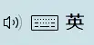
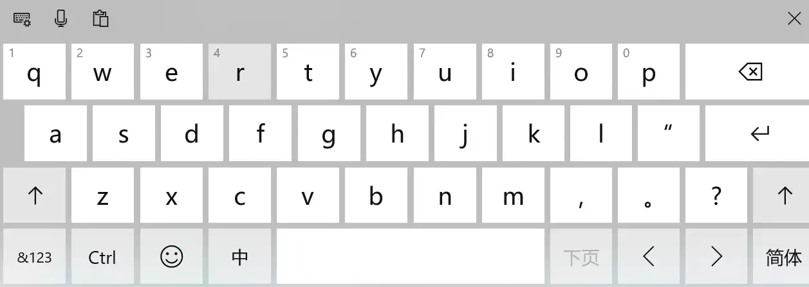

# 输入法

## windows 进行手写输入
1. 鼠标右键点击右下角工具按钮区域，弹出菜单
工具按钮：

弹出的菜单：

2. 勾选弹出菜单中的 “显示触摸键盘按钮”，工具按钮区域会新增一个键盘工具按钮：

3. 点击键盘按钮，弹出虚拟键盘

4. 点击虚拟键盘中左上角的键盘按钮，设置为手写输入

5. 通过鼠标输入

## 表情
方式：
1. 输入文本时最右侧的笑脸选项

2. 快捷键：`win` + `.`

