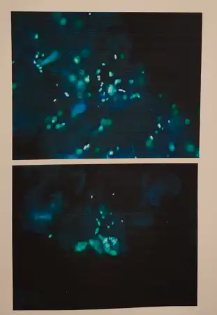
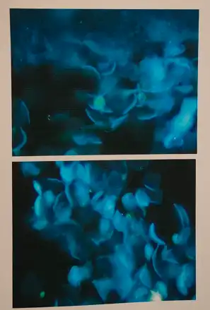

# 体检报告
毛囊炎：氯霉素酊

## 不自主摆动
病诉：偶发，向左摆头，无异常感
可能是因为之前两个显示器，切换查看养成的习惯。不过脖子有时候是有点不舒服。

地点：仙桃市第一人民医院
手机挂号直接到分诊台签到排队

**检测项目**

| 名称     | 费用  | 体检流程                                                                                         |
| ------ | --- | -------------------------------------------------------------------------------------------- |
| 颅脑CT平扫 | 168 | - 预约：门诊一楼大厅23，24，25窗口预约 - 排队体检：医技楼一楼，自助报道机签到 - 报告：可通过手机查看报告进度，大约1h。如打印影像，需缴费。小程序上可查看影像 |

检查结果出来后到分诊台挂号排队（如检查项目是次日做的，也是直接到分诊台挂号排队，无需重新缴费挂号）

## 擦烂红斑；股藓；皮炎
原因：骑行共享单车，一次性骑行了大概7公里，中途未作阶段性休息。
现象：腋下，腹股沟 伴瘙痒，可见片状红斑。
	真的爽死了，痒的睡不着
检查：真菌荧光染色检查
	腹股沟处：可见孢子

处理：
1. 丁酸氢化可的松乳膏
用法：1g 外用 2次/日
2. 炉甘石洗剂
用法：10ml 外用 3次/日
3. 萘替芬酮康唑乳膏
用法：1mg 外用 3次

:::tabs
@tab 可见孢子

孢子是图片中白色的点状物？
@tab 未见孢子

:::

检测表

| 项目         | 单价  |
| ---------- | --- |
| 真菌涂片检查     | 8   |
| 显微摄影术      | 35  |
| 皮肤直接免疫荧光检查 | 70  |
| 皮损取材检查     | 23  |

。。。因为有两个部位所以数量都是2，合计

## 身高、体重
身高：174.0
体重：72.2
体型：23.8
