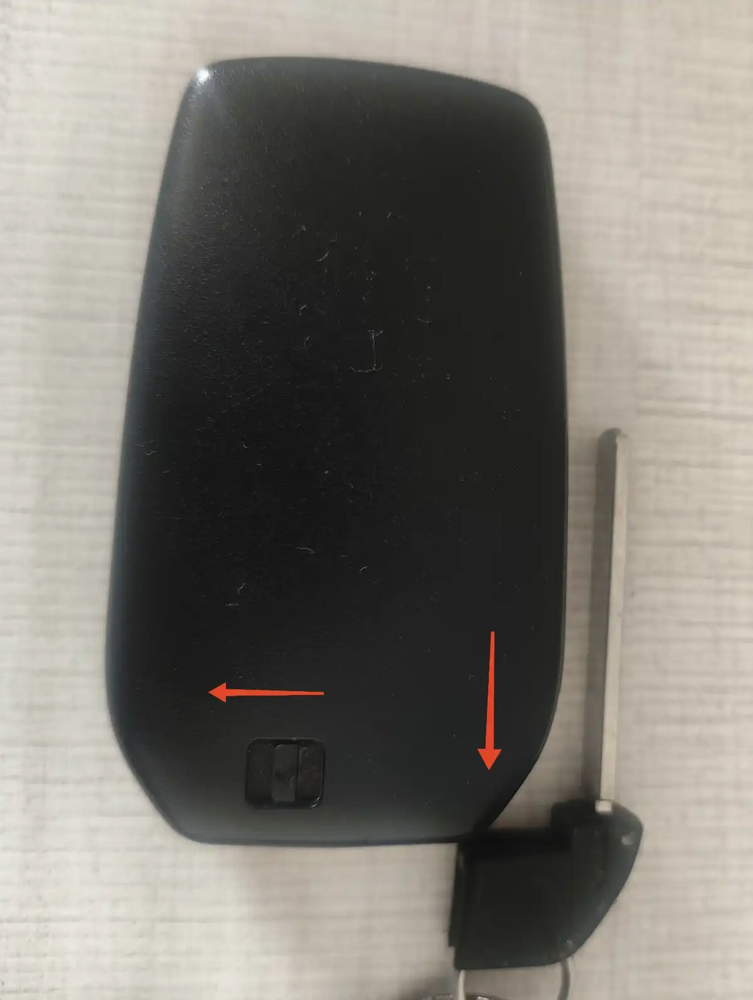
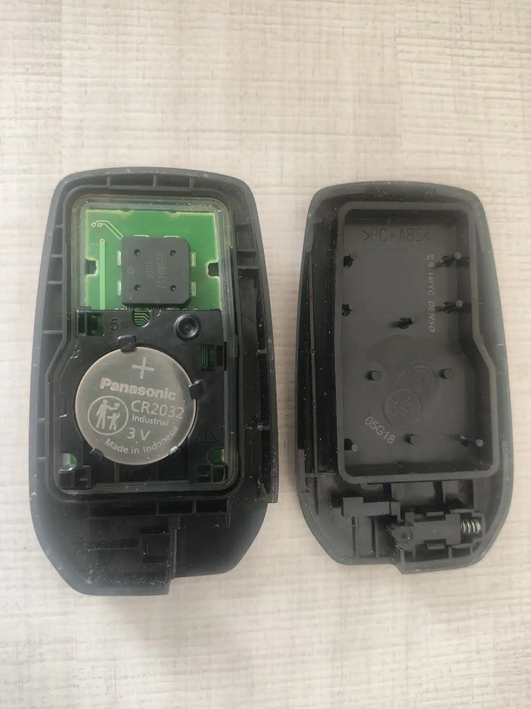

# 卡罗拉用户手册

## 钥匙

### 更换电池
*何时更换？*
车辆显示屏提示“钥匙电量不足，请更换”

 6-3 自行保养-》无限遥控/电子钥匙电池 P273
 **带智能进入和起动系统的车辆**
 1. 解除锁止并取处机械钥匙：锁止在钥匙面，向解锁方向按住的同时拔出钥匙

 2. 拆开钥匙盖

 3. 更换电池：确认电池型号（CR2032-3V），带有“+”极标识的面朝上（文具店购买，南孚，价格4元）
 4. 合盖、插入机械钥匙
 5. 检查钥匙功能是否正常

