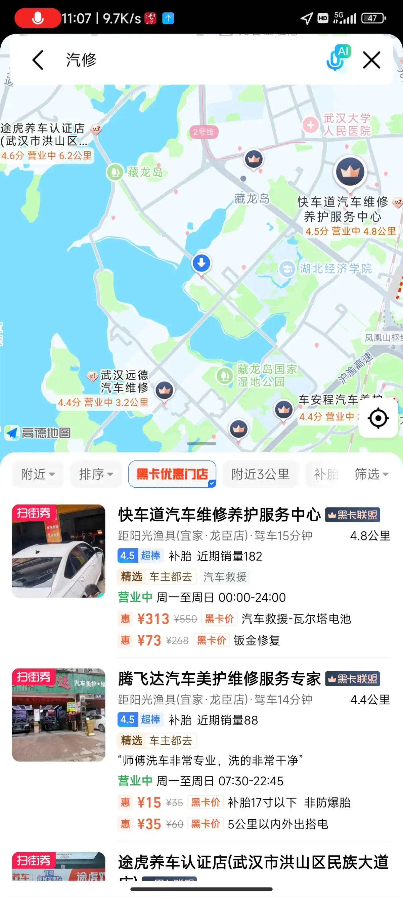
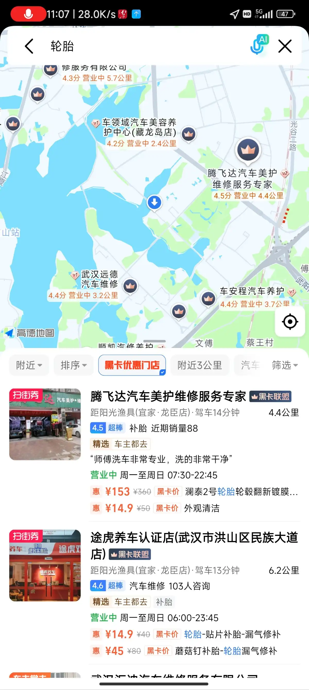
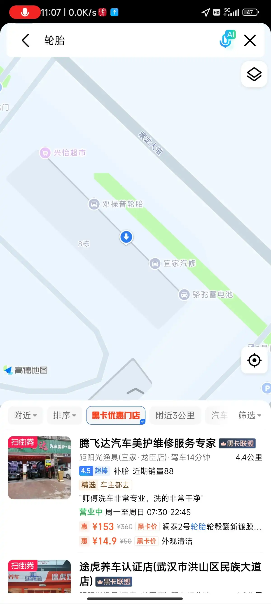

# 地图

## 高德地图
使用高德地图存在的问题：
**搜索不到相关地点**
更新到最新版本
:::tabs
@tab 搜索汽修

@tab 搜索轮胎

@tab 实际上的周边

:::
明明就在边上有汽修、轮胎，结果完全没有显示，导致我跑到高德显示的汽修点，结果不能修，又原路返回。
百度地图能搜索到！

**导航错误**
在上梁子湖高速前一两个路口高德提示最右侧车道左转，实际上，指示牌 和 地面指示标志提示都是正常的最左侧车道左转。

**路线规划垃圾**
十一高速免费，正常走高速，23：50 到达出口。路线规划时还是把免费的方案放在最前面。军山大桥修路，下桥到武监高速的入口堵车。虽然沪渝高速也堵车，但是是在同一条路上，起码能往前走的动。原计划直接在家附近的入口下高速，几分钟就能到家了，结果切换路线后没注意地图让我到市区下高速，回去还要半个小时。。。并且以为拿着票没到00：00也可以直接出去，开到了收费亭，刷了票。结果就是：叮，支付宝扣费xx。和工作人员商量能不能倒到后面等，然后一个老员工过来告知：可以停在没摄像头的位置等，但是进来收费亭就必须要出去，不然领导说他们不作为。。。还好高速费没多少，只能当买个教训，把钱付了。

## 百度地图
使用百度地图存在的问题：
**定位不准**
按照导航提示在路口等灯，导航提示“您已偏航，已重新为您规划路线”。导航显示的车速比车内仪表盘显示的车速高2km/h 左右。

**路线规划**
高德 和 百度 规划的路线似乎都没有既经济又快速的方案，比如从武汉藏龙岛出发到仙桃的线路，可以上三环，然后走东风大道高架，再走沪渝高速，总时长1h40min 左右，高速费用25。推荐的3条线路：

| 序号  | 路段             | 里程  | 时长      | 费用  |
| --- | -------------- | --- | ------- | --- |
| 1   | 四环-》武监高速-》武松。。 | 116 | 1h23min | 80  |
| 2   | 四环-》沪渝高速       | 127 | 1h27min | 82  |
| 3   | 三环-》沪聂线-》上聂线   | 117 | 2h28min | 0   |

推荐的线路不是太贵就是全程没有高速走起来太费时。

| 序号  | 路段               | 里程  | 时长      | 费用  |
| --- | ---------------- | --- | ------- | --- |
| 1   | 三环-》东风大道高架-》沪渝高速 | 113 | 1h34min | 25  |

而走一段高速，既省时间又不会花费太多的费用。

