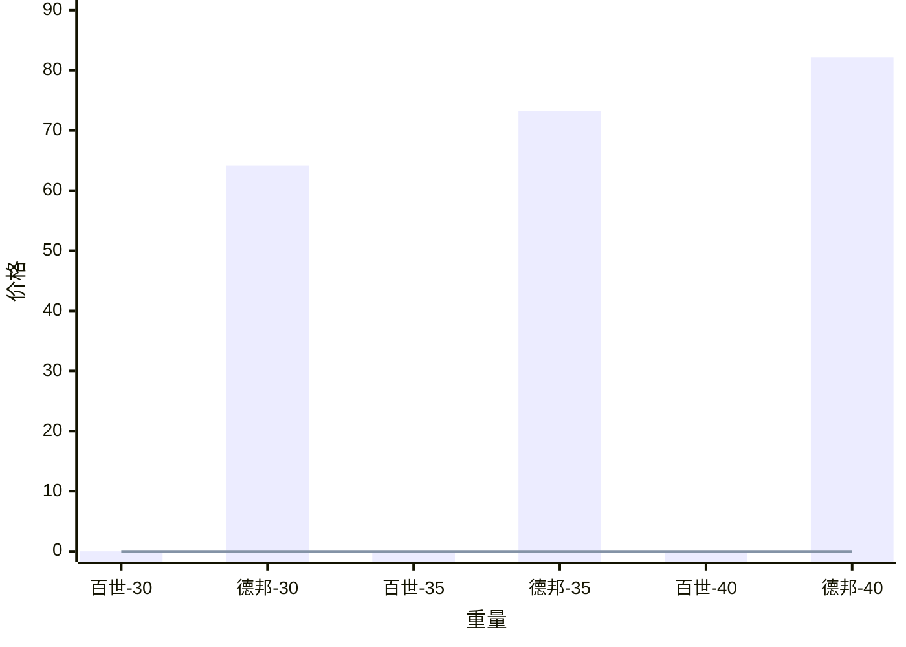
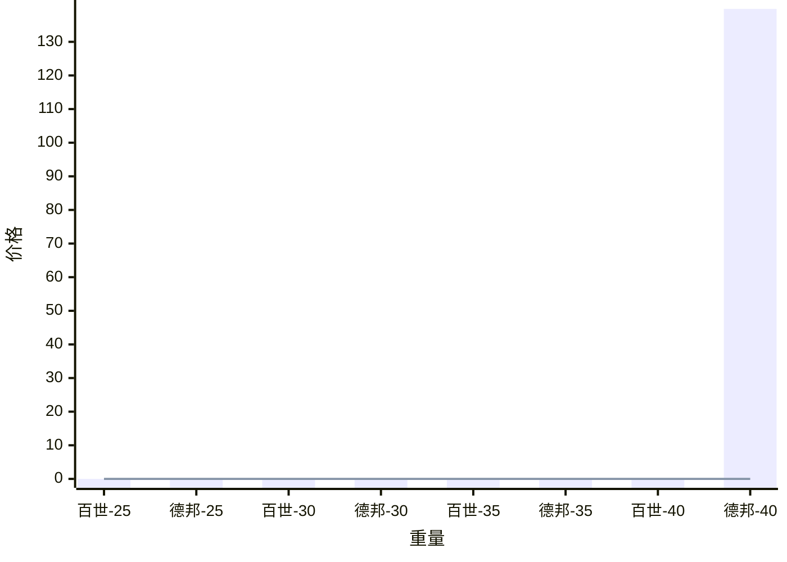
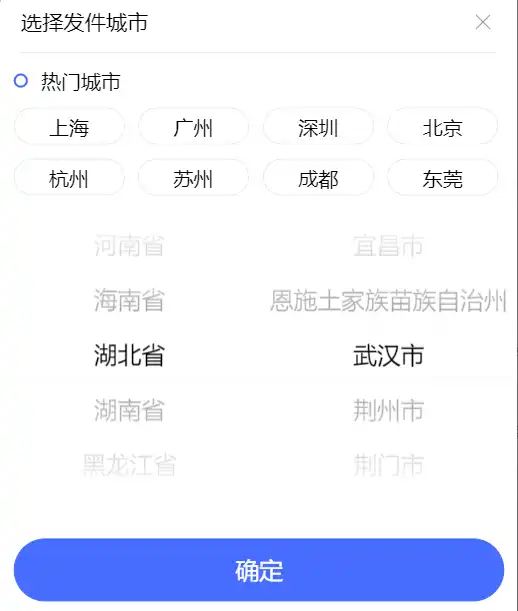

# 快递

## 计价规则
三种类型包裹：
1. 小包裹：按重量计费，体积无影响
2. 大又轻：按体积计费，重量无影响
3. 大又重：取实际重量 和 体积重量（体积按公式转换后的重量） 两者中的较大值

体积重量计算方式：
长 \* 宽 \* 高 /轻抛系数 ，长度单位均为cm

系数：

| 快递公司 | 系数   | 说明            |
| ---- | ---- | ------------- |
| 百世   | 5000 | 70kg以上        |
|      | 6000 | 70kg以下        |
| 德邦   | 6000 |               |
| 顺心   | 6000 |               |
| 跨越速运 | 5000 | 陆运件           |
|      | 6000 | 当日/次日/同城次日/隔日 |

百世的系数在德邦小程序 和 百世小程序 的费用说明中不一致
上表中为百世小程序中的说明，以下为德邦小程序中说明
“0-70kg 且 体积为 0.419 m³ 内 为8000；其余情况系数为6000”

重量计价：
1. 小于等于首重：按照首重（30kg）收费
2. 大于首重：首重 + 续重，首、续计价不一样，续重向上取整。
如果整体重量为 31.3kg，则重量价格为 30kg 的首重 + 2kg的续重

德邦的
## 大件行李
武汉江夏-》仙桃胡场
:::tabs
@tab 不带体积

@tab 带体积

:::

问：德邦是不邮寄30kg以下还是30kg以下都按照30kg算，为什么重量20、25预估费用都是64.2？
>德邦/跨越/百世/顺心 最低限重30kg，不足30kg按照最低30kg计费

35kg
保价服务费：3 保价金额：2000.0
优惠券减免：10.26
实际支付：58.14

实际价格：
货物数量：6，体积0.43m³ 重量：43.0kg
运费：126.38
优惠券减免：19.74
保价服务费：5.25
实际支付：111.89

0.43m³ = 430 000 000 cm³ -》/ 6000 ≈ 71.7
向上取整后体积重量为 72kg
1m = 10 dm = 100cm

吐槽下百世快递小程序选择地址真的难用：
- 常用里没有武汉
- 必须先选省然后选市（如果没先选省，市选项是空的），那为什么要搞省、市两个选项卡？我以为我可以直接在市里输市的名称，即使有重复的，那也可以把所有匹配项列出来，然后前面带上省，让用户选。
- 加载很慢，不认为是手机、网络问题（起码德邦加载是没这么卡顿的）
- 排序是按照字母顺序排列的，这个应该按照地区人数 或者 使用人数 或 热门程度 类似的排序吧？

德邦稍好一点吧，起码省-》市的选择是连续的且在一个界面

德邦也离谱，“查询价格明细” 里没找到仙桃市

下单时间：13.14 
预约2小时内取件 
实际取件时间：16.36

下单后百世快递工作人员电话询问：
1. 是否有带电池的物品：不能邮寄电池
2. 是否有化妆品、易碎品
3. 是否有其它易燃易爆物品

>[!waring]
>保丢不保损

丢了有的赔，坏了没得赔？

行李数量较多、重时提前和快递员沟通，对方好拖一个小车过来拉（虽然有上传照片，并且选择的是寄大件，但快递员似乎不会看这些），

### 关于是否会帮忙搬行李
由于住在2楼，且行李不重 + 快递员过来时让把行李搬到楼下 所以大概率是不会帮忙的，直接走楼梯搬下去了。
好像有增值服务里有搬行李的选项

### 其它
原本打算
1. 自己租一个车：比亚迪秦plus 低价78 + 优选服务包 + 50保险 = 198，再加上油费 150km，按0.3元/公里 = 45，+ 停车费，总的费用 接近300 还要自己开。又累又不划算
2. 货拉拉：一个微面完全够，还可以带上自己回去，网上价格178.57. 就是还有些东西在凉鞋哪里，添加途径点的话就是2百多。1是不确定价格，2是不方便修改行程
