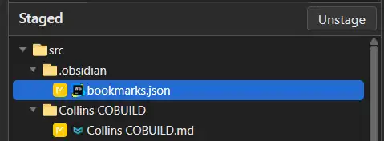

# 想法

## 音视频和字幕联动
如何利用Vidstack 音视频组件 配合 字幕文档，同步当前播放进度 和 当前显示的字幕。
点击字幕可以跳转到对应音视频位置，拖动音视频播放位置也能跳转显示播放内容对应的字幕。

## ob 中给段落 或者 指定的内容添加标签
在词汇文档中，每个单词使用二级标题，如果能对标题设置标签，如：food、study。。。那么就能将相同分类的单词汇总到一起便于总结、比较。

虽然可以给每个单词建立一篇文档，这样就可以使用base进行汇总，但是文档数量会极大增加同时不方便查看单词（需要使用链接 或 在文档列表中进行跳转）


## ob中对表格进行过滤
来源：
- 对咖啡配方的总结，想要查看是否有规律，比如添加的含量，含有同一原料的产品制作方式是否相同。
- 同一产品属于不同分类：如A为新品，属于品类1。品类1有一个表格，同时新品有一个表格。A下市后归类到下市产品分类，同时从新品中删除。不想要同时编辑多个表格。
- 这样做是否应该定义数据结构，然后让表格关联属性？或者也可以先定义表格，然后生成对应的数据结构。

能否把表格中的每一列当作一个属性，列中出现的所有值当作该属性的可选项。每一行当作一个对象。可以按照属性进行过滤。
一个对象的属性可以分布在多个表格中，可以对表格进行拆分以及组合。

如：
表格1

| 名称  | 年龄  |
| --- | --- |
| m   | 18  |

表格2

| 名称  | 电话  |
| --- | --- |
| m   |     |

通过指定的列（属性）区分对象。或者自动为每一行分配一个id，这样即使出现同名对象也有区分。
额这样做似乎类似于数据库了，目前ob数据库是查看文件的，文件头部定义了属性。但是表格没有类似功能。

貌似 Dataview 插件可以给区块编号，并且可以读取数据 以及 设置过滤条件，从而实现上面的要求。


## 地图增加换乘所需的时间
比如从马房山站 11号线-》 佛祖岭站 2好线，中间可以在虎泉换乘，也可以在武汉东换乘，但是不同站点换乘所需的时间不同，特别是火车、机场 或 多条线路的交叉站点，远一点的可能要走1公里了。还有其他方面的影响，比如人流量、座位等、车辆运行速度、途径的站点（11号线从虎泉到武汉东 中间有3个站，2号线有6个站，相差了3个站）等。

还有一个大小班次的问题（是叫这个名字吧）。虎泉换到2号线后，车次的终点站不是佛祖岭，而是武汉东。然后需要下车，等终点是佛祖岭的车次到达后再上车。


## 按修改时间查看git仓库中修改的文件

目前在staged 中只能看到有哪些文件修改了，选择具体文件后可以在右侧看到具体修改的内容。
问题是有没有一种界面-类似于时间轴，能够按照修改的时间排序文件？


## 红米手机相册导出
粗略地筛了一遍手机相册，还剩余900+张相片。
全选相片导出时提示超出最大数量限制
遇到几个问题：
- 最多只能全选每日的相片：在日视图下长按屏幕才会进入编辑状态，此时无法切换到月视图
- 如果选中的数量超过限制，回退时会退出编辑状态。。。又要重新选

选中/取消选中有两种方式：
- 按钮：每张图片右下角的圆形按钮 及 每日日期右侧的 全选/全不选
- 选择一张图片长按直到图片选中状态发生变化，然后拖动，这样拖动范围内的图片选中状态就会发生变化

使用RAR压缩
问题：勾选上 `压缩后删除源文件`后，相册中的图片没有被删除

发送后的问题：
- 相片的创建时间被修改为发送时的时间：时间信息可以是隐私，但是不能尊重我的选择吗？应该提供选项来确定是否保留创建时间

## 加密
需求：想要在public vault 中 创建一个包含图片的加密md文档，输入密码后可以查看内容
状态：
- public vault 上传的内容所有人都可以看到：必须对源文件进行加密
- 在ob 中使用 `Meld Encrypt`只能对文本内容进行加密，无法对链接的图片加密，并且对整个文档加密时文档的后缀不是md，不出现在文章列表中
- 使用 `Cryptomator` 只能在 加密的文件夹内存放md 以及 图片。unlock前既看不到md也看到不图片。

实际需求示例
- 生活
	- 相册.md
- private
	- 自拍.webp

md中的内容
```txt title="相册.md"
风和日丽的早上
[帅气的自拍照](/private.webp)
```

能够将 private 文件夹进行加密，并且unlock后是在原private路径，而不是虚拟盘