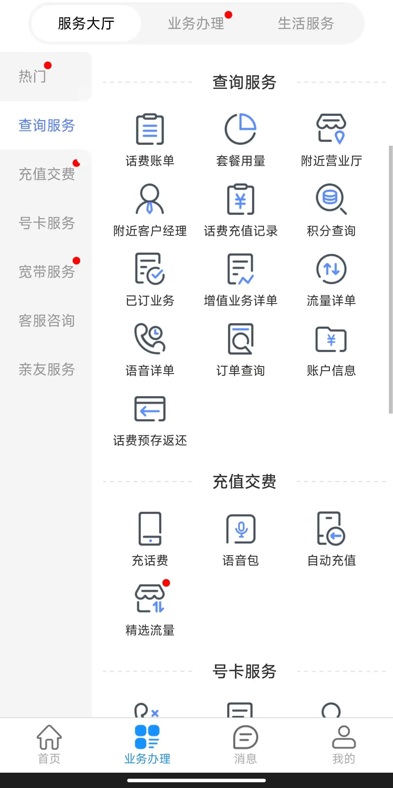
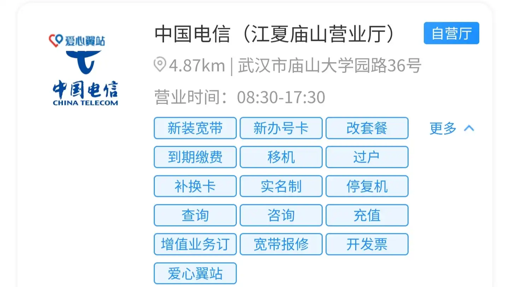
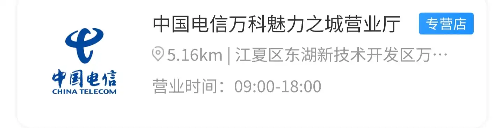

# 手机电信服务

## 通话限制
触发条件：?

>[!info]
>尊敬的用户，您好！您的手机号卡存在安全风险，为保护您的权益，根据国家法律法规有关规定和监管要求，暂停您的号码使用，请您携带有效证件（个人用户：本人有效身份证件；政企用户：号码登记的有效证件及经办人有效证件）及实物号卡到电信自有营业厅进行二次实名核验，并办理相关申诉手续，我公司将协助您向上级部门申请复核，通过后即可复通。谢谢您的配合！

**查询自有营业厅**
微信-》中国电信App *服务号* -》服务大厅 -》更多服务-》业务办理-》查询服务-》附近营业厅

找到距离最近的 **自营厅**

最好提前电话确认是否能够办理（上面的庙山不提供服务，需要到金融港的自营厅）
