# 消费统计
计划：先做记录，然后参考ipad 上的 `Tr.en.d` 软件，学习下需要记录哪些数据，以及如何做统计并改善收支。
数据同步到 `物品.md` 中

## 记录

### 2026-03-16
早：5
午：12
晚：9.73
合计：26.73

### 2026-03-17
早：8 汤包，不顶饱，味一般；3 黑米粥
午：12
晚：13 汉堡周二特惠
合计：36

### 2026-03-18
早：7馄饨
午：12
晚：12 小炒，一般，没有汤；3.5龟苓膏
打车 11（优惠6）
地铁 7
关东煮 8.5（3串）
平价水饺 9.9（16个）
汽水 7.5（2瓶）
美团民宿 49.84
合计：124.74

### 2026-03-19
早：豆浆 3
晚：12
地铁 2 中山公园-》大智路
地铁 2 大智路-》中山公园
哈啰共享单车 1.5 
地铁 5 马房山-》佛祖岭
公交 2
辣条 1.8
网费 12.8
合计：42.1

### 2026-03-20
晚：2 河南烧饼；8 胡辣汤；1 牛肉煎包；3 韭菜盒子
4.8 零食
合计：18.8
### 2026-03-21
中：4.5 热干面
晚：12 木桶饭 3.5 银耳汤
合计：20
### 2026-03-22
中：3 黑米粥
晚：12 木桶饭
合计：15
### 2026-03-23
早：6 肉末捞面
中：12  
晚：12 盖浇面，没有汁水，味道太淡了
合计：30
### 2026-03-24
早：4.5 热干面；3 八宝粥
中：12
晚：13 两个汉堡
合计：32.5
### 2026-03-25
早：3 饼；3 银耳汤
中：11
晚：5.5 热干面 。。。不应该是4.5吗；3 绿豆汤
零食：13.14
合计：38.64
### 2026-03-26
晚：17.82 哈尔滨麻辣烫，现在的麻辣烫真的是刺客，一点都吃不起。最重要的是吃不饱，差不多18吃了个寂寞。
13.40 卤味，一根肠 （7.x）+ 翅尖。

网费：30
电费：25
合计：86.22

收入：28 新入住的补的电费和煤气费用

### 2026-03-27
晚：胡辣汤 8 + 牛肉煎包 2.5 （3个）（套餐优惠0.5）
剪头 10

## Accounts
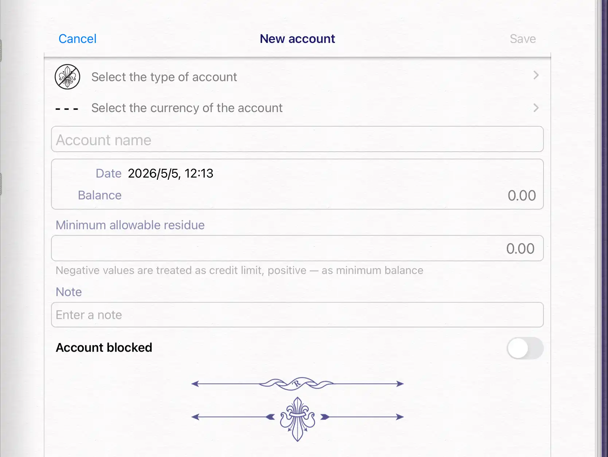

Account name：账户名称
Date：账户创建日期（或开始记录日期）
Balance：账户可用余额
Minimum allowable residue：账户的最小余额限制。如长沙地铁账户余额不能低于x？否则无法使用（进站）
>Negative values are treated as credit limit, positive - as minimum balance

	负数表示可欠费

Account blocked：是否被锁定（是否可用）

### Account types

| 类型                       | 描述                                                           | 说明                                              | 我的  |
| ------------------------ | ------------------------------------------------------------ | ----------------------------------------------- | --- |
| Cash                     | Funds stored in the form of cash                             | 现金                                              |     |
| Bank card                | Account bound to a plastic card                              | 有实体卡的银行账户                                       |     |
| Bank account             | Deposit or transactional account                             | 没有实体卡的银行账户                                      |     |
| Credit account           | Account for keeping record of funds under a credit agreement | 信用卡                                             |     |
| Internet service account | Account opened in the online services                        | 网上开通的账户                                         |     |
| General account          | Other accounts                                               |                                                 |     |
| Netting account          | The account to keep record of settlements with contractors   | 我的理解： 1. 交易的双方互有收支； 2. 交易的内容是服务/物品等 非直接金钱 |     |

### Currency

| 简写  | 全称                   | 货币符号 |
| --- | -------------------- | ---- |
| CNY | Chinese yuan         | 元    |
| USD | United States dollar | $    |
| EUR | Euro                 | €    |

## Records
### Expense
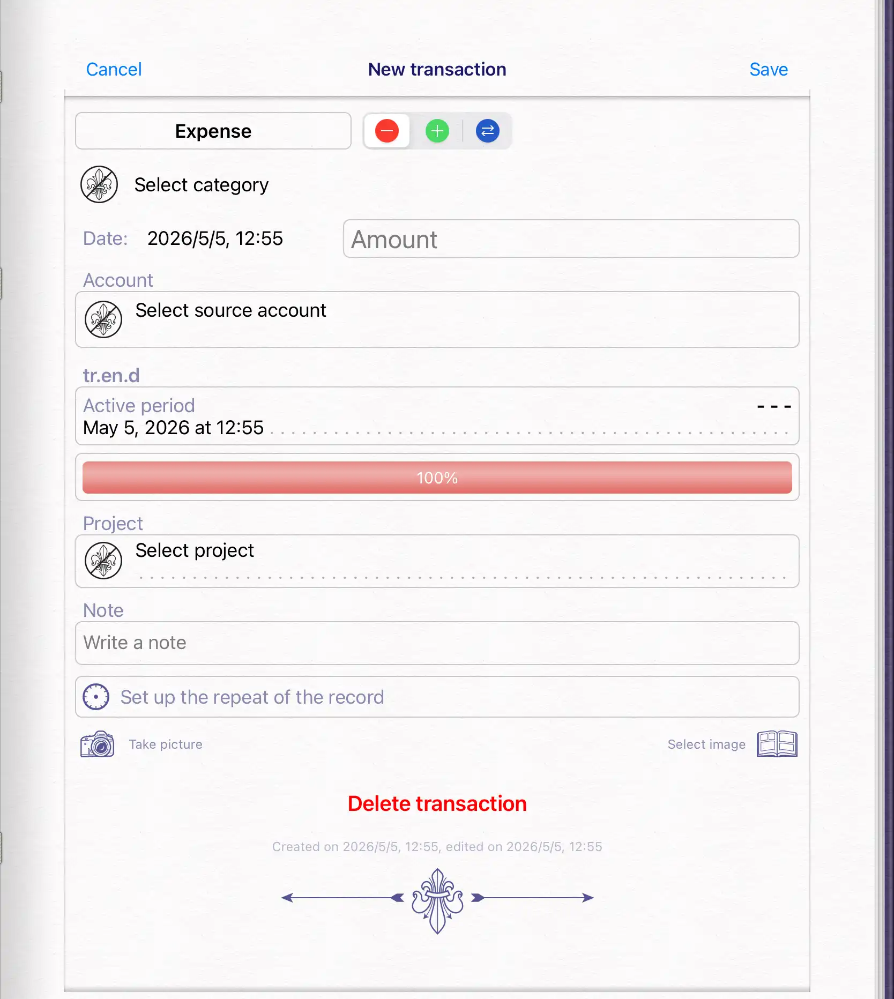

Category：
Amount：金额
Date：时间
Account：来源
Active period：影响时间
	Start、End
Note：
Set up the repeat of the record:
- Single: Auto repeat of the record is disabled
- Periodic: The record will be repeated automatically after a specified period
	- Period of repeating: hours, days, weeks, months, quarters, years
- Ongoing: The record will be repeated in accordance with the active period, so that the subsequent record immediately follows the pervious one.

#### Category
Car	
- Fuel
- Parking
- Car wash
- Service
- Tolls
- Road tax
- Car repair
- Car insurance
- Credit for a car
- Car tuning

Eating out	
- Restaurant
- Fast food

Public transportation	

Personal expenses	
- Education
- Medicine
- Fitness
- Sports
- Cost of image
- Smoking
- Alcohol

Family	
- Children
- Parents
- Pets
- Holidays
- Gifts

Shopping	
- Applications
- Clothing
- Cosmetics
- Computers & equipment
- Electronics
- Jewelry
- Shoes
- Accessories
- Lingerie
- Hosiery
- Various purchases

Entertainment	
- Books
- Video games
- Movies
- Cinema
- Shows
- Sporting events
- Gambling

Friends and colleagues	
- Gifts
- Events

Communication	
- Cell phone
- Mobile internet

House	
- Maintenance
- Construction
- Repair
- Mortgage
- Rent
- Property insurance
- Property tax

Utility costs	
- TV
- Telephone
- Utility service
- Electricity
- Home internet
- Heat
- Garbage disposal
- Water supply
- Security

Household	
- Food
- Cleaning
- Wash
- Household goods
- Household repairs
- Repair of clothing
- Tools
- Furniture

Transportation	
- Postal service
- Moving
- Courier delivery

Traveling	
- Travel insurance
- Flights
- Ground transfers
- Accommodation
- Eating
- Souvenirs
- Excursions
- Museums
- Car rent
- Railway transport
- Ship transport
- Customs duties

Business	
- Costs of an enterprise
- Means of production
- Consumables
- Business taxes
- Business lending
- Audit

Bank	
- Bank commission
- Loan payments

Other expenses	
- Loss of funds
- Force majeure
- Fines

Technical accounting	
- Account opening
- Account balance correction

### Gain
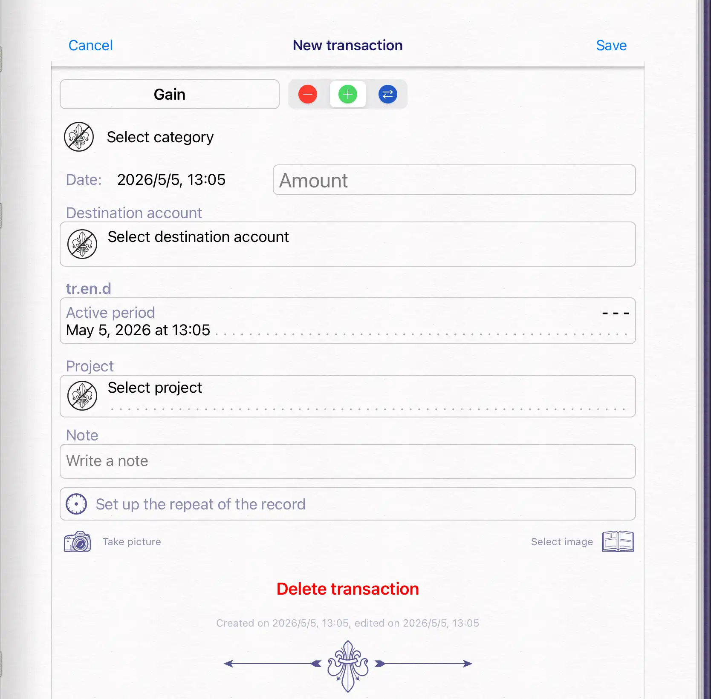

Category
Amount
Destination account
Active period
Note

#### Category
- Salary：薪资
- Bonus：奖金（因为行为或表现获得的奖励）
- Income from business：
- Interest income：业余爱好（非专职工作）带来的收入？
- Royalties：版税
- Gifts：赠品
- Accrued discount：利息？
- Resale：转卖。作为中间商赚取的差价？
- Revenue from the lease：出租
- Insurance indemnities：保险赔偿
- Return of purchase：返利
- Findings：捡到的
- Prize：奖金（在原有基础上额外获得的）
- Tax refund：退税
- Technical accounting
	- Account opening
	- Account balance correction

### Transfer
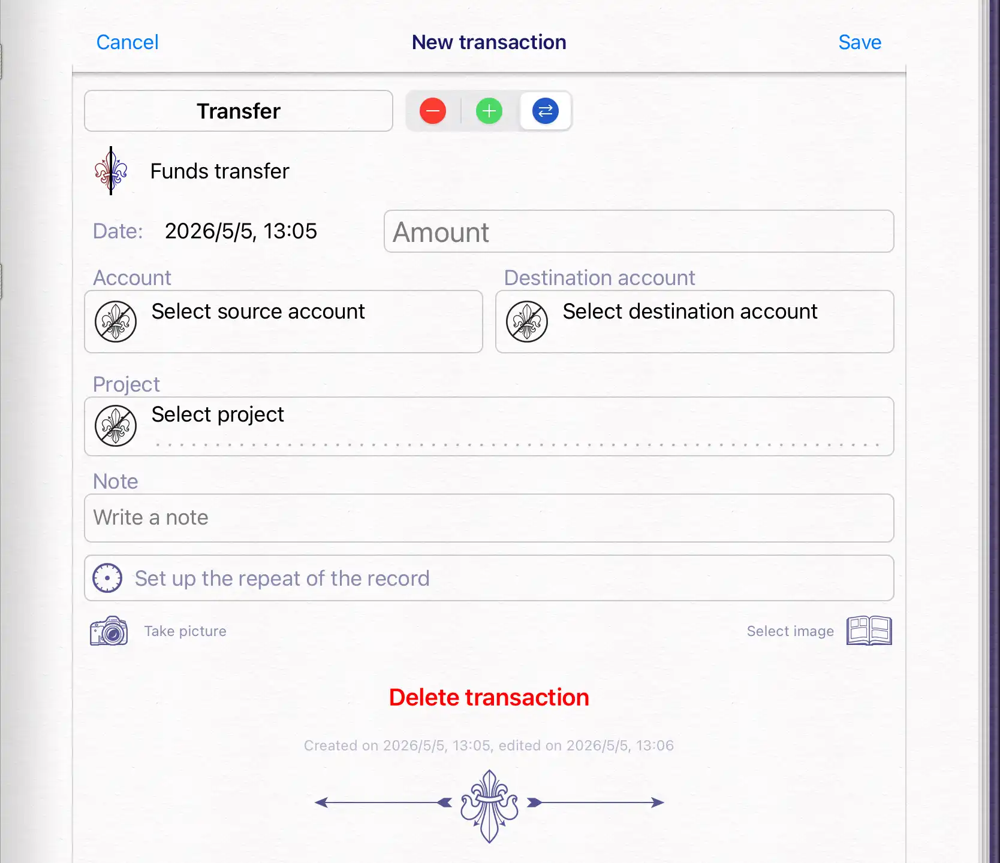

Amount
Account: source account 支出账户
Destination account: 到账账户

## Summary
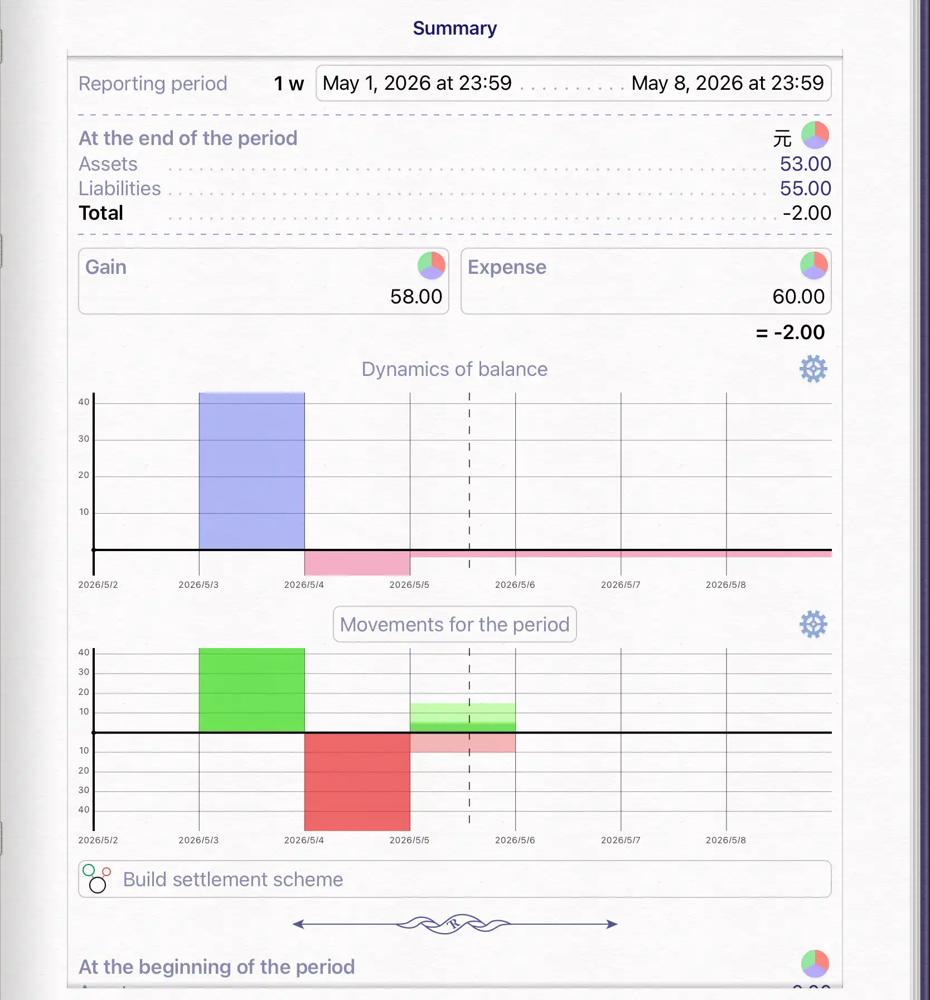

范围内的records

| 时间   | 类型             | 金额  | Spending on pleasure | Urgent needs |
| ---- | -------------- | --- | -------------------- | ------------ |
| 0503 | Gifts          | +43 |                      |              |
| 0504 | Rent           | 50  |                      | 50           |
| 0505 | Restaurant     | 10  | 7                    | 3            |
| 0505 | Salary         | +15 |                      |              |
| 0505 | Funds transfer | =10 |                      |              |

Reporting period: 时间范围
At the end of the period
Assets: ? 
Liabilities: ?
没搞懂这里的含义
Total
Gain:43 + 15 = 58
Expense:  50 + 10 = 60
= -2 balance

### Dynamics of balance
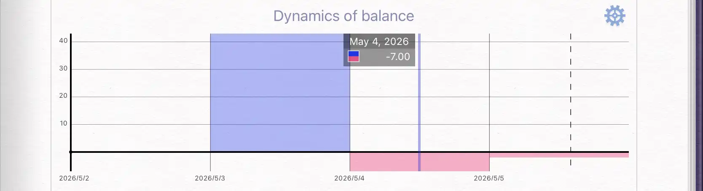
- 虚线：当前日期
- 蓝色：

### Total
**Running total**
实时统计：计算每日gains 和 expenses 以及它们的差值
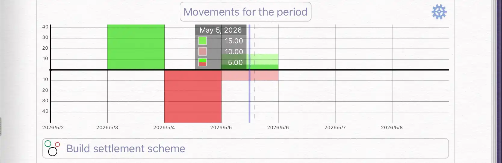
- 绿色-Gains
- 深红-Expenses
- 浅红-total
纵轴上方表示gains，下方表示expenses
使用更深的颜色表示最终total
gains > expenses: gains 使用浅绿色，expenses 使用浅红色， total 使用深绿。如上图所示
expenses > gains: gains-浅绿，expense-浅红，total-深红
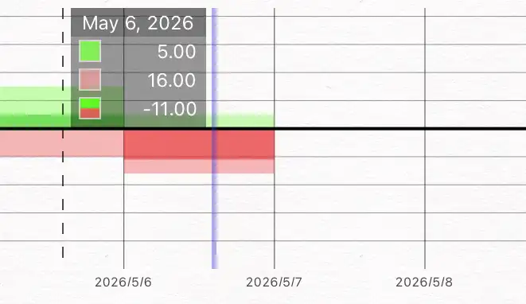

**Movements for the period**
查看period内 gains、expenses 以及 total的变化情况
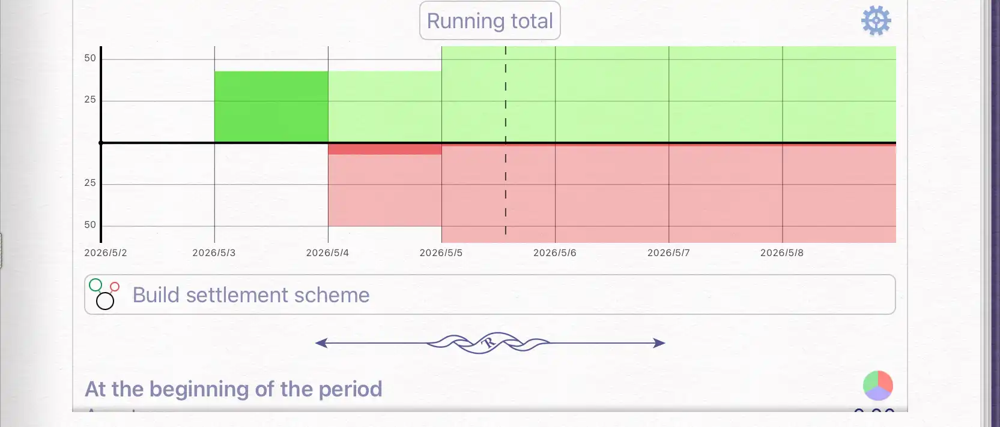

| 时间   | gains     | expenses      | 累计gains | 累计expenses | total |
| ---- | --------- | ------------- | ------- | ---------- | ----- |
| 0503 | 43-Gifts  | 0             | 43      | 0          | 43    |
| 0504 | 0         | 50-Rent       | 43      | 50         | -7    |
| 0505 | 15-Salary | 10-Restaurant | 58      | 60         | -2    |

^test-expend-table

**功能**
左上角设置按钮可以调整gains、expenses 显示区域
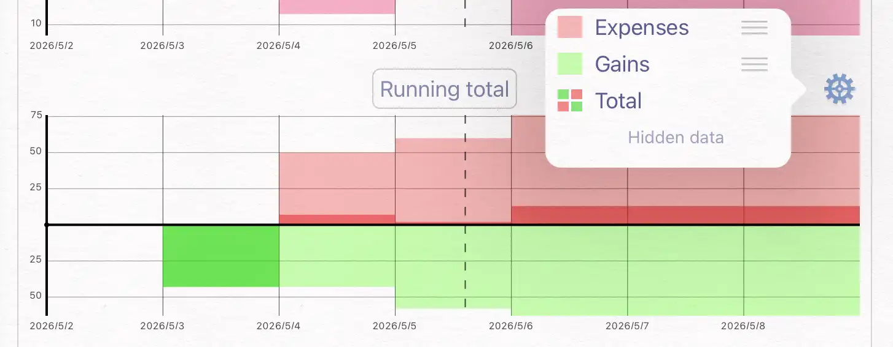 ^7c4778

## tr.en.d
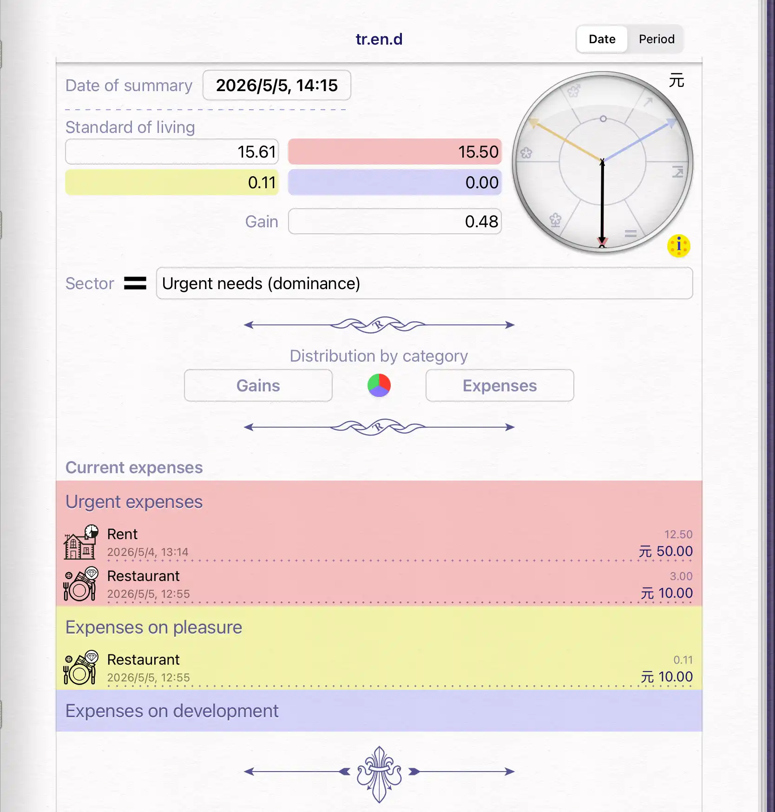

Standard of living
红色-Urgent expenses
黄色-Expenses on pleasure
蓝色-Expenses on development

[[#^test-expend-table]]

