# 消费统计
计划：先做记录，然后参考ipad 上的 `Tr.en.d` 软件，学习下需要记录哪些数据，以及如何做统计并改善收支。
数据同步到 `物品.md` 中

## 记录

**重要消费**
🔐β gh3DGPb5FifQ1dkm5BSP+VbNVrWjJdfkHPfmtYBcbUl0sOQaXCOlx8tD8fjYuIesbnXutf680UlUw0dY9pbVHtFNILttMf+JNzcUntAcbpjx+5GfcvctXtkaM9uzNl8edxypLF0x4adQB2FNL5ktA3Wwc4+W2mHfqMMfKENz/1FdiItRdEF9TWLnVkulR0DRbOFIrnZZW6PvM5s7zvc= 🔐

### 2026-03-16
早：5
午：12
晚：9.73
合计：26.73

### 2026-03-17
早：8 汤包，不顶饱，味一般；3 黑米粥
午：12
晚：13 汉堡周二特惠
合计：36

### 2026-03-18
早：7馄饨
午：12
晚：12 小炒，一般，没有汤；3.5龟苓膏
打车 11（优惠6）
地铁 7
关东煮 8.5（3串）
平价水饺 9.9（16个）
汽水 7.5（2瓶）
美团民宿 49.84
合计：124.74

### 2026-03-19
早：豆浆 3
晚：12
地铁 2 中山公园-》大智路
地铁 2 大智路-》中山公园
哈啰共享单车 1.5 
地铁 5 马房山-》佛祖岭
公交 2
辣条 1.8
网费 12.8
合计：42.1

### 2026-03-20
晚：2 河南烧饼；8 胡辣汤；1 牛肉煎包；3 韭菜盒子
4.8 零食
合计：18.8
### 2026-03-21
中：4.5 热干面
晚：12 木桶饭 3.5 银耳汤
合计：20
### 2026-03-22
中：3 黑米粥
晚：12 木桶饭
合计：15
### 2026-03-23
早：6 肉末捞面
中：12  
晚：12 盖浇面，没有汁水，味道太淡了
合计：30
### 2026-03-24
早：4.5 热干面；3 八宝粥
中：12
晚：13 两个汉堡
合计：32.5
### 2026-03-25
早：3 饼；3 银耳汤
中：11
晚：5.5 热干面 。。。不应该是4.5吗；3 绿豆汤
零食：13.14
合计：38.64
### 2026-03-26
晚：17.82 哈尔滨麻辣烫，现在的麻辣烫真的是刺客，一点都吃不起。最重要的是吃不饱，差不多18吃了个寂寞。
13.40 卤味，一根肠 （7.x）+ 翅尖。

网费：30
电费：25
合计：86.22

收入：28 新入住的补的电费和煤气费用

### 2026-03-27
晚：胡辣汤 8 + 牛肉煎包 2.5 （3个）（套餐优惠0.5）
剪头 10

## Accounts
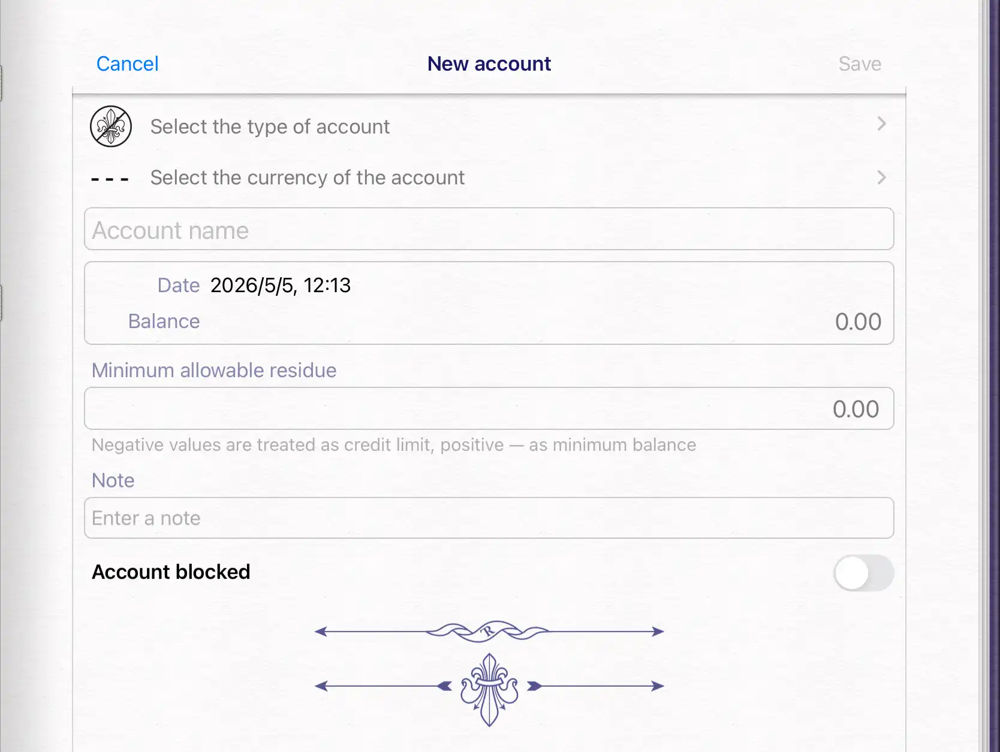

Account name：账户名称
Date：账户创建日期（或开始记录日期）
Balance：账户可用余额
Minimum allowable residue：账户的最小余额限制。如长沙地铁账户余额不能低于x？否则无法使用（进站）
>Negative values are treated as credit limit, positive - as minimum balance

	负数表示可欠费

Account blocked：是否被锁定（是否可用）

### Account types

| 类型                       | 描述                                                           | 说明                                              | 额外属性        |
| ------------------------ | ------------------------------------------------------------ | ----------------------------------------------- | ----------- |
| Cash                     | Funds stored in the form of cash                             | 现金                                              |             |
| Bank card                | Account bound to a plastic card                              | 有实体卡的银行账户                                       | Card number |
| Bank account             | Deposit or transactional account                             |                                                 | -           |
| Credit account           | Account for keeping record of funds under a credit agreement | 信用账户                                            | -           |
| Internet service account | Account opened in the online services                        | 网上开通的账户                                         | Website     |
| General account          | Other accounts                                               |                                                 |             |
| Netting account          | The account to keep record of settlements with contractors   | 我的理解： 1. 交易的双方互有收支； 2. 交易的内容是服务/物品等 非直接金钱 |             |

#### 我的accounts
**Cash**
- 钱包
**Bank card**
1. 中国建设银行
2. 长沙银行
3. 中国工商银行
4. 中国农业银行

**Credit account**
- 花呗
- 备用金
- 建设银行信用卡

**Internet service account**
- 微信零钱
- 支付宝

#### accounts分类的想法
1. account内资金的来源
- 是否可以在建立account的时候关联资金的来源以及去向？
比如一个银行卡只用来接收工资，禁止其它资金流入

### Currency

| 简写  | 全称                   | 货币符号 |
| --- | -------------------- | ---- |
| CNY | Chinese yuan         | 元    |
| USD | United States dollar | $    |
| EUR | Euro                 | €    |

## Records
### Expense
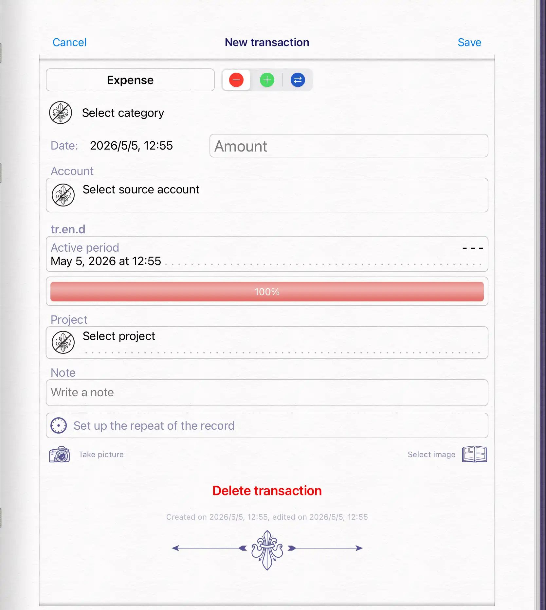

Category：
Amount：金额
Date：时间
Account：来源
Active period：影响时间
	Start、End
Note：
Set up the repeat of the record:
- Single: Auto repeat of the record is disabled
- Periodic: The record will be repeated automatically after a specified period
	- Period of repeating: hours, days, weeks, months, quarters, years
- Ongoing: The record will be repeated in accordance with the active period, so that the subsequent record immediately follows the pervious one.

#### Category
Car	
- Fuel
- Parking
- Car wash
- Service
- Tolls
- Road tax
- Car repair
- Car insurance
- Credit for a car
- Car tuning

Eating out	
- Restaurant
- Fast food

Public transportation	

Personal expenses	
- Education
- Medicine
- Fitness
- Sports
- Cost of image
- Smoking
- Alcohol

Family	
- Children
- Parents
- Pets
- Holidays
- Gifts

Shopping	
- Applications
- Clothing
- Cosmetics
- Computers & equipment
- Electronics
- Jewelry
- Shoes
- Accessories
- Lingerie
- Hosiery
- Various purchases

Entertainment	
- Books
- Video games
- Movies
- Cinema
- Shows
- Sporting events
- Gambling

Friends and colleagues	
- Gifts
- Events

Communication	
- Cell phone
- Mobile internet

House	
- Maintenance
- Construction
- Repair
- Mortgage
- Rent
- Property insurance
- Property tax

Utility costs	
- TV
- Telephone
- Utility service
- Electricity
- Home internet
- Heat
- Garbage disposal
- Water supply
- Security

Household	
- Food
- Cleaning
- Wash
- Household goods
- Household repairs
- Repair of clothing
- Tools
- Furniture

Transportation	
- Postal service
- Moving
- Courier delivery

Traveling	
- Travel insurance
- Flights
- Ground transfers
- Accommodation
- Eating
- Souvenirs
- Excursions
- Museums
- Car rent
- Railway transport
- Ship transport
- Customs duties

Business	
- Costs of an enterprise
- Means of production
- Consumables
- Business taxes
- Business lending
- Audit

Bank	
- Bank commission
- Loan payments

Other expenses	
- Loss of funds
- Force majeure
- Fines

Technical accounting	
- Account opening
- Account balance correction

### Gain
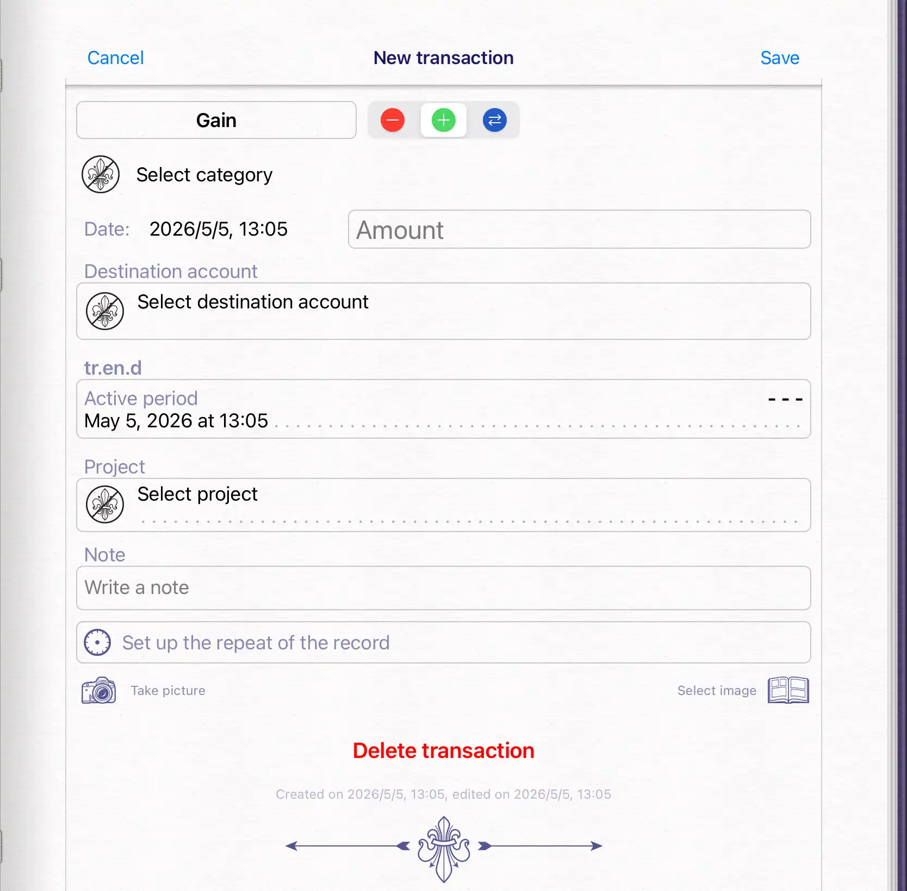

Category
Amount
Destination account
Active period
Note

#### Category
- Salary：薪资
- Bonus：奖金（因为行为或表现获得的奖励）
- Income from business：
- Interest income：业余爱好（非专职工作）带来的收入？
- Royalties：版税
- Gifts：赠品
- Accrued discount：利息？
- Resale：转卖。作为中间商赚取的差价？
- Revenue from the lease：出租
- Insurance indemnities：保险赔偿
- Return of purchase：返利
- Findings：捡到的
- Prize：奖金（在原有基础上额外获得的）
- Tax refund：退税
- Technical accounting
	- Account opening
	- Account balance correction

### Transfer
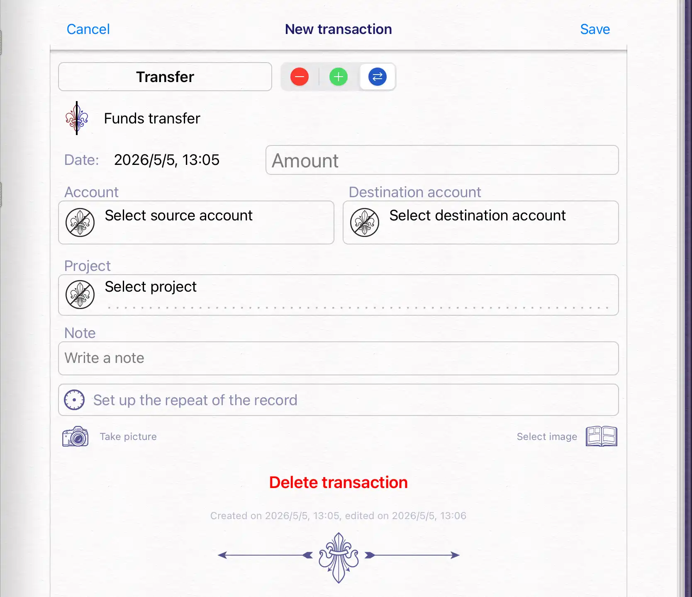

Amount
Account: source account 支出账户
Destination account: 到账账户

## Summary
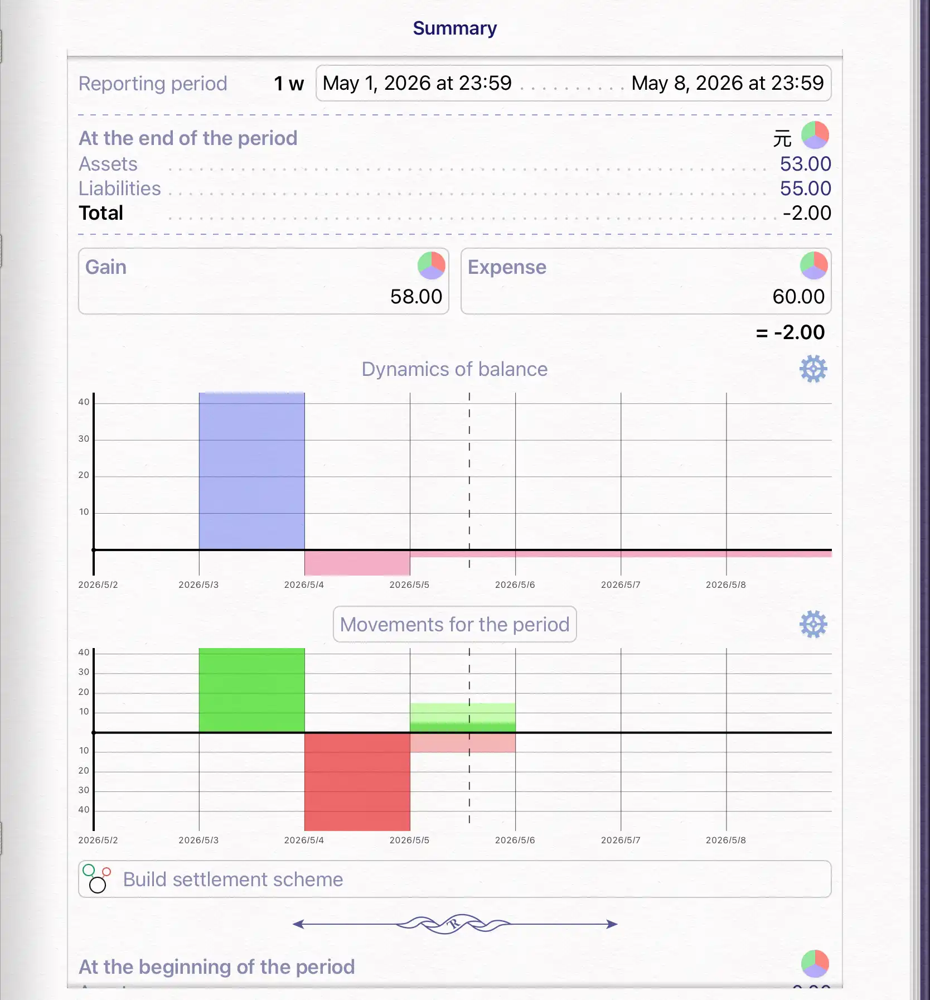

范围内的records

| 时间   | 类型             | 金额  | Spending on pleasure | Urgent needs | Active period |
| ---- | -------------- | --- | -------------------- | ------------ | ------------- |
| 0503 | Gifts          | +43 |                      |              | ---           |
| 0504 | Rent           | 50  |                      | 50           | 4 d           |
| 0505 | Restaurant     | 10  | 7                    | 3            | 1 d           |
| 0505 | Salary         | +15 |                      |              | 1 mon         |
| 0505 | Funds transfer | =10 |                      |              | null          |
^test-expend-table

Reporting period: 时间范围
At the end of the period
Assets: ? 
Liabilities: ?
没搞懂这里的含义
Total
Gain:43 + 15 = 58
Expense:  50 + 10 = 60
= -2 balance

### Dynamics of balance
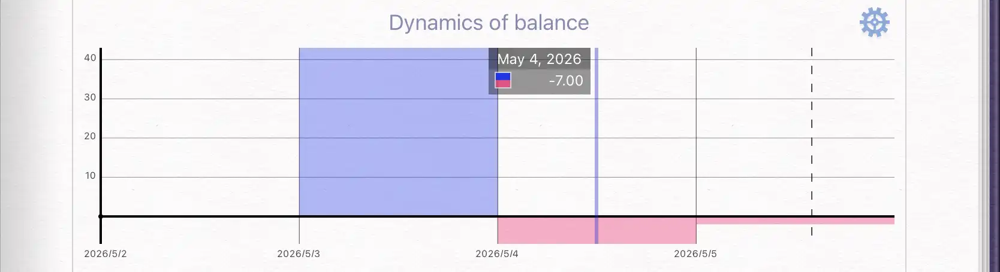
- 虚线：当前日期
- 蓝色：

### Total
**Running total**
实时统计：计算每日gains 和 expenses 以及它们的差值
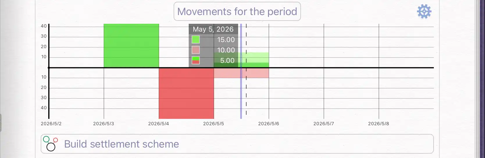
- 绿色-Gains
- 深红-Expenses
- 浅红-total
纵轴上方表示gains，下方表示expenses
使用更深的颜色表示最终total
gains > expenses: gains 使用浅绿色，expenses 使用浅红色， total 使用深绿。如上图所示
expenses > gains: gains-浅绿，expense-浅红，total-深红
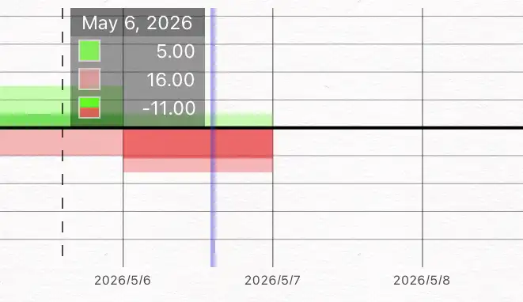

**Movements for the period**
查看period内 gains、expenses 以及 total的变化情况
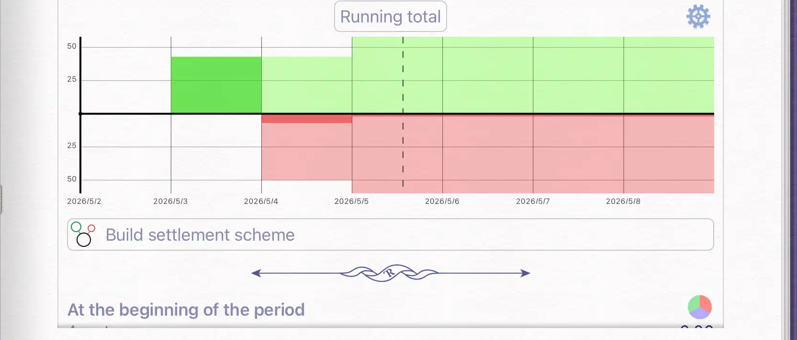

| 时间   | gains     | expenses      | 累计gains | 累计expenses | total |
| ---- | --------- | ------------- | ------- | ---------- | ----- |
| 0503 | 43-Gifts  | 0             | 43      | 0          | 43    |
| 0504 | 0         | 50-Rent       | 43      | 50         | -7    |
| 0505 | 15-Salary | 10-Restaurant | 58      | 60         | -2    |

**功能**
左上角设置按钮可以调整gains、expenses 显示区域
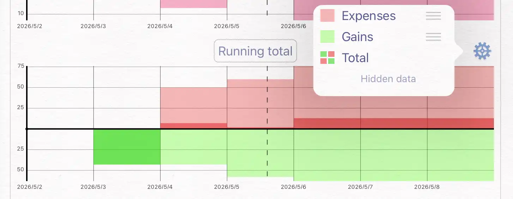 ^7c4778

## tr.en.d
**Date**
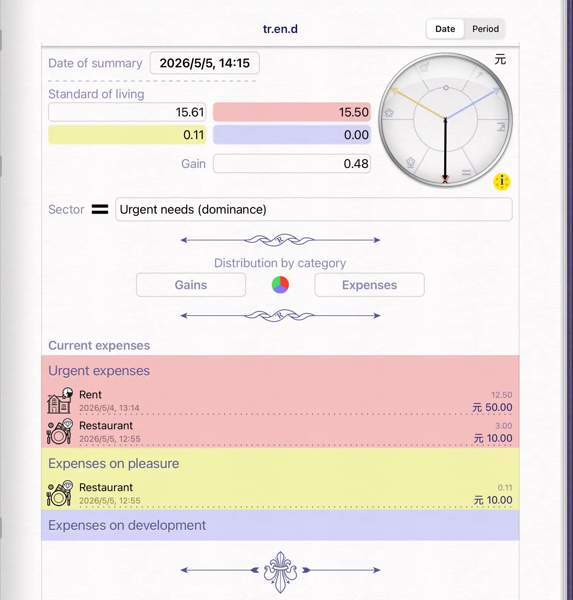

Standard of living
红色-Urgent expenses
	Rent：12.5 - 每日平均值
		50 - 总计
	Restaurant：3 
		10
黄色-Expenses on pleasure
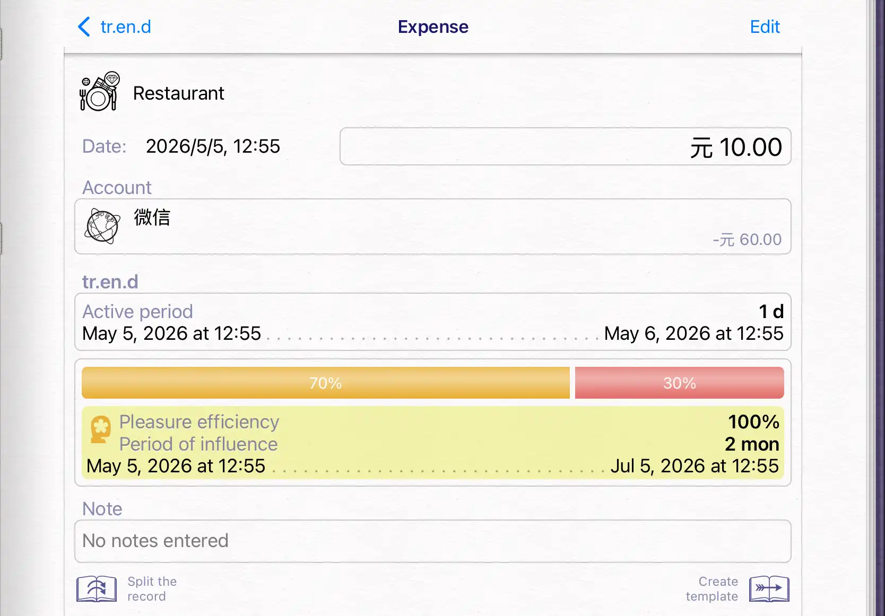
	Restaurant: 0.11
	Pleasure efficiency 100%
	Period of influence 2 mon
7 / 60 ≈ 0.117
蓝色-Expenses on development

合计的支出：
- Urgent expenses：12.5 + 3 = 15.5
- Expenses on pleasure：0.11 = 0.11
15.5 + 0.11 = 15.61

### Rose of spending
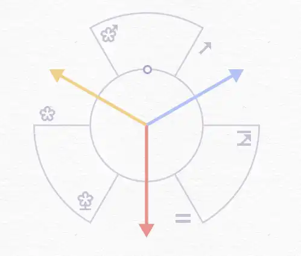
将三种类型的支出当作矢量，根据支出占比划分不同的生活方式，每种支出类型对应一种支出方式。
一共六种生活方式，每种支出类型之间有一种中间状态。
- Urgent needs
- Urgent development
- Development
- Comfortable development
- Pleasures
- Urgent pleasure

#### Sector
##### = Urgent needs
Degree dominance
Description
Majority of spending cannot be avoided, funds are sufficient only for the current life.

所有的支出不可避免，资金仅能维持当前生活状况

➕ Positive effects
Paid bills will not return as fines
➖ Negative effects
Lack of investment in the future and in recreation can result in a financial trap.

Recommendations
Give up part of the needs to leave some funds for the development, try to shift the tr.en.d vector right.

##### -- Urgent development
Degree dominance
Description
All expenses are extremely practical: either necessary, or will return with a possible profit.

➕ Positive effects
All the funds are working.

➖ Negative effects
Lack of spending on recreation may narrow your horizons and reduce the prospects.

Recommendations
Critically assess your performance. If necessary, allocate a portion of funds for recreation.

##### Development
Degree dominance
Description
Energies are focused on expenditures: those that increase revenue, lower the level of urgent expenses, raise the efficiency of investment in development and entertainment.

➕ Positive effects
These costs can come back with a profit.

➖ Negative effects
Ignoring spending on current needs may lead to losses in excess of potential income. Lack of comfort may reduce performance.

Recommendations
Check the state of the current expenses. Critically assess your performance. If necessary, allocate a portion of funds for recreation.

##### Comfortable development
Degree dominance
Description
Costs are focused on having fun and new advantages in life without significant spending on current needs.

➕ Positive effects
The best zone for personal development, ensures optimum performance.

➖ Negative effects
This pattern of spending is unstable as current expenses are low, which may indicate either a lack of attention to the problems of life support, or dependent status when vital issues are funded from another source.

Recommendations
You should check whether all the current bills are paid and there are no unaccounted expenses. If living conditions are funded from another source, make sure it is secure.

##### Pleasures
Degree dominance
Description
Most of the costs are going on the improvement of quality of life, entertainment and the increase of comfor.

➕ Positive effects
The pleasure received is an incentive to new achievements, reduces stress levels, increases efficiency.

➖ Negative effects
These expenditures will become memories and will not return in time. There is a tendency to fix the cost of pleasure: after an episodic increase of these expenses it is rather difficult to return the comfort to the previous level.

Recommendations
Try to combine pleasure with the current needs or profit promising affairs.

##### Urgent pleasure
Degree dominance
Description
Dolce Vita - two words that mean the affluent and pleasant life.

➕ Positive effects
Minimum of stress, maximum of comfort

➖ Negative effects
Lack of concern for the future can be fatal.

Recommendations
Think about the future, check the insurance, inquire about the projected state of affairs.

##### Balance of expenses
Description
Expenses are balanced in all aspects of time, resulting in: stability, growth potential and a good mood.

➕ Positive effects
Equilibration of costs.

➖ Negative effects
Not identified

Recommendations
The optimal character of spending for the long-term strategy.
However, it is useful to reduce the level of current expenses, pointing the tr.en.d vector toward the upper part of this zone, closer to the Zenith point (marked on the diagram).

