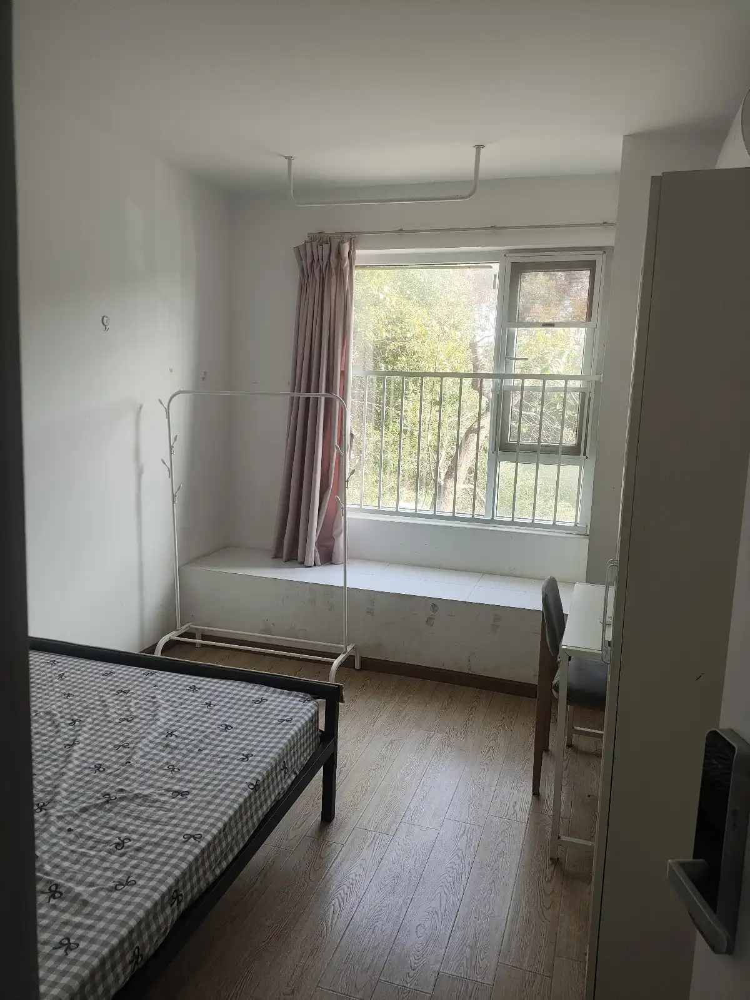
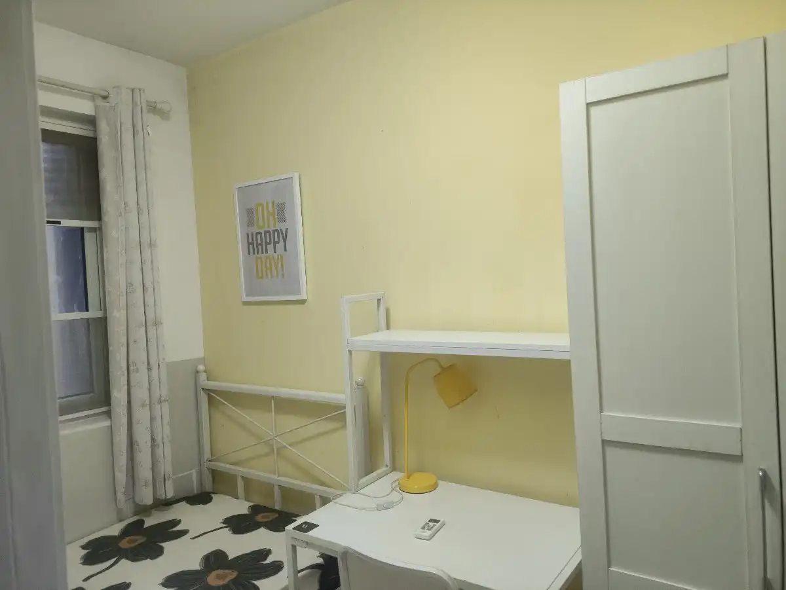
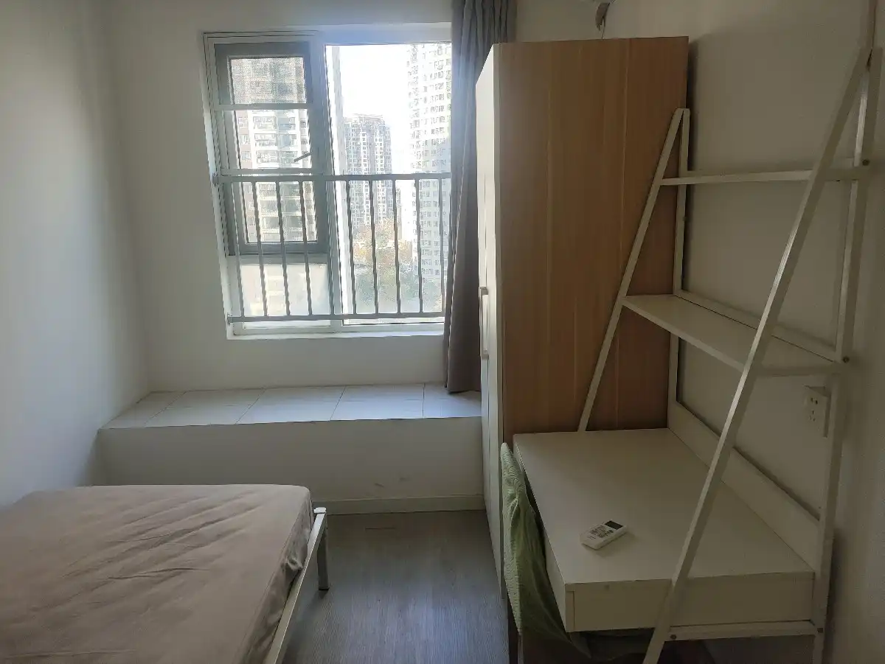

# 租房

| 地点            | 房租            | 图片                                    | 布局       | 水、电、燃气 | 其余费用  | 评价                                                        | 房源   |
| ------------- | ------------- | ------------------------------------- | -------- | ------ | ----- | --------------------------------------------------------- | ---- |
| 保利清能南区 2楼 卧室1 | 标价550？        |  | 三房，一个卫生间 | 水费：20  | 网络：50 | 位置靠近小区里面，吃饭走出来要个几分钟，但是楼层低-2楼，只有3个房间（入住前已有1户，剩余2户）。相对比较安静。 | 海居租房 |
| 保利清能南区 2楼 卧室2 | 标价450，实际报价500 |    |          |        |       | 和上面的房间比，缺点是没有阳光，靠楼道一侧，楼道的声音能传过来。房间小一点。                    |      |
| 11楼           | 标价400，实际报价450 |  | 5房       |        |       |                                                           |      |

