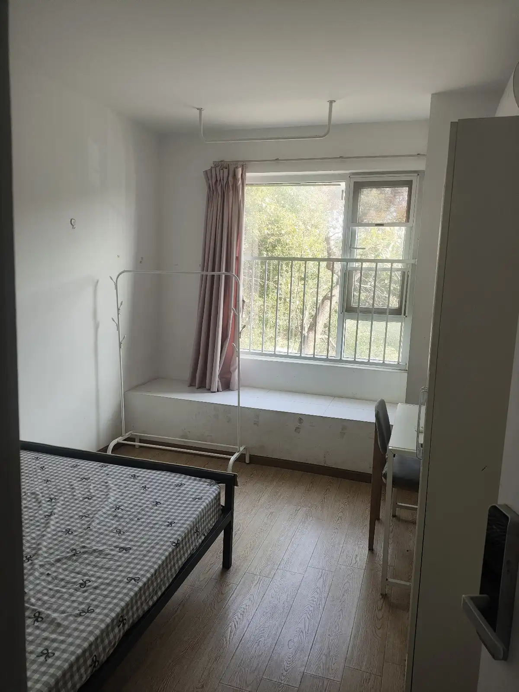
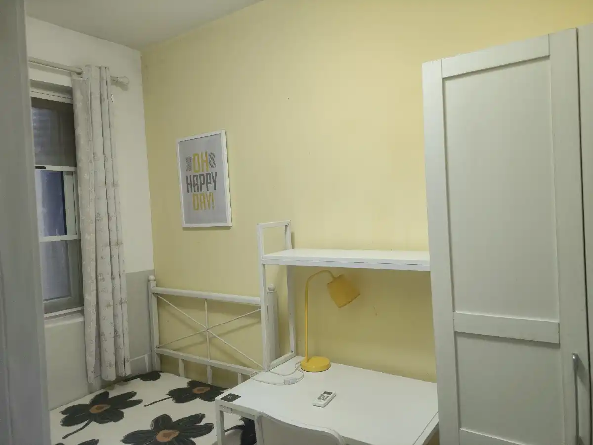
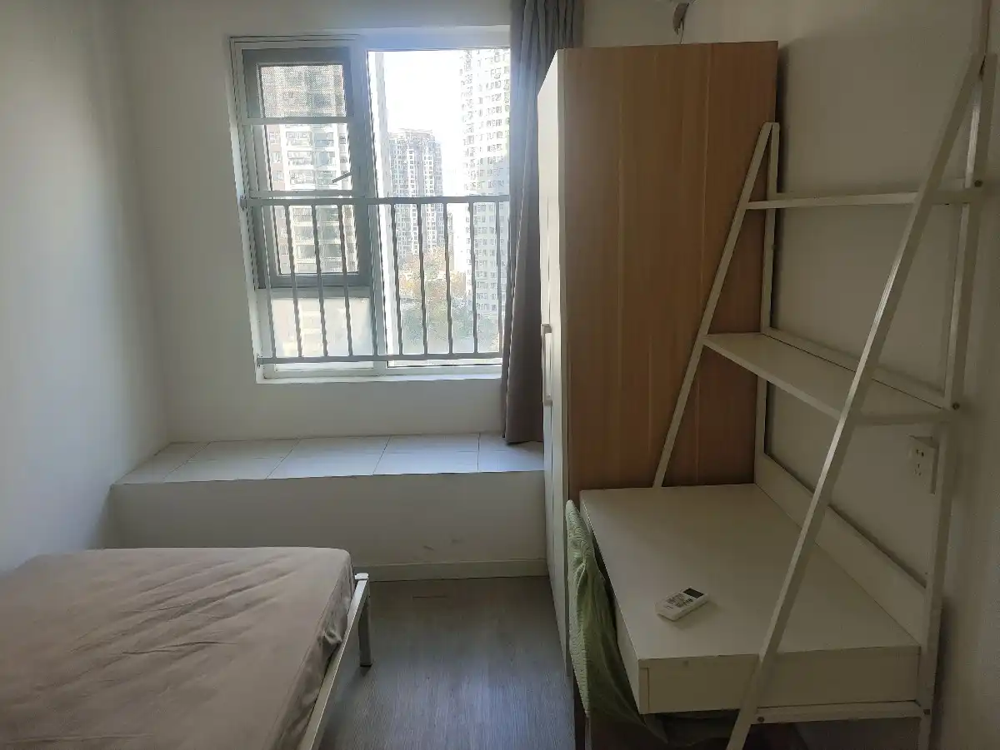

# 租房

| 地点            | 房租            | 图片                                    | 布局       | 水、电、燃气 | 其余费用  | 评价                                                        | 房源   |
| ------------- | ------------- | ------------------------------------- | -------- | ------ | ----- | --------------------------------------------------------- | ---- |
| 保利清能南区 2楼 卧室1 | 标价550？        |  | 三房，一个卫生间 | 水费：20  | 网络：50 | 位置靠近小区里面，吃饭走出来要个几分钟，但是楼层低-2楼，只有3个房间（入住前已有1户，剩余2户）。相对比较安静。 | 海居租房 |
| 保利清能南区 2楼 卧室2 | 标价450，实际报价500 |    |          |        |       | 和上面的房间比，缺点是没有阳光，靠楼道一侧，楼道的声音能传过来。房间小一点。                    |      |
| 11楼           | 标价400，实际报价450 |  | 5房       |        |       |                                                           |      |

## 室友
合租的房子基本上不会和室友碰面，但是生活还是会受到影响，特别是如果作息时间差别较大、房子不隔音，相互之间很有影响。这次遇到的也算是个神仙人物。
1. 凌晨2点洗澡、洗衣服
我是真不懂这种操作是如何能够做出来的。自己不睡觉难道别人不要睡觉？更离谱的是他自己可能还睡的着。。。之前看新闻，男子一个月用水多少吨，靠洗衣机的声音入睡。还只是当作一个笑话，没想到笑话照进现实。。。说实话你大半夜洗个澡就算了，不洗澡睡不着，能理解，但是洗衣服就过分了吧？！而且还不是速洗-忍个2、30分钟算了，TMD 一洗洗1个小时，真的是人才。以至于我不得不写下来发泄下情绪，否则越想越气。

2. 地漏不下水，找室友
Y 11：23，“室友们洗手池和地漏我住进去之前是不是堵了你们咋没和房东反应一下。”
”我这几天才发现一开始我以为是洗澡积水。”

Y 14：56，“都无所谓了嘛😑！”

Y 15：03 “我一个人站出来说整像我弄堵了一样！@中介 都不说那就算了吧！”

首先，确实是有问题。厕所的地漏在中间位置，淋浴的下面，地势似乎高于蹲便，又不下水，导致每次洗碗澡后中间都会积水。所以我洗完澡后都用拖把拖一下，对于我来说，算不上什么问题（当然我有拖地，但是别人没拖，在我用的时候有积水还是会不爽）。之前住这两个人，都能接受吧，所以没有保修。

之前厕所灯坏了，我在群里问的中介：
我：”厕所灯坏了（大概率是开关），有人修吗@中介“
中介：”江寓服务公众号上报修 江寓服务公众号上报修，主页，（第二行第三个选项）新增维修，备注写清楚就行“
我：👌

找谁租的房子，有问题找他不是很自然的事情吗？为什么有人会优先找室友啊？！
15：47，我回复Y：”地漏不知道，我来的时候就这样。洗完澡我会用拖把拖一下。洗手池我回去看一下。 有问题说问题，对房子不满意可以找带你看房的“

Y 16：00，”？你不是室友嘛“
”😂“

真的😶，我是室友又不是修理工，你找我好使吗？我是能疏通管道还是能背锅？也许他是担心由他来报修会让他承担责任。如果是以前有这种想法，好理解，但是现在都是找的中介，出了中介费，房子全权由中介负责了，有损坏也是很正常的事情，直接找中介报修就好了。如果我是房东租个房子还要维修那岂不是很费劲，万一我不住在武汉，难道一个灯泡坏了我还要跑到武汉换个灯泡？显然是不合理的。
理解不了现在的年轻人，气盛，但是不过🧠。最主要的是把个人情绪发泄到不确定的人身上，对问题的解决没有帮助。

后面他发了问题视频，我报修了。
我：”我报修了。公共区间有其他问题可以直接报修。如果涉及到需要定位责任人的（赔偿，遗失等)可以直接联系我“

厨房的灯也坏了，一并报修了。
维修的人来了一趟，厨房灯好了，但地漏似乎没弄好。
即使”问题依然存在“，他似乎也没”问题“了，起码群里是没看到消息。

