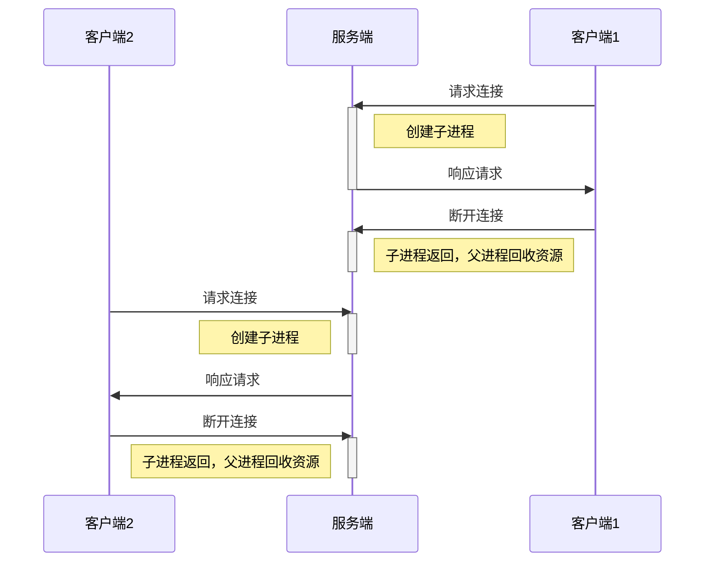

# 10.4 基于多任务的并发服务器


实现：
:::tabs
@tab 参考
``` cpp
#include <stdio.h>
#include <stdlib.h>
#include <string.h>
#include <unistd.h>
#include <signal.h>
#include <sys/wait.h>
#include <arpa/inet.h>
#include <sys/socket.h>

#define BUF_SIZE 30
void error_handling(char *message);
void read_childproc(int sig);

int main(int argc, char *argv[])
{
	int serv_sock, clnt_sock;
	struct sockaddr_in serv_adr, clnt_adr;
	
	pid_t pid;
	struct sigaction act;
	socklen_t adr_sz;
	int str_len, state;
	char buf[BUF_SIZE];
	if(argc!=2) {
		printf("Usage : %s <port>\n", argv[0]);
		exit(1);
	}

	act.sa_handler=read_childproc;
	sigemptyset(&act.sa_mask);
	act.sa_flags=0;
	state=sigaction(SIGCHLD, &act, 0);
	serv_sock=socket(PF_INET, SOCK_STREAM, 0);
	memset(&serv_adr, 0, sizeof(serv_adr));
	serv_adr.sin_family=AF_INET;
	serv_adr.sin_addr.s_addr=htonl(INADDR_ANY);
	serv_adr.sin_port=htons(atoi(argv[1]));
	
	if(bind(serv_sock, (struct sockaddr*) &serv_adr, sizeof(serv_adr))==-1)
		error_handling("bind() error");
	if(listen(serv_sock, 5)==-1)
		error_handling("listen() error");
	
	while(1)
	{
		adr_sz=sizeof(clnt_adr);
		clnt_sock=accept(serv_sock, (struct sockaddr*)&clnt_adr, &adr_sz);
		if(clnt_sock==-1)
			continue;
		else
			puts("new client connected...");
		pid=fork();
		if(pid==-1)
		{
			close(clnt_sock); //[!code highlight]
			continue; //[!code highlight]
		}
		if(pid==0)
		{
			close(serv_sock);
			while((str_len=read(clnt_sock, buf, BUF_SIZE))!=0)
				write(clnt_sock, buf, str_len);
			
			close(clnt_sock);
			puts("client disconnected...");
			return 0;
		}
		else
			close(clnt_sock); //[!code highlight]
	}
	close(serv_sock);
	return 0;
}

void read_childproc(int sig)
{
	pid_t pid;
	int status;
	pid=waitpid(-1, &status, WNOHANG);
	printf("removed proc id: %d \n", pid);
}
void error_handling(char *message)
{
	fputs(message, stderr);
	fputc('\n', stderr);
	exit(1);
}
```

效果：
``` 
new client connected...
new client connected...
client disconnected...
removed proc id: 2928
client disconnected...
removed proc id: 2929
```

@tab 我的
``` cpp
void closeProcess(int sig)
{
    int status;
    pid_t pid = waitpid(-1, &status, 0);
    if(pid > 0) {
        printf("Child process %d terminated.\n", pid);
    }
    else if(pid == -1) {
        unix_error("waitpid error");
    }
}

int main(int argc, char* argv[])
{
    if(argc!=3){
        printf("Usage : %s <IP> <port>\n", argv[0]);
        exit(1);
    }

    struct sigaction act;
    act.sa_handler = closeProcess;
    sigemptyset(&act.sa_mask);
    act.sa_flags = 0;
    printf("sigaction: %d\n", sigaction(SIGCHLD, &act, 0));

    int sock;
    struct sockaddr_in serv_addr;   
    char message[BUF_SIZE];
    int str_len;        
    sock = socket(PF_INET, SOCK_STREAM, 0);
    if(sock==-1)
        error_handling("socket() error");   
    memset(&serv_addr, 0, sizeof(serv_addr));
    serv_addr.sin_family=AF_INET;
    serv_addr.sin_addr.s_addr=inet_addr(argv[1]);
    serv_addr.sin_port=htons(atoi(argv[2]));      
    
    if(bind(sock, (struct sockaddr*)&serv_addr, sizeof(serv_addr))==-1)
        error_handling("bind() error"); 
    
    if(listen(sock, 5)==-1)
        error_handling("listen() error");

    while(1)
    {
        int clnt_sock;
        struct sockaddr_in clnt_addr;
        socklen_t clnt_addr_size=sizeof(clnt_addr);
        clnt_sock=accept(sock, (struct sockaddr*)&clnt_addr, &clnt_addr_size);
        if(clnt_sock==-1)
            error_handling("accept() error");
        else
            printf("New client connected addr:%s, port:%d\n", inet_ntoa(clnt_addr.sin_addr), ntohs(clnt_addr.sin_port));

	    pid_t pid;
        pid = fork();
        if(pid == -1) {
            unix_error("fork error");
        }
        else if(pid == 0) { // Child process
            while((str_len=read(clnt_sock, message, BUF_SIZE))!=0)
            {
                write(clnt_sock, message, str_len); // Echo back
            }
            close(clnt_sock);
            printf("Client disconnected...\n");
            return 0; // Terminate child process //[!code highlight]
        }
        else
            printf("child pid: %d \n", pid);
    }

    close(sock);
    
    return 0;
}

```

| 行号    | 功能               | 说明                                                                       |
| ----- | ---------------- | ------------------------------------------------------------------------ |
| 1-11  | 子进程结束处理          | waitpid中的第3个参数，参考为WNOHANG，这里在信号处理中回收子进程，那么子进程应该是已经结束了的。所以是否hang 应该没有影响吧？ |
| 20-24 | 设置信号处理           |                                                                          |
| 26-36 | 创建并设置服务端socket参数 |                                                                          |
| 38、39 | bind             |                                                                          |
| 41、42 | listen           |                                                                          |
| 46-53 | 接收客户端连接请求        |                                                                          |
| 55-59 | 创建子进程            |                                                                          |
|       | 在子进程中对客户端进行通讯    | 子进程中断开连接后关闭socket，并return                                                |

打开多个网络助手，同时连接到服务端
效果：
```
sigaction: 0
New client connected addr:192.168.56.1, port:13411
child pid: 2957
New client connected addr:192.168.56.1, port:13412
child pid: 2958
Client disconnected...
Child process 2957 terminated.
accept() error Interrupted system call //[!code highlight]
```
能够同时连接多个客户端，但是客户端关闭的时候会accept会报错
父进程在等待连接请求时被中断打断。

在参考代码中，如果accept报错，可能是因为信号处理导致的中断，再次进行accept。
<span style="background:#fff88f">问：</span>后面创建进程的阶段是不是也会被中断？所以fork出错时重新再接收？这里不应该直接销毁已经accept的请求吧，而是应该判断错误类型，如果是子进程销毁引起的中断，应该保留前面accept的socket，然后在中断结束后重新创建子进程。

修改错误处理函数：
``` cpp
void error_handling(const char *message)
{
    fputs(message, stderr);
    fprintf(stderr, " %s", strerror(errno));
    fputc('\n', stderr);
    if(errno == EINTR)
        return;
    else
        exit(1);
}
```

修改后效果：
``` 
sigaction: 0
New client connected addr:192.168.56.1, port:2442
child pid: 3119
New client connected addr:192.168.56.1, port:2443
child pid: 3120
Client disconnected...
Child process 3119 terminated.
accept() error Interrupted system call
Client disconnected...
Child process 3120 terminated.
accept() error Interrupted system call
```

:::

## 通过fork函数复制文件描述符
>[!info]
>从严格意义上说，套接字属于操作系统-只是进程拥有代表相应套接字的文件描述符。

### 查看打开的文件
使用 ***lsof***  - list open file命令查看当前已打开的文件
参考：[lsof Command in Linux with Examples - GeeksforGeeks](https://www.geeksforgeeks.org/linux-unix/lsof-command-in-linux-with-examples/)

运行程序，使用 `ps au` 查看进程的pid，然后再使用 `lsof -p <pid>`查看进程打开的文件
``` 

COMMAND  PID USER   FD   TYPE DEVICE SIZE/OFF   NODE NAME
Network 3216 ming  cwd    DIR   0,44     4096     19 /media/sf_share/Network/build
Network 3216 ming  rtd    DIR    8,1     4096      2 /
Network 3216 ming  txt    REG   0,44    14160    318 /media/sf_share/Network/build/Network
Network 3216 ming  mem    REG    8,1  1868984 398763 /lib/x86_64-linux-gnu/libc-2.23.so
Network 3216 ming  mem    REG    8,1   162632 398755 /lib/x86_64-linux-gnu/ld-2.23.so
Network 3216 ming    0u   CHR  136,8      0t0     11 /dev/pts/8
Network 3216 ming    1u   CHR  136,8      0t0     11 /dev/pts/8
Network 3216 ming    2u   CHR  136,8      0t0     11 /dev/pts/8
Network 3216 ming    3u  IPv4  33459      0t0    TCP 192.168.56.101:10086 (LISTEN)

```

| 参数       | 值                                                                                                                                                                             | 用途                                                                                                                                               | 说明                                                                                                                                                                 |
| -------- | ----------------------------------------------------------------------------------------------------------------------------------------------------------------------------- | ------------------------------------------------------------------------------------------------------------------------------------------------ | ------------------------------------------------------------------------------------------------------------------------------------------------------------------ |
| FD       | **cwd**  current working directory;<br>**rtd**  root directory;<br>**txt**  program text (code and data);<br>**mem**  memory-mapped file;<br>**u** for read and write access; | is the File Descriptor number of the file or                                                                                                     |                                                                                                                                                                    |
| TYPE     | **DIR** for a directory;<br>**REG** for a regular file;<br>**CHR** for a character special file;<br>**IPV4** for an IPv4 socket;                                              | is the type of the node associated with the file                                                                                                 |                                                                                                                                                                    |
| DEVICE   |                                                                                                                                                                               |                                                                                                                                                  |                                                                                                                                                                    |
| SIZE/OFF | `0t0`、4096                                                                                                                                                                    | is the size of the file or the file offset in bytes.                                                                                             | the offset is normally displayed in decimal with a leading `0t` if it contains 8 digits or less; in hexadecimal with a leading `0x` if it is longer than 8 digits. |
| NODE     |                                                                                                                                                                               | is the node number of a local file;<br>or the inode number of an NFS file in the server host;<br>or the Internet protocol type - e.g, `TCP'; 。。。 |                                                                                                                                                                    |

<span style="background:#fff88f">问：</span>为什么socket的NODE值显式为TCP？socket应该也是有NODE值得，如何查看其NODE？

这里可以看到服务端得监视socket 
连接一个客户端后再次查看进程打开的文件
``` 
Network 3216 ming    2u   CHR  136,8      0t0     11 /dev/pts/8
Network 3216 ming    3u  IPv4  33459      0t0    TCP 192.168.56.101:10086 (LISTEN)
Network 3216 ming    4u  IPv4  33460      0t0    TCP 192.168.56.101:10086->192.168.56.1:1600 (ESTABLISHED)
```
打开的文件新增了一个 `ESTABLISHED` 的 socket，这里服务端的socket 指向 客户端的socket

查看子进程打开的文件：
1. 查看pid为3241
``` bash
ming      3216  0.0  0.0   4356   784 pts/8    S+   05:14   0:00 ./Network 192.168.56.101 10086
ming      3241  0.0  0.0   4356    80 pts/8    S+   05:45   0:00 ./Network 192.168.56.101 10086
```
2. lsof
```
ming@ubuntu:~$ lsof -p 3241
COMMAND  PID USER   FD   TYPE DEVICE SIZE/OFF   NODE NAME
Network 3241 ming  cwd    DIR   0,44     4096     19 /media/sf_share/Network/build
Network 3241 ming  rtd    DIR    8,1     4096      2 /
Network 3241 ming  txt    REG   0,44    14160    318 /media/sf_share/Network/build/Network
Network 3241 ming  mem    REG    8,1  1868984 398763 /lib/x86_64-linux-gnu/libc-2.23.so
Network 3241 ming  mem    REG    8,1   162632 398755 /lib/x86_64-linux-gnu/ld-2.23.so
Network 3241 ming    0u   CHR  136,8      0t0     11 /dev/pts/8
Network 3241 ming    1u   CHR  136,8      0t0     11 /dev/pts/8
Network 3241 ming    2u   CHR  136,8      0t0     11 /dev/pts/8
Network 3241 ming    3u  IPv4  33459      0t0    TCP 192.168.56.101:10086 (LISTEN)
Network 3241 ming    4u  IPv4  33460      0t0    TCP 192.168.56.101:10086->192.168.56.1:1600 (ESTABLISHED)
```
可以看到子进程打开的文件和父进程的一模一样，区别在于 他们的**PID** 不同。

## fork的过程
:::tabs
@tab 初始


@tab 建立连接


@tab 创建子进程


:::

在创建子进程后，没有系统socket都关联到两个文件描述符，“只有2个文件描述符都终止（销毁）-close后，才能销毁套接字。

所以需要创建子进程后，子进程中只保留 和 accept 时和客户端建立连接的socket，而父进程中只保留监听socket。子进程销毁时只需销毁连接socket，父进程销毁时销毁监听socket。

在上面我的代码中并没有在主进程中关闭clntsocket，客户端断开连接后查看socket 状态：
``` bash
ming@ubuntu:~$ lsof -i
COMMAND  PID USER   FD   TYPE DEVICE SIZE/OFF NODE NAME
Network 3216 ming    3u  IPv4  33459      0t0  TCP 192.168.56.101:10086 (LISTEN)
Network 3216 ming    4u  IPv4  33460      0t0  TCP 192.168.56.101:10086->192.168.56.1:1600 (CLOSE_WAIT)
```
可以看到 连接到56.1：1600 的socket 没有被关闭，状态为 `CLOSE_WAIT`

**更新代码**
``` cpp
        else if(pid == 0) { // Child process
            close(sock); //[!code highlight]
            while((str_len=read(clnt_sock, message, BUF_SIZE))!=0)
            {
                write(clnt_sock, message, str_len); // Echo back
            }
            close(clnt_sock);
            printf("Client disconnected...\n");
            return 0; // Terminate child process
        }
        else
        {
            close(clnt_sock); // Parent process closes client socket //[!code highlight]
            printf("child pid: %d \n", pid);
        }
```
效果：
``` 
ming@ubuntu:~$ lsof -i
COMMAND  PID USER   FD   TYPE DEVICE SIZE/OFF NODE NAME
Network 3297 ming    3u  IPv4  34812      0t0  TCP 192.168.56.101:10086 (LISTEN)
Network 3298 ming    4u  IPv4  34813      0t0  TCP 192.168.56.101:10086->192.168.56.1:3818 (ESTABLISHED)
ming@ubuntu:~$ lsof -i
COMMAND  PID USER   FD   TYPE DEVICE SIZE/OFF NODE NAME
Network 3297 ming    3u  IPv4  34812      0t0  TCP 192.168.56.101:10086 (LISTEN)

```
客户端断开连接后clntsock 正常销毁

