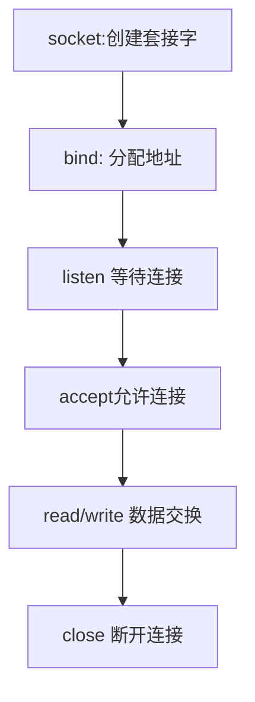
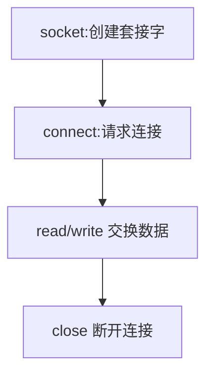

# 4.2 实现基于TCP的服务端 客户端
## 服务端
调用流程：


### 进入等待连接请求（监听）状态
使用bind（） 给socket 分配地址后调用listen（）进入等待连接请求状态。
``` cpp
       #include <sys/types.h>          /* See NOTES */
       #include <sys/socket.h>

       int listen(int sockfd, int backlog);
```

| 参数      | 含义                      | 说明                                        |
| ------- | ----------------------- | ----------------------------------------- |
| sockfd  | 要进入等待连接请求状态的socket文件描述符 | socket 类型需要是SOCK_STREAM 或  SOCK_SEQPACKET |
| backlog | 连接请求队列的长度               |                                           |
| return  | 是否调用成功                  | 0：success；-1：error                        |


客户端通过connect（）发送建立连接请求，服务端只有在进入监听状态后请求才可以被接收。如果服务端未进入监听状态，客户端connect（）返回错误。
在监听状态下，所有的连接请求都被放入连接请求队列。

### 受理客户端连接请求
服务端的监听套接字相当于守卫，所有要进行通讯的客户端都要经过守卫。
``` cpp
       #include <sys/types.h>          /* See NOTES */
       #include <sys/socket.h>

       int accept(int sockfd, struct sockaddr *addr, socklen_t *addrlen);
```

| 参数      | 含义                       | 说明                                                                            |
| ------- | ------------------------ | ----------------------------------------------------------------------------- |
| sockfd  | 处于监听状态的socket            | extracts the first connection request on the  queue  of  pending  connections |
| addr    | 指向sockaddr structure 的指针 | 填充为peer socket（发起连接请求的客户端socket）的地址信息                                         |
| addrlen | 存储addr structure 的长度指针   | 填充addr实际的长度值                                                                  |
| return  | new connected socket     | nonnegative integer：创建一个新的 和 当前处理的socket 进行通信的socket；-1：error                 |


## 客户端
调用流程：


``` cpp
       #include <sys/types.h>          /* See NOTES */
       #include <sys/socket.h>

       int connect(int sockfd, const struct sockaddr *addr,
                   socklen_t addrlen);
```

| 参数      | 含义                   | 说明  |
| ------- | -------------------- | --- |
| sockfd  | 发送连接请求的socket        |     |
| addr    | 服务端socket 地址信息       |     |
| addrlen | servaddr structure长度 |     |
>[!quote]
>客户端套接字地址信息在哪？
>何时？调用connect 函数时
>何地？ 操作系统，更准确地说是在内核中
>如何？ IP用计算机（主机）的IP，端口随机

可以设置客户端的socket绑定的地址：

问：<mark style="background: #FFF3A3A6;">如何实现？</mark>

## 基于TCP的服务器/客户端函数调用关系

客户端发送连接请求时，服务端可能还没有调用accept。如果已经调用accept，但是请求队列中还没有socket，那么accpet（）进入阻塞状态，直到有客户端发送连接请求。
