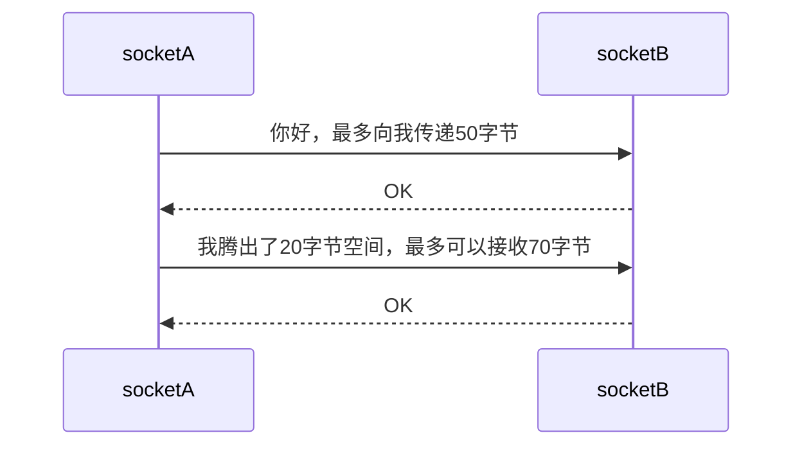
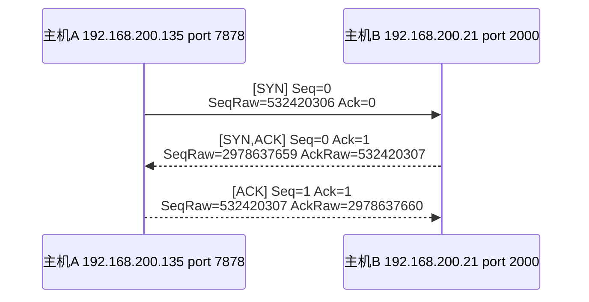
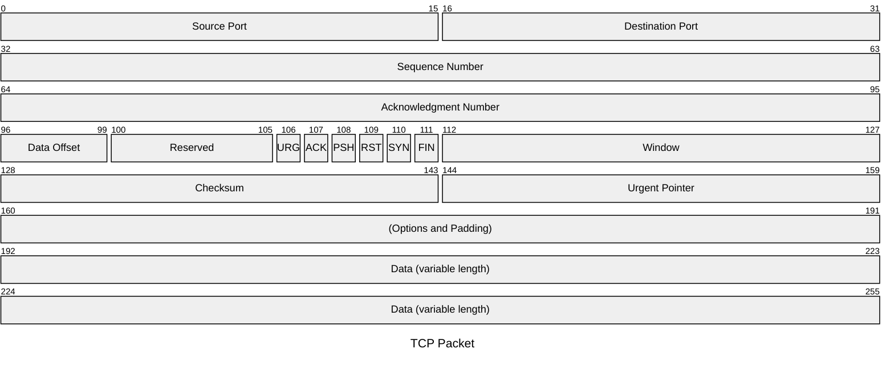
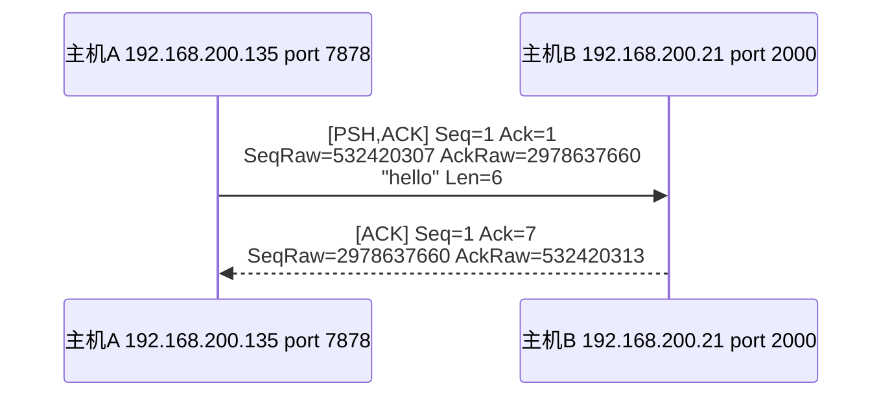
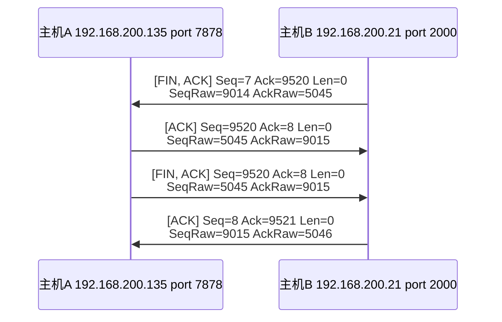

# 5.2 TCP原理

## 套接字中的I/O缓冲

I/O缓冲的特性：
- 每个socket都有I/O缓冲
- 在创建socket时生成缓冲
- I/O缓冲包含输入缓冲 和 输出缓冲

传输特性：
- 关闭socket将丢失输入缓冲中的数据：不再接收
- 关闭socket会继续发送输出缓冲中的数据
- 不会传输超过可用的输入缓冲大小的数据：假设输入缓冲大小50bytes，可用20bytes，传输时最多发送20bytes长度数据
	- 由滑动窗口协议确定当前最大传输字节大小
	- write在数据移动到输出缓冲后返回，TCP协议保证输出数据能够传输到对方主机，从外在表现上看write在数据传输完成时（对方主机可以读取到数据）完成。

滑动窗口协议：

## 连接
参考官网的捕获示例：200722_tcp_anon文件

TCP Header Format

其中第106到111位为标志位，用于说明TCP 报文的用途

| 名称  | 全称                    | 说明             |
| --- | --------------------- | -------------- |
| SYN | Synchronization       | 收发数据前传输的同步消息   |
| ACK | Acknowledgment        | 消息确认           |
| Seq | Sequence Number       | 当前自身发送的数据包的序号值 |
| Ack | Acknowledgment Number | 当前已接收的对端数据包的序号 |
报文中\[SYN, ACK] 表示对应的标志位为1

>[!quote]
>收发数据前向数据包分配序号，并向对方通报此序号，这都是为防止数据丢失所做的准备。通过向数据包分配序号并确认，可以在数据丢失时马上查看并重传丢失的数据包。

问：<mark style="background: #FFF3A3A6;">SYN 消息和 ACK消息有什么区别？收到SYN后会保存SYN消息中的Seq Number，然后在此基础上进行回复？</mark>

- SYN 同步消息的作用：向对方通报数据包序号
- ACK 消息：在接收的Seq Number基础上增加，表示已经接收到了Seq Number，请传递序号为SeqNumber + 1的数据包

## 交换数据

A 向 B 发送了6个字节的数据， B回复的Ack 值为7，在A发送的Seq 基础上 增加传输的数据字节数。
整个过程：A-》B：当前发送的数据从序号1开始，长度为6字节。给我你的从序号1开始的数据。B-》A：给你序号1开始的数据，长度为0。 我正确接收到了直到序号7的数据。

Ack 的增量为字节长度而不是1是为了对数据包的所有字节进行确认，如果只增加1则是对整个数据包的确认，无法明确是全部正确接收还是丢失了一部分。

问题：<mark style="background: #FFF3A3A6;">这里SEQ 以及 回复的 ACK 值和书上的说明不一致啊！</mark>
如果按照书中的 ACK -》SEQ + 传递的字节数 + 1，那么上面回复的报文中Ack 应该是 307 + 6 + 1 = 314，而不是313

但是在SYN 过程中ACK 是有+1，所以连接 和 交换数据过程有所不同？

## 断开连接

为了简便实际传输的序号值取末尾4位。

>[!quote]
>A control bit (finis) occupying one sequence number, which indicates that the sender will send no more data or control occupying sequence space.

主机B是断开连接的发起方，主机A在收到断开连接请求后进行处理，在准备就绪后回复可以断开消息，然后主机B断开，并最终发送一个已断开消息。

问：<mark style="background: #FFF3A3A6;">收到FIN后做了什么处理工作？前面提到关闭socket后清除接收缓冲，是在什么时候进行的？</mark>
